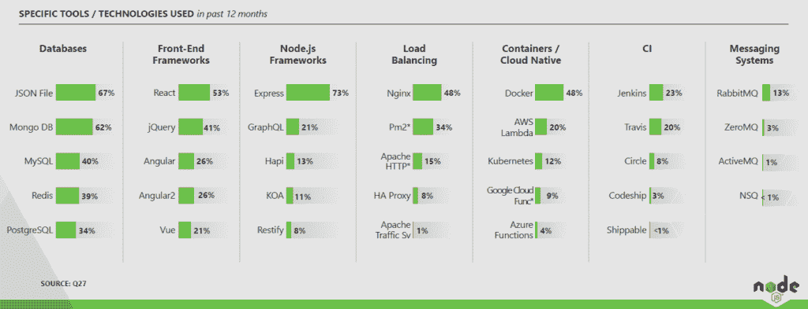

# 本周数字:Node.js 用户的技术堆栈

> 原文：<https://thenewstack.io/this-week-in-numbers-the-node-js-users-tech-stack/>

Node.js 基金会发布了基于 Node 社区 1626 名成员的第三次年度[用户调查](https://nodejs.org/en/user-survey-report/)。将来，我们将会看到这些开发人员使用的包管理器和语言。现在，读者将有兴趣了解 with Node.js 最常使用的基础设施类型。

单击以嵌入。

React 是目前为止使用最多的前端框架并不奇怪。排在第二位的是 jQuery，它通常不被认为与 Angular 和 Vue 属于同一类别。值得注意的是，40%的受访者使用过 Angular 或 Angular2。由于这是新的堆栈，我们觉得有必要报告容器和云原生图表。以下是一些数据点:

*   在 Node.js 社区中，48%的人使用 Docker，但是“只有”12%的人使用 Kubernetes。深究一下，只有 5%的 Kubernetes 用户不使用 Docker。相比之下，23%的 Docker 用户也使用 Kubernetes。
*   35%的 Docker 用户受访者还使用无服务器功能即服务(FaaS)产品。相比之下，61%的 FaaS 用户也使用 Docker。
*   总体而言，使用容器的人数是使用无服务器计算解决方案的两倍(48%比 28%)。请注意，新的堆栈分析了原始数据，并将使用 FaaS 解决方案(AWS Lambda、Azure Functions、Google Cloud Functions 或 Apache OpenWhisk)的任何人都算作无服务器用户。

由[丹尼尔·库切列夫](https://unsplash.com/photos/KaVPZvzlLhs?utm_source=unsplash&utm_medium=referral&utm_content=creditCopyText)在 [Unsplash](https://unsplash.com/?utm_source=unsplash&utm_medium=referral&utm_content=creditCopyText) 上拍摄的专题图片。

<svg xmlns:xlink="http://www.w3.org/1999/xlink" viewBox="0 0 68 31" version="1.1"><title>Group</title> <desc>Created with Sketch.</desc></svg>