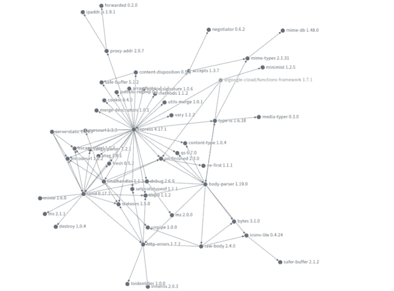

# 本周编程:谷歌进入开源洞察游戏

> 原文：<https://thenewstack.io/this-week-in-programming-google-gets-into-the-open-source-insights-game/>

如果你使用开源软件已经有一段时间了，那么你会很清楚[这类项目中经常涉及的错综复杂的依赖关系网](https://xkcd.com/2347/)。如果没有，那么有[任何](https://libraries.io/) [数量](https://metrics.openssf.org/grafana/d/default/metric-dashboard?orgId=1)的[工具](https://security.lfx.linuxfoundation.org/#/)在那里探索一切是如何相互联系的，并且本周谷歌已经用自己的产品跳进了这场游戏——一个名为[开源洞察](https://deps.dev/)的探索性可视化网站，给用户一个开源项目依赖性的交互式视图。

现在，谷歌并不是第一个试图揭示或解开开源世界令人眼花缭乱的依赖图的游戏，但该公司认为，它更试图以一种开发者可以直观地看到他们到底有多糟糕的方式来展示一切。

“当然，有一些工具可以提供帮助:漏洞扫描器和依赖性审计可以帮助识别软件包何时暴露于漏洞。但是，想象一幅大画面，理解你所依赖的东西，以及这意味着什么，仍然是很困难的，”他们写道。

开源 Insights 工具(目前是“实验性的”)为用户提供了一个项目如何组成的表格或图形可视化，允许他们探索依赖关系图，并检查使用某些项目的不同版本可能会如何影响依赖关系图。谷歌指出，其中一个好处是，它允许用户看到所有这些信息,“不需要你先安装软件包”。您可以立即看到安装一个软件包(或更新版本)对您的项目可能意味着什么，它有多受欢迎，找到源代码和其他信息的链接，然后决定是否应该安装它。”

目前，该工具支持 [npm](https://www.npmjs.com/) 、 [Maven](https://search.maven.org/) 、 [Go 模块](https://blog.golang.org/using-go-modules)和 Cargo，更多的打包系统即将推出。虽然拓扑和可视化确实很难，但正如 New Stack 分析师 Lawrence Hecht 所指出的，这有助于解决问题，“这实际上只对软件架构师和当您试图调试应用程序或发现问题时才重要，而不是在日常情况下。换句话说，这种类型的‘点工具’对于工匠的工具书是有用的，但不需要放入谷歌的产品组合中。”

如果你是其中一个持怀疑态度的人，不要担心，当谈到谷歌时，你永远不会孤单:只要前往[黑客新闻](https://news.ycombinator.com/item?id=27387414)并打赌这将持续多久，然后在不断增长的[谷歌墓地](https://killedbygoogle.com/)结束。

## 本周的节目中

*   **为 Stack Overflow 倒一杯:**现在，不要对整个事情过于戏剧化——毕竟， [Joel Spolsky 说](https://www.joelonsoftware.com/2021/06/02/kinda-a-big-announcement/)该公司“将继续独立运营，由完全相同的团队根据完全相同的计划和完全相同的商业惯例运营它”——但 Stack Overflow [本周宣布](https://stackoverflow.blog/2021/06/02/prosus-acquires-stack-overflow/)它已被 Prosus 收购。抛开承诺不谈，黑客新闻等网站的普遍反应是怀疑。例如，一位用户[将](https://news.ycombinator.com/item?id=27372217)斯波尔斯基的声明——“整个公司都在原地不动:我们现在只是有了不同的所有者”——描述为“在绝对幼稚到故意不真诚的光谱上的某个地方。”其他人提供了各种时代的轶事，像这样的陈述已经被提出，只是被一次又一次地证明是错误的。在这一点上，只有时间能证明一切。

*   DockerCon 2021 的所有新功能:上周是虚拟会议繁忙的一周，DockerCon 2021 与微软 Build 同时运行。如果你错过了，Docker 已经写了一份关于[所有新功能](https://www.docker.com/blog/dockercon-live-2021-looking-back-at-the-new-stuff/)的简明摘要，所有这些都表示“在多个维度上加强安全性，包括在不同开发阶段扫描漏洞，以及通过提供审计日志和范围访问令牌等工具来提高团队安全性。”上周你可能错过的公告包括 [Docker 验证发行商](https://www.docker.com/docker-expands-trusted-content-offerings)计划、Docker 开发环境、Docker Compose v2、[范围访问令牌](https://www.docker.com/press-release/docker-advances-collaborative-application-development-platform)、审计日志、Docker 桌面更新等等。
*   **补上 Visual Studio 代码:**上周，微软举行了第二次虚拟微软构建会议，本周该公司提供了所有 Visual Studio 代码面板的回顾[。鉴于我们知道你非常喜欢你的 Visual Studio 代码，我们认为这是一个合适的分享。当我们谈论 VS 代码时，您最喜欢的编辑器也在本周发布了带有 Kubernetes 扩展的](https://code.visualstudio.com/blogs/2021/06/02/build-2021)[本地隧道调试](https://cloudblogs.microsoft.com/opensource/2021/06/02/enabling-local-tunnel-debugging-with-the-kubernetes-extension-for-vs-code/)，这使得“使用您一直使用的相同开发工具，在您的开发机器上本地运行您的应用的微服务，同时隧道化到 Kubernetes 集群，应用的其余部分和其他服务正在该集群中运行。”这使得您可以在本地机器上测试和调试代码，就像它运行在 Kubernetes 集群上一样，否则这可能很困难，甚至完全不可能。“本地隧道调试功能，”他们指出，“还避开了操作复杂性，例如必须构建 Docker 映像并部署到集群以查看变化。”

[https://www.youtube.com/embed/eKJftIqv8Uo?feature=oembed](https://www.youtube.com/embed/eKJftIqv8Uo?feature=oembed)

视频

*   **fuzzing 测试是 Golang 的一项任务:**虽然他们说原生 fuzzing 不会为 Go 1.17 版本做好准备，因为[最初提出了](https://github.com/golang/go/issues/44551)， [fuzzing 现在处于 Go 开发分支的 beta](https://blog.golang.org/fuzz-beta) ， [dev.fuzz](https://github.com/golang/go/tree/dev.fuzz) 。根据提议背后的开发者 Katie Hockman 的说法，提供 fuzzing 功能的测试版有三个主要目标。就像任何测试版一样，Go 团队想要识别和修复任何问题，弄清楚它是否真的有效地完成了它想要做的事情(查找 bug)，并确定用户界面是否真的可用。对于那些想要参与测试的人，有些警告:fuzzing 可能会占用大量内存，影响运行时的性能，也可能会占用几个 GB 的存储空间。当 fuzzing 处于测试阶段时，请确保[为任何问题或想法提交一个问题](https://github.com/golang/go/issues/new/?&labels=fuzz&title=%5Bdev%2Efuzz%5D&milestone=backlog&body=)，并前往 Gophers Slack 中的 [#fuzzing 频道](https://gophers.slack.com/archives/CH5KV1AKE)参与讨论。
*   **GCC 慢慢远离 FSF:** 上周，DevClass 上的一篇文章介绍了 [GCC 如何在没有 FSF 版权转让的情况下接受投稿](https://devclass.com/2021/06/02/the-emancipation-of-gcc-compiler-collection-now-accepts-contributions-without-fsf-copyright-assignment/)。“想要为 GNU 编译器集合做出贡献，但不想将版权转让给自由软件基金会的开发人员现在可以忙着承诺了，”他们写道，并指出 GCC 指导委员会成员大卫·埃德尔松(David Edelsohn)已经通知了贡献者这一举动，称该委员会已经“决定放宽对所有变更分配版权的要求。”最近几个月，在理查德·M·斯托曼重返 FSF 董事会一事上，有一点[引起了](https://thenewstack.io/why-almost-everyone-wants-richard-stallman-cancelled/)[的骚动](https://thenewstack.io/this-week-in-programming-free-software-cant-exist-without-richard-stallman/)，DevClass 认为这是这种变化的一个可能原因。“鉴于‘GCC 指导委员会致力于为所有人提供一个友好、安全和友好的环境’，他们觉得与 Stallman 的合作不符合 GCC 开发者和用户社区的最佳利益——Stallman 并不特别了解这一点，”他们写道。“更新的版权政策符合这一理念，这使得那些批评 FSF 及其最近决定让斯托尔曼留在董事会的人更容易坚持 GCC。”

<svg xmlns:xlink="http://www.w3.org/1999/xlink" viewBox="0 0 68 31" version="1.1"><title>Group</title> <desc>Created with Sketch.</desc></svg>