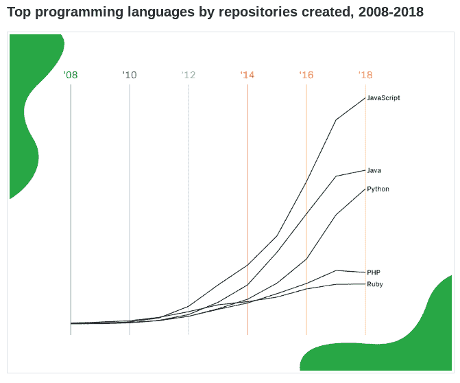
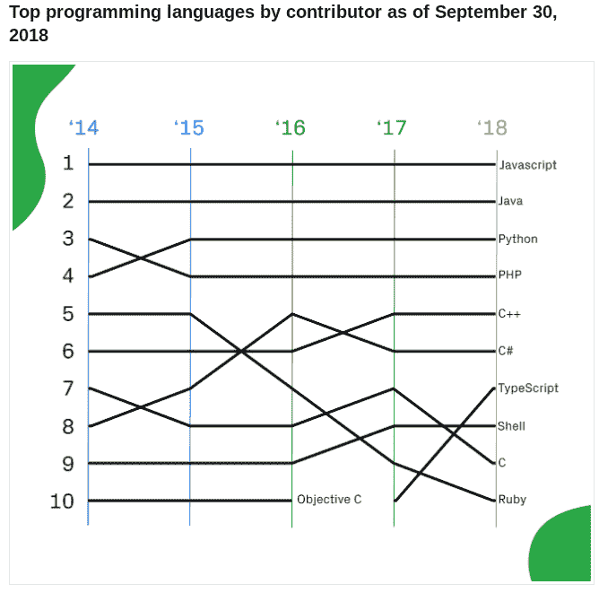
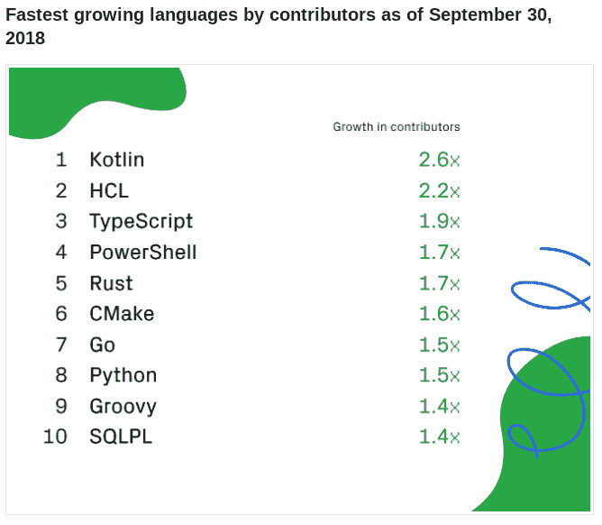

# 本周编程:语言排名稳定了吗？

> 原文：<https://thenewstack.io/this-week-in-programming-have-language-rankings-leveled-off/>

上个月，我们[重点报道了](https://thenewstack.io/this-week-in-programming-the-bug-free-lie-of-visual-programming/)TechCrunch 上的一篇文章，该文章指出了现代语言排名尝试的各种错误，并询问“[衡量编程语言受欢迎程度到底是怎么回事？](https://techcrunch.com/2018/09/30/what-the-heck-is-going-on-with-measures-of-programming-language-popularity/)”这篇文章接着对 [TIOBE 指数](https://www.tiobe.com/tiobe-index/)和竞争对手“ [PYPL 指数](http://pypl.github.io/PYPL.html)进行了分析，然后选择了 GitHub 的年度报告，它声称这些报告“基本上与[作者]自己的经历完全吻合”，唯一的警告是它们只考虑开源项目。

在所有的语言排名尝试中，我也发现自己最受那些基于 GitHub 数字的语言排名的吸引，尽管任何单一的尝试都很容易被发现错误。我也曾经是一名大学生，上过“统计分析”和“研究方法”之类的课程，我非常清楚观察现象的每一种方式不仅涉及到塑造现象，而且还会因你可能选择的观察方法而存在一些固有的缺陷。

尽管如此，尽管如此，我们今年的“[octo verse 状态:2018 年顶级编程语言](https://blog.github.com/2018-11-15-state-of-the-octoverse-top-programming-languages/)”只是告诉我们风向如何。我说的风，实际上可能是指静止的空气，因为在我看来，这些数字的总体主题是过去一年的安静停滞，至少对于那些被视为精华的语言来说是如此。帖子中提供的第一张图表显示了根据创建的库的数量排名的顶级语言，我们看到一切似乎都在向前发展，就像过去十年一样:

虽然 GitHub 指出 JavaScript 在 2011 年后会“稳步上升”，但看起来这份语言列表并没有随着时间的推移而发生太大变化。当我们根据贡献者的数量来看排名靠前的语言时，我们看到了一个类似的故事，排名靠前的四种语言也是如此。

当然，在这个图表中，我们看到 Ruby 在稳步下降，而 Typescript 在稳步上升。这里唯一令人惊讶的是，在人气短暂上升后，C 语言在过去一年中有所下降。不管怎样，10 种语言中有 7 种的排名完全相同。至少目前看来，语言的受欢迎程度已经趋于平稳。当然，这还不包括那些在排行榜上一路攀升的边缘失败者。

最后，除了语言排名本身，GitHub 还提供了一个精彩的分析，即到底是什么让一种特定的语言在 2018 年流行起来，将其归结为三个关键特征:线程安全、互操作性和开源。你可以从中获取你想要的，同时，看看这个精彩的视频，它简洁地解释了计算机如何计算那些很难计算的东西。

[https://www.youtube.com/embed/RY_2gElt3SA?feature=oembed](https://www.youtube.com/embed/RY_2gElt3SA?feature=oembed)

视频

## 本周的节目中

*   **GoLang 九岁生日:**由谷歌支持的开源编程语言 Go 本周庆祝[自“我们开源我们最初的 Go 草图的那一天”起九周年纪念日](https://blog.golang.org/9years)，并称过去的一年是“Go 语言和社区的突破之年”在该项目的年度回顾中，读者可以看到 Golang 近期历史的乐观总结，确保不要花费任何时间争论版本控制系统或类似的事情。相反，这篇文章提到了众多将 Golang 列为最受喜爱和尊敬的调查。例如， [Stack Overflow 的 2018 年开发者调查](https://insights.stackoverflow.com/survey/2018#most-loved-dreaded-and-wanted)将围棋列为五大最受欢迎和五大最受欢迎的语言，而 [HackerRank 的 2018 年开发者调查](https://research.hackerrank.com/developer-skills/2018/)称，近 40%的开发者将围棋作为他们的下一门学习语言。[与此同时，ActiveState 的 2018 年开发者调查](https://www.activestate.com/developer-survey-2018-open-source-runtime-pains)显示，36%的用户表示他们对使用 Go“非常满意”，61%的用户表示“非常满意”或更好。该项目也见证了巨大的社区增长，自第一次会议举行以来的五年里，涌现出了 20 多场[围棋会议](https://github.com/golang/go/wiki/Conferences)和 300 场围棋相关聚会。最后，在对 Go 2 的快速总结之后，回顾指出了该项目的一个“重要里程碑”，这是“第一次，来自社区的贡献超过了 Go 团队。”

*   **亚马逊提供免费 OpenJDK:** 几个月前，我们与你们[分享了一个警告](https://thenewstack.io/this-week-in-programming-looking-past-the-quantum-ai-buzz-at-microsoft-ignite/)不要落入 [JDK 的诱饵和开关](https://blog.joda.org/2018/09/do-not-fall-into-oracles-java-11-trap.html)，因为甲骨文已经“更新了(他们)提供甲骨文 JDK 的许可条款”，使之前免费的产品变得不那么自由。当然，解决方案是下载 OpenJDK，现在亚马逊已经推出了 Amazon Corretto，一个免费的 OpenJDK 发行版，提供长期支持。根据公告，该公司“将至少在 2023 年 6 月之前免费向[科雷托 8](https://aws.amazon.com/corretto) 分发安全更新，至少在 2024 年 8 月之前向科雷托 11 分发安全更新。”Register 中的一份报告指出，该公司已经在内部使用该发行版，并“将该软件提供给其客户在云中使用，或者提供给任何想要在本地或本地使用该软件的人，在各种平台上使用，包括 Amazon Linux 2、Microsoft Windows 和 macOS，并作为 Docker 映像。它这样做是因为甲骨文今年早些时候宣布，在 2019 年 1 月之后，它将不再为 OpenJDK 提供免费的长期支持，这一决定源于 Java 开发节奏的转变，以及甲骨文显然希望专注于付费客户而不是免费用户。”

https://twitter.com/oscargodson/status/1063113412530462720

*   **Visual Studio 2019 和 Visual Studio Code 2018 年 10 月:**微软提供了 Visual Studio 2019 即将到来的[变化的预览，以及 Visual Studio Code](https://sdtimes.com/msft/microsoft-previews-changes-coming-in-visual-studio-2019/)2018 年 10 月[发布的更新。至于](https://code.visualstudio.com/updates/v1_29) [Visual Studio 2019](https://blogs.msdn.microsoft.com/visualstudio/2018/11/12/a-preview-of-ux-and-ui-changes-in-visual-studio-2019/) ，SD Times 写道，该公司正在“更新主题、图标和闪屏，并为开发人员提供更快获得代码的新方法，”在今年 6 月首次[宣布的更新中。该版本的亮点将包括“一个新的开始窗口，提供对常见操作的快速访问”和“一个新的简化 Git-first 工作流”，以及对 UI 进行更改以“回收 ide 中的重要空间”。出于好奇，我们提供了](https://sdtimes.com/msft/visual-studio-2019-announced/)[完整路线图](https://docs.microsoft.com/en-us/visualstudio/productinfo/vs-roadmap)。然后，关于 [Visual Studio Code 的 2018 年 10 月发布](https://code.visualstudio.com/updates/v1_29)，微软宣布了“大量重大更新”，包括[多行搜索](https://code.visualstudio.com/updates/v1_29#_multiline-search)，在智能感知中包含[文件图标](https://code.visualstudio.com/updates/v1_29#_file-and-folder-icons-in-intellisense)，[更好的 macOS 支持](https://code.visualstudio.com/updates/v1_29#_macos-mojave-dark-mode-support)，[可折叠堆栈框架](https://code.visualstudio.com/updates/v1_29#_collapsible-stack-frames)，一个[改进的加载脚本视图](https://code.visualstudio.com/updates/v1_29#_improved-loaded-scripts-view)，[更新的扩展示例](https://code.visualstudio.com/updates/v1_29#_normalized-extension-samples)，以及[扩展的 CI 配方](https://code.visualstudio.com/updates/v1_29#_using-azure-pipelines-for-extension-ci)这些特性中最令人兴奋的似乎是第一次提到的——执行多行正则表达式搜索的能力。对于你的 VSCode 用户，请确保点击进入博客文章，因为这只是涉及到本月的新内容。哦，最后一点，微软本周还单独宣布[人工智能辅助编码将与 Visual Studio IntelliCode](https://blogs.msdn.microsoft.com/visualstudio/2018/11/12/ai-assisted-coding-comes-to-java-with-visual-studio-intellicode/) 一起进入 Java。

通过 Pixabay 的特征图像。

<svg xmlns:xlink="http://www.w3.org/1999/xlink" viewBox="0 0 68 31" version="1.1"><title>Group</title> <desc>Created with Sketch.</desc></svg>