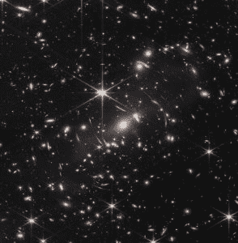
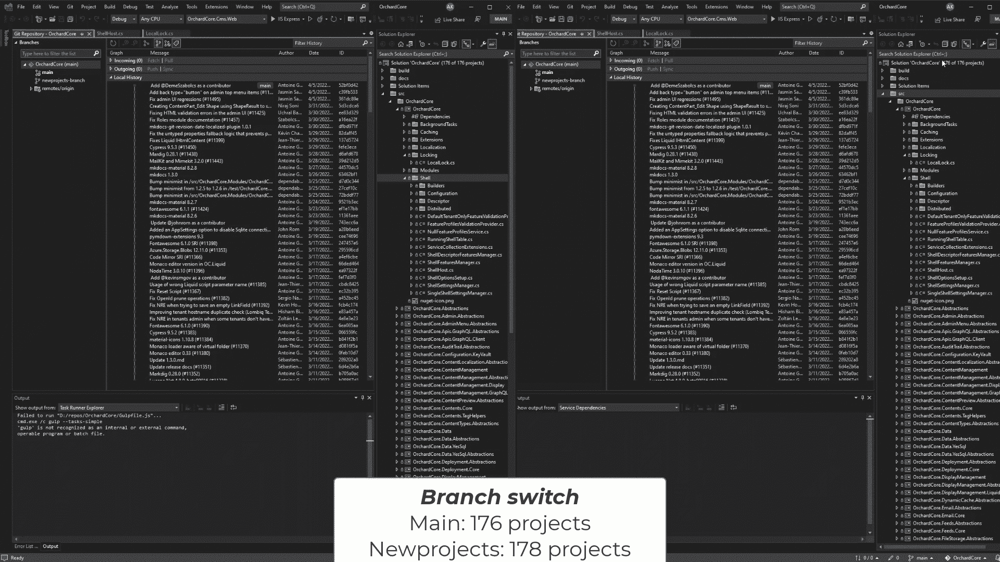

# 本周节目:蜂巢的手臂优势

> 原文：<https://thenewstack.io/this-week-in-programming-honeycombs-arm-advantage/>

本周在纽约举行的 AWS 峰会上，我们看到了 T2 如何通过使用大数据帮助工程师调试他们的系统。

蜂巢的服务“因其规模和速度而与众不同”，蜂巢的主要开发者倡导者 [Liz Fong-Jones](https://www.lizthegrey.com/) 在峰会主题演讲中解释道。

Honeycomb 服务的目标是让任何工程师在 10 秒或更短的时间内回答任何关于他们故障或功能不良的系统的问题——甚至是之前通过迭代思路提出的问题，或者“跟踪面包屑”，正如她在主题演讲中解释的那样。

秘制酱？o11y 公司从客户端收集所有可以收集的运营数据，将其存储在 AWS 固态硬盘上，然后结合使用 [AWS Lambda 无服务器服务](https://aws.amazon.com/lambda/)和基于 ARM 的高速 [AWS Graviton](https://aws.amazon.com/pm/ec2-graviton) 处理器来解析数据并返回查询。

蜂巢服务利用了各种 aws 预打包的分析服务。其中一些已经在内部 AWS 服务上捕获，包括[关系数据库服务](https://aws.amazon.com/rds/)和 [CloudWatch](https://aws.amazon.com/cloudwatch/) 。

詹姆斯·韦伯太空望远镜拍摄的星团 SMACS 0723 的图像。每个光点代表一个完整的星系。(美国宇航局)

同样重要的是 [OpenTelemetry](https://opentelemetry.io/) 的 [Amazon 发行版](https://aws.amazon.com/otel/?otel-blogs.sort-by=item.additionalFields.createdDate&otel-blogs.sort-order=desc)、[Cloud Native Computing Foundation](https://cncf.io/?utm_content=inline-mention)的 API、库和代理的开源包，用于通过分布式跟踪和度量来监控应用程序。

Honeycomb 对所有应用程序生成的数据进行预处理，并将其存储在亚马逊[简单存储服务](https://aws.amazon.com/s3/) (S3)，然后通过 AWS Lambda 无服务器服务进行动态分析。该服务目前每秒处理 250 万个跟踪跨度，而三年前仅为 20 万个。Fong-Jones 说:“我们的客户正在询问 10 倍于 10 倍数据的问题。

对于只有 50 名工程师的工作来说，这是一个相当令人印象深刻的设置。该设置由有状态和无状态服务的组合组成，主要由 GoLang 构建，但也加入了一些 Java 和 Node.js。

对于无状态服务，Honeycomb 使用运行在 [EC2 C6g Graviton2](https://aws.amazon.com/ec2/instance-types/c6g/) 和 [C7g Graviton3](https://aws.amazon.com/ec2/instance-types/c7g/) 实例上的 [Amazon Elastic Kubernetes](https://aws.amazon.com/eks/) 服务。

蜂巢似乎看好 [ARM 架构](https://thenewstack.io/is-arm-architecture-the-future-of-cloud-computing/)。

Fong-Jones 指出，当该公司从基于英特尔至强处理器的 [AWS M5](https://aws.amazon.com/blogs/aws/m5-the-next-generation-of-general-purpose-ec2-instances/) 实例切换到 Graviton 2 时，中值延迟提高了 10%。“Graviton 2 处理器的效率更高，我们能够推动更多的负载，”她说。

此外，Graviton2 和 Graviton3 之间的 A/B 测试发现，尾部延迟进一步提高了 10%到 20%,吞吐量和中值延迟提高了 30%。CPU 利用率降低了约 30%，“这意味着我们可以更努力地推动它，”她说。

Honeycomb 通过使用 [AWS Spot](https://aws.amazon.com/ec2/spot/) 实例节省了一些钱，这些实例是 AWS 中尚未使用的机器。AWS 有一个优雅的终止处理程序，当其他地方需要处理器时，它会退出工作负载。在这里，Honeycomb 最初通过将一些工作负载转移到 spot 节省了大约 20%。

对于 Kafka 流数据摄取，Honeycomb 使用 [EC2 Im4g](https://aws.amazon.com/ec2/instance-types/i4g/) 实例，这些实例基于 [Nitro 固态驱动器](https://aws.amazon.com/blogs/aws/aws-nitro-ssd-high-performance-storage-for-your-i-o-intensive-applications/)。更早、更慢的存储迭代让 CPU 对工作如饥似渴。她说:“在 Im4g 上适当调整所有东西的大小，可以让我们达到适当的网络 CPU 和存储阈值。

Lambda 提供了另一块拼图。考虑到存储在 S3 上的数百万个文件，即使只使用 100 个快速引力子实例也不能完全完成任务。这就是 Lambda 的用武之地，它能够立即提供多达“数以万计的并行工作人员”。

“将 AWS Lambda 和 Graviton 结合在一起，我们看到性价比提高了约 40%，”她说。

## 本周的节目中

*   **云军备竞赛？**:大约十年来，业界或多或少都认为数据中心[中的 ARM64 单线程多核处理器将是一件好事](https://thenewstack.io/linus-torvalds-meltdown-spectre-perhaps-move-arm/)，考虑到它们的运行效率。AWS 已于 2018 年提供 ARM，随着 2020 年推出 Graviton2，AWS [表示](https://thenewstack.io/aws-graviton-marks-the-emergence-of-arm-for-cloud-native-workloads/)ARM 架构将不适用于任务关键型横向扩展云工作负载。4 月，ARM 也带着通用的 [Dpsv5 和内存优化的 Epsv5](https://docs.microsoft.com/en-us/azure/virtual-machines/dasv5-dadsv5-series) 虚拟机来到 Azure。现在，三大云提供商中的最后一家[谷歌云](https://cloud.google.com/)也加入了这个行列。本周，该公司[推出了](https://cloud.google.com/blog/products/compute/tau-t2a-is-first-compute-engine-vm-on-an-arm-chip)其首款基于 ARM 的实例——Tau T2A。T2A 虚拟机由基于 Ampere [Altra ARM 的处理器](https://amperecomputing.com/blogs/2022-07-13/ampere-altra-based-t2a-vms-now-in-preview-on-google-cloud.html)提供支持，每个虚拟机提供多达 48 个 vCPU，每个 vCPU 具有 4GB 内存和 32Gbps 网络带宽。据该公司称，Tau T2A 系列虚拟机适合横向扩展工作负载，如 web 服务器、容器化微服务、数据记录处理、媒体代码转换和 Java 应用程序。

*   **Visual Studio 与 Git** 融为一体:微软正在使其 [Visual Studio](https://visualstudio.microsoft.com/) 集成开发环境与广泛使用的开源 Git 源代码控制管理软件更加兼容。Visual Studio 2022 17.3 版本。到目前为止，在存储库中的 git 分支之间切换会导致等待时间，因为新的分支会被加载进来。微软高级项目经理 [Taysser Gherfal](https://www.linkedin.com/in/taysser/) 在一篇[博客文章](https://devblogs.microsoft.com/visualstudio/vs2022-performance-enhancements-git-branch-switching/)中解释此次发布时写道:“例如，每次团队成员向/从他们的分支添加/删除项目时，团队的其他成员很可能会在切换到/从这个分支时经历一次解决方案重新加载。微软想出了如何将重新加载的次数减少 80%,消除低效，例如每当团队成员在同一个分支中加载时都需要重新加载。这个版本包括一些索引和着色 C 和 C++代码的性能改进。例如，在 Visual Studio 的早期版本中，索引 Chromium 代码库需要 26 分钟，而新版本可以在 6 分钟内完成相同的任务，[报告了](https://sdtimes.com/msft/microsoft-improves-git-branch-switching-c-experience-in-visual-studio-update/) SD Times。

*   可观测性，最后的边疆:在郊区或城市里，你可能不会觉得夜空有多黑暗，偶尔会被一颗星星或埃隆·马斯克的 Starlink 低地球卫星打断。然而，没有了周围的城市光污染，夜空有着完全不同的、更加险恶的景象。相反，它是行星、恒星、星系和各种其他物质和能量在空间和时间中旋转的可怕混乱。坦率地说，我们的小行星在这个漩涡中幸存至今，没有在某个时候被禁止进行超空间旁路，这是一个奇迹(正如道格拉斯·亚当斯在他的经典“[银河系漫游指南](https://amzn.to/3PadtCG)”中所预测的)。本周，由于美国宇航局的詹姆斯·韦伯太空望远镜(JWST)，我们获得了迄今为止对这个宇宙最深刻的一瞥，它提供了第一批宇宙的[红外图像](https://www.nasa.gov/image-feature/goddard/2022/nasa-s-webb-delivers-deepest-infrared-image-of-universe-yet)(或宇宙的很小一部分)【JWST】的镜头，在距离地球约 100 万英里的地方绕太阳运行，如此强大，以至于实际上看到了时光倒流。它拍摄的星系团 SMACS 0723 的初始图像显示了 460 万年前的银河系，这要归功于光速的极限(186，000 英里/秒)。五月，我们的欧洲记者 Jennifer Riggins [提交了一份关于 JWST 背后的工程的引人入胜的报道。“这是一个展示站点可靠性工程概念的伟大平台，因为这是可靠性的极致，”IBM SRE 建筑师 Robert Barron 在 WTF is SRE 会议上谈到 JWST 时说。“我认为我们可以从这项工作中汲取很多教训和灵感，并将其应用到我们的日常生活中。”例如，他解释说，设计团队最初专注于功能需求:他们需要一个比哈勃太空望远镜更大的镜子，但美国宇航局没有能力将这么大的镜子送入太空。这导致他们定义了一些非功能性的需求，例如从较小的六边形创建镜子，然后可以在适当的位置展开。这项工作是基于美国宇航局将飞船送入太空的价值观，即组件需要冗余、可靠和可修复。“毫无疑问，詹姆斯·韦伯太空望远镜的 SRE 战略比地球上颁布的任何战略都更有利害关系。它仍然是一个极好的例子，说明了站点可靠性工程和可观测性需求是如何随着环境的变化而变化的，”里金斯写道。](https://thenewstack.io/james-webb-space-telescope-and-344-single-points-of-failure/)

<svg xmlns:xlink="http://www.w3.org/1999/xlink" viewBox="0 0 68 31" version="1.1"><title>Group</title> <desc>Created with Sketch.</desc></svg>