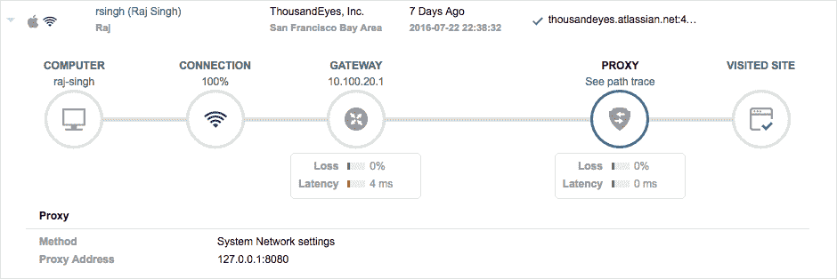
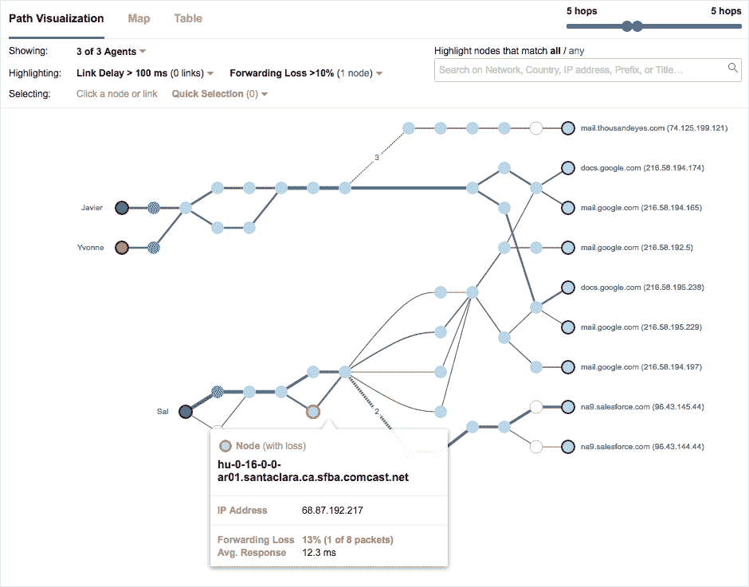

# 千里眼将网络监控延伸到互联网本身

> 原文：<https://thenewstack.io/thousandeyes-extends-network-monitoring-internet/>

是应用问题还是互联网问题？

当事情不顺利时，这是网络团队试图回答的问题。

“网络层和生产 IT 团队的混乱和复杂性正在增加。他们正在使用更多的云服务，他们正在使用移动设备，应用程序的各个部分以不同的方式托管，” [ThousandEyes](https://www.thousandeyes.com/) 的产品营销主管 [Nick Kephart](https://www.linkedin.com/in/nickkephart) 说。

“网络通常被视为黑匣子，尤其是互联网本身。因此，我们开始了解网络中最重要的部分，即互联网和所有服务——互联网服务提供商、内容交付网络等等。”

你可以去网站问“谷歌关闭了吗？”或者“iCloud 停机了吗？”

“他们可能会告诉你一个网站宕机了，但很少有人会告诉你互联网的哪个部分出现了问题。对于大多数客户来说，仅仅知道我的主要服务提供商现在是否在工作以及工作得好不好是不够的。”凯普哈特解释道。

“这是试图告诉你什么时候有互联网或网络中断，并把它放在你自己的应用环境中。”

周三，ThousandEyes 发布了[端点代理](https://www.thousandeyes.com/product/endpoint-agents)，它提供了对网络中每个连接点(WiFi、VPN、代理)状态的可见性，一直到端点设备。虽然其客户已经依赖于 ThousandEyes 来了解网络行为如何影响应用交付，但这项新服务提供了对用户在家或在移动设备上工作的体验的可见性。

ThousandEyes 并不孤单。 [Riverbed 最近宣布收购 Aternity](https://www.aternity.com/blogs/its-the-end-user/) ，为其产品添加基于用户设备的监控，以帮助组织评估最终用户体验。

“随着应用程序越来越多地迁移到云，以 SaaS 产品的形式交付，组织失去了对其应用程序可用性和性能的显著可见性。端点成为监控 SaaS 提供商性能的有利位置，”根据

[Terry Cosgrove](http://www.gartner.com/analyst/19993/Terrence-Cosgrove)

，Gartner 企业移动分析师。“组织将越来越需要能够查明问题是出在供应商方面、公共/私有网络基础架构方面，还是出在客户/企业方面。”

**重点排除故障**

Kephart 列举了千眼的三个用例:

*   在您自己的网络中，使用分支机构和呼叫中心的代理来监控 WAN、并行冗余协议(PRP)应用程序或 VOIP 的性能。

*   了解外部托管解决方案的性能，如 Salesforce 或 Office 365。

*   对于 SaaS 应用程序、API 或网站。它监控全球 120 个地点的交通状况，以确定消费者的真实体验。例如，在他的演示中，马德里的用户用了 9 秒钟加载一个奥运网站。

“您可以了解您与托管该应用程序的所有部分之间的性能，包括 CDNs、全球多个数据中心之间的负载平衡。Kephart 说:“当运营团队和应用程序开发人员考虑这些代码在现实世界中是如何部署的时候，这些都是非常重要的。

不过，它不会取代应用性能管理解决方案，如 [New Relic](https://newrelic.com/) 或 [AppDynamics](https://thenewstack.io/appdynamics-heats-apm-winter-2016-release/) 。它在用户级别进行监控，而不是代码级别。

它可以跨所有类型的应用程序环境，跨用 Java 或。NET 或其他各种语言。

“我们只是在寻找一个 web 服务器或 VOIP 服务器来响应请求。以及他们是否以我们期望的表现做出回应。在这个意义上它是不可知论者。

“它将围绕预期响应时间和预期延迟设定基准。您也可以自己设置阈值。你可以说你期望在三秒钟内访问广域网上所有站点的电子邮件。根据应用程序、组织的架构以及这些组织的全球化程度，这显然会有很大的不同，”Kephart 说。

虽然在未来，该系统可能会提供建议采取的行动，以减轻问题，但现在，它的重点是故障排除和网络规划。他说，这主要由相对复杂的运营团队使用，在某些情况下也用于呼叫服务台，尽管该公司在 DevOps 组织中有更广泛的使用，这取决于他们的跨职能程度。

它跟踪逐跳性能，并可以查明复杂的问题，如每个接口的丢失、每个链路的延迟以及客户端和服务器之间的路径随时间的变化。

该系统收集网络拓扑、依赖性和行为的详细取证数据；提供可视化功能，帮助您快速解决不同网段、服务和应用程序中的问题。汇集来自多个地区的多层网络数据，并共享从其广泛的客户群中检测到的性能和中断信息。

其客户包括 Ticketmaster、苏富比和 [iHeartMedia](http://www.iheartmedia.com/Pages/Home.aspx) 。

“在日常使用和大规模流量工程工作中，ThousandEyes 都是我们的重要工具。 [Evernote](https://evernote.com/?var=c) 运营副总裁 [Alexei Rodriguez](https://twitter.com/alexeirrm) 表示:“这些见解和数据让我们能够更好地了解我们的变化对最终用户的影响，以及与我们的运输提供商的更好互动。

端点代理可以跟踪全球广域网的性能

**增加可见性**

[AIM Specialty Health 高级经理 Ivan Shepherd 负责领导其网络和技术安全团队，他在 ThousandEyes 最近的](https://blog.thousandeyes.com/visibility-telecommuter-services-aim-specialty-health/) [Connect](https://www.thousandeyes.com/events/connect/new-york-2016) 活动中谈到了该公司如何与该公司合作建立远程办公计划，在该计划中，医疗专家远程连接他们的笔记本电脑和 VOIP 电话服务。

AIM Specialty 选择的运营商存在全国性的边界网关协议(BGP)问题，而 Ping、Curl、SNMP 等[网络监控工具](https://thenewstack.io/category/monitoring/)或 [IP SLA](http://www.cisco.com/c/en/us/td/docs/switches/lan/catalyst4500/12-2/44sg/configuration/guide/Wrapper-44SG/swipsla.html) 无法帮助解决这些问题。然而，ThousandEyes 的路径可视化快照帮助该公司准确定位了数据包丢失发生的位置，并做出了更好的补救决策。

他说，企业代理提供了跨合作伙伴站点的网络可见性，并为服务呼叫提供了准确的信息，这些信息在过去可能会阻碍服务问题。

该公司成立于 2010 年，已融资 6060 万美元，包括去年 2 月 3500 万美元的 C 轮融资。

有一系列服务可以监控内部应用程序和外部托管的应用程序。然而，专注于微服务监控的《[监控的艺术](https://www.artofmonitoring.com/)》一书的作者 [James Turnbull](https://jamesturnbull.net/) 说，大多数[当前的工具并不非常适合容器或服务架构](https://thenewstack.io/qa-james-turnbull-art-monitoring-age-microservices/)。他指出，在那些支持容器化的更新中，有 [Datadog](https://thenewstack.io/datadog-bringing-monitoring-darkness-light/) 和 New Relic 以及开源工具 Sensu 和 [Nagios](https://www.nagios.org/) 。 [AppDynamics](http://www.lightreading.com/enterprise-cloud/appdynamics-extends-microservices-support/d/d-id/725173) 刚刚宣布微服务支持。

ThousandEyes 在 4 月宣布了对 Docker 的支持，Kephart 专注于其对底层网络的可见性及其对容器化应用的影响。

5 月，它宣布了代理对代理测试，允许组织[映射端点之间的正向和反向路径](https://blog.thousandeyes.com/network-visibility-for-the-reverse-path/)，以更好地了解问题可能源自何处。

上个月，它宣布了[互联网中断检测](https://blog.thousandeyes.com/analyzing-internet-issues-traffic-outage-detection/)，它跟踪互联网服务提供商的具体故障点和路由故障点。

451 Research 的一份[报告称 ThousandEyes 是解决 SaaS 应用程序联网问题的一种“创新和差异化”方法，但指出它将与企业中已有的应用程序性能管理产品相竞争。](http://marketo-web.thousandeyes.com/rs/thousandeyes/images/ThousandEyes_Impact_Report.pdf)

451 网络分析师 Jim Duffy 称其“SaaS 本地”产品独一无二，是对企业 APM 部署的补充。

码头工人和[新遗迹](https://newrelic.com/)是新堆栈的赞助商。

特征图片:[罗布森#](https://www.flickr.com/photos/_robson_/) 的[眼球追踪](https://www.flickr.com/photos/_robson_/7882504556/in/photolist-d1xTYY-h4ce7D-7cKhQd-8HqRdF-8BrSNK-3KS6Cq-dpd3t3-oNS4QN-gZpYjb-gKRjdS-pQRoSE-8LoMtK-9sgf6f-9sdfhX-rCeuH-gVfpJw-paDAMS-hmzNw8-doAGwb-5xE95t-dmDFhy-7biBjN-pEGBDK-oZW8t-dppdf1-azDvhM-7cLx5T-9sgeD5-7b833t-dppe69-9sdfxp-9sd1Su-5x2sjF-ocE8n4-9sd1No-9sgehf-bUrVtC-cdjtTy-8PWJ3f-4hu42z-azVikJ-dpp7np-9sa3k6-5t8azQ-dkqtWX-dppheY-oWkhtB-3522zm-z4j9LJ-5Yraf)，授权于 **[CC BY-SA 2.0](https://creativecommons.org/licenses/by/2.0/)** 。

<svg xmlns:xlink="http://www.w3.org/1999/xlink" viewBox="0 0 68 31" version="1.1"><title>Group</title> <desc>Created with Sketch.</desc></svg>