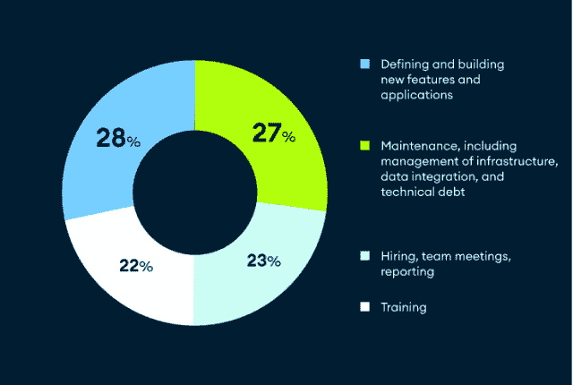

# 限制开发者创新的 3 个因素

> 原文：<https://thenewstack.io/three-factors-limiting-developers-innovation/>

 [马克·波特

马克是 MongoDB 的首席技术官，在这里他负责为公司制定长期的技术路线图和愿景。在 MongoDB 之前，Mark 是东南亚超级应用 Grab 的核心技术和运输首席技术官，该应用为数百万人提供日常服务，如打车、食品、包裹、杂货配送、移动支付和金融服务。在此之前，他是亚马逊网络服务的总经理，并在新闻集团、甲骨文公司和美国宇航局喷气推进实验室担任过各种职务。](https://www.linkedin.com/in/marklovestech/) 

软件已稳步成为业务增长和创新的引擎，这导致企业或消费者对新应用程序的需求呈指数级增长。

根据国际数据公司的数据，到 2025 年将会有 7.5 亿个新的应用程序。这意味着在接下来的几年里，将会有比软件业前 40 年更多的应用程序出现。

随着每月数以千计的新应用程序的推出，企业需要更多能够创新的开发人员。事实上，美国劳工统计局报告称，仅在美国，到这个十年结束时，劳动力将需要增加 40 万名开发人员。

但是除了越来越多的开发人员之外，组织还需要确保他们的开发团队是多产的、高效的并且能够创新。MongoDB 最近的一项调查表明，开发人员正在努力解决这个问题。

## 开发者的时间是怎么度过的？

开发人员的目标是定义和构建新的功能和应用程序。这种类型的创新对商业成功至关重要，因为软件创新会带来诸如改善客户体验、降低成本和提高生产率等好处。 [MongoDB 的 2022 年数据与创新报告](https://www.mongodb.com/collateral/report-on-data-and-innovation-en?utm_source=the_new_stack&utm_medium=paid_media_content)对 2000 名亚太地区技术专业人士进行了调查，发现公司有两个共同的最高创新目标:提高内部效率和生产率，以及制造更好的产品。换句话说:更快地制造更好的东西。

但这是真的吗？调查显示“不尽然”下面是这 2，000 名 IT 专业人员报告的时间分配明细:

只有 28%的技术团队时间花在定义和构建新功能和应用上，相比之下，管理基础设施和完成管理任务和项目的时间高达 72%。不用说，这不利于创新。

## 是什么限制了开发者的创新？

是什么阻碍了开发人员花费更多时间来开发新软件？调查指出了三大贡献者:

1.  **开发人员工作量大:**一份[草堆](https://www.haystackapp.io)调查报告称 [80%的开发人员形容自己精疲力竭](https://www.zdnet.com/article/developer-burnout-isnt-going-away-employers-need-to-act-now/) **。**这显然会影响员工创新和创造优质工作的能力。随着数据量和 app 创建的持续增长，倦怠只会越来越严重。这个问题只能通过为开发人员提供适当的工具和简化的数据架构来解决。两者都允许开发人员减少他们的整体认知负荷，并允许他们更有效地构建应用程序。
2.  **复杂数据架构:**我们的调查发现，复杂性限制了创新。无论是几十年有机蔓延的遗留系统，还是随着越来越多的组件添加到其中而变得过于复杂的云环境，“意大利面条式架构”都需要开发人员花费大量时间来学习、连接和维护不同的技术。
3.  **遗留系统和技术债务:**企业使用的系统，尤其是过时的技术和过于复杂的系统，通常是开发人员和组织创新的主要障碍。大量的时间和资源投入到维护和构建旧系统与新技术的连接方式中。尽管数字化转型努力将许多公司移向云，麦肯锡的一项调查发现，60%的首席信息官发现他们的技术债务在过去三年中有所增加。这意味着几年或几十年前做出的 IT 决策阻碍了当今开发人员的灵活性。

想了解更多关于开发者、数据和创新的信息吗？下载[MongoDB 2022 年数据与创新报告](https://www.mongodb.com/collateral/report-on-data-and-innovation-en?utm_source=the_new_stack&utm_medium=paid_media_content)。

<svg xmlns:xlink="http://www.w3.org/1999/xlink" viewBox="0 0 68 31" version="1.1"><title>Group</title> <desc>Created with Sketch.</desc></svg>