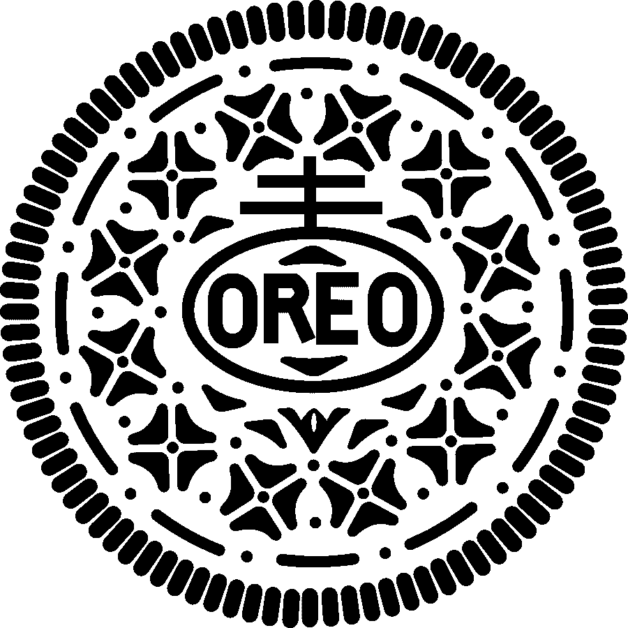
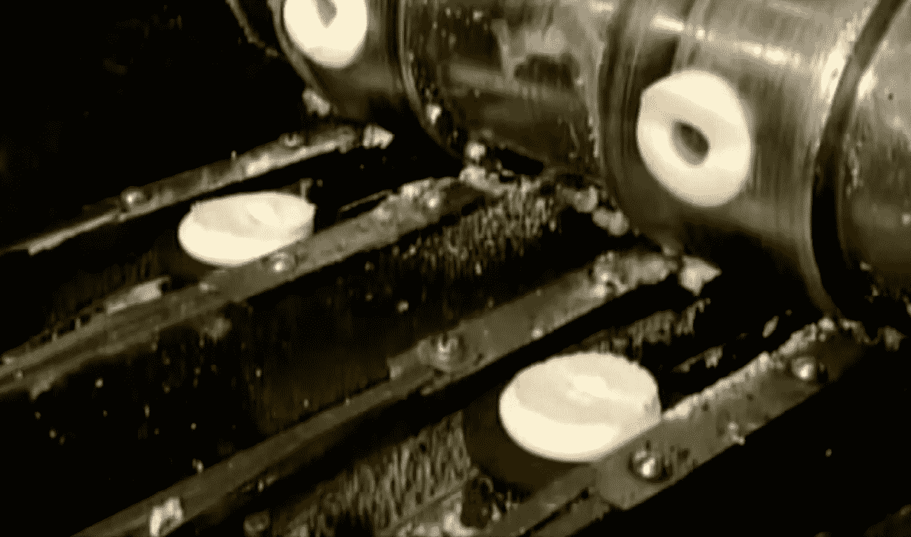

# 普林斯顿的研究生如何逆向工程奥利奥

> 原文：<https://thenewstack.io/three-princeton-engineers-experimented-oreos/>

在新泽西州的一所研究生院，三个朋友开始了一项非凡的探索，他们想看到未来——或者至少绝对确定地知道，当你把奥利奥饼干拆开时，奶油在哪里。

这个故事要追溯到 20 世纪 90 年代，当时曾有一个广告活动，建议孩子们不用扔硬币，只需拆开一块奥利奥饼干，就可以做出重要的游戏决定，甚至预测他们的未来:

[https://www.youtube.com/embed/1kD3L3Ypqps?feature=oembed](https://www.youtube.com/embed/1kD3L3Ypqps?feature=oembed)

视频

几十年后，在普林斯顿大学的机械和航空航天工程项目中，三名研究生勇敢地调查了这些传说是否是真的——是否真的存在一种模式，即纳贝斯克的一半巧克力三明治饼干最终会有最多的奶油。

他们的故事吸引了 Quartz，它在[上发布了一篇记录他们冒险经历的可爱文章](http://qz.com/806914/oreo-twist-off-game-prediction/)。热诚的研究人员团队是:

*   [乔舒亚·斯皮勒](https://www.linkedin.com/in/joshua-a-spechler-b5a5b137)——现在是苹果公司的硬件工程师
*   约翰·卡纳雷拉——现在是杜邦公司的机械工程顾问
*   丹·奎因——目前是斯坦福大学的博士后学生

当他们都深情地回顾他们在普林斯顿的时光时，有一个特别的实验会让他们永远记住。正如石英解释的那样:

每天下午 4 点，他们部门会端出咖啡和饼干，包括——令人惊讶的——奥利奥。几个月来，茶点时间过去了，三人组没有再考虑饼干，但有一天奥利奥扭扭游戏出现了。

“奥利奥是我们这一代人的愿望，”奎因说，他目前是斯坦福大学的博士后。

如果你曾经想知道研究生们在每天下午 4 点喝咖啡的休息时间都聊些什么——现在你知道了。是的，饼干*也在*上。但这不仅仅是因为他们沉浸在怀旧的童年记忆中——以及对咖啡因和糖的狂热追求。“卡纳雷拉声称他有一个童年的朋友，他总是赢得奥利奥扭摆游戏，”石英报道。

这是一群科学家，他们决定调查…

那么*有没有一种模式可以让饼干的哪一面得到最多的奶油？根据 Quartz 的说法，当这三个朋友寻找答案时，他们发现“文献中没有任何东西”。正如 Thrillist.com[后来解释](https://www.thrillist.com/news/nation/predicting-what-side-of-oreo-cream-is-on-twist)，“当发现没有其他人对这个问题给予足够的关注时，三人组深入了。”*

这个故事最令人惊讶的是研究人员投入了大量的精力来分析这个问题。“从工程的角度来看，这很有趣，因为这种饼干与许多现代复合材料相似，”卡纳雷拉告诉 Quartz，并指出“强脆层(薄饼)的强度与弱韧性层(奶油)的韧性相结合。”Quartz 将奥利奥描述为“将高强度但易碎的材料与低强度韧性材料结合在一起的系统”。

你以为那只是一块饼干…

哦，但是[强大的奥利奥](http://www.oreo.com/)要多得多。一个多世纪以来，奥利奥一直是美国最畅销的饼干。102 年后，两名加州男子于 2014 年被判 20 年监禁，罪名是[出售奥利奥秘方，使用](http://qz.com/184795/a-us-jury-just-convicted-two-men-for-selling-a-secret-oreo-whitening-technique-to-china/)杜邦化学物质来增白香草奶油馅。一位纳贝斯克食品科学家甚至获得了奥利奥相关工艺的五项专利。“我们只能希望它们都印在巧克力上，”《时代》杂志开玩笑说，“写在香草糖霜上……”

所以，也许在我们文化深处的某个地方，隐藏着一种不可抗拒的诱惑，想要破解奥利奥饼干最后仅存的秘密。普林斯顿坚定的研究人员继续他们的科学调查。实验室测试和实验接踵而至，用金属臂机械地一个接一个地扭开饼干。呃，毫不奇怪，他们的研究完全是自费的。他们冒险去山姆俱乐部买散装饼干。沿着阴谋(和巧克力)的轨迹，他们的精彩冒险到达了激动人心的结局，研究人员最终实现了他们的“尤里卡！”瞬间——这一科学突破将在未来几年彻底改变曲奇饼的制作。

“成千上万的饼干后，普林斯顿大学的研究人员终于意识到 25 岁的游戏被操纵，”石英报道。“对于盒子里的每一块饼干，奶油都在同一边……如果奶油出现在一块饼干的左饼干上，那么它也会出现在盒子里每块饼干的左饼干上。”

团队的最终结论？"这是制造过程的一个特点。"

这篇文章甚至引用了一部简短的纪录片[作为更多的证据，这部纪录片讲述了一次参观制作类似小吃的饼干工厂的经历](https://www.youtube.com/watch?v=-i1oMwNgH2Q)[纽曼-O](http://www.newmansown.com/food/type/cookies/) (来自演员保罗·纽曼的食品公司)。这里，奶油馅首先只涂在一片薄饼上。然后，它沿着生产线向下移动，让它的奶油暴露几秒钟——在另一个巧克力威化应用到另一面之前。

显然，这显著影响了香草奶油馅的粘性。“热奶油很容易流过第一片薄饼，填满饼干的小裂缝，像热胶水一样粘在上面，”Quartz 报告说，“而冷奶油只是停留在这些裂缝的边缘。”

https://www.youtube.com/watch?v =-i1omngh2q

不用说，这一消息在爱吃奥利奥的网上世界激起了强烈反应。“这一发现为操场上的骗子们在天真无邪的学童身上横行霸道打开了方便之门……”Thrillist.com 抱怨道。“不要把你的新知识用于邪恶，”文章总结道。

但是这个大学实验让 Gizmodo 有了自己的理论:“这三个人在开始这个任务的时候可能已经嗨到不行了。

“就像大多数吸毒实验一样，你会学到一些你可能不知道的东西，但这几乎没用。”

Gizmodo 的故事也引发了一位评论者的意料之中的反应。

“现在我很想吃奥利奥。”

<svg xmlns:xlink="http://www.w3.org/1999/xlink" viewBox="0 0 68 31" version="1.1"><title>Group</title> <desc>Created with Sketch.</desc></svg>