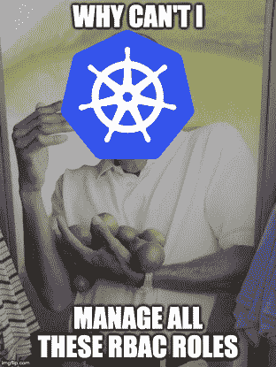
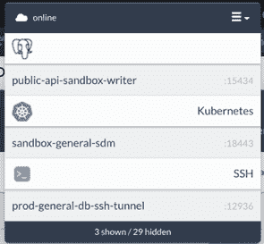

# 库伯内特 RBAC 的 3 种现实方法

> 原文：<https://thenewstack.io/three-realistic-approaches-to-kubernetes-rbac/>

[](https://www.linkedin.com/in/catherine-ting-cai/)

 [猫蔡

猫蔡现任博览会平台工程总监。当不编码时，你可以找到她写的关于编码或举重的文章。](https://www.linkedin.com/in/catherine-ting-cai/) [](https://www.linkedin.com/in/catherine-ting-cai/)

Kubernetes 上基于角色的访问控制(RBAC)理论上看起来完全合理。显而易见:组织当然希望对集群实施用户和应用程序访问策略。Kubernetes 官方文档[提供了很多关于 RBAC API 对象如何工作的指导](https://kubernetes.io/docs/reference/access-authn-authz/rbac/)，但是很少有关于如何为组织以功能方式部署它的最佳实践。开发人员在“ [Kubernetes 最佳实践](https://lmgtfy.com/?q=kubernetes+best+practices)”上尝试了真正的 Google-fu 方法，结果发现同样的信息缺乏被包裹在安全咒语的列表中(职责分离等等)。)

以一种适合你公司规模的方式管理 RBAC 令人困惑和不知所措。在加速实施政策之前，有必要弄清楚 RBAC 实际上在试图解决什么问题。

您通常会发现，实现 RBAC，就像所有的安全问题一样，是限制访问和操作简便性之间的一场跷跷板游戏。

还有最低特权原则，这是你的安全团队一直困扰你的问题。但这实际上意味着什么呢？运行在中的应用程序和访问集群的开发人员应该只能访问他们需要的资源。你的应用程序应该只能读取它们自己的[机密](https://kubernetes.io/docs/concepts/configuration/secret/)和[配置图](https://kubernetes.io/docs/tasks/configure-pod-container/configure-pod-configmap/)。很简单。你的开发人员有点难搞清楚，因为有许多开发人员的角色，他们很容易随着时间的推移而改变。例如，移动开发人员可能只需要对 Kubernetes 集群的只读访问权限，而主要平台开发人员则需要管理员访问权限。另一方面，您试图平衡操作简便性。作为集群管理员，您希望能够快速授予新用户一个角色，让他们拥有所需的所有访问权限(而不是授予个人特权的疯狂行为)。这使得审计更容易，因为您将通过他们所拥有的角色确切地知道谁可以访问什么资源。您还希望能够详细说明随着时间的推移不会成为巨大的运营难题的角色。

我已经阐明了三种现实的方法去了解库伯内特·RBAC。我知道这些，因为我做过

## 方法 1–面向所有人的集群管理


如果你从以前做集群管理的时候就开始做 Kubernetes 了。

如果你是一家缺乏工程资源的小型创业公司，这也可能是现状。业务速度往往胜过安全性，这没什么。知道你的风险是什么是值得的。

### 阿拉伯国家区域局已实施:✅

**最低特权原则:**🙈你刚刚做了你的安全工程师最可怕的噩梦。每个开发人员都可以访问一切(是的，您组织的国家机密！)您的应用程序能够针对 Kubernetes 集群运行 API 命令。如果应用程序受到危害，那么在这种实现下，可以安全地假设一切都受到危害。

**操作简便:**🤷🏻‍♀️:这个实现很容易，因为你的开发人员要么可以访问集群中的所有东西，要么根本不能访问。需要注意的是，随着你的成长，你会招致组织风险和麻烦。您的开发人员可能会无意中删除您的配置映射和机密。哎呀。

**结论:**它确实完成了任务。对于信任度高、时间少、资源少的小型初创公司来说，这可能是完全建立(或需要)更严格的 RBAC 政策的一个很好的方法。对于那些工程人员超过 30 人的公司来说，这种方法并不太好。

## # 2–RBAC 婴儿台阶

在您的组织发生了第 n 起因偶然击键而导致所有集群配置和/或机密被删除而需要手动干预的事件后，您可能已经超越了 CAFA 解决方案。在这些事件和愤怒的安全团队咄咄逼人的催促之间，您被迫为您的应用程序和用户划分出 RBAC 角色。这看起来像什么？

你所有的**应用**都应该有一个服务账户，而不仅仅是默认账户。

```
<em># Specify a service account name for your application</em>
apiVersion:  v1
kind:  ServiceAccount
metadata:
name:  data-engineering-app
namespace:  data-engineering
—
apiVersion:  apps/v1
kind:  Deployment
metadata:
name:  data-engineering-app
namespace:  data-engineering
spec:
replicas:  2
template:
metadata:
labels:
app:  data-engineering-app
spec:
<em># Reference the service account in your deployment</em>
serviceAccountName:  data-engineering-app
containers:
–  name:  data-engineering-app
image:  nginx:latest
ports:
–  containerPort:  80
env:
–  name:  AWS_REGION
value:  “us-west-2”
–  name:  WHATS_THIS_EVEN_NEED_CONFIGS_FOR
valueFrom:
configMapKeyRef:
name:  data-engineering-app
key:  totally.real.configs
resources:
requests:
cpu:  10m
memory:  40Mi
limits:
cpu:  10m
memory:  40Mi

```

然后，您将指定一个角色和一个相应的 RoleBinding，以确保您的服务帐户只能访问它需要的 K8s API 资源。在这种情况下，示例应用程序只需要读取自己的配置。

```
<em># Create a role that allows the deployment to read configs</em>
apiVersion:  rbac.authorization.k8s.io/v1
kind:  Role
metadata:
<em># Remember that roles are scoped to a namespace</em>
namespace:  data-engineering
name:  umbrella:data-engineering-app
rules:
–  apiGroups:  [“”]
resources:  [“configmaps”]
resourceNames:   [“data-engineering-app-configmap”]
verbs:  [“get”]
—
<em># Create a rolebinding to bind the role to the service account</em>
apiVersion:  rbac.authorization.k8s.io/v1beta1
kind:  RoleBinding
metadata:
name:  umbrella:data-engineering-app
roleRef:
apiGroup:  rbac.authorization.k8s.io
kind:  Role
name:  umbrella:data-engineering-app
subjects:
–  kind:  ServiceAccount
name:  data-engineering-app
namespace:  data-engineering

```

在**用户**侧实施 RBAC 在概念上是类似的。您可以为单个用户创建 RoleBindings，但是这并不是推荐的方法，因为这样做有很高的操作员精神错乱的风险。

对于 sane RBAC 来说，更好的方法是创建用户映射到的内容；这种映射是如何完成的取决于集群的[验证器](https://kubernetes.io/docs/reference/access-authn-authz/authentication/%23authentication-strategies)(例如，EKS 的 aws-iam-authenticator 使用 mapRoles 将角色 ARN 映射到一组组)。

组和他们可以访问的 API 最终是根据组织的需求来确定的，但是一般的读者(对于刚刚熟悉事物的新工程师来说)、作者(对于您的工程师来说)和管理员(对于您来说)角色是一个好的开始。(哎，对所有人来说都比 admin 强。)

```
—
<em># An example reader ClusterRole – ClusterRole so you’re not worried about namespaces at this time. Remember, we’re talking generic reader/writer/admin roles.</em>
apiVersion:  rbac.authorization.k8s.io/v1
kind:  ClusterRole
metadata:
name:  reader
rules:
–  apiGroups:  [“*”]
resources:
–  deployments
–  configmaps
–  pods
–  secrets
–  services
verbs:
–  get
–  list
–  watch
—
<em># An example reader ClusterRoleBinding that gives read permissions to</em>
<em># the engineering and operations groups</em>
apiVersion:  rbac.authorization.k8s.io/v1beta1
kind:  ClusterRoleBinding
metadata:
name:  reader-binding
roleRef:
apiGroup:  rbac.authorization.k8s.io
kind:  ClusterRole
name:  reader
subjects:
–  kind:  Group
name:  umbrella:engineering
–  kind:  Group
name:  umbrella:operations
—
<em># An example writer ClusterRole</em>
apiVersion:  rbac.authorization.k8s.io/v1
kind:  ClusterRole
metadata:
name:  writer
rules:
–  apiGroups:  [“*”]
resources:
–  deployments
–  configmaps
–  pods
–  secrets
–  services
verbs:
–  create
–  delete
–  patch
–  update
—
<em># An example writer ClusterRoleBinding that gives write permissions to</em>
<em># the operations group</em>
apiVersion:  rbac.authorization.k8s.io/v1beta1
kind:  ClusterRoleBinding
metadata:
name:  reader-binding
roleRef:
apiGroup:  rbac.authorization.k8s.io
kind:  ClusterRole
name:  reader
subjects:
–  kind:  Group
name:  umbrella:operations

```

### **RBAC 实施了:**   (RBAC 想不开，加倍检查)

**最低特权原则:**🤷🏻‍♀️大部分情况下，是的。有独立的读者、作者和管理员角色。您的应用程序都获得特定的访问权限。是时候拍拍我们自己的背了。工作做得很好…

**RBAC 已实施:** ✅✅ (RBAC 非常努力，反复检查)

**操作简单:**当然，这并不像赋予每个人和所有事物神力那么简单，但是这里的设置总体来说还不错。除此之外，随着时间的推移，你会发现越来越多的不同团队向你咨询 RBAC 政策。除了你的组织的平台/开发/基础设施/工具团队之外，没有人会去弄清楚 Kubernetes 的 RBAC 是什么。您发现自己不得不经常更新策略，以识别新的自定义资源定义，用于您的数据工程师不断开发的酷酷的 Kubernetes 集成。根据您使用的身份验证器的类型，您还可能手动将开发人员设置到他们所属的组中，以获得正确的访问权限。你开始觉得自己像一个被美化了的 YAML·德夫。

## #3:自动化



这最后一种方法…并不是真正的方法。它更多的是一系列指引，让你走上 RBAC 的成功之路。在感受到第一点和第二点的痛苦后，随着时间的推移，你会自然而然地采用很多这样的方法。

对于您的应用程序，您可能希望采用与第二部分中的通用读取器/写入器/管理器方法类似的方法。大多数应用程序不太可能大量使用 Kubernetes API，除了读取它们自己的配置和秘密。

对于 CI/CD 相关的应用程序，您可以对 API 组稍微宽松一些。创建一个通用 RBAC 模板和指导方针的知识库供公司其他人使用是很好的第一步。如果它们易于使用和查找，您的开发人员最终只会复制/粘贴它们(这正是您想要的)。

根据您在 Kubernetes 中的身份验证方法，用户配置可能是处理 RBAC 的一个棘手问题。 [strongDM](https://strongdm.com/docs/user-guide/kubernetes-connection/) 集成了 Kubernetes，使向用户授予基于角色的集群访问权限变得标准化和简单。

strongDM 的解决方案不是创建直接的用户映射，而是依赖于在 Kubernetes 中生成角色，并用客户端证书和密钥填充 strongDM。然后，用户可以按照与所有数据源相同的标准化方式获得对集群的访问权限。



随着时间的推移，随着组织的发展，通用的读者/作者/管理员方法无法扩展。(一个随机的网络陌生人提出的解决方案难道不是解决你所有问题的良药吗？惊喜吧。)你的每个角色都需要更多的粒度，这意味着你需要创造更多的角色，这在精神上变得更加困难。像往常一样，开源解决方案来拯救这一切，使之更容易管理。 [RBAC 管理器](https://github.com/FairwindsOps/rbac-manager)通过标签使管理用户、服务和角色绑定变得更加容易。 [rakkess](https://github.com/corneliusweig/rakkess) 和 [rbac-lookup](https://github.com/FairwindsOps/rbac-lookup) 都提供了服务帐户和用户角色的简单可见性，由于未知的原因，单独使用 kubectl 很难确定。(这几乎就像库伯内特有意让你难以理解 RBAC)。Popeye ，一个用于执行最佳实践的通用 Kubernetes 扫描器，对于检测由于更新和删除角色而逐渐积累的未使用的 RBAC 规则非常有用。

### **RBAC 已实现:** ✅✅您已经得到了这两个检查，所以希望您没有倒退并丢失 RBAC 实现。

**最小特权原则:是！**

**操作简便:**静止🤷🏻‍♀️.在这一点上，您可能已经意识到实施 RBAC 并不是一门精确的科学，并且容易随着时间的推移而改变，这取决于您的组织的增长轨迹。希望有了现成的开源解决方案，您将能够拼凑出一个适合您的解决方案，而不会将您逼入绝境。工程师的梦想。

<svg xmlns:xlink="http://www.w3.org/1999/xlink" viewBox="0 0 68 31" version="1.1"><title>Group</title> <desc>Created with Sketch.</desc></svg>