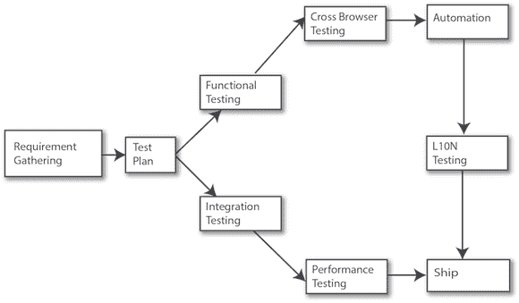

# 软件工程的三个阶段

> 原文：<https://thenewstack.io/three-stages-software-engineering-scale/>

正如一句古老的工程格言所说，“快速、便宜或好:你只能有两个。”虽然个别软件开发人员经常面临何时何地在代码中做出妥协的决定，但科技公司作为一个整体也在更广泛的层面上面临类似的问题。当一个公司寻求扩展软件工程时，诸如复杂性、速度、组织一致性和资源可用性之类的东西会产生限制。然而，改变开发、构建、测试和发布应用程序的方式通常有助于缓解这些问题。

## 第一阶段:简单

扩展软件开发必须从某个地方开始。当我在 2011 年加入 LinkedIn 时， [LinkedIn 移动开发团队](https://thenewstack.io/lessons-learned-building-linkedin-app-six-months/)很小——确切地说，只有六个人。该公司只有一个 iOS 应用程序，它是基于 [Three20 框架](https://github.com/facebookarchive/three20)构建的。我们使用 Ruby on Rails 前端，我们的 Rails 实例与我们的后端 API 接口。构建是在我的个人机器上创建的，发布是根据需要进行的。测试几乎完全是手动的，我们只测试了一些服务器端的指标。我们既没有手机网站，也没有安卓系统。可以想象，这不是构建和部署软件的最有效方式。

当开始一个新的软件开发项目时，最重要的第一步是找到使开发-构建-发布过程简单的方法*。早期关注简单和直接的过程是关键，因为它允许您专注于创建解决您的业务问题的软件，为您的用户表现良好，并可以随着您的用户群的增长而扩展。*

 [基兰·普拉萨德

Kiran Prasad 是 LinkedIn 的工程副总裁。他目前领导着旗舰团队，该团队为 LinkedIn 全球超过 4.67 亿会员提供统一的移动和桌面体验。在 2011 年加入 LinkedIn 之前，他是 Palm Inc .的高级应用总监，在那里他启动并交付了 webOS，这是 Palm 的第一款 Windows Phone，也是最初 Treo 的技术负责人。](https://www.linkedin.com/in/kiranprasad) 

在移动世界中，许多人认为他们没有时间专注于构建可靠的代码。因此，他们被引诱使用像 PhoneGap 这样的工具，这些工具以简单性换取便携性。但是我建议不要这样做，因为这些工具本质上是用技术债务来换取开发和部署的速度，这使得随着应用程序的发展，您更难理解自己的代码。它们还使得无法使用由苹果和谷歌等大平台公司提供的开发工具，包括服务器端和客户端。这些工具可以满足一般项目团队的需求，当涉及到开发和测试时，只有不到十个左右的开发人员在一个项目中工作。

相反，在您的扩展基础的开始，您应该专注于让专家从根本上理解您的代码，并避免用速度换取工具，这些工具将使设计-构建-测试过程复杂化或在项目的早期引入技术债务。

在早期阶段要避免的另一件关键事情是试图解决那些不会推动你的业务发展的问题。很多人听说了像谷歌、脸书或 LinkedIn 这样的公司在工具方面的出色表现，并希望通过构建自己的定制工具来模仿这些公司。但是我们和同行组织开发这些工具的唯一原因是因为我们有成百上千的开发人员。用户和开发人员的数量使我们不得不做定制工具，而不是相反。[试飞](http://www.imore.com/testflight)、 [Gradle](https://thenewstack.io/linkedins-python-contribution-gives-gradle-added-boost/) 、 [IntelliJ](https://www.jetbrains.com/idea/) IDE 和其他简单的工具将满足你的大部分需求，而你的开发团队仍然很小。如果有人提出一些定制的疯狂工具来解决一个常见的工程问题，那么这可能是错误的答案。

我们的技术堆栈的性能权衡每天都在引起头痛。我们需要架构我们的服务器，使其更加 I/O 友好，我们需要修复测试和发布管道。到第 3 季度，我们已经开始扩展我们的组织，以扩大我们的移动用户群和平台可用性。我们有 11%的流量，在基于 Android 和 HTML5 的移动网络上发布，并且已经增加了 10 名工程师。我们还从基于流程的系统(Rails)切换到事件系统( [Node.js](/tag/node.js/) )，以提高处理客户端请求的性能。

## 第二阶段:效率

一旦你的工程组织发展到 30 人以上，下一件重要的事情就是建立一种发布节奏的意识。当我们在 LinkedIn 建立了一个规模合理的移动工程团队后，我们遇到了分支开发模型的问题，我称之为“分支地狱”从本质上讲，如果你的发布相隔很远，开发人员会因为害怕错过最新的构建而尝试提交还没有准备好投入生产的代码。这导致不良代码被添加到分支中，损害了分支的就绪性，并最终延迟了软件新版本的发布。

为了解决这个问题，我们最终采用了一个非常简单的发布模型，称为“火车模型”在这种模式中，每个版本都在固定的时间投入生产，就像火车离开车站一样。某一组特性可能在火车上，也可能不在火车上，但毫无疑问，它肯定会离开，这解决了延迟发布的问题。当你在一个早期的工程组织中时，火车可以随时离开。但是一旦你达到了一定的规模，你需要创建并坚持一个时间表——关于你如何以及何时发布新版本的结构。

> 专注于维护平台之间的一致性将会简化工具层的开发，以及每个人理解产品的认知层。

为了让 train 模型工作，您需要投资一个基于主干的开发模型，与分支开发相比，它提供了一个显著简化的方法。拥有一个好的实验平台和自动化测试套件也是一项不错的投资，这样可以加快您的发布进度并增加您的测试覆盖率。在这一点上，我还建议运行模拟器(软件模拟器之类的),在这个阶段不要关注设备的可变性，直到您获得更多的用户。

LinkedIn 测试策略。

在 LinkedIn，我们使用一个名为 [LIX](https://engineering.linkedin.com/testing/quality-control-linkedins-testing-methodology) 的系统，管理我们所有测试和实验的生命周期。每个产品特性都经过 LIX 测试，功能测试是在 LIX 开启和关闭的情况下进行的。所有的检查都是直接进行的，必须符合我们的测试标准才能发货。当我们在 2012 年采用这个系统时，这意味着我们的自动化测试第一次可以让我们全面了解我们的代码准备情况，哪些功能已经准备好发布，哪些还没有。简而言之，我们已经驱逐了“分支地狱”

在我们公司历史的这一点上，我们跟踪三个主要指标来衡量成功:

*   从设计创建到代码签入的时间。
*   从代码签入生产代码的时间。
*   从代码进入生产到 100%加入成员的时间。

一旦你处于更有节奏的执行模式，我建议锁定跨平台的功能开发，这样在 iOS 上推出的功能也可以在 Android 上推出。这不仅仅是为了满足最终用户的期望。相反，将两者分开会给每个人带来更多的复杂性，从设计师、项目经理到开发人员。专注于维护平台之间的一致性将会简化工具层的开发，以及每个人理解产品的认知层。

## 第三阶段:组织调整

当项目变得如此之大，以至于你所有的工程努力(基础设施、数据库、操作等等)都无法完成时，扩展任何软件开发项目的最后阶段就是组织调整。)支持相同的输出。当你开始让数百名开发人员致力于一个单一的代码库，数百万用户每天都在使用你的软件时，这种情况就会发生。

> 随着你越做越大，你实际上需要压缩发布周期。

在这个规模上，你需要在每个阶段保证质量:提交前、提交后、生产中等等。从很多方面来说，这意味着你必须放弃在测试周期中发现所有 bug 的想法，而专注于监控你的软件在野外的实际行为。有很多关键指标可以用来衡量你的产品运行的好坏:CPU 利用率、DNS 查找、内存利用率、崩溃率等等。:这些都是关键指标。这可能看起来违反直觉，但没有办法监控 1 亿用户在他们的屏幕上看到了什么，所以你实际上必须发布你的软件才能真正了解它的性能。

另一个违反直觉的想法是，随着你变得越来越大，你实际上需要压缩发布周期。在 LinkedIn，我们从每月一次的发布周期变成了 3×3 的发布周期。这种更短的持续时间减少了开发人员的巨大担忧，他们可能会觉得需要在最后一刻将许多功能加入到一个版本中，以避免错过最后期限。对于更小的人群，你可以通过文化来控制这种倾向。但是，当你的工程团队中有许多不同组织的许多人时，你不可能仅仅通过文化来控制这种冲动。频繁的发布也有助于开发人员减少对错过发布截止日期的焦虑，因此，他们不会急于将代码投入构建。

拥有这样的发布节奏几乎需要一个完全自动化的发布周期，仅仅是为了跟上您的团队前进的步伐。在这个阶段，我前面讨论的定制工具开始发挥作用。这是因为在这种规模下，iOS、Android 甚至 Web 开发的默认工具将无法处理您不断增长的代码库，并将最终降低您的团队的移动速度。它们并不是为了方便许多人在同一个代码库上工作而构建的，默认情况下，大型平台供应商并没有提供像质量库管理这样的特性。在 LinkedIn，我们在多个回购之间分割我们的项目，以实现更易于管理的多团队协作。这需要在定制工具上进行大量投资，以使多产品开发工作能够跟上我们期望的发布节奏。随着您团队的成长，准备在您的开发基础设施上进行类似的投资。

最后，这一部分被称为“组织调整”是有原因的。今天，在 LinkedIn，我们将移动视为我们业务的主要部分，不再区分移动工程和桌面工程。正如形式遵循功能一样，随着用户和客户数量的增长，您的业务目标和软件项目也将最终保持一致。无论用户使用什么平台，他们都希望获得相同的体验。拥有两个拥有两种不同体验的团队。破碎的经历造成了群体间的内讧。

此外，如果移动团队的人数比工程团队的其他人加起来还多，你就不会继续雇佣他们。当你的项目与整个组织融合为一个整体时，你可以说你在你的工程组织中真正有了“规模”。

## 把所有的放在一起

扩展一个软件工程组织向最好的组织提出了许多挑战。它有可能带来成本和复杂性，但也为改善协作和提高运营效率提供了有益的机会。

通常，这些挑战不仅与流程和资源有关，也与文化和理念有关。通过减少对组织的恐惧，提高创新的速度，并在整个组织中建立一致性，您可以获得一大群高度积极的软件工程师的好处。

<svg xmlns:xlink="http://www.w3.org/1999/xlink" viewBox="0 0 68 31" version="1.1"><title>Group</title> <desc>Created with Sketch.</desc></svg>