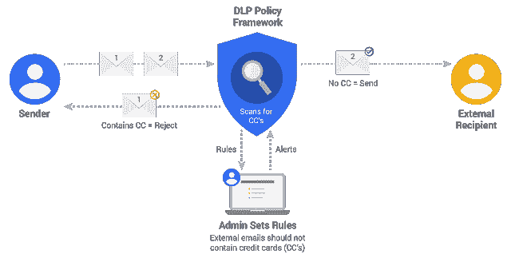

# 谷歌向开发者提供物理密钥认证

> 原文：<https://thenewstack.io/three-years-later-google-offers-physical-key-authentication-developers/>

本月早些时候，在三藩市举行的 Google Cloud Next(T1)大会的两场主题演讲中，负责技术基础设施的高级副总裁 T2 向观众展示了一系列安全技术。它们中的一些，当剩下的部分缝合在一起时，可以组成一个平台。

有一种技术被称为[数据丢失预防(DLP)库](https://cloud.googleblog.com/2015/12/google-for-work-security-announcing-DLP.html)，但从技术上讲，它实际上是一个隐私安全网，能够扫描数码照片，并自动编辑信用卡号、社会安全号和其他可能是私人数据的常见模式。在同一个演示中，有一个 USB key——具体来说，是 FIDO U2F(通用第二因子)key，可能来自[yubi co](https://www.yubico.com/)——它验证用户对 [G Suite Enterprise](https://gsuite.google.com/) 应用程序的访问，或者可能是托管在[谷歌云平台](https://cloud.google.com/)上的任何应用程序。

“这项功能可以让您对域中的所有成员强制使用安全密钥，”lzle 解释道，他站在一个手指像短笛一样操作 U2F 键的动画前面。"这意味着现在对你所有应用程序的访问都有很强的防钓鱼能力."

该演示使其看起来好像 DLP 库和 U2F 密钥都是一个有凝聚力的新安全平台的一部分，以及一个名为[身份感知代理](https://cloud.google.com/iap/)的新软件库，加上一个由谷歌制造的实际芯片，以在服务器内部建立一个*信任根*，它被称为 Titan。此外，该安全平台的杠杆点是谷歌云平台。

## 祖先

谷歌实际上正在围绕其建立的模型——在演示文稿中只是间接提到了它的存在——可以追溯到 2014 年。然后，一位名叫[罗里·沃德](https://research.google.com/pubs/RoryWard.html)的爱尔兰谷歌网站可靠性工程师与技术作家[贝特西·拜尔](https://www.linkedin.com/in/betsy-beyer-5b80712/?locale=de_DE)合作，开发了一个他们称为“ [BeyondCorp:企业安全新方法](https://static.googleusercontent.com/media/research.google.com/en/us/pubs/archive/43231.pdf)的安全模型[PDF] Ward 和 Beyer 的论文[被认为引发了 Google 的行动](http://www.datacenterknowledge.com/archives/2015/05/15/googles-wholesale-move-cloud-take-security-makes-cloud-apps-enterprise-friendly/)将几乎所有的内部应用程序迁移到一个*非特权托管模型*——一个废除虚拟专用网络(VPN)的模型，这样任何服务器，任何地方托管应用程序都可以可靠地验证客户端。

这种模式支持任何服务器驱动的系统或任何公共平台即服务(PaaS)向经过身份验证的用户可靠地提供应用和数据，同时拒绝所有其他用户的访问。通过将安全负担转移给客户，BeyondCorp 模型将重新定位攻击面，从一个容易破解的软壳生物，变成大约 100 万个硬壳坚果。

Google 现在称之为云身份感知代理(Cloud IAP)是由 BeyondCorp 模型引入的，它有一个相似的名字:面向互联网的访问代理。“访问代理是为每个应用程序配置的，”Beyer 和 Ward 在 2014 年写道，“并提供通用功能，如全局可达性、负载平衡、访问控制检查、应用程序健康检查和拒绝服务保护。在访问控制检查完成后，此代理将请求适当地委托给后端应用程序。

[几周前发布的谷歌云 IAP 新文档](https://cloud.google.com/iap/)的序言将它的存在归功于 BeyondCorp，它将其描述为“一种企业安全模式，使每个员工都能在不使用 VPN 的情况下从不受信任的网络工作。”

BeyondCorp 模式极其重要的一点——比其无 VPN、无边界访问控制的原则更重要——是它在 Google 内部引发的浪潮，它反过来影响了我们所有人。BeyondCorp 预示着向面向应用的基础设施的转变，不仅是针对谷歌的主要服务，如搜索，而是针对它所做的一切。事实上，正是重新设计其所有服务的迫切需要，导致谷歌将其 [Borg](https://thenewstack.io/google-learned-borg-container-management/) staging 模型应用于低层用户应用。正是这种努力向谷歌工程师揭示了[将容器调度器分离出来作为一个独立进程](https://thenewstack.io/google-lifts-the-veil-on-borg-revealing-apache-auroras-heritage/)的必要性。这个决定直接导致了 Kubernetes 的诞生。

IAP 可能是历史上最重要的软件创新之一的催化剂。然而，在谷歌 Next，它被奇怪地描述为——与其起源相反——GCP 向用户提供的一种保护机制。

“我们认为对资源的每一个访问决策都不是关于用户的凭证，也许是他们的第二个因素，”lzle 说，“而是真正应该基于周围环境的东西，例如，用户设备的状态，他们的位置，等等。我们称之为“上下文感知安全性”。用户的环境决定了访问权限，而不仅仅是他们所在的网络或他们是谁。我们今天使用 IAP 代理的上下文只是用户身份和安全密钥，也就是身份认证的强度。但是随着时间的推移，你可以期待我们未来的版本使用越来越丰富的上下文，以更好地保护对你的云应用或 G 套件的访问。"

## 激励

虽然微软曾经锁定的平台的一些部分已经相互分离，但该公司仍然拥有的优势之一(我不会使用“王牌”一词)是 Active Directory 身份管理软件的市场份额仍然超过 90%。微软显然正在利用其在上下文丰富的身份方面的领导地位，作为 Azure 和 Office 365 的支柱。

正如身份市场领域的一些人猜测的那样，谷歌感受到了来自微软的压力，要找到一种与 Azure 平起平坐的方式，或许还能保持竞争优势。这就是 Yubico 的用武之地。

早在 2014 年，就在一名谷歌安全工程师告诉同样的观众，“我们目前在社区中没有比基于密码的身份认证更好的选择”后几天，一群安全工程师联合起来，成立了[快速身份在线(FIDO)联盟](https://fidoalliance.org/)。在谷歌的合作下，Yubico 生产了第一批消费级 FIDO U2F 钥匙。

U2F 不是一个身份机制；表示身份的问题就留给别人了。相反，U2F 寻求涉及身份的认证过程的标准化，然而，它可能被标记化，以及在所涉及的三方之间的交换中使用的语言:会话中的服务器和客户端，加上担保客户端真实性的*依赖方*。

随着首款 Yubikey 的上市，Gmail 成为谷歌第一款利用这些密钥进行二次身份认证的应用。今天，你可以设置所有谷歌的网络应用程序来识别你的 U2F 键。

“从 FIDO U2F 的角度来看，这项工作是为了消除对用户名和密码的依赖，增加一个强大的第二个因素，”Yubico 负责解决方案工程的副总裁 [Jerrod Chong](https://www.linkedin.com/in/jerrod-chong-527b633/) 在谈到新的堆栈时解释道。“因此，开发人员编写的代码，而不是构建使用密码的应用程序或网站，他们可以选择允许一个强大的第二因素。市场上还有许多次要因素，但迄今为止，我们在 FIDO U2F 安全密钥方面所做的工作确实是最先进、最安全的。”

## 选择的诅咒

Chong 认为，如今认证面临的主要问题是选择的多样性。

“老实说，我们给身份产业制造了这个烂摊子，”他告诉我们。“每一家安保公司都对我们今天的混乱局面负有责任。认证也不例外；生态系统中有很多专有的东西。所以我们需要继续前进。安全社区合作比相互对抗更有价值。”

据 Chong 说，Yubico 对与谷歌合作的兴趣不是为了推进单一云平台的事业，而是为了帮助为每个人都可以使用的认证标准奠定进一步的基础。

“总的来说，我们需要转向一种模式，在这种模式下，一切都可以相互配合，”他说。“云平台也是如此。云平台和银行没什么区别。如果每个云平台都需要与您拥有的任何认证者(无论是软件、手机还是硬件)建立某种一对一的关系，这对每个人来说都是一种糟糕的情况。因为一个公司要和多个云服务合作，不管喜欢不喜欢。这些云公司在这方面可能是邪恶的，但每个人都在使用 AWS，每个人都在使用 Azure，每个人都在使用 Google。三到四种不同的产品试图进入这些系统都不起作用。每个人都必须一起工作。好消息是，我们实际上已经在这件事情上取得了进展，大型互联网服务提供商说，“伙计们，你们真的必须为生态系统解决这个问题。”"

因此，倡导工作负载协调公平竞争的公司(远在其收入流之外)正被其合作伙伴敦促对云平台服务采取同样的立场(远在其收入流之内)。这就是关于公平的事情:除非你平均分配，否则作为一项政策，它不会很好地发挥作用。

来自 [Yubico](https://www.yubico.com/press/images/) 的特色照片。

<svg xmlns:xlink="http://www.w3.org/1999/xlink" viewBox="0 0 68 31" version="1.1"><title>Group</title> <desc>Created with Sketch.</desc></svg>