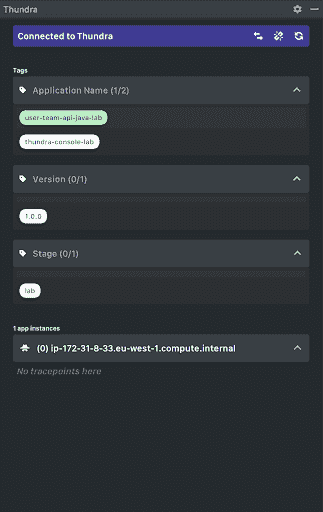
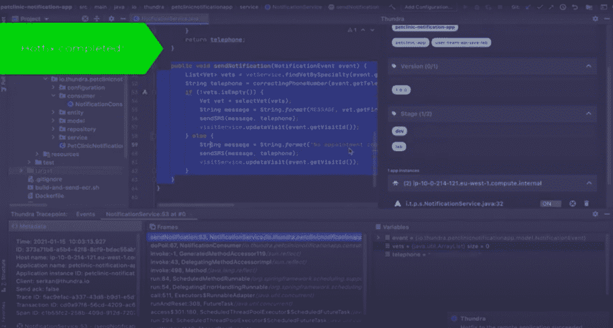
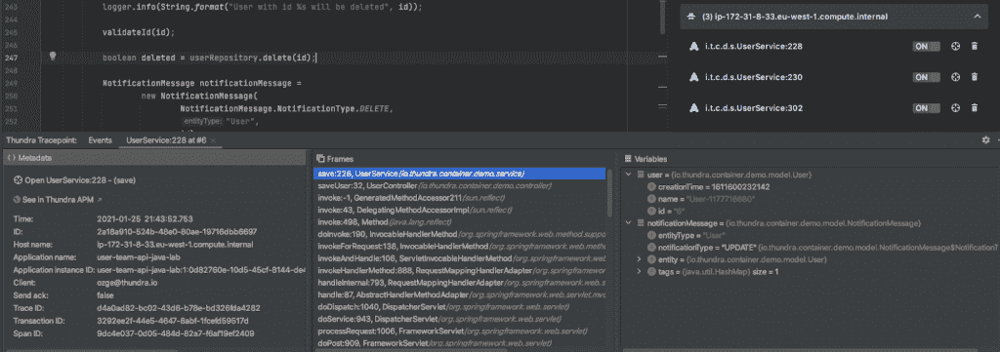

# 桑德拉云调试平台支持 Java/Spring 热修复功能

> 原文：<https://thenewstack.io/thundra-debugging-platform-supports-java-spring-hot-fix-capabilities/>

云监控提供商桑德拉通过提供一个插件来扩展其平台，以便在不中断应用程序执行时间的情况下远程调试和修复应用程序代码。

虽然[桑德拉](https://www.thundra.io/?utm_content=inline-mention)以前允许监控和调试应用程序和微服务，但桑德拉的[助手](https://blog.thundra.io/introducing-thundra-sidekick-intellij-idea-plugin)插件更进一步，允许直接对实时代码实施补丁。因此，开发人员可以依靠桑德拉来诊断应用程序性能问题，然后使用桑德拉 Sidekick 和 Java 集成开发环境 [IntelliJ IDEA](https://en.wikipedia.org/wiki/IntelliJ_IDEA) 来添加和查看问题代码的跟踪点，而不会影响代码的执行。然后，无需重新部署应用程序就可以实现和上传修复。

“在成功帮助社区解决生产问题后，我们也明白了我们触及了开发者痛苦的冰山一角，”[桑德拉创始人兼首席技术官 Serkan Ozal](https://tr.linkedin.com/in/serkanozal) 说桑德拉 Sidekick 有助于发现和修复以前隐藏的更大的问题。"

这个新插件适用于任何 Java 应用程序和任何 Spring 应用程序。如果运行时是 Java，它可以在亚马逊网络服务、微软 Azure 和谷歌云上运行。它还致力于容器化应用程序和 Kubernetes。

## 复杂性斗争

Ozal 描述了监控系统“过去和现在都面临着独特的挑战”，需要替代方案来监控和修复问题，而不影响应用程序功能的执行时间。与此同时，Ozal 指出，如今构建的应用程序越来越多地使用第三方服务创建，如 [DynamoDB](https://aws.amazon.com/fr/dynamodb/) 和 [SQS](https://aws.amazon.com/sqs/) ，在线零售服务，包括 [Twilio](https://www.twilio.com/) 和 [Stripe](https://stripe.com/) ，以及内部 DevOps 团队成员提供的支持应用程序开发和运营管理的服务。

“应用程序的复杂性不断增加，开发人员需要在应用程序投入生产之前和之后管理复杂性，”Ozal 说。“在代码投入生产后，有许多最佳实践和多种工具来管理复杂性和解决问题，但是，最终结果是现代应用程序的生产复杂性仍然没有得到很好的管理。”

桑德拉监控和调试平台允许开发人员通过 IDE 在调试过程中在单独的测试环境中暂停和中继代码。这是通过使用跟踪、指标和日志的跟踪功能来实现的。

[在演示](https://www.youtube.com/watch?v=3aOjnEam09Y&feature=youtu.be&ab_channel=Thundra)中，桑德拉展示了一个样本事件，涉及一个终端用户在安排预约时遇到的问题。桑德拉 Sidekick 调试过程首先涉及设置和启动跟踪点，以揭示代码中的问题。问题代码随后在云环境中被一个修复程序替换。

## 远程修复

除此之外，桑德拉 Sidekick 还为远程开发团队提供便利，Ozal 说。

“传统上，开发人员使用他们的个人电脑和本地环境来模拟第三方和云依赖，”Ozal 说。“尽管在开发分布式微服务和云应用的同时创建反映生产环境的开发环境具有挑战性，但应用团队欢迎远程开发。”

然而，Ozal 指出，在远程环境中调试应用程序的过程通常是“艰巨的”，并且当“像在本地环境中一样为远程应用程序设置断点”时，通常会缺少这一过程。“远程开发缺乏分布式环境下的调试工具，”Ozal 说。“这一挑战揭示了利用桑德拉的技术来最大限度地满足开发人员在处理微服务时的生产前需求的机会。”

附加 Sidekick 功能:

**设置跟踪点:**跟踪点集成了其分布式跟踪技术。“通过使用跟踪点周围的变量，开发人员可以定义跟踪点的条件，并通过定义跟踪点来过滤必要的信息，”Ozal 说。"例如，当特定条件发生时，开发人员可以配置它并拍摄快照."

**快照**:当代码执行到达跟踪点时，桑德拉·塞德克为变量和调用堆栈拍快照，所有有价值的数据都被检索到，而性能开销可以忽略不计(<1 毫秒)。

**分布式追踪**:桑德拉助手在同一个分布函数中连接几个追踪点。“这允许开发人员在同一事务的快照之间导航，同时实现端到端的调试可见性，”Ozal 说。

<svg xmlns:xlink="http://www.w3.org/1999/xlink" viewBox="0 0 68 31" version="1.1"><title>Group</title> <desc>Created with Sketch.</desc></svg>