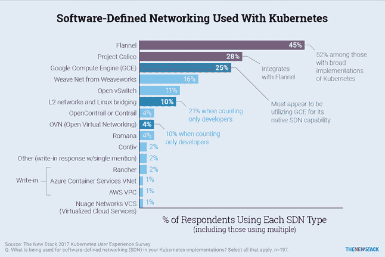

# Tigera 旨在缓解与 Kubernetes 的连接问题

> 原文：<https://thenewstack.io/tigera-aims-ease-connectivity-pain-kubernetes/>

网络初创公司 Tigera 的最近发布了 Kubernetes 的 Essentials，这是该公司的首次商业发布，是计划每月发布的第一个工具，以帮助云原生应用程序的开发人员解决他们的连接挑战。

它旨在弥合概念验证和生产级 [Kubernetes](/category/kubernetes/) 之间的差距，这是一个开源的容器编排引擎。

Tigera 总裁兼首席执行官 [Ratan Tipirneni](https://twitter.com/ratant?ref_src=twsrc%5Egoogle%7Ctwcamp%5Eserp%7Ctwgr%5Eauthor) 表示，云原生架构带来了一系列连接问题，如动态设置容器、分配 IP 地址、设置网络、弄清楚每个微服务如何与其他微服务对话、延迟、重试等问题。

“所有这些问题现在都落到了开发商的肩上，”他说。“我们过去也遇到过这些问题，但都是在系统软件层面。现在有了这种类型的架构，开发人员不得不处理这个问题。”

Tigera 的核心技术, [Project Calico](https://www.projectcalico.org/) ,拥有大量正在转向生产 Kubernetes 的用户。Tipirneni 说，每秒钟数十亿次 API 调用的大型部署正在带来一种新的连接挑战。

该公司在宣布 Tigera Essentials 时断言:“当考虑负载平衡、云网络、安全策略、集群进入、地址转换或引导流量以平衡多个版本(例如，蓝绿部署、滚动升级或金丝雀版本)的选项时，用户会对堆栈中不同级别的选项组合感到困惑。”。

总部位于旧金山的公司的第一个工具包中的三个功能:

*   一个策略查询实用程序(作为新的命令行工具“calicoq”安装)，用于探索哪些策略适用于哪些工作负载，并确定适用于给定 pod 的所有策略。它可以确认安全策略是否按预期应用，并诊断策略配置错误。
*   一种策略审核模式，用于在投入生产之前进行预演。它确保策略按预期运行，并可以帮助用户分析流量模式，从而在不中断应用程序的情况下优化策略。
*   策略违规警报，用于早期检测异常应用程序行为或入侵者活动。

Tigera 的员工还为工具包和支持的技术提供技术支持，并保证生产部署问题的响应时间。它支持 Calico 2.4、法兰绒 0.8、集装箱网络接口(CNI) 0.5.2 和 Istio 0.1。

Calico 项目是虚拟网络的第 3 层方法，它是由 [Metaswitch](https://www.metaswitch.com/) 开发并开源的。[法兰绒](https://github.com/coreos/flannel)，来自 [CoreOS](https://coreos.com/) ，是一个容器网络结构，依赖于分布式系统信息存储守护进程 etcd，是 Kubernetes 的基础。 [CNI](https://github.com/containernetworking/cni) ，也来自 CoreOS，现在是[云本地计算基金会](https://www.cncf.io/)(也是 Kubernetes 的赞助商)的一个网络项目。

[Istio](https://github.com/istio/istio) 是一个交通监控网络，旨在与 Kubernetes 协同工作。Tigera 只在非生产环境中支持它，但是 Tipirneni 预测它会很大。

“我们正在拥抱 Istio。我们相信这将是一个非常强大、非常有影响力的连接解决方案，”他说。

每月 Tigera 工具包将基于客户需求；Tipirneni 说，该公司已经积压了大量的申请。

Tigera 的创始人**—**[Andrew Randall](https://www.linkedin.com/in/andrewrandall/)、[Christopher Liljenstolpe](https://www.linkedin.com/in/liljenstolpe/)和 [Alex Pollitt](https://www.linkedin.com/in/alexpollitt/) **—** 来自 Metaswitch，他们宣布去年成立的新公司将成为开源项目 Calico 的赞助商。2016 年 6 月，Tigera 宣布与 CoreOS 合作，在一个名为 [Canal](https://github.com/projectcalico/canal) 的新项目中[整合印花布和法兰绒](https://www.youtube.com/watch?v=3QmPTPw5QXg)。Tigera 的 Tom Denham 最近提供了这项工作进展的最新情况。

[https://www.youtube.com/embed/3eAVHt3lyuM?feature=oembed](https://www.youtube.com/embed/3eAVHt3lyuM?feature=oembed)

视频

在 Docker 和容器生态系统上的新堆栈[电子书中的一篇关于](http://www.thenewstack.io/ebookseries)[容器联网](https://thenewstack.io/container-networking-landscape-cni-coreos-cnm-docker/)的帖子中，[李·卡尔科特](https://twitter.com/lcalcote)深入研究了为 Linux 容器配置网络接口的两个提议标准:由 Docker 和 CNI 提议的容器网络模型(CNM)。

在新堆栈 2017 年 Kubernetes 用户体验调查尚未公布的结果中，法兰绒是最受欢迎的网络选择，45%的受访者使用它。

Calico 以 28%的份额位居第二，谷歌计算引擎以 25%的份额紧随其后，用户引用了 GCE 的本地软件定义网络(SDN)工具。

与初次实施 Kubernetes 的人(39%)相比，广泛实施 Kubernetes 的人(52%的受访者)更有可能使用法兰绒。

然而，46%的人在引用印花布的同时也引用了法兰绒，因为两者正在融合。与此同时，在表示他们的 Kubernetes 实现处于初始状态的集群运营商中，大约 40%的人表示他们正在使用 Project Calico。

TNS 调查结果报告的作者、分析师 Lawrence Hecht 表示:“Tigera 能否在这些用户被广泛采用的过程中留住他们，这是一个悬而未决的问题。”。

然而，Tipirneni 说，印花布被广泛用于生产 Kubernetes 环境。

Hecht 还指出，应用程序开发人员有不同的需求，因此他们对 SDN 方法的选择多种多样也就不足为奇了。

[云本地计算基金会](https://www.cncf.io/)和[CoreOS](https://coreos.com/) 是新堆栈的赞助商。

来自 Tigera 的特征图像。

<svg xmlns:xlink="http://www.w3.org/1999/xlink" viewBox="0 0 68 31" version="1.1"><title>Group</title> <desc>Created with Sketch.</desc></svg>