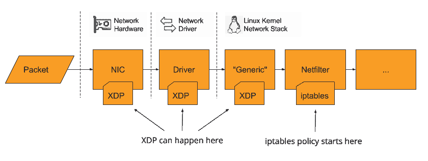

# Tigera 利用 eBPF 为 Calico 提供内核级功能

> 原文：<https://thenewstack.io/tigera-harnesses-ebpf-to-give-calico-kernel-level-functionality/>

随着 2018 年接近尾声，[我们写道](/linux-technology-for-the-new-year-ebpf/)[扩展的 Berkeley 数据包过滤器(eBPF)](https://prototype-kernel.readthedocs.io/en/latest/bpf/) 将开始“从各个内核模块接管更多的监控、安全和网络职责”，事实上，新采用的 Linux 内核虚拟机已经[成为各种](/sysdig-update-provides-security-and-visibility-to-cloud-native-applications/)[产品新功能的核心](/cilium-making-bpf-easy-on-kubernetes-for-improved-security-performance/)。本周，Kubernetes 安全和合规性提供商 [Tigera](https://www.tigera.io/) 发布了两个新特性，这两个新特性基于 eBPF 作为其开源 [Calico](https://www.tigera.io/tigera-products/calico/) 控制平面的新增数据平面。

在接受新堆栈采访时，Tigera 首席执行官 [Ratan Tipirneni](https://www.linkedin.com/in/ratantipirneni) 认为 Tigera 首席技术官兼联合创始人 [Alex Pollitt](https://www.linkedin.com/in/alexpollitt/) 的早期架构决策是这些新功能的关键。

“他对数据层的看法是利用现有的东西，而不是试图重新发明。这是一个明智的决定。这是他的第一个决定。他做的第二个决定是让这个可插拔，这样如果将来有更好的数据点，我们就可以插入它，”Tipirneni 说。“这些年来，我们一直在研究的第一个数据平面是 Linux IP 表。效果真的很好。eBPF 是一种新的数据平面。它要稳定下来并开始成为主流还需要几年的时间，但是对于一些特定的用例，eBPF 可以超级强大。一个例子就是拒绝服务攻击，我们相信 Kubernetes 集群遭受拒绝服务攻击只是时间问题。”

在一篇博客文章中，该公司解释说，eBPF 将用于两个新功能:拒绝服务(DoS)攻击的[缓解](https://www.tigera.io/blog/introducing-xdp-optimized-denial-of-service-mitigation/)和 Envoy sidecar 加速，这将“使用 eBPF 功能提高 Istio 的网络吞吐量。”第一个功能在[的独立博客文章](https://www.tigera.io/blog/introducing-xdp-optimized-denial-of-service-mitigation/)中有详细解释，于 5 月随 [Calico 3.7](https://www.tigera.io/blog/whats-new-in-calico-v3-7/) 发布，并使用 eXpress Data Path (XDP)运行，“这是一种 Linux 内核功能，允许 BPF 程序非常早地插入 Linux 的数据包处理管道”，将 DoS 攻击的处理移动到网络接口控制器(NIC)或 NIC 设备驱动程序的堆栈上，而不是依赖于 Linux 的 IPTables 策略，后者在堆栈中进一步运行。

该功能让人想起硬件加速，如使用 GPU 进行机器学习，这意味着它可以承受比原生 IPTables 大得多的数据包量，如 Tigera 的基准测试所示。

博客文章称，第二个功能是通过使用“eBPF sockmap 来绕过 sidecar 架构的大部分网络开销”，从而加快 Istio 中 Envoy sidecar 的吞吐量。Tipirneni 解释说，这本质上是一种捷径，因为 eBPF 允许他们再次将进程移动到堆栈的不同部分。在这种情况下，sockmap 允许 eBPF 跳过许多标准的网络路由功能，这些功能通常会减慢这个过程。Tipirneni 解释说，eBPF 允许用户拥有一个安全的环境来开发内核级特性，而以前他们可能会面临内核崩溃的风险。

“您可以在用户级别编写实用程序并调用一些内核函数，而不用担心内核崩溃。在某种程度上，它给了你一个虚拟机，在内核中安全而温暖，允许你窥视内核并做一些非常酷的事情，”Tipirneni 说。“假设你正在编写一个设备驱动程序，它驻留在内核中。你有一个中断处理程序，中断处理程序需要非常高效。您可以在用户级别编写一个简单的 eBPF 程序来查看设备驱动程序的中断处理程序，并查看它在中断处理代码中引入的延迟。另一个例子是文件系统——您可以编写一个简单的实用程序来查看系统调用的性能，看看延迟是多少。以前你需要成为一名内核程序程序员才能访问它，但是使用 eBPF，你可以在用户级别做很多很酷的事情。”

Tipirneni 还表示，鉴于 eBPF 的潜力，Tigera 将寻求进一步投资，将其产品与 eBPF 整合。

“我们将在 eBPF 上投入大量资金，因为我们认为 eBPF 不仅仅是一项技术，更是一个创新平台。通过利用 eBPF 的特性，你可以解决一些非常复杂的问题，我们预计将在这方面投入大量资金，”Tipirneni 说。“安全攻击变得越来越复杂。你需要能够利用多个向量，我们觉得 eBPF 实际上可以让我们访问多个向量，我们可以获得更好的可见性，推动异常检测，并利用一些机器学习功能来检测和防止大量攻击。”

目前，Linux 用户必须运行 Linux 内核版本 4.4，或者最好是 4.9 才能运行 eBPF。虽然 Calico 3.7 已经使用 eBPF 来帮助减轻 DoS 攻击，但 Calico 3.8 预计将在本月晚些时候推出 Envoy sidecar 加速。

图片由来自 Pixabay 的 Gerd Altmann 提供。

<svg xmlns:xlink="http://www.w3.org/1999/xlink" viewBox="0 0 68 31" version="1.1"><title>Group</title> <desc>Created with Sketch.</desc></svg>