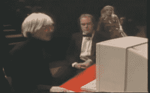
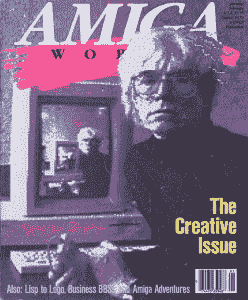

# 安迪·沃霍尔尝试阿米加的时候

> 原文：<https://thenewstack.io/time-andy-warhol-demod-amiga/>

下个月是安迪·沃霍尔逝世 30 周年纪念日。他于 1987 年情人节后 8 天去世，享年 58 岁。因此，这是一个很好的时机来回顾一下 20 世纪的艺术偶像之一是如何首先面对一种真正新技术的到来的——个人电脑。

沃霍尔出生于宾夕法尼亚州匹兹堡一个移民矿工的儿子，但后来创作了一些有史以来最昂贵的画作。

事实上，他对“波普艺术”的研究可能源于他早期作为商业艺术家的职业生涯，这让他对名人的*技术*有了独特的理解，这在很大程度上要归功于那些大量生产的照片……

但是他生命的最后几年特别有趣，包括为 MTV 制作的有线电视节目[——当然，叫做“安迪·沃霍尔的 15 分钟”(“MTV 推出了半小时的夜生活新乐队，时髦的人说着奇怪的事情，”](https://web.archive.org/web/20100123101437/http://www.warholstars.org/warhol/warhol1/andy/warhol/film/tv.html)[戏弄了一个宣传广告](https://www.youtube.com/watch?v=sEzkf1Iwaz0)。)

[https://www.youtube.com/embed/0aGt8lsTn98?feature=oembed](https://www.youtube.com/embed/0aGt8lsTn98?feature=oembed)

视频

甚至还有[客串《爱之船》](http://www.adamkuban.com/2013/01/yes-this-really-happened-andy-warhol-was-on-the-love-boat-2/)，[在达斯汀·霍夫曼电影 *Tootsie* 中客串](https://youtu.be/2P5ZtegrW0g?t=45)，以及[1984 年热门单曲《汽车又见面了》的官方音乐录影带](https://youtu.be/KXpJ0bM5zbM)中的角色。当然，也是在那一年，苹果公司发布了他们开创性的“1984”广告(由雷德利·斯科特导演)，宣布他们新的麦金塔个人电脑…

“当第二年 Amiga 宣布他们的 Amiga 1000 时，该公司不顾一切地制造更大的轰动，”记得[最近的一篇文章主板](http://motherboard.vice.com/read/how-the-commodore-amiga-turned-andy-warhol-into-a-computer-artist)。“Amiga 的第一个型号与 Mac 的最初版本相比有许多主要优势，包括其广泛的调色板、令人印象深刻的动画功能以及多任务处理能力。”

谁比安迪·沃霍尔更能展示它的潜力呢？

Amiga 的软件工程主管 Robert Pariseau 身穿燕尾服，打着领结，第一次登台，引人注目地宣布“Amiga 在纽约市林肯中心的全球首映”。他告诉人群，“你们将要见证的是始于 1982 年的研究和工程努力的结果，迄今为止已经消耗了超过 100 个人年的工程人才。”

Pariseau 在实用工作台上展示了它的时钟和“偏好”工具，他解释说，“在 Amiga，*用户*控制他如何使用他的时间，而不是计算机。”有一个 Textcraft 文字处理器，一个“非常丰富的用户界面”，包括菜单和光标图标。

Pariseau 展示了 Amiga 的 4096 种颜色、一些简单的动画图形、在单独窗口中运行的应用程序，以及生成条形图和饼图的能力，赢得了掌声。他制作了一张 3.5 英寸的软盘，里面有一个神奇的 IBM 个人电脑模拟器，令观众眼花缭乱。(“是的，是用软件完成的。它是如何工作的？那是个秘密……”)

“他很好，但他不是史蒂夫·乔布斯，”主板认为，并补充说，“幸运的是，准将有更好的东西…安迪·沃霍尔和黛博拉·哈利，他们出来展示了机器的艺术能力。”

在上面视频的最后三分钟，组合“金发女郎”的主唱黛博拉·哈利一边捋着头发，一边问“你准备好为我画像了吗？”常驻阿米加艺术家杰克·哈格(也在舞台上，穿着燕尾服)宣布他将协助安迪·沃霍尔使用阿米加创作他的第一幅电脑肖像。“首先，安迪要给黛比拍一张数码快照……你发现这很自然，不是吗？”他提示道。

“是啊，很好，”沃霍尔说，表现出他标志性的语调缺乏变化。

“这是一件很棒的事情，”他难以置信地补充道，这实际上引来了观众怀疑的笑声。

“你还能说什么？”杰克·哈格勇敢地说。

“嗯，有很多事情，”安迪说，从字面上理解他…

哈格继续讲述沃霍尔对这个现在已经很原始的软件的使用:“安迪正在从菜单栏中选择，它给你提供了绘画系统的所有功能，他正在选择‘填充’……”当他为哈利的黄头发选择的黄色一直漏到图像的角落时，沃霍尔——总是一个意外华丽的粉丝——说:“嗯，这有点漂亮。我想我会留着它。”

当被问及他用过什么电脑时，沃霍尔暗示他没有用过，赢得了掌声。“我等着，呃，等这一个。”

沃霍尔后来回忆说，这就像是在博物馆展示他的作品——在他创作的时候。

当被问及他的时尚艺术家朋友们对计算机艺术的新概念有何看法时，沃霍尔回答说:“他们都很喜欢。他们一直在使用施乐，他们迫不及待地想使用它，因为有太多的人对施乐艺术感兴趣。”在个人电脑出现之前，施乐机器是最先进的电子复制品，引用沃霍尔 1969 年的一个实验，[另一个网站](http://tedium.co/2016/05/05/photocopiers-xerox-history/)暗示沃霍尔“可能是第一个认为把自己的脸放到复印机上是个好主意的人。”

到 20 世纪 70 年代，沃霍尔已经转移到宝丽来相机，根据维基百科[，“宝丽来特别为沃霍尔生产。”但是到了 1985 年，沃霍尔说“在电脑上进行艺术创作，我最喜欢的一点是它看起来像我的作品。”](https://en.wikipedia.org/wiki/Andy_Warhol#Other_media)

他对个人电脑的新热情，尤其是对 Amiga 的热情，完全是真诚的。“在他生命的最后，他开始使用 Amiga 计算机创作作品，”[记得计算机历史博物馆](http://www.computerhistory.org/atchm/warhol-the-computer/)，并补充道“沃霍尔对计算机感兴趣并不奇怪；几十年来，他一直着迷于流行文化，计算机已经超越了神秘的工具，成为日常生活中的物品……再加上这种机器的艺术潜力，他的兴趣一点也不夸张。”

博物馆报告称，史蒂夫·乔布斯曾试图打电话给安迪·沃霍尔送他一台麦金塔电脑，但“沃霍尔从未回过电话，认为没有理由考虑电脑。”然而，沃霍尔最终还是在 1984 年约翰·列侬九岁儿子的生日派对上遇到了史蒂夫·乔布斯。此外，还有纽约艺术家基斯·哈林。

起初，沃霍尔和哈林看着乔布斯向肖恩展示如何操作这台机器。过了一会儿，沃霍尔代替肖恩站在了苹果电脑前，乔布斯试图解释如何使用鼠标。这花了一段时间，但最后沃霍尔用铅笔工具来画。

“看！基思。我画了一个圈！”沃霍尔对哈林说。

Motherboard 报道称，沃霍尔最终对 Amiga 的个人电脑产生了浓厚的兴趣。沃霍尔收购了几个阿米加，并开始用它们创作作品，包括一部用阿米加 1000 拍摄的名为《非诚勿扰》的短片。这是 20 个玛丽莲·梦露的数字化影像，来自 20 世纪 50 年代的新闻短片，由沃霍尔处理，配上音乐这部电影直到他去世近 20 年后才上映——只有一次，是由底特律的新艺术博物馆放映的。

计算机历史博物馆报道说，沃霍尔还为《阿米加世界》杂志创作了一个封面，展示了“安迪·沃霍尔与阿米加的合影，展示了安迪·沃霍尔与阿米加的合影……与沃霍尔的许多作品一样，它是关于我们这个世界的图像以及艺术家如何在这个世界中发挥作用的。虽然安迪·沃霍尔的传统艺术作品可能更为人所知，但如果他多活几年，他很可能会成为所有电脑艺术家中最重要的人物。”

来自计算机历史博物馆。

但他不仅仅创造了一个封面。这位桀骜不驯的艺术家甚至同意接受*阿米加世界*的采访。尽管这是一次奇怪的采访，是在沃霍尔制作《今日深红偏振清洗——格洛·多莉·帕顿》的时候进行的，他通过改变颜色来分散注意力。(“哎呀，如果我们现在有一台打印机，我就可以用所有这些不同的颜色把它们打印出来并发送到多莉·帕顿，”沃霍尔嘀咕道。"这会省去我们很多麻烦。")

两位面试官不知道该问安迪·沃霍尔什么，最后以“这是自切片面包以来最伟大的事情吗？”

“哦，是的，它是…”

在去世前两年，沃霍尔似乎不可思议地意识到了这种新设备的颠覆性潜力。当被问及他是否预见到人们使用个人电脑进行视频编辑时，沃霍尔不想暗示这样一个有限的未来。“我觉得任何东西……任何人都可以用。”

安迪·沃霍尔 1975，来源:维基百科。

他认为人们会创造更多的个人艺术吗？“那也是，是啊…”

他认为使用电脑有局限性吗？“没有。”

他认为自己把它作为主要工具了吗？“哦是啊。这会节省很多时间。”

当被问及是否怀念把手放在颜料里的时候，他回答说，“不，不，不把手放在颜料里真的很棒。”

那么，为什么他从来没有做过任何与计算机有关的事情呢？“哦，我不知道。麻省理工学院给我打了大约 10 年左右的电话，但我从来没有去过……也许是耶鲁大学。”

这是这位 50 多岁的艺术家的有趣一瞥，他正在迎接一项真正新技术的到来。沃霍尔似乎对互动小说的想法很感兴趣，但他说他不玩游戏，因为“我不够快”但他已经在展望未来，他提出了大规模 20 x 30 英尺打印输出的可能性，说他认为他现在应该有一支轻便的笔，并想象有一个触摸屏该有多好。

在某个时刻，面试官终于问了他一个终极问题——他的新 Amiga 个人电脑有没有他*不喜欢的地方。沃霍尔回答道“不，不，我喜欢这台机器……*

“如果我们有打印机，我会用四种不同的颜色画这幅肖像，然后送给多莉。”

* * *

# WebReduce

Amiga 发布视频的特征图片。

<svg xmlns:xlink="http://www.w3.org/1999/xlink" viewBox="0 0 68 31" version="1.1"><title>Group</title> <desc>Created with Sketch.</desc></svg>