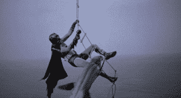

# 那次美国海军试图开发爆炸鲨鱼

> 原文：<https://thenewstack.io/time-navy-tried-develop-exploding-sharks/>

 你知道伟大的想法是如何同时出现在多个深刻的思想家身上的吗？

在 1966 年的电影《蝙蝠侠》中有一个场景，穿着斗篷的十字军战士[与一条爆炸的鲨鱼](https://www.youtube.com/watch?v=qcKZMWiFZCI#t=6m06s)搏斗。就在那个历史时刻，美国海军正在进行一项为期 13 年的项目，开发爆炸鲨鱼！

上周，[玛丽·罗奇](http://maryroach.net/)(《华盛顿邮报》称她为“美国最有趣的科学作家”)发表了一篇文章，引用了最近解密的文件，内容是关于美国海军战后对鲨鱼投放弹药的实验。在研究一本关于“[战争中人类的好奇科学](https://www.amazon.com/Grunt-Curious-Science-Humans-War-ebook/dp/B016APOD1K/)”的书时，罗奇发现了关于这个从 1958 年到 1971 年进行的奇异海军实验的第一个线索。在《海洋渔业评论》的一篇文章中，罗奇发现了一个项目的参考资料，该项目“将鲨鱼转化为一种遥控鱼雷，可以在装载炸药的同时撞击船只。”

罗奇在 *Undark* 网站(由麻省理工学院新闻项目出版)上写道:“我无法让自己把它放在一边，”在一篇题为“[我遗漏了什么:鲨鱼皮多？“她尽职尽责地开始打电话——“如果你打电话是为了一个被标记的探听者，请按 3，”一条语音邮件信息建议道——并最终确认了斯克里普斯海洋研究所存在一个文件缓存。罗奇最终证实了关于一个叫做詹姆斯·马里恩·斯诺德格拉斯的所谓“小玩意人”的文件的存在，这些文件存放在斯克里普斯。不幸的是，所有的文件都被标记为“机密”](http://undark.org/article/sharks-explosives-world-war-ii-mary-roach-what-i-left-out/)

但是 MuckRock.com 调查网站的一位联合创始人知道很多关于索取公共记录的事情，他后来帮助罗奇获得了一份海军关于他们奇怪的 13 年项目的官方最终报告…

海军的复杂计划是使用头盔将鲨鱼神奇地变成可操纵的鱼雷，头盔可以传递冲击，将鲨鱼导向敌人的目标。鲨鱼的整个路线将被预先编程到头盔中，一旦鲨鱼偏离路线，头盔就能感应到。鲨鱼生物学家与小玩意人 Snodgrass 合作开发了复杂的路线跟踪机制，这也让鲨鱼感到震惊。这些隐形的海洋掠食者——海底食物链中的顶级动物——将被用来创建一个具有战略意义的攻击鱼类大军。

> 鲨鱼用它们的鳃逐渐从水中吸取氧气。它们的身体具有均匀的密度，这使它们躲过了正在寻找密度差异的声纳系统。

但是最终，这个项目失败了——因为鲨鱼不想做。经过 13 年的研究，海军得出结论说:“鲨鱼对长时间的电刺激没有反应，这让我们印象深刻。”。海军甚至研究了捆绑炸药到其他动物身上，但是发现他们的选择“惊人的有限”

他们在 1971 年 6 月 16 日的最终报告中，以最严肃的语气宣布，“我们对鲨鱼作为指挥导航工具或远距离运输有效载荷的适用性持严重保留意见。”

但即使在今天，似乎仍有该计划的回声。去年有报道称，在圣地亚哥的海军海洋哺乳动物项目中，海军[正在训练海豚搜寻海底矿藏。2012 年,《连线》杂志发表了一篇关于一名海洋生物学家的实验的文章，该实验涉及将水下激光夹在一条鲨鱼的尾巴上——在一篇题为“](http://www.businessinsider.com/the-us-navys-combat-dolphins-are-serious-military-assets-2015-3)[终于，一条鲨鱼有了激光](http://www.wired.com/2012/05/wicked-lasers-shark/)”的深思熟虑的分析中

[https://www.youtube.com/embed/-v7k6-eEBrk?feature=oembed](https://www.youtube.com/embed/-v7k6-eEBrk?feature=oembed)

视频

尽管该计划失败了，但海军最初的鲨鱼想法还是有一些优点的。鲨鱼非常隐蔽——比海豚安静得多——而且还能长距离游泳。与海豚不同，鲨鱼甚至无法被声纳探测到。鲨鱼用它们的鳃逐渐从水中吸取氧气。它们的身体具有均匀的密度，这使它们躲过了正在寻找密度差异的声纳系统。最后，“如果任务失败，”报告指出，一条死鲨鱼只会沉入海底——而不是带着海军配发的耳机不加选择地浮上水面。

这份解密文件还指出，海军认为海豚太聪明了，不容易控制。但是鲨鱼也可能是由于历史的偶然事件而被引入海军的。到第二次世界大战结束时，海军已经花了几年时间研究鲨鱼，以开发一种鲨鱼驱避剂。事实上，著名的法国厨师茱莉亚·切尔德记得，在她开始学习烹饪艺术之前，这是她在美国战时情报局工作期间的一个项目。在一个特殊的网页上，中情局记得早在 1942 年，蔡尔德“自认是厨房里的一场灾难”，开玩笑说“也许更合适的是，她很快发现自己在帮助开发一种连鲨鱼都拒绝食用的食谱。”

有趣的是，就连这种防鲨剂也出现在 1966 年的电影《蝙蝠侠》中，在这部电影中，蝙蝠侠与一条快要爆炸的鲨鱼搏斗，这条鲨鱼紧紧咬住了他的腿。“神圣的沙丁鱼！”罗宾喊道，蝙蝠侠打了鲨鱼一拳，但无济于事。他求助于他广泛收集的海洋驱避喷雾——其中包括鲨鱼驱避剂——然后告诉媒体，这是“一只不幸的动物偶然吞下了一枚漂浮的水雷”(补充说“我不会担心这个”)。因此，即使当海军正在进行他们秘密的机密计划，将鲨鱼武器化的时候，好莱坞正在制作一部电影，其中猫女、小丑、企鹅和谜语者也在使用同样的策略。

因此，也许海军失败实验的最后一句话来自蝙蝠侠的邪恶死敌谜语者也是奇怪而恰当的。在电影中，谜语者抱怨说，他们击败由超级恶棍企鹅开发的披着斗篷的十字军的精心计划被轻易挫败了。谜语者嘲弄地冷笑着…

“你和你训练有素的爆炸鲨鱼…”

https://www.youtube.com/watch?v = qcKZMWiFZCI # t = 6m06s

* * *

# WebReduce

<svg xmlns:xlink="http://www.w3.org/1999/xlink" viewBox="0 0 68 31" version="1.1"><title>Group</title> <desc>Created with Sketch.</desc></svg>