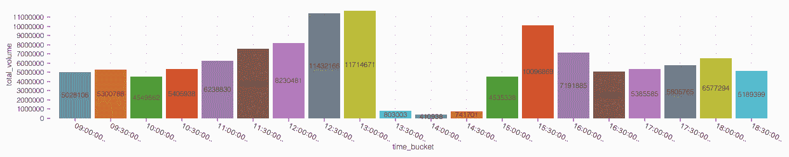

# 用 Kafka 和 Kinetica 对实时数据进行时间序列分析

> 原文：<https://thenewstack.io/time-series-analysis-on-real-time-data-with-kafka-and-kinetica/>

时间序列数据越来越受欢迎的原因是传感器和其他实时生成数据的设备越来越多，以及人们越来越认识到预测未来趋势的价值。

时间序列分析是理解模式的一种更加严格和结构化的方法，而不是简单地绘制一段时间内的测量值。它涉及到诸如线性或指数增长或衰退或周期性波动等分析，而这些往往不是仅仅通过查看数据图表就能看出来的。


图 1:互联设备的增长

对来自实时数据源的数据进行时间序列分析，可用于对业务流程和运营做出明智的决策。例如，企业可以使用它来跟踪能源使用和优化机器性能，监控客户行为和偏好，为设备提供预测性维护，检测操作中的异常情况，并降低成本。

然而，时间序列数据的很大一部分价值迅速贬值。例如，考虑股票交易和报价的市场数据。基于这些数据信号的买入或卖出决策需要在机会丧失之前立即触发。

但是，实时执行这种类型的时间序列分析是一个巨大的挑战。在本文中，我将通过建立一个端到端的管道来说明复杂的时间序列数据库所需的基本分析功能，该管道从两个不同的 Kafka 主题中获取股票市场数据，并对它们进行时间序列分析，以触发股票购买决策。都是实时的。

我将使用一个免费的时间序列数据库 Kinetica 来演示不同的部分。本文的最后一节包括如何在本地或云中安装 Kinetica 的说明(只需几分钟)。

### 从高速数据馈送中摄取

实时系列分析系统的第一个要求是能够快速接收大量数据。这需要几样东西:

1.  像 Apache Kafka 这样的流数据源的一流连接器
2.  同时执行查询和加载数据，即数据加载不能被查询执行阻塞
3.  跨群集中的所有节点分布接收，以便单个节点不会成为瓶颈

对于下面的第一个查询，我使用连接凭证、Kafka 集群的位置和 quotes 主题的名称创建了一个数据源。第二个查询是 LOAD INTO 语句，用于配置来自该数据源的流接收。数据接收过程始终处于开启状态，会自动将 Kafka 主题中的新数据添加到数据库的一个表中。

```
CREATE OR REPLACE DATA SOURCE quote_stream
LOCATION  =  'kafka://pkc-ep9mm.us-east-2.aws.confluent.cloud:9092'
WITH OPTIONS
(
 kafka_topic_name  =   'quotes',
 credential  =  'trade_quote_creds'  --set using  a  diff.  query
);

LOAD DATA INTO quotes
FORMAT JSON
WITH OPTIONS  (
 DATA SOURCE  =  'quote_stream',  --  name of the data source
 SUBSCRIBE  =  TRUE,
 TYPE_INFERENCE_MODE  =  'speed',
 ERROR_HANDLING  =  'permissive',
 kafka_offset_reset_policy  =  'latest',  --  load the latest
);

```

### 关于数据的注释

Kafka 使用主题的概念，主题接收封装输入数据的“消息”。您可以将每条消息视为表格中的一行。我为这次演示设置了两个合成的卡夫卡主题。

1.  交易主题:交易主题以每分钟为基础记录当天的交易数据。这些数据包括苹果、亚马逊和谷歌三只股票的开盘价、收盘价、最低价和最高价，以及每分钟的交易量。
2.  报价主题:报价数据以每秒五到六条消息的速度生成。这记录了三只股票的买入价、买入价大小、卖出价和卖出价大小。

我已经设置了主题，以便它们模仿市场反馈，但是主题**中的信息并不反映实际价格**。需要注意的另一点是，实际的市场提要只在市场时段(上午 9 点到下午 5 点或更长时间)运行，但是，我设置的主题会连续产生数据，因此代码可以在任何时区运行。


图 2:最高日交易价格。

## 日期和时间函数

日期和时间值的操作是时间序列分析的基本部分。您为时间序列分析选择的任何分析数据库都需要提供日期和时间函数，以便于处理时间序列数据。我在下面列出了一些常见的分析任务

### 计算工期

以下查询以天为单位计算交易数据的总持续时间。查询中的关键字“日”可以更改为其他值，如“月”、“年”、“秒”等。更改用于表示持续时间的单位。

```
 SELECT TIMESTAMPDIFF(DAY,  MIN(time),  MAX(time))  AS days_duration
FROM trades

```

### 时间段

另一个常见任务，尤其是在处理大量数据时，是创建存储桶来聚合特定的值，以便识别模式。

时间桶函数允许我们创建一个任意的时间间隔来对表中的时间(或日期)值进行分类。让我们用它来指定 30 分钟时段，并计算前一天这些 30 分钟间隔的总交易股票。时段函数的结果是日期时间格式的间隔的开始。我使用 SPLIT()函数丢弃日期部分，以便标签在图表上看起来更好。

```
SELECT
 SPLIT(
 TIME_BUCKET(INTERVAL  30  MINUTES,  time,  0,  0),  --buckets
 ' ',
 2)  AS time_bucket,
 SUM(trading_volume)  AS total_volume
FROM trades
WHERE date(time)  =  DATE(DATEADD(DAY,  -1,  NOW()))
GROUP BY time_bucket
ORDER BY time_bucket

```



图 3:昨天每 30 分钟的总交易量。

### 添加或减去日期和时间

有时我们可能需要加上或减去日期和时间值。这在尝试过滤数据的特定部分、校正日期时间记录中的一致滞后或沿时间线向前或向后跳转时非常有用。最简单的方法之一是使用区间函数。下面的简单查询向当前时间添加一天。

```
SELECT NOW()  +  INTERVAL  1  DAY AS same_time_tomorrow

```

### 窗口功能

窗口函数应用于按表中某一列排序的记录窗口(当应用于时间序列数据时，通常是时间)。每个窗口都是参照当前行构建的。该操作的结果集由表中每行的一个值组成。

```
&lt;window function&gt;  OVER  &lt;window specification&gt;

```

窗函数对于时间序列分析是必不可少的。它的许多应用包括如下。

1.  检测趋势和季节性:通过计算数据点窗口的滚动平均值或滚动标准差，窗口函数可用于识别时间序列数据中的趋势和季节性。
2.  平滑数据:通过在数据点窗口应用滚动平均，窗口函数对于平滑噪声时间序列数据也很有用。这有助于识别数据中的潜在模式，否则很难检测到这些模式。
3.  异常值检测:通过计算数据点窗口的滚动标准偏差，可以识别异常值并将其从分析中删除。这有助于确保数据集中的极值不会扭曲结果。
4.  特征提取:通过计算数据点窗口内的滚动平均值、滚动总和以及其他统计测量值，窗口函数也可用于从时间序列数据集中提取特征。这对于从时间序列数据集中提取趋势、季节性和周期等要素特别有用，这些要素可用于更复杂的分析，如预测和预测建模。

在下面的查询中，我使用一个窗口函数来查找前一天每个观察值的前五个观察值的移动平均值:


图 4:过去 24 小时的平均小时价格差距。

### 通过持续更新的物化视图保持实时性

在前面的查询中，我使用了一个物化视图来存储查询结果。请注意，第二行指定了五秒钟的刷新间隔。这意味着查询每五秒钟用最新版本的数据更新一次。因此，当新数据进入交易主题时，这些数据会自动包含在移动平均线计算中。此外，请注意 WHERE 子句。它使用 NOW()引用当前时间。每次刷新时，查询还会进行更新，以删除与上一个结果集中前五秒相对应的任何观察值。

### 时间戳需要不精确的或基于间隔的连接

复杂的分析和决策需要将不同表格中的数据结合起来。当表共享具有相同值的低基数键列(即基于等式的连接)时，这很容易。然而，在处理高速流数据时，情况往往并非如此。来自不同流源的时间戳很少精确对齐。

例如，当试图查找与交易值具有完全相同时间戳的报价值时，下面显示的交易和报价数据之间的简单的基于等式的内部连接只产生九条记录。

```
SELECT *
FROM trades  t
INNER JOIN quotes  q  ON
t.symbol  =  q.symbol AND
t.time  =  q.timestamp

```

一个简单的改变解决了这个问题，用一个 ASOF 函数代替等式操作符。下面的 ASOF 函数从每个交易时间戳值建立一秒钟的间隔，在此间隔内寻找匹配的报价。如果在一秒钟的时间间隔内有多个报价，我们选择最接近交易时间戳的值(由 MIN 参数设置)。

```
SELECT *
FROM trades  t
INNER JOIN quotes  q  ON
t.symbol  =  q.symbol AND
ASOF(t.time,  q.timestamp,  INTERVAL  '0'  SECOND,  INTERVAL  '1'  SECOND,  MIN)

```

这个简单的改变产生了一个有 305 条记录的结果集，而不是我们从一个严格的基于平等的匹配中得到的 9 条记录。

## 实时事件流和决策

难题的最后一块是基于时间序列查询执行决策。让我们在前一个查询的基础上建立一个物化视图，如果报价数据中的买入价高于交易数据中前一分钟的最高价，该视图将记录购买决策。此实体化视图设置为在更改时刷新。因此，当物化视图检测到交易或报价表中的新数据并对其做出响应时，就会实时触发购买决策。

```
CREATE OR REPLACE MATERIALIZED VIEW trade_quotes
REFRESH ON CHANGE
SELECT
 DATETIME(time)  AS time,
 t.symbol AS symbol,
 price_high,
 bid_price
FROM trades  t
INNER JOIN quotes  q  ON
t.symbol  =  q.symbol AND
ASOF(t.time,  q.timestamp,  INTERVAL  '0'  SECOND,  INTERVAL  '1'  SECOND,  MIN)
WHERE bid_price  &gt;  price_high

```

最后，为了执行交易，我们需要将进入这个视图的任何新记录传输到外部系统。我们可以通过建立一个流来实现。下面的查询建立了一个流，该流监听物化视图的变化，并将购买决定发送给 webhook。

```
CREATE STREAM buy_events ON trade_quotes
REFRESH ON CHANGE
WITH OPTIONS
(
 DESTINATION  =  'https://ertzvoll4sdf60x.m.pipedream.net'
)

```

## 自己试试这个

我已经在上面的流查询中配置了目的地 webhook，将数据写出到 google 电子表格[这里是](https://bit.ly/3ExmTVC)。您实际上可以自己触发这些购买事件，并使用 [Kinetica Cloud](https://cloud.kinetica.com/trynow/) 上的时间序列分析工作簿，或通过从我们的 Github repo [这里](https://github.com/kineticadb/examples/tree/master/time_series)下载工作簿，并将其导入 Kinetica 的[开发者版](https://www.kinetica.com/developer-edition/)中，实时看到它们被写到电子表格中。我已经预先配置了所有数据流，因此您无需进行任何额外的设置即可运行此工作簿。

Kinetica Cloud 和开发者版都是免费使用的。云版本只需几分钟即可完成设置，是快速浏览 Kinetica 功能的绝佳选择。然而，它是 Kinetica 的共享多租户实例，因此您可能会体验到稍慢的性能。开发者版也很容易设置，大约需要 10 到 15 分钟，安装一个 [Docker](https://docs.docker.com/get-docker/) 。开发者版是一个永久免费的个人版本，可以在你的电脑上运行，可以处理大容量数据的实时计算。

<svg xmlns:xlink="http://www.w3.org/1999/xlink" viewBox="0 0 68 31" version="1.1"><title>Group</title> <desc>Created with Sketch.</desc></svg>