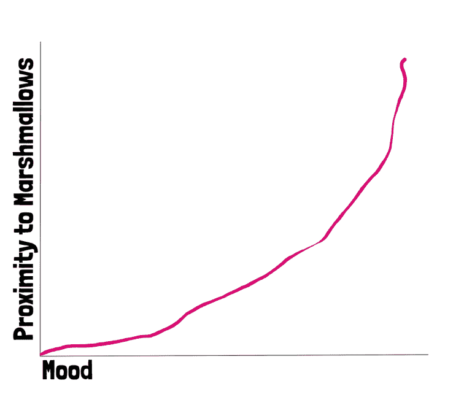
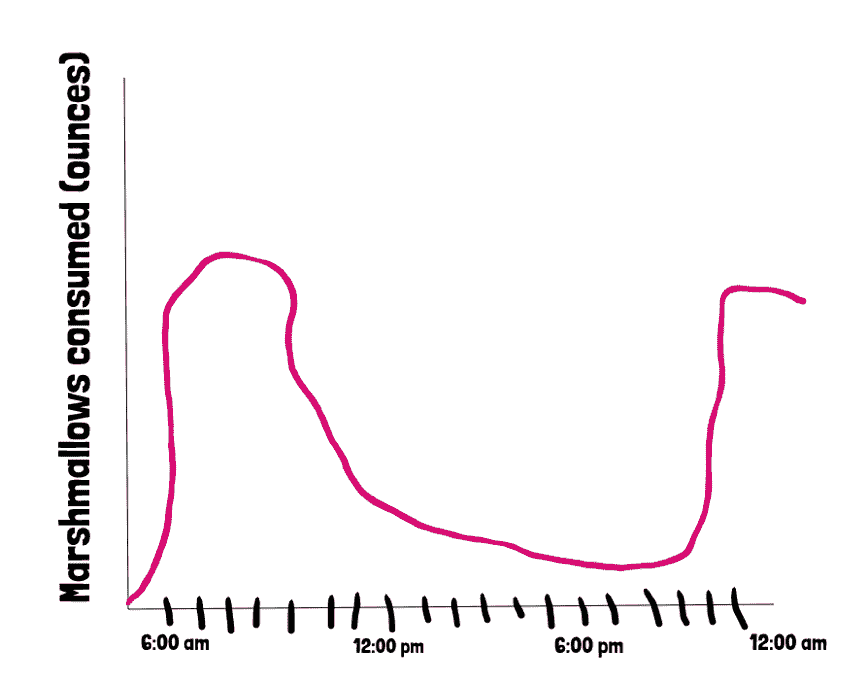

# 什么是时间序列数据，为什么要关注它？

> 原文：<https://thenewstack.io/time-series-data-care/>

像许多人一样，我大半辈子都没听过“时间序列”这个词。直到我在一家建立时间序列平台的公司面试时，我才意识到我需要谷歌一下。我希望我可以说搜索时间序列很容易，我走进我的面试能够说，“时间序列数据是一系列按时间顺序索引的数据点。”然后，我的面试官和我碰杯，而我们谈论时间。

直到他们雇用我之后(因为他们很好，我答应我可以学习)，我才开始理解这个概念，现在我认为时间序列是一个强大的类别，应该得到更好的互联网搜索结果。如果你现在想知道我是否会尝试向你推销你需要一个[时间序列数据库](http://influxdata.com/time-series-database/)，我会说，“在我们一起经历了一切之后？”

 [凯蒂·法默

凯蒂和她的丈夫以及两条狗住在加州的奥克兰(其中至少有一条会和她聊一些有趣的科技话题)。她喜欢试验代码，破坏东西，并试图修复它。她在科罗拉多州丹佛市的图灵软件与设计学院学习编码，这给了她一个绝好的机会，在她知道如何修复之前就把东西弄坏了。](https://www.influxdata.com/) 

我想告诉你为什么时间序列存在，以及它是如何帮助你的——你决定你是否需要它。

客观上，时间序列数据按时间顺序是有意义的；在人类世界中，我们很大程度上被时间这个线性概念所束缚。但是在工程中，我们经常计划异步行为，即我们无法预测的意外和最终事件，并且假设事件将以任何特定的顺序发生可能是危险的。

然而，时间序列数据是独特的，因为它有一个自然的时间顺序。如果你六个月前对我说这句话，我会茫然地盯着你。毕竟，不像是有事件存在于时间之外。

但有些事件与时间无关，这才是关键。时间序列数据不仅仅是关于按时间顺序发生的事情，而是关于当你把时间作为一个轴时其价值增加的事件。

## 为什么？

如果你一直在阅读时间序列数据，你会知道虽然它可以作为一个高度抽象的概念出现，但它也出现在许多不同的行业中。时间序列数据适合于单个数据点没有太大价值的大型数据集。一颗流星是不可预测的迪士尼时刻，但流星雨是一个预测事件，有一个预期的持续时间和单个辐射点。

**非时间序列**:

当然，它们是相关的，但是时间不是一个因素。

**时间序列**:

如果有足够的数据，我可以预测自己吃棉花糖的时间。

预测是时间序列数据的主要情况之一。它影响着金融界的风险分析、气象学中所有类型的预测以及机器学习算法。

另一个普遍的用例是信号和/或异常检测。时间序列数据可用于辨别模式，以找到相关信息，消除噪音，并找到可能预示恶意行为或服务器机房混乱的意外模式。

公平地说，是鸽子先开始的。

当然，它也用于物联网系统，以管理来自数百万设备的大量数据。它在 [DevOps](/category/devops/) 中用于跟踪系统健康状况和趋势。

时间序列数据以一种可测量的、可证明的、向你的老板展示的方式跟踪时间的变化。时间序列数据被科学家、工程师、修补者和像我这样的初学者使用。

我希望你开始明白我对时间序列数据的理解:具体的度量标准有助于你的工作。我可以监控我的数据库，跟踪服务器启动/停机时间，查看网站流量，登录 nodebot，所有这些都使用时间序列数据。

我很想听听你是如何使用时间序列数据的，或者你是否仍然对整个事情有所保留。你可以随时给我发推特( [@thekatertot](https://twitter.com/thekatertot) )或者发邮件到[katy@influxdb.com](mailto:katy@influxdb.com)。

InfluxData 赞助了这个故事。

凯蒂·法默的特写艺术。

<svg xmlns:xlink="http://www.w3.org/1999/xlink" viewBox="0 0 68 31" version="1.1"><title>Group</title> <desc>Created with Sketch.</desc></svg>