# 基于张量流和 InfluxDB 的时间序列预测

> 原文：<https://thenewstack.io/time-series-forecasting-with-tensorflow-and-influxdb/>

[](https://www.linkedin.com/in/gourav-singh-bais/)

[Gourav Bais](https://www.linkedin.com/in/gourav-singh-bais/)

[Gourav Bais 是 ValueMomentum Inc .的一名应用机器学习工程师，他擅长开发机器学习/深度学习管道，重新训练系统，并将数据科学原型转化为生产级解决方案。在过去的三年里，他一直在同一领域工作，并为包括财富 500 强公司在内的许多客户服务，这让他有机会写下自己的经验和技能，为机器学习社区做出贡献。](https://www.linkedin.com/in/gourav-singh-bais/)

[](https://www.linkedin.com/in/gourav-singh-bais/)[](https://www.linkedin.com/in/gourav-singh-bais/)

你可能熟悉机器学习(ML)和深度学习(DL)技术的实例，如人脸识别、光学字符识别 OCR、 [Python 语言翻译器](https://techvidvan.com/tutorials/python-language-translator/)和[自然语言搜索](https://www.searchenginewatch.com/2016/04/12/everything-you-need-to-know-about-natural-language-search/.) (NLS)。

但是现在，DL 和 ML 正致力于以惊人的准确度预测诸如股票市场、天气和信用欺诈之类的事情。您可能已经注意到，这些类别都与时间相关，属于时间序列数据的范畴。

[时序数据](https://www.influxdata.com/what-is-time-series-data)是指一组随时间变化或可以用时间表示的数值。对于时间序列数据，您总是要处理大量需要长期存储的数据。由于可伸缩性问题，在关系数据库中存储时间序列数据可能很困难。这就是时序数据库的用武之地。

临时数据库是专门为存储时间序列数据而设计的。InfluxDB 是一个广泛使用的 TSDB，它随着时间的推移跟踪度量和事件，并基于聚合时间存储它们。

然而，在使用 InfluxDB 存储数据之后，您的工作还没有完成。只有当[你可以分析](https://www.influxdata.com/time-series-analysis-methods/)并用它来改善你的业务时，数据才是有用的。例如，你可以使用时间序列数据来预测未来的天气模式，这个过程被称为[时间序列预测](https://www.influxdata.com/time-series-forecasting-methods)。

在本文中，您将了解如何使用 InfluxDB 中的数据在 [TensorFlow](https://www.tensorflow.org) 中训练模型并进行预测。

## 什么是 InfluxDB？

InfluxDB 的数据模型专门用于时序数据，因此没有任何限制，比如用新值替换旧值或更高的访问次数。它使用标记并保留未索引的字段，这自动确保您将拥有良好的数据库性能。InfluxDB 是通用的，支持多种数据类型，并允许用户根据需要创建附加字段和标签。

InfluxDB 可用于许多对时间敏感的场景，包括:

*   股票市场:关系数据库成批存储数据，一次存储许多条目，而股票价格需要一次存储一行，因为你没有第二天的价格。如果您使用 InfluxDB 来存储一段时间内的股市数据，它将为您提供速度和效率。一旦存储了这些数据，你就可以应用不同的时间序列算法，比如[自回归综合移动平均线](https://en.wikipedia.org/wiki/Autoregressive_integrated_moving_average) (ARIMA)或[神经网络方法](https://www.sciencedirect.com/topics/engineering/neural-network-approach)来预测未来几天的股价值。(请注意:这并非 100%准确，但它让你对市场可能的走向有所了解。)
*   **健康监测**:智能手表和手机等设备被用来追踪你的健康状况。在这些设备的后端，将 ML/DL 算法应用于数据，以进行必要的预测。如果在用户的健康状况中发现任何异常，他们的医生会被告知这些变化。
*   **天气数据**:多个传感器可以存储特定时间段的天气数据。如果存储在 InfluxDB 中，这些数据可以用于不同的算法来帮助进行预测。然而，并不是存储在数据库中的所有数据都可以用于进行预测，因为这样会过于详尽。在这种情况下，选择一个特定的时间范围，如两个月的数据，然后使用不同的统计方法，如 ARIMA、ARIMAX 或 SARIMAX 来预测天气。

## 基于张量流和 InfluxDB 的时间序列预测

如前所述，您将连接到 InfluxDB 并安装一个 [InfluxDB Python 库](https://www.influxdata.com/blog/getting-started-with-python-and-influxdb-v2-0)。然后，您将使用数据集并根据数据构建模型来进行一些预测。您需要做的第一件事是设置您的 InfluxDB 帐户。

本教程假设您使用的是 macOS 界面，但是如果您使用的是 Windows 或 Unix，说明也是类似的。

## 设置 InfluxDB

要在 macOS 上安装 InfluxDB，可以使用[自制软件](https://brew.sh):

`$ brew update`

`$ brew install influxdb influxdb-cli`

或者，您可以从 [Install InfluxDB](https://docs.influxdata.com/influxdb/v2.2/install) 页面手动下载，或者注册一个免费的 [InfluxDB Cloud](https://cloud2.influxdata.com/signup/) 帐户，无需本地安装即可开始使用。

注意:如果你遇到一个*太多打开文件*的错误，[按照这些步骤](https://unix.stackexchange.com/a/221988/471569)来修复它。

安装完成后，在终端中使用以下命令启动 InfluxDB:

`influxd`

当您第一次启动 InfluxDB 时，您需要向它提供一些必需的值，否则您将无法使用它。您可以使用命令行终端或本地主机 GUI 来设置它。要通过终端配置 InfluxDB，使用 *setup* 命令:

`$ influx setup`

对于初始设置，需要以下详细信息:

*   **用户名**:您的账户可以选择任意用户名。
*   **密码**:必须为同一个数据库访问用户名创建一个密码。
*   **组织名称**:数据库操作需要组织名称。
*   **时段名称:**您可以为一个组织创建任意多个时段，但是在初始设置中，您需要至少创建一个时段。
*   **保留期**:这是您的存储桶存储数据并自动删除数据的期限。如果您选择**从不* *或将其留空，它将无限期存储数据。

如果您想使用 GUI 配置 InfluxDB，您需要访问*localhost:8086 localhost:8086*。一旦到了那里，它会要求您提供前面提到的所有必需的细节。

要在其他平台上设置 InfluxDB，可以参考[安装 InfluxDB](https://docs.influxdata.com/influxdb/v2.2/install/) 页面了解更多信息。

一旦初始设置完成，您的帐户已经创建，您需要登录到*localhost:8086 localhost:8086*，您应该会看到以下内容:

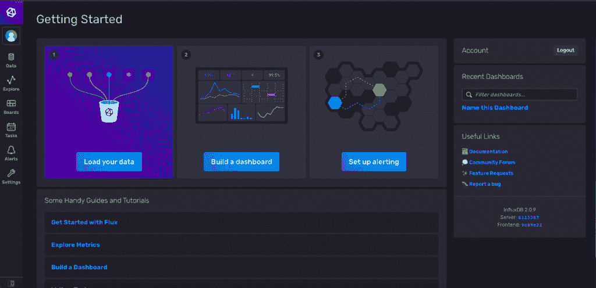

在本教程中，一旦您连接到数据库，您只需要关注**数据**组件。但是，如果您愿意，您可以浏览仪表板上的所有可用选项。

现在，点击左侧边栏上的**数据**图标，您将看到这样一个屏幕:

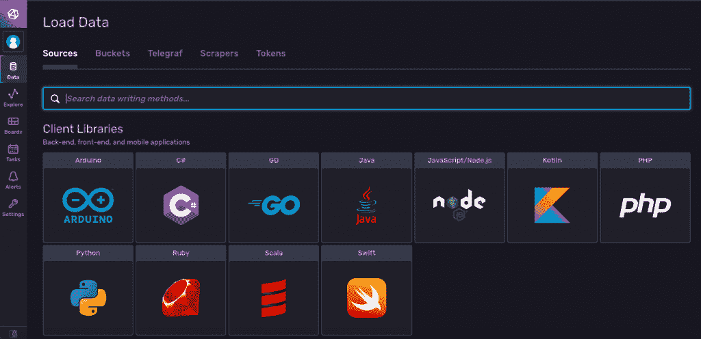

InfluxDB 加载数据

为了使用[Python](https://www.python.org)[tensor flow 库](https://www.tensorflow.org/resources/libraries-extensions)，您需要查看**桶**和**令牌**部分。桶就像数据库名称，类似于关系数据库中的名称，而令牌是唯一的键，只能用于不同的数据库操作。

在这种情况下，您已经创建了一个初始存储桶。要生成唯一令牌，导航至**令牌**部分，并点击**生成令牌**按钮。您可以使用两种不同类型的令牌:

1.**读/写令牌**:该令牌仅授予您对您选择的不同存储桶的读写访问权限:

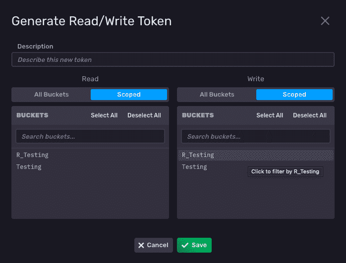

2.所有访问令牌:这个令牌给你对数据库的完全控制。您可以对 InfluxDB 中的任何存储桶执行读、写、更新和删除操作。在本教程中，您只需要使用这个令牌，因为它比读/写令牌更灵活:

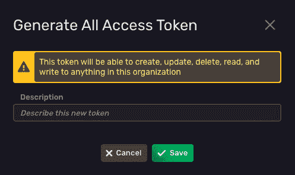

现在您已经设置了 InfluxDB，是时候使用您的数据实现时间序列预测了。Python 3.9 和 [Jupyter Notebook](https://jupyter.org) 一起用于开发。

## 安装 InfluxDB Python 库

要安装 InfluxDB Python 库，您可以在您的终端或 Jupyter 笔记本中使用 [Python 包管理器](https://pypi.org/project/pip)(pip:

```
## install using terminal

$  pip install influxdb-client

## install using jupyter notebook

!  pip install influxdb-client

```

## 安装 TensorFlow

TensorFlow 是一个非常强大的库，你可以用它来实现任何类型的神经网络，比如一个[人工神经网络](https://en.wikipedia.org/wiki/Artificial_neural_network) (ANN)】,一个[卷积神经网络](https://en.wikipedia.org/wiki/Convolutional_neural_network) (CNN)，或者一个[递归神经网络](https://en.wikipedia.org/wiki/Recurrent_neural_network) (RNN)。要使用它，您需要导入您想要使用的不同层和模型，编译它们，然后运行它们以获得训练好的模型。要使用 pip 安装 TensorFlow，请运行以下命令:

```
## install using terminal

$  pip install tensorflow

##install using jupyter-notebook

!  pip install tensorflow

```

## 探索数据集

在本教程中，您将使用一个流行的数据集，其中包含特定时期内已识别的太阳黑子。您将在本教程中看到的代码引用自文章“[使用 TensorFlow 和深度混合学习进行时间序列预测](https://towardsdatascience.com/time-series-forecasting-using-tensorflow-and-deep-hybrid-learning-5088ad76dd55)”可以从这个 [GitHub repo](https://github.com/gouravsinghbais/Time-Series-Forecasting-with-Tensorflow-and-InfluxDB/blob/master/sunspots-dataset/Sunspots.csv) 下载。

下载后，您将看到数据包含以下字段:

1.**日期**:记录斑点的日期。
2。**月平均太阳黑子总数**:一段时间内记录的平均太阳黑子数。

要用 Python 读取数据集并检查前几行数据，请使用下面的代码:

```
## import dependencies
import tensorflow as tf
import numpy as np
import pandas as pd

## Loading the data as a pandas dataframe
data  =  pd.read_csv("sunspots.csv",  index_col=0)
## show first few rows of the dataset
data.head()

```

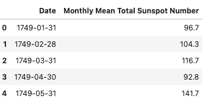

## 将数据集连接到 InfluxDB

在将您的数据连接到 InfluxDB 之前，您需要使用 [InfluxDB 2.0 python 客户端](https://github.com/influxdata/influxdb-client-python)与您的 bucket 建立连接，代码如下:

```
## import dependencies

from influxdb_client import InfluxDBClient,  Point,  WritePrecision
from influxdb_client.client.write_api import SYNCHRONOUS

## You can generate a Token from the "Tokens Tab" in the UI

token  =  "your-token"
org  =  "my-org"
bucket  =  "Testing"

## connect to influxdb

client  =  InfluxDBClient(url="http://localhost:8086",  token=token,  org  =  org)

```

前两行显示了使用 InfluxDB 的重要导入。然后定义基本的连接细节，比如令牌、组织名称和想要存储数据的存储桶名称。最后，您调用 *InfluxDBClient* 函数来连接 InfluxDB。这里提到了 *localhost* URL，因为您想要连接到本地 InfluxDB 客户端。

如果要连接到 [InfluxDB 云实例](https://cloud2.influxdata.com/signup/)，需要指定各自的 URL。你可以在 [**InfluxDB 云区域**](https://docs.influxdata.com/influxdb/cloud/reference/regions/) 页面找到不同的端点。

## 插入数据

现在您已经连接到 InfluxDB，您需要在存储数据之前再执行一个任务。InfluxDB 假设数据集中的索引将是时间戳值；如果不是，它将假设这些列是不同的事件，并在当前时间戳(当前日期和时间)存储它们。您可以使用下面的代码将时间戳列作为索引:

```
# convert Date column to datetime

data['Date']  =  pd.to_datetime(data['Date'])

## create date as index

data.set_index(data['Date'],  drop  =  True,  inplace  =  True)

data.drop('Date',  axis  =  1,  inplace  =  True)

```

如果你有兴趣了解更多关于使用 Pandas 和 InfluxDB 的信息，请查看这个 [Pandas 和 InfluxDB 教程](https://www.influxdata.com/blog/getting-started-with-influxdb-and-pandas/)

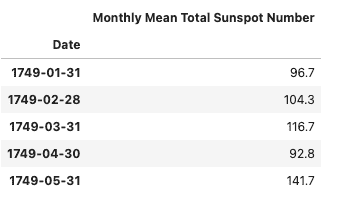

重新索引的数据

要使用 Python 在 InfluxDB 中插入数据，您需要创建一个 *Write API* 对象:

```
## create object of write API

write_api  =  client.write_api(write_options=SYNCHRONOUS)

```

这里， *SYNCHRONOUS* 指定您将一次存储多行数据。现在，你只需要将你的数据帧传递给你的 *write_api* 对象:

```
## write data to influxdb

response  =  write_api.write(bucket,  record  =  data,  data_frame_measurement_name='sunspot',
                           data_frame_tag_columns=['sunspot'])

```

在前面的代码中， *data_frame_tag_columns* 用于存储列的元数据信息，*data _ frame _ measurement _ name*类似于关系数据库中的表名。如果来自 write API 的响应是 *None* ，那么您的数据存储成功；否则，您会收到一条错误消息。

**注**:根据您的系统性能，您可能会遇到*打开文件过多*错误。在这种情况下，您需要一次存储一些固定数量的行，而不是一次传递整个数据集:

```
i_lower  =  0

## iterate over 25 rows at once and store it in influxdb

for  i  in range(0,  len(data),  25):

             response  =  write_api.write(bucket,  record  =  data[i_lower:i],  data_frame_measurement_name='sunspot',

                          data_frame_tag_columns=['sunspot'])

             i_lower  =  i

             print('%d rows inserted'%(i))

```

## 读取数据

既然已经将数据存储在 InfluxDB 数据库中，就可以读取这些数据了。要从 InfluxDB 中查询数据，需要创建一个`read API`对象。从数据库中查询你的数据最简单的方法。您只需指定要查询的时间段:

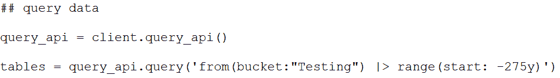

这里，时段被定义为`-275y`，因为您想要选择过去 275 年的所有条目。

一旦查询了数据，就可以遍历每一行，从该数据创建一个 data frame:

```
## iterate over queried data

time,  sunspot  =  [],  []

for table in tables:

             for row in table.records:

              time.append(row.values.get('_time'))

              sunspot.append(row.values.get('_value'))

## create dataframe

data  =  pd.DataFrame({'Date':time,  'Monthly Mean Total Sunspot Number':  sunspot})

```

## 检查和清理数据集

现在您已经有了数据，您需要从**日期**列中检索并清理数据:

```
## convert datetime to only date

data['Date']  =  data['Date'].dt.date

```

为了可视化**日期**列中的太阳黑子数据，可以使用下面的代码:

```
## import plotting dependency

import matplotlib.pyplot as plt

## plot the data

data.plot()

plt.show()

```

*绘图*功能绘制所有太阳黑子相对于时间的曲线:

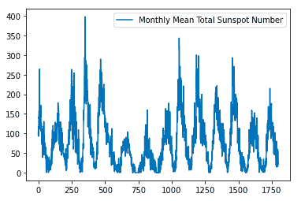

## 工程特征

目前，你只有一个专栏(太阳黑子)作为一个特征，它不可能作出预测。为了进行必要的预测，您需要最后 60 个条目作为输入，并且您需要将这些数据分成训练集和测试集:

```
# Convert the data values to numpy for better and faster processing

time_index  =  np.array(data['Date'])

data  =  np.array(data['Monthly Mean Total Sunspot Number'])   

# ratio to split the data

SPLIT_RATIO  =  0.8

# Dividing into train-test split

split_index  =  int(SPLIT_RATIO *  data.shape[0])  

# Train-Test Split

train_data  =  data[:split_index]

train_time  =  time_index[:split_index] 

test_data  =  data[split_index:]

test_time  =  time_index[split_index:]

```

创建训练和测试集后，您需要创建一个函数来准备输入特征。您无需担心为创建输入要素而对数据进行不同的计算，因为 TensorFlow 会为您完成这项工作。您只需要定义窗口大小(您想要多少个条目作为输入特征):

```
## required parameters

WINDOW_SIZE  =  60

BATCH_SIZE  =  32

SHUFFLE_BUFFER  =  1000

## function to create the input features

def ts_data_generator(data,  window_size,  batch_size,  shuffle_buffer):

            '''

            Utility function for time series data generation in batches

            '''

             ts_data  =  tf.data.Dataset.from_tensor_slices(data)

             ts_data  =  ts_data.window(window_size  +  1,  shift=1,  drop_remainder=True)

             ts_data  =  ts_data.flat_map(lambda window:  window.batch(window_size  +  1))

             ts_data  =  ts_data.shuffle(shuffle_buffer).map(lambda window:  (window[:-1],  window[-1]))

             ts_data  =  ts_data.batch(batch_size).prefetch(1)

              return ts_data# Expanding data into tensors

tensor_train_data  =  tf.expand_dims(train_data,  axis=-1)

tensor_test_data  =  tf.expand_dims(test_data,  axis=-1)

## generate input and output features for training and testing set

tensor_train_dataset  =  ts_data_generator(tensor_train_data,  WINDOW_SIZE,  BATCH_SIZE,  SHUFFLE_BUFFER)

tensor_test_dataset  =  ts_data_generator(tensor_test_data,  WINDOW_SIZE,  BATCH_SIZE,  SHUFFLE_BUFFER)

```

在前面的函数中，数据被转换为 TensorFlow 数据集，以加快处理速度。然后调用*窗口*函数创建不同的输入特征(最后 60 个输入条目作为特征)。之后， *flat_map* 函数用于通过展平数据来保持时间序列的顺序。最后，为了训练 DL 模型，您重组并创建了一批数据。

## 建立模型并做出预测

数据现在已经准备好，可以对其执行时间序列分析了。要进行预测，您需要创建一个基于 DL 的模型。在这种情况下，你将使用一个组合的 [CNN](https://en.wikipedia.org/wiki/Convolutional_neural_network) 和[长短期记忆](https://en.wikipedia.org/wiki/Long_short-term_memory) (LSTM)模型:

```
## combination of 1D CNN and LSTM

model  =  tf.keras.models.Sequential([tf.keras.layers.Conv1D(filters=32,  kernel_size=5,strides=1,  padding="causal",activation="relu",                         

                                      input_shape=[None,  1]),

                                      tf.keras.layers.LSTM(64,  return_sequences=True),

                                      tf.keras.layers.LSTM(64,  return_sequences=True), 

                                      tf.keras.layers.Dense(30,  activation="relu"),  

                                      tf.keras.layers.Dense(10,  activation="relu"), 

                                      tf.keras.layers.Dense(1)])

```

在前面的代码中，一个序列模型由一个*一维 CNN* 层、几个 *LSTM* 层和一些*密集*层初始化。sequential 类以这样一种方式准备神经网络层的级联管道，即您定义的每一层都将被添加到前一层。输入形状参数初始化为 *None，1* ，表示提供给模型的输入形状。在这种情况下，提供了一个展平的输入，模型的形状决定为 1。

一旦你定义了模型，你需要编译它并在训练数据上训练它:

```
## compile neural network model

optimizer  =  tf.keras.optimizers.SGD(lr=1e-3,  momentum=0.9)

model.compile(loss=tf.keras.losses.Huber(),

              optimizer=optimizer,

              metrics=["mae"])

## training neural network model

history  =  model.fit(tensor_train_dataset,  epochs=200,  validation_data=tensor_test_dataset)

```

一些参数用于编译一个模型，包括一个[优化算法](https://www.tensorflow.org/api_docs/python/tf/keras/optimizers)，它调整网络神经元的权重和学习速率，从而减少损失并提高整体准确性。使用损失函数来计算神经网络中发生权重修改所基于的过程的损失。然后，使用指标来评估模型的整体准确性。同时， *mae* 被使用，因为您想要预测数字数据。培训开始后，您应该会看到您的模型正在运行:

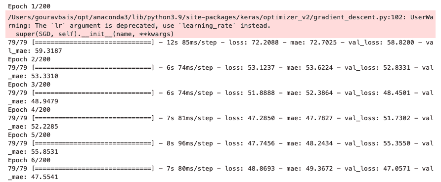

模型的最后一行用 200 个时期的训练数据进行训练。您可以使用以下代码检查模型的训练和验证损失:

```
import matplotlib.pyplot as plt

# summarize history for loss

plt.plot(history.history['loss'])

plt.plot(history.history['val_loss'])

plt.title('model loss')

plt.ylabel('loss')

plt.xlabel('epoch')

plt.legend(['train',  'test'],  loc='upper left')

plt.show()

```

因为如果不能用模型进行预测，那么模型就没有用，所以您需要提供您要进行预测的日期之前六十天的值:

```
def model_forecast(model,  data,  window_size):

             ds  =  tf.data.Dataset.from_tensor_slices(data)

             ds  =  ds.window(window_size,  shift=1,  drop_remainder=True)

             ds  =  ds.flat_map(lambda  w:  w.batch(window_size))

             ds  =  ds.batch(32).prefetch(1)

             forecast  =  model.predict(ds)

             return forecast

rnn_forecast  =  model_forecast(model,  data[...,  np.newaxis],  WINDOW_SIZE)

rnn_forecast  =  rnn_forecast[split_index  -  WINDOW_SIZE:-1,  -1,  0]

# Overall Error

error  =  tf.keras.metrics.mean_absolute_error(test_data,  rnn_forecast).numpy()

print(error)

```

这里使用了 *model_forecast* 函数，该函数类似于 *ts_data_generator* ，只是它是用来做预测的。函数后面的两行是对测试数据的预测。同时，最后一行用于显示预测中的误差(实际测试数据和模型预测之间的差异)。

现在，您的培训和验证损失图应该如下所示:

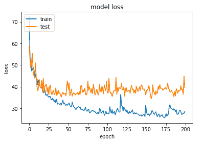

为了检查预测的准确性，您可以使用以下代码绘制比较图:

```
import matplotlib.pyplot as plt

# summarize history for loss

plt.plot(test_data)

plt.plot(rnn_forecast)

plt.title('model loss')

plt.ylabel('loss')

plt.xlabel('epoch')

plt.legend(['test',  'predictions'],  loc='upper left')

plt.show()

```

你的预测图看起来会像这样:

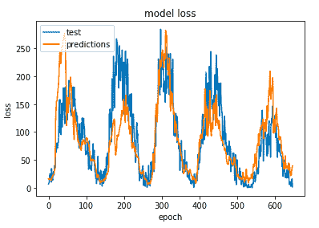

正如你所看到的，预测足够好，它们能够保持时间序列的模式，即使有时，它们与实际结果相差甚远。

本教程的完整代码可以在这个 [GitHub repo](https://github.com/gouravsinghbais/Time-Series-Forecasting-with-Tensorflow-and-InfluxDB) 中获得。

## 结论

在本文中，您了解了什么是时间序列数据，以及如何有效地将其存储在专门为其设计的时间序列数据库中，如 [InfluxDB](https://www.influxdata.com/?utm_content=inline-mention) 。

时间序列数据是无用的，除非你利用它来做战略决策。在这里，您学习了如何使用 TensorFlow 库通过神经网络实现时间序列预测。

## 额外资源

<svg xmlns:xlink="http://www.w3.org/1999/xlink" viewBox="0 0 68 31" version="1.1"><title>Group</title> <desc>Created with Sketch.</desc></svg>