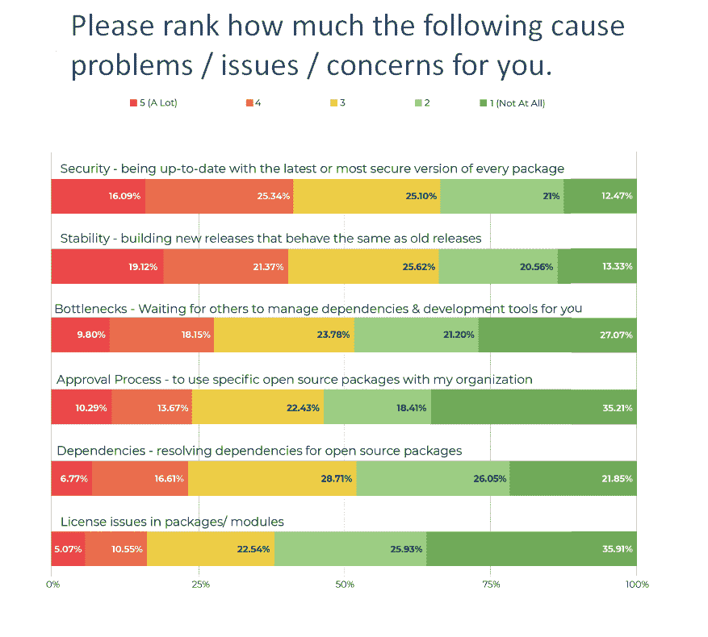
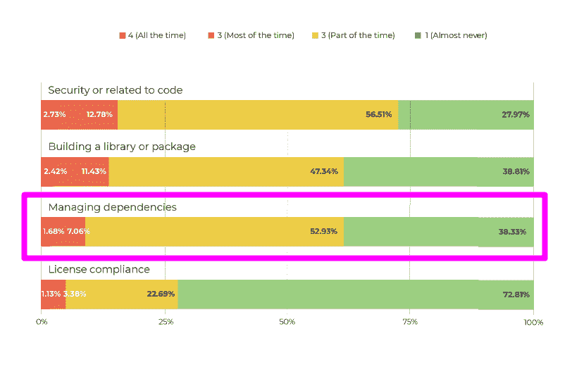

# 去年，花费在项目许可和依赖项上的时间有所减少

> 原文：<https://thenewstack.io/time-spent-on-project-licensing-and-dependencies-declined-in-last-year/>

开发人员的生产力是一个持续关注的问题，但并不是每个痛点都会永远存在。开源运行时的用户花在管理依赖性上的时间更少了，也更不关心许可问题了。我们推测这是因为部署自动化和安全扫描软件在这些领域有所帮助。

在 ActiveState 的“ [2019 开发者调查:开源运行时，](https://www.activestate.com/resources/white-papers/developer-survey-2019-open-source-runtime-pains/)”中，那些说他们几乎从不花时间管理开源依赖的人从 2018 年的 25%上升到 2019 年的 38%。更不用说许可证合规性，因为 73%的人几乎从不花时间在这上面。总的来说，对包或模块中许可证问题的关注也减少了。非常关注的人从 2018 年的 10%下降到 2019 年的 5%，而“完全不”关注许可证问题的人从 2018 年的 27%上升到 2019 年的 36%。

许可证合规性的重要性并未下降。相反，由于开源许可的一些更广泛的趋势，与批准过程和法律审查相关的痛苦可能不太常见。 [Bart Copeland](https://twitter.com/bart_copeland) ，ActiveState 的首席执行官兼总裁，认为越来越多的库包含了更少的限制性许可。事实上，许可证的存在，即使它不在公司的批准名单上，也意味着花在法律审查上的时间不会很长。

像许可一样，管理依赖关系的重要性并没有降低。相反，越来越少的人在和他们打交道。如果持续集成和部署(CI/CD)软件正在处理构建包或库的过程，那么许多与开源依赖相关的安全性和稳定性问题也可以得到缓解。随着这些负担的减轻，调查的受访者可能会花更多的时间实际编程。

来源:ActiveState 的《2019 开发者调查:开源运行时》。开源包中的依赖性比它们的许可更令人担忧。依赖性会影响安全性和稳定性，这是程序员更关心的问题，因为它们更容易被注意到。

来源:ActiveState 的《2019 开发者调查:开源运行时》。请注意，图表处理的是这些类型的活动发生的“频率”，而不是每天花费时间的实际百分比。

## 更多关于开发人员的时间

如果你不清楚什么是开发人员或者什么构成了编程，就很难对开发人员的生产力得出很多结论。例如，解决安全问题有时会涉及到编码，但并不总是如此。ActiveState 调查询问花在编程上的时间。它指出这样做的时间要少得多，现在有 62%的人每天花 4 个小时或更少的时间编程。这一时间是否被浪费有待讨论。编程时间的下降也可能是因为工作过度的人减少了，因为每天花 8 小时或更多时间编程的受访者比例从 2018 年的 19%下降到 2019 年的 11%。

ActiveState 研究中发现的变化部分是因为具有特定开发人员/程序员工作角色的参与者在 2019 年从 44%下降到 37%。然而，大多数其他受访者从事与编程相关的工作，如软件架构师、开发人员或工程经理。这是一个值得进一步研究的课题。

最后，值得注意的是时间的缺乏是如何影响其他决策的。这里有两个数据点值得一提:

*   49%的人说放松时间限制会积极影响他们对开源项目的贡献。
*   新项目开始时，没有建立新的开发环境。尽管 32%的人每月至少启动一次新项目，但只有 14%的人表示每月至少建立一次新的开发环境。28%的人说设置一个开发环境需要五个小时或更长时间。你的痛阈是多少？什么会让你为了节省时间而跳过最佳实践

通过 Pixabay 的特征图像。

<svg xmlns:xlink="http://www.w3.org/1999/xlink" viewBox="0 0 68 31" version="1.1"><title>Group</title> <desc>Created with Sketch.</desc></svg>