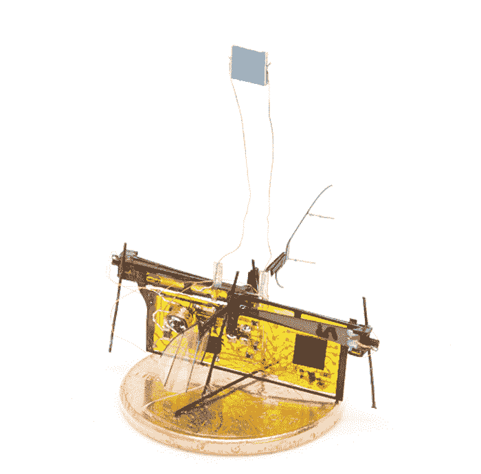
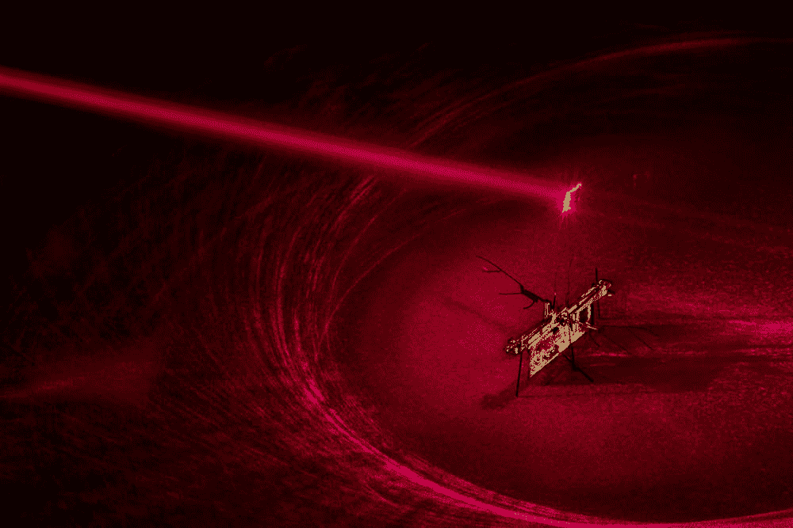

# 微型无线机器人昆虫由激光驱动

> 原文：<https://thenewstack.io/tiny-wireless-robot-insect-is-powered-by-lasers/>

很难不相信某种机器人接管正在进行中，特别是我们看到的各种机器人:从工厂生产线上发现的巨型工业机器人，到可能[进行手术](https://thenewstack.io/self-folding-mini-origami-robots-are-the-nanosurgeons-of-tomorrow/)、[微加工](https://thenewstack.io/harvards-micro-robot-high-precision-high-speed-wonder/)、[诊断疾病甚至抗击癌症](https://thenewstack.io/biodegradable-micro-robots-made-algae-help-fight-cancer/)的微型机器人。

但是，无论大小，机器人都受到它们如何供电、推进和控制的限制，尤其是微型机器人。它们的体型很小，这意味着它们不能像大型无人机那样使用螺旋桨，它们的移动通常受到沉重电池或电源的限制。例如，像哈佛大学 [RoboBee](https://wyss.harvard.edu/technology/autonomous-flying-microrobots-robobees/) 这样的小型机器人在概念上很吸引人，但在现实中，它们必须通过有线连接与电源相连，这一事实阻碍了它们的发展。

然而，华盛顿大学的研究人员最近在开发一种方法方面取得了重大进展，这种方法可以为微型机器人提供足够的无线动力，使其能够升空飞行——当然是使用激光。它被称为 RoboFly，重量大约与牙签相同，正如我们所见，它绝对没有电池或电线来阻止它瞬间发射，快速拍打翅膀。

[https://www.youtube.com/embed/7DXuxGErs9k?feature=oembed](https://www.youtube.com/embed/7DXuxGErs9k?feature=oembed)

视频

RoboFly 的短暂升空可能看起来不算多，但这实际上是第一次这么小的机器人能够无线飞行。正如该团队在他们的论文[中解释的那样，该论文最近在](https://homes.cs.washington.edu/~gshyam/Papers/wirelessfly.pdf)[国际机器人和自动化会议](https://icra2018.org/)上发表，微型机器人不能像它们更大、更重的无人机兄弟一样使用螺旋桨，因此通常依靠由压电致动器驱动的扑翼。以前的设计也受到无线飞行所需电池重量的限制，以及增加电压和处理计算所需的(相对)沉重的机载电子设备。

但是，为了创造一个真正自主的可以无线飞行的昆虫机器人，该团队必须克服这些挑战。为了实现这一目标，该团队开发了自己的电路制造技术，以创造无线自主飞行所需的微型电子设备。使用这种方法，他们能够创建一个重量不到 100 毫克的[升压转换器](https://en.wikipedia.org/wiki/Boost_converter)，压电驱动器和微控制器，然后将所有这些集成到微型机器人昆虫中，总重量为 190 毫克。

该机器人还附有一个微型光伏板，可以将激光束的恒定功率转化为电能。但仅此一项就产生了微不足道的 7 伏电压，所以这个电压然后被升压转换器放大到 240 伏，然后可以驱动翅膀快速跳动。微控制器就像一个“大脑”,调节电流，使其产生类似于真正昆虫翅膀的运动。

“[微控制器]使用脉冲来形成波形，”论文的主要作者 [Johannes James](https://depts.washington.edu/airlab/people.html) 说。“为了让翅膀快速向前扇动，它会快速连续地发出一系列脉冲，然后当你接近波峰时，脉冲会变慢。然后它反过来这样做，让翅膀平稳地向另一个方向扇动。”

然而，正如你可能已经注意到的那样，一旦机器人移动到激光指向的范围之外，它就会停止飞行。该团队现在正在研究一种方法，在机器人移动时一前一后地操纵激光，这样它就可以保持飞行更长的距离。也有可能使用更小的电池，可以有效地从无线电波中获取能量。如果这些改进得以实现，那么很难说这种微型机器人会走向何方。

“我真的很想做一个发现甲烷泄漏的，”副教授兼论文合著者 [Shyam Gollakota](https://homes.cs.washington.edu/~gshyam/) 说。“你可以买一个装满它们的手提箱，打开它，它们会绕着你的大楼飞来飞去，寻找从泄漏的管道中冒出来的缕缕气体。如果这些机器人可以很容易地找到漏洞，它们将更有可能被修补，这将减少温室气体排放。这是受真苍蝇的启发，真苍蝇真的很擅长飞来飞去找有臭味的东西。所以我们认为这是我们 RoboFly 的一个很好的应用。”

图片:华盛顿大学

<svg xmlns:xlink="http://www.w3.org/1999/xlink" viewBox="0 0 68 31" version="1.1"><title>Group</title> <desc>Created with Sketch.</desc></svg>