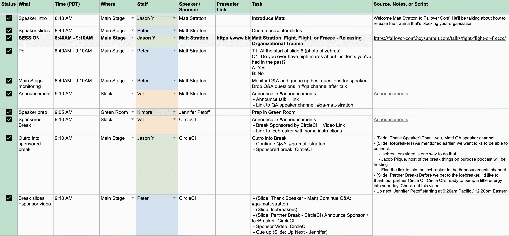
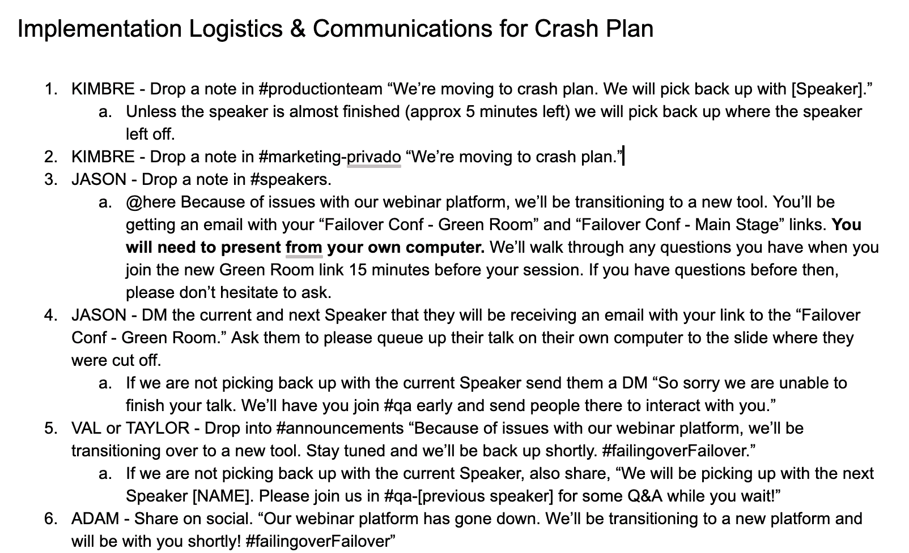
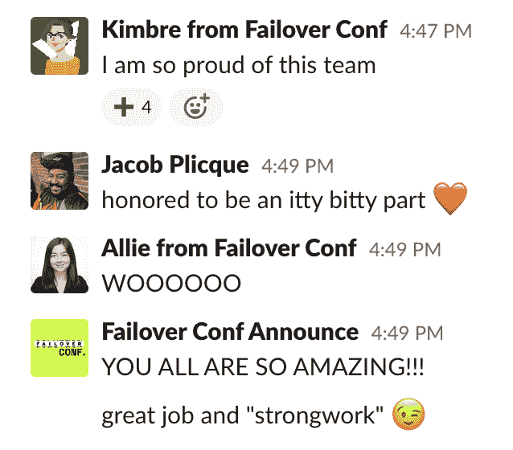
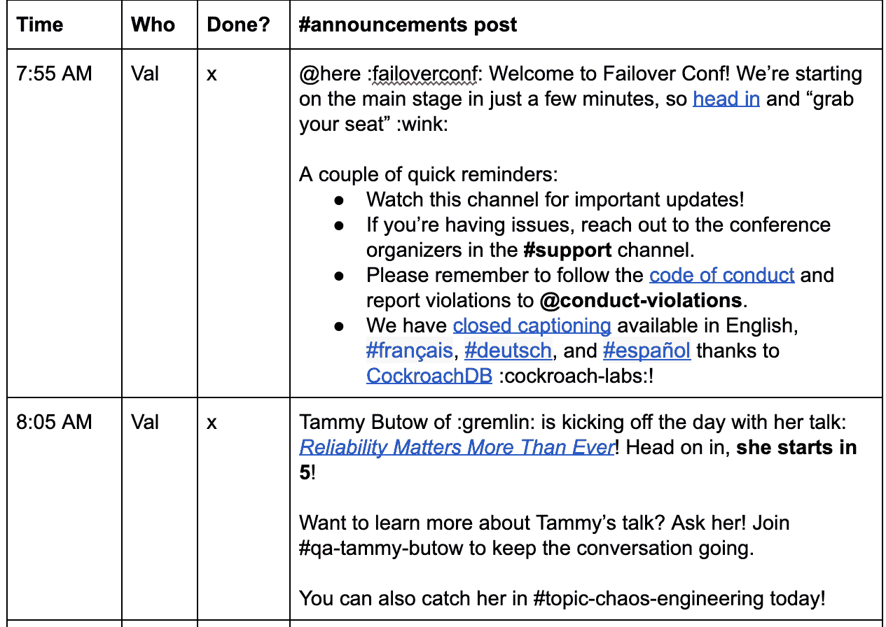
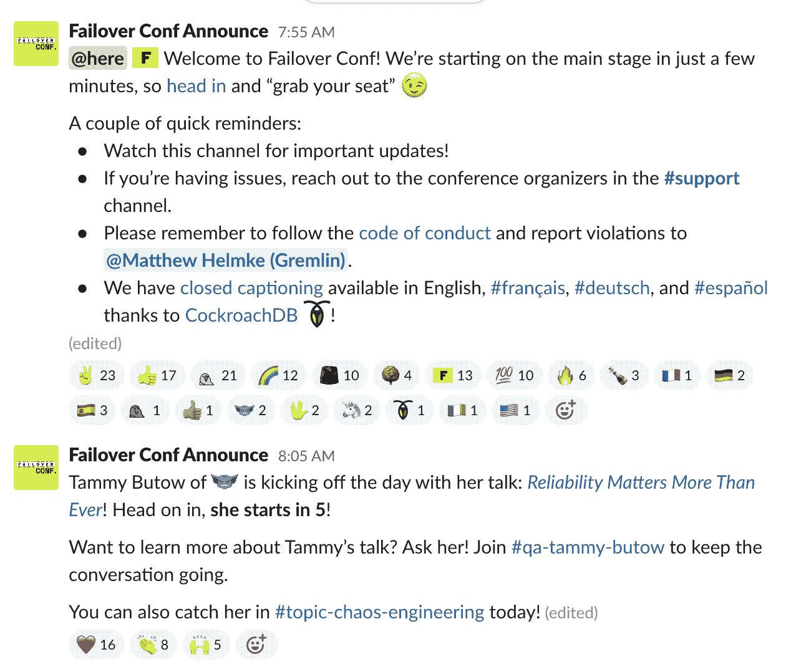

# 下次在线活动的提示(和模板)

> 原文：<https://thenewstack.io/tips-and-templates-for-your-next-online-event/>

 [金布雷·兰卡斯特

金布雷·兰卡斯特是 Gremlin 负责全球活动&现场营销团队的高级经理。此前，她在 Split 和 Scalyr 负责活动和现场营销项目。她专注于数据驱动的活动项目，以最大限度地提高渠道影响力，并建立流程以提高规模效率。她处理数字事件的方式一直是以同理心、平等和参与为主导，帮助虚拟世界重新变得人性化。](https://www.gremlin.com/) 

如果说我在过去五年为工程师举办的活动中学到了一件关键的事情，那就是你的内容只有在你最可行的要点下才是最强大的。因此，当我们坐下来为虚拟事件写下我们的五大技巧时，我们试图将重点放在你可能还没有听说过的建议上，但我们希望在运行 [Gremlin](https://www.gremlin.com/) 的[故障转移配置](https://thenewstack.io/gremlins-failover-conf-a-virtual-conference-for-those-grounded-by-covid-19/)之前就知道这些建议。

值得一提的是，已经有很多关于虚拟程序的文章提供了很好的技巧和高水平的指导。由 Tom May 在创意博客上撰写的专家建议汇编是我的最爱之一。如果高层次的方法是你正在寻找的，我建议从那里开始。

如果你知道你要去虚拟化，你有一个坚实的上市计划，你已经钉观众适合，这份名单是给你的。我们分享的每张图片都来自我们自己的规划文档，每个链接都指向一个模板，让你真正开始。

## 1.练习您的事件响应计划

虚拟事件中最重要的一点就是不要倒下。这不是关于你花哨的变焦背景，或者你时髦的西装，甚至是你配偶给你的漂亮的 DIY 发型(尽管—👏).如果你的与会者丢失了你的音频或视频，最好的情况是——他们会点击那个“X ”,然后再也看不到他们了，最坏的情况是，他们会在 Twitter 上被清晰地听到。

当制作团队中没有一个成员在同一个房间时，这说起来容易做起来难。我们是这样做的。

*   **做好最好的准备:**为了让我们的制作团队提前做好准备，我们定义了一个[精确运行的 Show doc](https://cdn.thenewstack.io/media/2020/06/212d4b30-run_of_show_template.xlsx) ，为每个团队成员分解了当天的全部流程。我们为每项职能培训了两个人，将一天分成几个班次，并在出现问题时提供冗余。在活动开始前的一周，我们对每个发言人进行了一次预演，每个电话都遵循了规定的流程。这使我们能够正确地将扬声器安装到工具上，走完每个步骤来解决问题，并作为生产人员进行多次练习。剧透警告——我们第一次没有做对。如果我们在其中一次试运行中发现了改进流程的机会，我们会相应地为下一次试运行更新我们的流程。到了活动日，我们的团队接受了培训，我们的演讲者做好了准备，我们的工具经过了测试，我们的流程也经过了完善。

描述:一个来自我们的 Show doc 的例子。每个细节都考虑到了。

*   **做最坏的打算:**我们知道，对于一个叫做故障转移会议的事件来说，最糟糕的事情就是没有自己的故障转移计划。我们制定了一个说明性的[应急计划](https://cdn.thenewstack.io/media/2020/06/7fc22fa4-crash_plan_template.docx)，以防我们的网上研讨会平台崩溃。它包括谁将打电话给 pivot，我们如何与与会者沟通，我们如何在内部和与发言者沟通，以及我们如何知道我们已经完全备份和运行。我们作为一个团队来练习这个，虽然我很感激我们做了充分的准备，但我很自豪地分享我们从来不需要使用它。

描述:我们实际应急计划的样本。请注意，订单是有意安排的，所有副本都是为了提高效率和协调信息而复制/粘贴给我的。

*   **执行计划:**在活动期间，每个员工都使用专用的私人 Slack 频道，这样我们就能不断地发现和解决问题。关键任务的制作人员也在我们的电话上进行了一整天的 Zoom 音频通话，以有效和高效地解决扬声器和我们的工作人员的任何平台或连接问题。每个人都知道去哪里提出问题以及每个问题的解决状态。热点提示——当你需要休息时，这些频道也非常适合用来标记，当事情进展顺利时用来庆祝，当一天结束时作为一个团队来举杯庆祝。

## 2.少即是多

我们都在家和我们的宠物、孩子和植物宝宝在一起。在此期间完成工作是一个独特的挑战。因此，虽然在线活动能分散注意力很好，但也很容易分心。尽你所能帮助你的与会者集中注意力。他们会感谢易于遵循的说明，熟悉的工具，他们不需要重新学习，并在整个过程中手持。

检查你是否要求你的与会者做太多事情的最简单的方法是问，“如果我们都在同一个房间里，我会要求他们这样做吗？”如果你在一个实体剧院，当你的演讲者在舞台上时，你绝不会鼓励他们在大厅里漫步。同样对待虚拟舞台。当一个演讲直播时，这个演讲就是焦点。我们帮助我们的与会者集中注意力，只在需要时给他们明确的行动和更新，通过在 Slack 上精心安排#announcements 频道。与会者知道观看现场直播的演讲，并通过该频道了解演讲间隙的活动。

描述:计划文档和最终结果。请注意，所有帖子都可以直接复制/粘贴到 Slack 中，包括使用表情符号来表现个性。

## 3.教他们如何笑(参与)

在前世，我是一名专业的戏剧演员。当你在喜剧中表演时，最重要的目标之一就是“教会观众如何笑”如果你让他们想笑多久就笑多久，等到他们安静下来，你的节目就会多两个小时。如果你走得太快，试图盖过他们的笑声，他们听不到下一个笑话的顶部，你会扼杀你的下一个笑声。关键是在表演的顶部设定节奏，并通过精心制作第一个大笑来教他们节奏。如果你成功了，他们会抓住你，陪你看完整场演出，并享受表演的快乐时光。

虚拟事件也是如此。如果你提供了选择，但没有刻意培养这些互动，他们就不知道如何参与。通过提供一个例子(“这就是投票的样子”)，举例说明如何做(“这是你的回答”)，并给他们大量的练习机会(“现在你试试！”).

我们通过在节目的顶部运行愚蠢的样本投票来教观众如何参与投票功能。我们提示他们将一个样本问题放入问答中，这样我们就可以向他们展示其他与会者如何对问题进行投票表决。我们向他们展示了我们如何在每次会议后将未回答的问题转移到专门的#q&a 频道，在那里他们可以在休息时继续与发言者进行对话。我们还鼓励在一些#topic 频道中进行讨论，通过播种问题来开始对话，并让专门的团队成员随时待命，以保持对话生动有趣。一旦我们教会了与会者如何互动，我们的努力就有了回报！这些精心制作的调查让与会者参与到舞台内容中，并轻松地引导他们在每次演讲结束后如何继续互动。在参加我们直播的 3，426 名与会者中，有 1，966 人参加了 Slack。提交了 9，769 个调查答案，通过网络研讨会工具提交了 100 多个问题。

## 4.做一个好伙伴

虽然你可以在没有伙伴的情况下进行一项活动，但它肯定没有那么有趣，你的影响范围也不会那么大。你越体贴和乐于助人，你就越容易让他们成功。我们每周二向合作伙伴发送行动号召(CTA ),帮助他们朝着目标前进，并让他们的团队为这一重要日子做好准备。我们保持这些 CTA 的简单，我们从来没有每周发送一个以上，这样要求是可管理的。如果它包括一个社交帖子，甚至是给他们团队的内部电子邮件，我们会包括他们可以个性化的样本。这意味着 CTA 非常容易执行，并且合作伙伴始终如一地响应我们的请求。

我们还会及时向合作伙伴发送进度更新。他们知道我们会在每周五给他们发送更新，没有人会不清楚他们朝着目标前进的进度。结果是，我们的 39 家供应商合作伙伴中有 29 家超额完成了我们活动的成功举办。正是通过他们的努力，我们才取得了巨大的成功。

## 5.“王牌在他们的位置”

几年前，我的一些密友教了我一句话“王牌在他们的位置上”，这是他们从 Chipotle 那里学到的。从那以后，它一直是我的最爱。这个想法是为了达到最好的效果——就像晚餐高峰时超快的墨西哥卷饼线——你需要让每个人都站在他们是专家的地方。你将交付更好的产品，更快，最少的错误(或碎玉米饼)。

我不能强调这对在线活动有多重要。虚拟事件的问题解决与物理事件的问题解决有很大不同。

让你的专家成为专家。相信他们的投入，听从他们的指导。过度分析或要求他们过度解释会让他们慢下来，失去关键时间。有无数的选择要做，所以当他们确定最关键的选择时，相信他们。如果你已经在高层次的目标上达成一致，并且你信任你的专家团队，那么就启用他们，在必要的时候解除封锁，否则就不要干涉他们。

对于在重要的日子里表现突出的员工角色，利用你的团队中的人，他们的技能可以满足你的需要。在线活动的需求是完全不同的，所以参与其中的团队成员应该反映出这一点。需要有人管理对有问题的与会者的支持吗？利用您现有的支持团队来回答这些问题！他们已经是处理这类问题的专家了，所以如果你只是简单地让他们去解决当天他们会帮你解决的具体问题，他们会在这个角色上茁壮成长。您需要执行的培训将是最少的，他们将提升您的计划(因为他们是专家),与会者将得到很好的照顾。

运行一个事件是复杂的。做好了更是如此。因此，虽然举办虚拟活动带来了新的挑战，但它也创造了新的机会来提高你的品牌和声誉，并继续保持现场活动提供的积极势头。如果我能提供最后一个建议，那就是给自己一些优雅。你不会事事如意，但在一场真正的全球危机中取得一点点成功是值得庆祝的。做好计划，对你的团队和你的观众感同身受，考虑潜在的失败，如果你也为这些做好计划，你会很好的。

<svg xmlns:xlink="http://www.w3.org/1999/xlink" viewBox="0 0 68 31" version="1.1"><title>Group</title> <desc>Created with Sketch.</desc></svg>