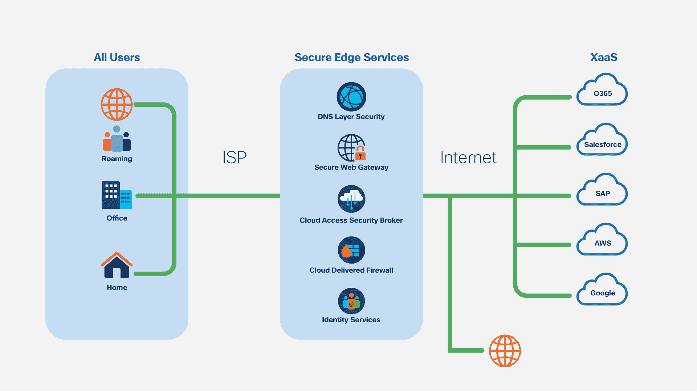

# 监控应用性能安全优势的提示

> 原文：<https://thenewstack.io/tips-for-monitoring-the-secure-edge-for-app-performance/>

 [迈克·希克斯

迈克是思科旗下 ThousandEyes 公司的首席解决方案分析师，在网络和应用性能方面拥有 30 多年的经验，是公认的专家。](https://www.linkedin.com/in/hicksmike/) 

对新的永久性混合劳动力的调整产生了一波投资和工具浪潮，以确保企业网络的新优势。

企业越来越多地探索将其边缘安全控制转移到云交付模式的方法，包括寻求验证用户身份、强制执行组织策略和防止恶意流量的云原生安全功能。这一趋势在 2020 年加速发展，并且随着企业重新考虑将远程员工连接到他们所需的分布式网络资源和服务的方式，这一趋势只会继续增长。

然而，随着网络和安全基础设施越来越依赖于云，组织如何确保 VPN 和云访问安全代理等功能不会影响远程员工所依赖的应用和服务的性能？应用程序已经成为员工用来访问他们高效工作所需的服务的关键机制，因此应用程序体验的任何中断都会对业务造成严重影响。

## **云大小的能见度差距**

安全接入服务边缘(SASE)描述了向基于云的网络架构的转移，该架构将网络和安全功能结合到单个平台中。虽然这种功能整合为最终用户提供了简化的体验，但支撑新的以云为中心的架构的是越来越多的组件和依赖项，如安全 web 网关(SWG)、云访问安全代理(CASB)和零信任网络访问(ZTNA)。所有这些都需要根据安全策略进行交互，以便为最终用户提供无缝的安全体验。

这些政策虽然是集中控制的，但会在边缘强制执行，这实际上把每个员工都变成了一个人的分支机构。在这个高度分布式的架构中，依赖于云和以互联网为中心的网络，一个复杂的相互依赖的网络出现了。为了保持可靠的连接，组织不能再依赖传统的监控解决方案来查看和排除企业范围之外的任何问题。

与任何云交付的服务一样，无论是安全性还是其他方面，对外部网络的可见性以及对构成底层网络的不同组件的了解都变得至关重要，以便跟踪性能、捕捉性能降级并避免最终可能影响用户数字体验的盲点。

## **看到 SASE 在**上运行的云

那么，公司如何在 SASE 架构中确保持续的性能和应用交付呢？监测和核查至关重要。在验证性能之前，应用程序和网络团队需要先验证提议的安全更新的影响，这需要持续进行。

典型的企业网络连接模式。

为了克服以云和互联网为中心的环境造成的运营盲点，合成监控提供了 IT 所需的端到端可见性。综合监控的核心是使用脚本来模拟最终用户在应用程序中的预期工作流和路径。与直观的网络可视化相结合，modern synthetics 让用户了解如何体验应用。它还提供了查看应用底层网络特征(包括 SASE 中的安全功能，如 VPN 和 SWG)所需的更深入的视角，并诊断性能下降是否是由外部问题引起的，如潜在的 DNS 服务器或出现配置错误的下游互联网服务提供商。

例如，通过创建验证 DNS 服务的连接性和性能的综合测试，以及确保代理服务可用并能够根据所需策略传递流量的测试，团队不仅能够验证安全边缘服务的连接性，还能够验证在其上运行的业务服务的数字体验。此外，这些测试可以创建有形指标的基准，以观察安全的边缘环境并主动提醒任何中断，从而更快地解决问题。

向云基础设施的迁移无处不在，SASE 只是应用所有者在努力确保优化应用性能时面临日益复杂的环境的一个例子。就安全态势进行协商不是一个选项，但中断性能也不是。毕竟，如果性能不佳的 VPN 连接导致用户将其关闭，安全性和用户体验都会受到影响。在现代企业体系中，从用户到应用程序的端到端可见性对于快速修复问题和保持连接至关重要，同时还能提供安全且始终在线的应用程序体验。

<svg xmlns:xlink="http://www.w3.org/1999/xlink" viewBox="0 0 68 31" version="1.1"><title>Group</title> <desc>Created with Sketch.</desc></svg>