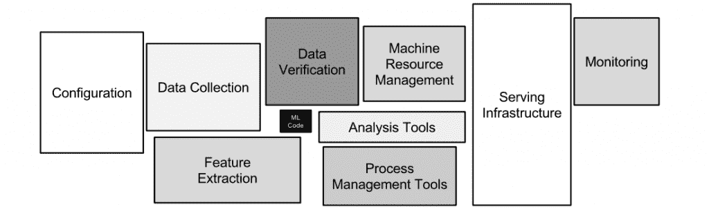

# Apache Spark 深度学习的来龙去脉

> 原文：<https://thenewstack.io/tips-tricks-develop-deep-learning-using-apache-spark/>

在最近于圣何塞举行的 [NVIDIA GPU 技术会议](http://www.gputechconf.com/)上，Databricks 软件工程师[蒂姆·亨特](https://www.linkedin.com/in/timotheehunter/)解释说，开发深度学习需要一套专门的专业知识。

[Databricks](https://databricks.com) 成立于 2013 年，旨在帮助人们使用 Apache Spark 数据处理框架构建大数据平台。它提供了一个 [Spark-as-a-Platform](https://databricks.com/product/databricks) 和使用 GPU 进行深度学习的专业知识，这可以极大地帮助加速深度学习工作。

亨特说，有多种方法可以整合 Spark 和深度学习，但目前还没有就如何最好地使用 Spark 进行深度学习达成共识。也就是说，任何安装过程都有一些通用规则，可以帮助那些刚刚开始将深度学习应用到项目中的开发人员。

## 深度学习不同于机器学习

他说，首先，尽管如此，重要的是要理解深度学习与机器学习有不同的要求。使用机器学习，工作负载由通信和大量输入/输出(I/O)主导。因此，使用具有大量内存的机器来促进缓存操作是可行的。这减少了通信量，从而提高了速度。

但是深度学习通常是在一个小得多的集群上完成的。所以它需要更多的计算能力和更少的内存。亨特说，这种差异会给不理解这种差异的开发人员带来问题。在[深度学习](https://www.youtube.com/watch?v=n1ViNeWhC24)中，一个系统可以复制人脑的神经网络，作为理解大型数据集模式的一种方式。这对于计算机视觉等任务尤其有用。

但他说，在大规模使用深度学习时，最重要的是要认识到，大多数见解都是针对一项任务、一个数据集和一种算法的。没有什么能代替实验来观察什么有效，什么无效。

他建议从一台机器上的数据并行作业开始，只有当数据集变得太大时才转移到合作框架。亨特解释说，多个 GPU 更难设置，也更难训练和调试。所以最好从小处着手。

## 流行的框架

去年出现了结合 Spark 和深度学习的解决方案。他们都采取不同的方法。

Spark 绑定最流行的深度学习框架有[Caffe](http://caffe.berkeleyvision.org/)([CaffeonSpark](https://github.com/yahoo/CaffeOnSpark))、 [Keras](https://github.com/fchollet/keras/tree/master/keras) ( [Elphas](https://github.com/maxpumperla/elephas) )、 [MXNet](http://mxnet.io/get_started/why_mxnet.html) 、 [PaddlePaddle](http://www.paddlepaddle.org/) 、 [TensorFlow](https://www.tensorflow.org/) 。Spark 原生的有 [BigDL](https://github.com/intel-analytics/BigDL) ， [DeepDist](http://deepdist.com/) ，DeepLearning4J， [MLLib](https://spark.apache.org/mllib/) ， [SparkCL](https://arxiv.org/abs/1505.01120) ，以及 [SparkNet](https://sparknet.net/) 。

因此，下一个显而易见的问题是“我们应该使用哪种解决方案？”

没有正确的答案，亨特说，并指出所有这些解决方案都有不同的编程语言和库。Databricks 在公共云上托管，更喜欢使用 GPU 来计算深度学习工作负载。但是他们的客户使用各种各样的深度学习框架。

根据 Hunter 的说法，在考虑深度学习时的一个大问题是，“你希望受到 I/O 或处理器的约束吗？”这个问题的答案取决于数据集的大小。

如果你的数据集很小，比如 60K 的图片，而且图片本身也很小，你可以使用亚马逊的 MXNet。这允许您将图像加载到每个工人的内存中，并以多并行方式工作。

## 数据管道和深度学习

除了考虑性能，开发人员还需要弄清楚深度学习如何集成到整体数据管道中。亨特说，总的来说，深度学习实际上只涉及数据管道的数据验证部分。但在设置深度学习时，考虑围绕深度学习发生的一切是至关重要的。

数据集成管道。图片来自斯卡利等人的《机器学习系统中隐藏的技术债务》

亨特说，许多人使用深度学习有两种方式。第一种是用于培训，其中工作负载由 I/O 控制。这需要大型集群、高内存/CPU 比率。当训练完成并且系统进入深度学习阶段时，需要转移到计算密集型、小型集群、低内存/CPU。

深度学习的第二个用途是专门的数据转换，即特征提取和预测。比如输入小狗小猫的图片，输出图片和标签。亨特说，深度学习转换过程受到将数据从存储位置移动到计算位置所需的通信量的限制。

## 循环模式

亨特说，在 Databricks，最常见的应用是 Spark 被用作调度程序。“Spark 处理许多并行运行的任务，这些任务可以单独维护数据，”他说，但他指出，对于数据并行任务，数据存储在 Spark 之外。

他说，对于嵌入式深度学习转换，任务也以数据并行方式运行，但数据最常见的是存储在 Spark 内部的数据帧或弹性分布式数据集(rdd)中。

Hunter 说，还可以选择使用合作框架，以分布式方式绕过 Spark。其特征在于数据的多次传递以及繁重和/或专门的通信。他警告说，使用合作框架，Spark 看不到系统在做什么，但会得到结果。因此，监控流程和故障排除必须在 Spark 之外进行。

## 通过深度学习流式传输数据

亨特说，建立深度学习最重要的部分是如何将数据纳入深度学习系统。您有三种主要的存储选择。

这首先是一个“冷层”，一个使用亚马逊简单存储服务(S3)或内部存储服务(T2)的“冷层”。第二个选择是带有 Sparks 盘上持久层的本地存储。第三种也是最快的选择是使用 Spark RDD 或 Spark 数据帧的内存存储。当数据不适合本地内存时，可以存储在本地光盘上。“人们忘记了从本地光盘中检索数据有多快，”亨特指出。

## 保持警惕

亨特表示，在添加深度学习时，有几件事情需要注意。

他说，大多数深度学习框架都是在考虑 Python 的情况下建立的，所以他们通常有一个用 Java 或 C++编写的内核，但有一个 Python 接口。

一种常见的方法是使用 [PySpark](https://github.com/apache/spark/tree/master/python/pyspark) 库，尽管在这里深度学习最终会遇到很多沟通瓶颈。所有框架都针对磁盘 I/O 进行了大量优化。读取文件很快，当本地文件不适合时，它会使用本地文件。

亨特说，但这也有不好的一面。使用 Spark 的一个好处是，当数据减少时，您可以在另一台机器上重新运行计算，并且会得到相同的结果。当数据存储在本地内存中时，您就失去了这种能力。

所以这是一个权衡。引用机器学习专家 Leon Bottou 的话，他说“再现性是两倍的价值”，这意味着他愿意得到不可再现的结果，如果它们以至少两倍的速度交付的话。“我需要一台运行速度快 10 倍的机器，以减少我看不到的计算。”所以要看结果对你有多重要。“这是一个正在探索的领域，”亨特说。

所以对于深度学习开发者来说，重要的问题是:你想在算法和 Spark 之间设置什么边界？你想让算法使用 Spark 的通信，知道其中的权衡吗？

## 开发者提示

“软件栈很深，需要非常仔细的构建，”亨特说。如果你错过了一个步骤，当你开始运行系统时，你将会有糟糕的性能。

他说，交钥匙栈开始出现，但就目前而言，开发人员必须集成硬件、驱动程序、库和对 GPU 的任何特殊调用。您将需要支持所有这些的多个版本。

如果您在公共云上工作，您还需要支持许多不同的硬件和不同的软件版本。

Databricks 发现，一些客户会超越他们的建议，安装自己的 GPU 库。然后他们抱怨 GPU 慢。它破坏了系统，因为他们没有恰当地合并图书馆。

Hunter 说，最直接的解决方案是以一种尽可能不依赖底层操作系统的方式打包所有的依赖项。他认为 Docker 在这方面非常方便。

<svg xmlns:xlink="http://www.w3.org/1999/xlink" viewBox="0 0 68 31" version="1.1"><title>Group</title> <desc>Created with Sketch.</desc></svg>