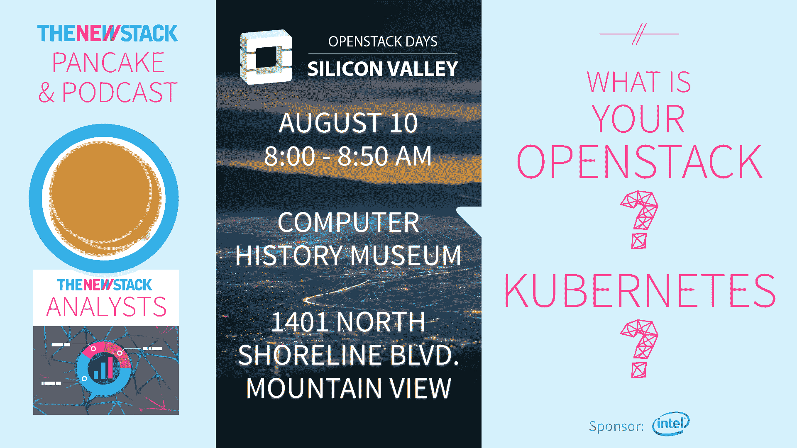

# 《栖息地主厨》能成为 DevOps 游戏规则改变者吗？

> 原文：<https://thenewstack.io/tns-analysts-show-100-chef-habitat-may-become-devops-gamechanger/>

由于 Chef 新推出的 [Habitat](https://www.habitat.sh/) 目前还处于早期阶段，许多开发人员想知道它是否可以成为部署新开发或更新的应用程序的自动化工作流程的关键元素。

在下面嵌入的第 100 集[New Stack Analysts](https://thenewstack.io/podcasts/)播客中，我们将探索如何在当今企业中使用 [Chef's Habitat](https://www.habitat.sh/) ，企业可以做些什么来确保他们解决正确的工作流问题，以及 Habitat 等工具如何让当今的开发人员生活更轻松。我们采访了金融服务公司 Kasasa 的基础设施服务总监 Boyd Hemphill。Arista Networks 的扩展性工程师 Jere Julian；亚当·米科尔，德州农工大学建筑学院的信息技术主任；和德克萨斯建筑学院的操作工程师维多利亚·布莱辛一起讨论他们对这些问题的想法。New Stack 的 [Lee Calcote](https://twitter.com/lcalcote) 主持了上个月在 ChefConf 2016 上举行的演讲。

[#100:大厨 Habitat 能否成为 DevOps 游戏规则改变者？](https://thenewstack.simplecast.com/episodes/100-could-chef-habitat-become-a-devops-gamechanger)

[https://www.youtube.com/embed/7b6txTrmP14?feature=oembed](https://www.youtube.com/embed/7b6txTrmP14?feature=oembed)

视频

“资源抽象层是关键。在虚拟世界中，我们都从中受益。不必花费太多的时间和精力来处理独立的设备驱动程序。能够为应用程序带来同样的好处是一个巨大的胜利。没有一种技术能解决所有问题，但拥有一套可用的技术是一件大事，”Julian 说。

Mikeal 解释说，德克萨斯 A&M 建筑学院希望 Habitat 能够为其研究生和研究员提供一种更方便的方法来管理他们的虚拟机和应用程序。由于该大学目前已经有了一个基于 Chef 的基础设施，像 Habitat 这样的工具对于那些已经将 Chef 集成到他们当前系统架构中的组织来说是非常有益的。他指出，该大学曾考虑过 Docker，但其学习曲线是导致该大学最终选择 Chef 的一个因素。

当考虑他们的系统基础设施时，开发人员和运营团队可能很难确定问题在哪里，或者他们的工作流的哪一部分需要优化。Julian 指出，安全性和网络等问题是 DevOps 团队需要了解的事情，在这些问题在每个 DevOps 环境中得到解决之前，“我们真的没有代码形式的基础架构，我们只有零件和部件。”

解决问题是企业和开发者应该关注的焦点。Julian 恳求说，虽然 Habitat 等新技术令业内许多人兴奋，但企业必须记住他们最初为什么要开发产品和软件。

“我们是极客，我们对技术和各种不同的选择感到兴奋，有时我们会忘记我们为什么要做这些事情。我们如此沉迷于新的酷工具，我们能做的事情，以至于我们忘记了停下来后退，提醒自己为什么要这样做。我们这样做是因为有一个商业问题需要解决，”朱利安说。

Docker 是新堆栈的赞助商。

专题图片:(从左至右):亚当·米科尔、维多利亚·布莱辛、博伊德·汉菲尔在切夫孔夫。

<svg xmlns:xlink="http://www.w3.org/1999/xlink" viewBox="0 0 68 31" version="1.1"><title>Group</title> <desc>Created with Sketch.</desc></svg>