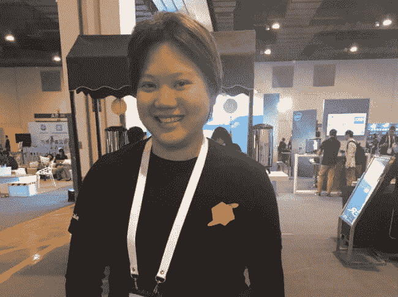

# TNS 上下文:KubeCon Preview 和 Kubernetes 自定义控制器

> 原文：<https://thenewstack.io/tns-context-kubecon-preview-and-kubernetes-custom-controllers/>

[TNS 上下文:KubeCon 预览和 Kubernetes 自定义控制器](https://thenewstack.simplecast.com/episodes/tns-context-kubecon-preview-and-kubernetes-custom-controllers)

欢迎来到[新的堆栈环境](https://thenewstack.io/podcasts/context)，这是一个播客，让我们来看看大规模开发和部署社区本周最相关的新闻。本周我们将与 Joel Speed 进行对话，他是 Pusher 的云基础设施工程师，一直在帮助构建内部的 Kubernetes 平台。Joel 本周为我们写了一篇关于如何用自定义控制器解决 Kubernetes 配置问题的投稿，所以我们会先和他谈谈。

在稍后的节目中，我们将与 TNS 执行主编 Joab Jackson 和 TNS 主编 Alex Williams 谈论我们对下周在西雅图举行的 [KubeCon + CloudNativeCon 北美](https://events.linuxfoundation.org/events/kubecon-cloudnativecon-north-america-2018/)的期待。新的 Stack 有两个煎饼早餐和一个完整的播客和直播时间表，所以请访问我们的网站或关注我们的 Twitter @thenewstack，了解 KubeCon 的实时更新。

## 链接

*   [CNAB 简化了分布式应用的容器式部署](/microsoft-cnab-simplifies-container-deployment-to-distributed-applications/):微软和 Docker 联手简化了将多个组件打包成一个应用的业务。微软的云原生应用捆绑包(CNAB)提供了一种将你的组件打包成一个应用的方法，使用了一个叫做 Duffle 的新的包管理器。CNAP 是一个参考实现，所以它对其他人是开放的。
*   [关键漏洞允许 Kubernetes 节点黑客](/critical-vulnerability-allows-kubernetes-node-hacking/) : Kubernetes 获得首个重大漏洞！“通过特制的请求，被允许通过 Kubernetes API 服务器与后端服务器建立连接的用户可以通过相同的连接直接向后端服务器发送任意请求，并使用 Kubernetes API 服务器用于建立后端连接的 TLS 凭据进行验证，”Kubernetes 开发人员在一份公告中说。
*   [Portworx PX-Enterprise 2.0](/portworx-px-enterprise-2-0-the-missing-piece-of-the-hybrid-cloud/) :混合云的缺失部分:Portworx 刚刚随着 Portworx-Enterprise 2.0 的发布向前迈出了一大步，Portworx-Enterprise 2.0 是一个虚拟存储结构，它跨越多个集群，无论这些集群是在同一个云平台、多个云还是本地和云的混合环境中。
*   [用定制控制器解决 Kubernetes 的配置困境](https://thenewstack.io/solving-kubernetes-configuration-woes-with-a-custom-controller/):当更新配置图时，他们需要一种方法来查看这些更改是否被推出。配置映射和机密都没有版本，也没有控制循环。虽然更新配置映射会更新 Pod 内的已挂载文件，但更新机密不会触发集群内的任何更改。

## 本周照片

PlanetScale 的 Adrianna Tan 很乐意分享她的 wifi(谢谢！)在上个月最近的 KubeCon + CloudNativeCon China 上。

谷歌的克雷格·博克斯(Craig Box)，一位“神秘的新西兰女士”，和 Linux 基金会的丹·布朗(Dan Brown)和莎拉·康威(Sarah Conway)，在 KubeCon + CloudNativeCon China 的上海美丽的天际线前。

如果你想知道是谁为软件马戏团和最近在拉斯维加斯举行的 2018 年 IFX 创造了艺术而舒适的活动空间，这就是你要找的人，Richard Sjenitzer，摄于 IFX。

云原生计算基金会、Kubecon + CloudNativeCon 和 Portworx 是新堆栈的赞助商。

通过 Pixabay 的特征图像。

<svg xmlns:xlink="http://www.w3.org/1999/xlink" viewBox="0 0 68 31" version="1.1"><title>Group</title> <desc>Created with Sketch.</desc></svg>