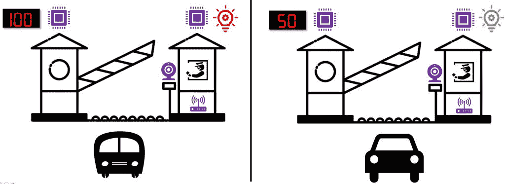

# TNS 演示:在边缘开始机器学习

> 原文：<https://thenewstack.io/tns-demo-get-started-with-machine-learning-at-the-edge/>

你是如何把 AI 带到边缘计算的？这是新堆栈演示第一集的主题，由分析师兼 TNS 特约撰稿人[贾纳基拉姆·MSV](https://thenewstack.io/author/janakiram/)整理。基于英特尔的人工智能套件，我们展示了如何“训练”设备来识别不同的车辆类型——在这种情况下，是一辆模型汽车和公共汽车。像这样的系统可以根据传感器“看到”的车辆类型来计算通行费。它可以被视为边缘设备，因为它不需要连接到互联网来获得数据中心服务器的任何额外帮助。

[https://www.youtube.com/embed/0gekz5jW-hg?feature=oembed](https://www.youtube.com/embed/0gekz5jW-hg?feature=oembed)

视频

这个项目基于一个[英特尔 AI Vision X Kit](https://software.intel.com/en-us/iot/hardware/up-squared-ai-vision-dev-kit) ，一个运行英特尔凌动处理器的边缘设备。这个工具包带有一个摄像头，可以通过 USB 端口向设备传输图像(尽管许多其他网络摄像头也可以工作)。这里使用的套件的一个可选版本包括[英特尔 Myriad VPU](https://www.movidius.com/myriad2) (视觉处理单元)，该设备将推理任务卸载到它上面。该设备运行一个版本的 Ubuntu Linux，它可以很容易地用[英特尔 OpenVINO Toolkit](/intel-openvino-brings-ai-inferencing-to-the-desktop/) 安装。

该演示还部署了几个 [Arduino Yun](https://store.arduino.cc/usa/arduino-yun-rev-2) 微控制器，一个驱动数字显示器，另一个驱动两个 led，一个红色，一个绿色。它们通过 WiFi 连接到边缘设备，MQTT 充当该系统的消息代理。

在本教程中，小型模型汽车和公共汽车被放置在摄像头前面，摄像头会将图像发送到设备。该设备卸载到推理到 VU，以确定车辆是否存在以及它是小汽车还是更大的卡车或公共汽车。结果被传送到云单位。如果车辆类型是卡车，一个 LED 将发光，如果车辆是汽车，另一个将发光。显示屏上的数字显示了车辆的估计大小。

以下是本项目中使用的项目列表:

## 软件设置

机器学习可以分为两个部分:训练模型，然后使用模型进行推理。训练包括系统学习如何识别不同类型的数据，而推理则是应用所学知识来做出决策。在这种设置中，推理必须通过 VPU 实时完成。

对于与该系统配合工作的软件，第一步是将预先存在的深度学习视觉识别模型优化为 VPU 可以使用的 16 位浮点格式。该功能由 OpenVINO 工具包提供，并产生两个输出，一个 bin 文件和一个 XML 文件，这两个文件随后都被集成到工具包中的开源计算机视觉库 [OpenCV](https://sourceforge.net/projects/opencvlibrary/) 使用。OpenCV 文件被修改以将推理处理卸载到英特尔 Myriad VPU。

为这个项目编写的 Python 程序遍历每一帧来识别对象，当一个对象出现时，程序通过 MQTT 发送消息，启动基于 OpenCV 的识别过程。结果发布到 Arduino 云设备订阅的 MQTT 主题。当检测到感兴趣的对象时，为一云编写的软件改变致动器的显示。另一个云点亮相应的 LED。对于本项目的定制软件，请参见[本前期教程](https://thenewstack.io/how-i-built-an-aiot-project-with-intel-ai-vision-x-developer-kit-and-arduino-yun/)。

当它部署在收费站时，LED 的颜色和显示屏上显示的值会根据车辆类型而变化。

请继续关注我们新的演示视频播客系列。

<svg xmlns:xlink="http://www.w3.org/1999/xlink" viewBox="0 0 68 31" version="1.1"><title>Group</title> <desc>Created with Sketch.</desc></svg>