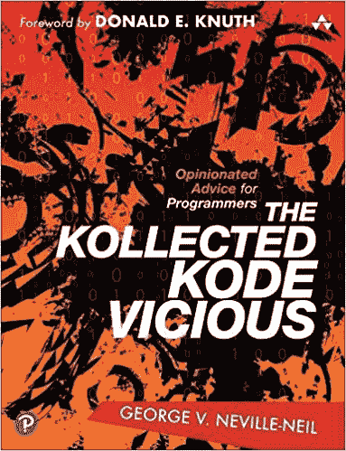
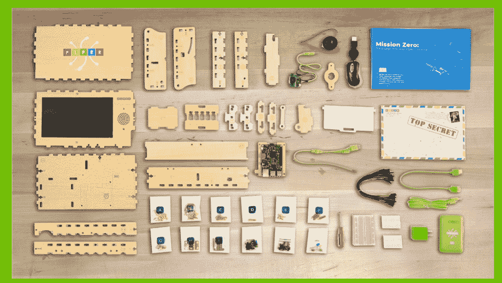
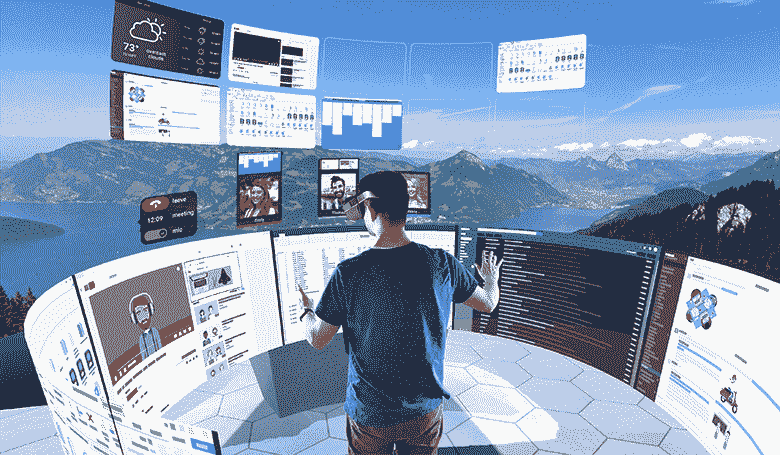

# TNS 2020 年礼品指南:实用项目和美妙乐趣

> 原文：<https://thenewstack.io/tns-gift-guide-for-2020-practical-projects-and-fabulous-fun/>

现在是[我们的](https://thenewstack.io/exploding-kittens-geeky-gifts-secretly-wish-got/) [自己的](https://thenewstack.io/a-very-geeky-christmas-four-gift-ideas-for-the-programmer-in-your-life/) [一年一度的](https://thenewstack.io/geeky-gifts-secretly-wish-wed-gotten/) [传统](https://thenewstack.io/tech-y-gifts-geeks-2017-edition/)了:自 2015 年以来，New Stack 为你生活中的书呆子或你自己的书呆子收集了一年一度的礼物，并在尖端技术变成尖端玩具的过程中，谦虚地提供我们对技术流动的观点。

当界限像圣诞雪一样融化时，看看我们玩工具的方式很有趣。今年，每个礼物的想法似乎都变得更加令人惊奇，直到我们离消失在母体中只有一步之遥。

## 1.唐纳德·克努特的建议

著名的数学家/计算机科学家唐纳德·克努特取消了他今年的[年度](https://thenewstack.io/donald-knuths-2019-christmas-tree-lecture-explores-pi-in-the-art-of-computer-programming/) [圣诞节](https://thenewstack.io/donald-knuths-christmas-tree-lecture-addresses-curious-problem-combinatorial-geometry/) [圣诞树](https://thenewstack.io/donald-knuths-christmas-tree-lecture-on-dancing-links-and-organ-music/)讲座——但是这位 82 岁的计算机科学先驱仍然为我们带来了[一本真正优秀的书籍推荐](https://www.informit.com/articles/article.aspx?p=3094511)。在计算机械协会的学术交流中，有一个名为“Kode Vicious”的定期专栏，Knuth 最近承认他是“多年来……”的粉丝

他在书的前言中解释道:“这些话题不仅及时，而且解释得风趣而优雅。”。在撰写该专栏 15 年后，作者 George V. Neville-Neil 收集了一本 336 页的书，提供“实用的、一口大小的编程建议”，并更新了“阐明更广泛主题并解决与每个软件专业人员相关的问题的新材料”。除了关于抽象和线程的部分，还有一个有趣的章节，标题是“人与人之间:与开发人员、经理和其他人打交道”。"

尽管他的出版商[向忧心忡忡的经理们](https://www.pearson.com/us/higher-education/product/Neville-Neil-The-Kollected-Kode-Vicious/9780136869962.html)保证“虽然对所提问题的回答总是着眼于幽默，但给出的建议是非常严肃的。”

## 2.构建自己的计算机

今年最热门的科技礼物之一是 Piper 电脑套件，在这里你可以组装自己的电脑。“好的，我喜欢这东西…”一位 ZDNet 博客作者写道[，并补充道“我是这东西为之而生的孩子。如果我得到了这套装备，我会非常激动。”](https://www.zdnet.com/article/best-tech-gifts-for-kids-roboticists-hackers-learning-coding/)

他不是唯一的粉丝。“我爱 Piper，”史蒂夫·沃兹尼亚克在 Piper 的网站上再次引用了这句话，“因为它代表了让我能够做我生命中所有伟大的技术事情的东西。”

不需要焊接，但你仍然可以利用 Piper 易于安装的激光切割木制部件(其中一个部件包含一个 9 英寸的屏幕)，一件一件地制作自己的盒子。它由树莓皮驱动，但在引擎盖下有更多的乐趣。根据亚马逊上的[描述，该套件甚至包括一个特殊版本的《我的世界》，因此“制造计算机只是一个开始！使用 Piper 的 StoryMode，孩子们将被引导完成一项秘密任务，连接电线和电子元件，在沉浸式世界中移动，并控制结果。”](https://www.amazon.com/Piper-Computer-Kit-Minecraft-Raspberry/dp/B07HPFF3KC)

Piper 的工具包已经成为有抱负的程序员的“it”物品。根据 Piper 的网站，它非常受欢迎，以至于“2020 年售罄”(2019 年的“远程学习捆绑包”也是如此)。亚马逊也将其列为“[目前不可用](https://www.amazon.com/Piper-Computer-Kit-Minecraft-Raspberry/dp/B07HPFF3KC)”不过幸运的是，有几个还在[易贝](https://www.ebay.com/itm/Piper-Computer-Kit-STEM-Built-Your-Own-Computer-Minecraft-Raspberry-Pi-Edition/143875123229?hash=item217fa0281d:g:wYMAAOSwvrFfzRU7)[上](https://www.ebay.com/sch/i.html?_from=R40&_trksid=m570.l1313&_nkw=Piper%20Computer%20Kit&_sacat=0)冒出来。

## 3.键盘就是电脑

但是你最喜欢的 IT 工作者可能也想进入一个计算机完全消失的世界。Raspberry Pi 400 将自己标榜为“70 美元的台式电脑……内置在紧凑键盘中的完整个人电脑。”看，键盘*就是*电脑——在它的按键下面是一个 Raspberry Pi 板，拥有所有必要的 RAM 和处理能力(外加内置的以太网和 HDMI 输出端口)。是的，你需要自己的显示器来插入它，但除此之外，它的[官方网页](https://www.raspberrypi.org/blog/raspberry-pi-400-the-70-desktop-pc/)承诺它是“‘圣诞节早晨’的产品，具有最佳的开箱即用体验:一台可以插入你的电视或显示器的完整 PC”，同时为幸运的接收者提供“对大多数用户来说，与传统 PC 没有区别的体验”

[https://www.youtube.com/embed/ZSvHJ97d8n8?feature=oembed](https://www.youtube.com/embed/ZSvHJ97d8n8?feature=oembed)

视频

这些也卖得很快——但是你仍然可以在易贝找到一些经销商。

## 4.虚拟游戏，虚拟工作

每个人都对经典视频游戏 Myst 在虚拟现实中的到来赞不绝口，首先在 Oculus Quest 上独家发布。

[https://www.youtube.com/embed/ZHBWNemdeu4?feature=oembed](https://www.youtube.com/embed/ZHBWNemdeu4?feature=oembed)

视频

但也有可能探索一个更奇怪的虚拟世界——你自己的工作空间——这是 Oculus Quest 应用程序“ [vSpatial](https://www.oculus.com/blog/wide-open-workspace-vspatial-available-now-on-oculus-quest/?locale=en_US) 提供的它们不再是两个并排的显示器，而是承诺无限数量的显示器(出现在无形的工作组织“旋转木马”上)，巨大的窗口似乎可以从你的地板上高耸起来。它们是协作屏幕，可以与你的同事(或者至少是他们的虚拟化身)共享——当然，虚拟场景背景也很棒。

它的官方网页承诺它提供虚拟环境的所有好处——包括“投篮休息一下”的能力

[https://www.youtube.com/embed/VOph3UT9zGc?feature=oembed](https://www.youtube.com/embed/VOph3UT9zGc?feature=oembed)

视频

这是一份特别适合迎接新年挑战的礼物。“远程工作需要沉浸感、团队协作的新方式以及参加大型会议和活动的新方式，”vSpatial 的创始人兼首席执行官 Richard B. Platt 解释道，并补充说他们也“看到了学校的极大兴趣”。“由于疫情的存在，未来的工作已经变成了远程工作，而且还会持续下去。

“更重要的是，我们设想将我们习惯的习惯性 2D 工作流发展成身临其境的 3D 工作流，让团队在任何地方工作和开会。”

他们现在已经调整了他们的虚拟空间 SaaS 云以供私有云使用…

## 5.NextMind 的脑机接口

但也许所有这些技术虚拟化正引导我们走向终极黑客项目——其中一个工具就是你自己的脑袋。总部位于巴黎的初创公司 NextMind 终于开始为其实时大脑-计算机接口提供开发工具包。NextMind 的[网页](https://www.next-mind.com/)承诺:“让你的思维控制一切”。一个宣传视频解释说，一个紧凑的(并获得专利的)传感器翻译来自你大脑的神经信号，以便它们控制现实世界的数字设备。

"如果你能用一个想法控制你的世界会怎么样？"视频问道，显示漫不经心的用户随意调暗灯光或只用他们的想法混合音乐。

[https://www.youtube.com/embed/RR7tHXV14xk?feature=oembed](https://www.youtube.com/embed/RR7tHXV14xk?feature=oembed)

视频

NextMind 将其描述为“第一个识别活动视觉焦点的智能系统。”重量仅为 60 克(2.11 盎司)，戴在头带上的传感器包括九个脑电图(EEG)电极，通过标准的蓝牙连接传输，产生几乎是心灵感应的效果。

本月，NextMind 开始向雄心勃勃的开发者提供他们 399 美元的套件，他们希望“建立第一代精神控制的体验”多亏了它所描述的机器学习算法，“你用得越多，它就变得越直观。缩小思想和行动之间的差距。”(尽管他们的网站强调这一切都符合现代隐私法规。“传感器数据仅在您的个人计算机上处理。您可以选择安全地与我们共享您的数据，以便在完全遵守 GDPR 的情况下改进我们的研究和您的体验。”)

这一切都证明了我们的技术正在把我们带向新的方向——伟大的传统继续修补和努力，在这一年和每一年，带着一个不屈不挠的希望。

还有很多享受假期的方式。

大家节日快乐！

<svg xmlns:xlink="http://www.w3.org/1999/xlink" viewBox="0 0 68 31" version="1.1"><title>Group</title> <desc>Created with Sketch.</desc></svg>