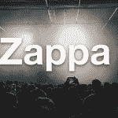
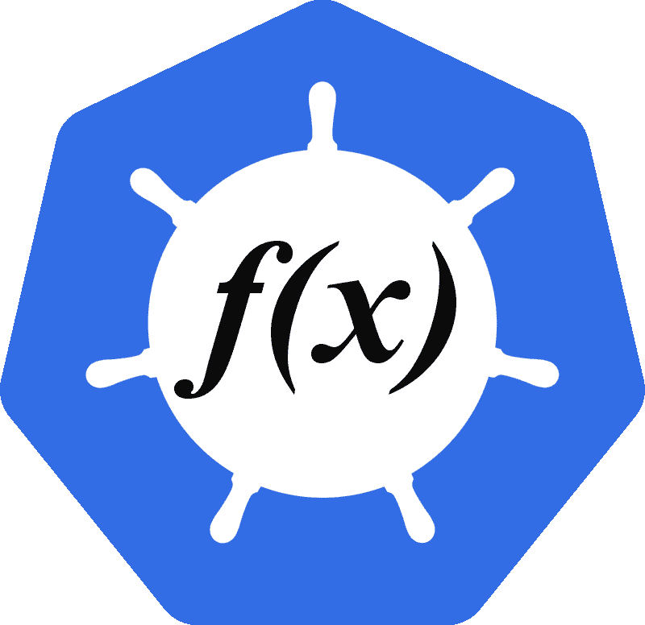
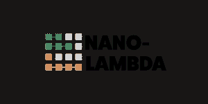
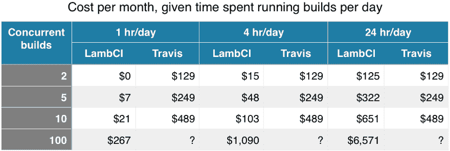
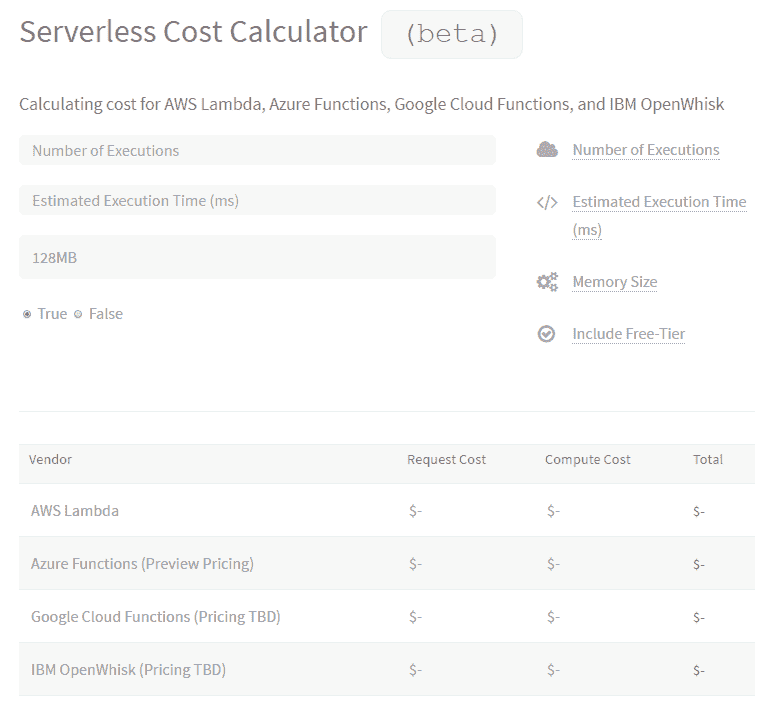

# TNS 无服务器技术指南:最佳框架、平台和工具

> 原文：<https://thenewstack.io/tns-guide-serverless-technologies-best-frameworks-platforms-tools/>

本文是收集新兴技术和服务的两部分系列文章的第二部分

[serverless](http://www.thenewstack.io/tag/Serverless)

生态系统。第一

[installment](https://thenewstack.io/guide-serverless-technologies-functions-backends-service/)

涵盖功能即服务(FaaS)和后端即服务(移动提供商的 BaaS 或 mBaas)提供商。

即使你不需要服务器本身，无服务器技术仍然需要大量的支持软件。需要框架来编纂最佳实践，这样每个人都不必重新发明轮子，特别是当涉及到与各种语言如 Go、JavaScript 和 Python 接口时。需要平台来帮助人们避免在配置底层基础设施上花费太多时间，也许可以通过将工作交给服务提供商来完成。

正好赶上在伦敦举行的无服务器会议，这篇文章重点介绍了一些最广泛使用的框架和平台，以及其他支持工具，它们使基于无服务器的工作负载获得了成功。

## 无服务器框架

[Chalice](https://github.com/awslabs/chalice) (AWS Labs):一个开源项目，为 AWS 提供 Python 无服务器微框架，允许您快速创建和部署使用 Amazon API Gateway 和 AWS Lambda 的应用程序。它对如何部署应用程序做出假设，并且对如何构建应用程序有限制。

[Claudia . js](https://claudiajs.com/)(Claudia . js):Claudia . js 可以轻松地将 Node.js 项目部署到 [AWS Lambda](http://docs.aws.amazon.com/lambda/latest/dg/welcome.html) 和 [API 网关](https://aws.amazon.com/api-gateway/)。它自动化了所有容易出错的部署和配置任务，并按照开发者期望的方式设置一切。它的创始人 Gojko Adzic 已经创建了扩展库，让用户快速构建聊天机器人和 Web API 端点。

[DEEP Framework](https://github.com/MitocGroup/deep-framework)(Mitoc Group):用于构建云原生 web 应用的全栈 JavaScript 框架，与具体的云提供商无关。它用于支持 Mitoc 的 DEEP Marketplace，这是一种软件服务，允许客户从微服务列表中选择和部署。

[格式塔框架](http://www.galacticfog.com/product)(银河迷雾):一组一起使用的微服务为应用开发者创建了一个平台来构建功能，而无需管理容器环境。该公司是中间层[的合作伙伴](https://thenewstack.io/galactic-fog-brings-serverless-container-ecosystem/)，因此可能是在中间层的数据中心操作系统(DC/OS)上执行 Lambda 功能的第一批方式之一。

[Serverless 框架](http://www.serverless.com) (Serverless，Inc.): Serverless 是一个专门在亚马逊 web Services 的 Lambda 和 API 网关上构建 Web、移动和物联网应用的应用框架。这是一个命令行界面。背后的公司 Serverless，Inc .最近筹集了超过 300 万美元的资金。《新书库》最近采访了它的创造者奥斯汀·柯林斯。

[无服务器框架如何重塑 AWS Lambda](https://thenewstack.simplecast.com/episodes/how-the-serverless-framework-is-reshaping-aws-lambda)

[Shep](https://github.com/bustlelabs/shep) (Bustle): Shep 是一个用 AWS API Gateway 和 Lambda 构建 JavaScript APIs 的框架。它是由 business 的工程团队创造和使用的。

[斯巴达](http://gosparta.io/)(开源项目):斯巴达为 AWS Lambda 微服务提供了一个 Go 框架。这个项目由 NodeSource 的 Matt Weagle 领导。Sparta 让你的基于 Lambda 的服务与整套 AWS lambda 事件源集成在一起。它还可以提供云信息支持的资源。

[Zappa](https://github.com/Miserlou/Zappa) (开源项目):无服务器的 Python web 服务，使得在 AWS Lambda 和 API Gateway 上部署 Python WSGI 应用程序(即基于像 [Django](https://www.djangoproject.com/) 和 [Flask](http://flask.pocoo.org/) 这样的框架)变得容易。几个月前[瑞安·布朗](https://twitter.com/ryan_sb)对创始人[里奇·琼斯](https://github.com/Miserlou)进行了一次有趣的[采访](https://serverlesscode.com/post/rich-jones-interview-django-zappa/)。

## 无服务器平台

[Apex](http://apex.run) (PubNub):让您构建、部署和管理 AWS Lambda 作业。 [Apex](https://thenewstack.io/apex-makes-aws-lambda-easy-peasy-programmers/) 通过使用注入到构建中的 Node.js 填充程序，允许使用非本地支持的语言。测试功能和其他工具也是该项目的一部分，该项目由 [PubNub](https://thenewstack.io/pubnub-makes-network-programmable/) 赞助。

Funktion(红帽):基于 Kubernetes(T21)的开源、事件驱动、lambda 风格的编程模型。一个*function*(注意时髦的拼写)是一个用任何语言编写的常规函数，但是连接到一个部署在 Kubernetes 中的触发器。当激活时，这些触发器与数据库、消息系统和许多其他云服务的端点 URL 一起工作。该项目仍处于试验阶段。

[Iron.io 平台](https://www.iron.io/platform/) (Iron.io):该平台包括 [IronWorker](https://www.iron.io/platform/ironworker/) 、 [IronMQ](https://www.iron.io/platform/ironmq/) 和 [IronCache](https://www.iron.io/platform/ironcache/) ，并[预集成到众多云原生平台](https://thenewstack.io/iron-io-brings-serverless-computing-cloud-foundry-platform/)，如 Cloud Foundry、Kubernetes、Mesos 等。有了 IronWorker，你可以从防火墙内部运行类似 AWS Lamba 的无服务器功能。IronWorker 是一个平台，它隔离了在容器化环境中按需处理的各个任务的代码和依赖关系。IronMQ 是一个分布式队列服务，IronCache 是一个数据服务。

[Gordon](https://github.com/jorgebastida/gordon) (开源项目):Gordon 是一个使用 CloudFormation 创建、连接和部署 AWS Lambdas 的平台。Jorge Bastida 是这个项目的主要开发者。

[Nano Lambda](http://nano-lambda.com/) (Nano Lambda):运行和扩展微服务的自动化计算服务。代码被上传到一个容器中。在容器之外，Nano Lambda 将协调所需的任务，以联网、保护、认证和记录微服务。我们从[阿德里安·科克罗夫特](https://twitter.com/adrianco)的演讲中了解了这家新兴公司，并期待看到他们如何在无服务器领域赚钱。

项目奎托斯(Iron.io):仍处于测试阶段，项目奎托斯将使企业能够在任何云提供商以及内部运行 AWS Lambda 功能。Iron.io 已经提供了另一个产品 IronWorker，它可以运行[类似 AWS Lamba 的无服务器功能](https://www.iron.io/aws-lambda-vs-ironworker/)，这些功能[预集成到许多云原生平台](https://thenewstack.io/iron-io-brings-serverless-computing-cloud-foundry-platform/)。

Syncano (Syncano): Syncano 是一个构建无服务器应用的平台，允许用户定制套接字，套接字是连接到 Syncano 服务的配置。它提供了一个仪表板和 SDK 来定义数据模式。该公司是无服务器领域最成熟的公司之一。

## 无服务器工具

[IOpipe](https://www.iopipe.com/) (IOpipe): IOpipe 是用于监控亚马逊 Lambda 功能的分析和分布式跟踪服务。用户在他们的 Lambda 函数中添加一个模块来获取遥测数据。IOpipe 汇总数据，发送电子邮件报告，并提供仪表板和指标。它的创始人是 [Erica Windisch](https://twitter.com/ewindisch) ，一位码头工人校友，是我们 2014 年[和 2015 年](https://thenewstack.io/the-new-stack-analysts-show-23-docker-its-just-the-beginning/)[的播客嘉宾。](https://thenewstack.io/tns-analysts-show-56-the-pancake-breakfast-circuit-comes-to-containercon/)

Kaazing WebSocket 网关(Kaazing):这个网络网关为实时的、基于 web 的协议提升提供了一个单一的访问点，支持负载平衡、集群和安全管理。它有免费版(社区版)和企业版。

Kappa (开源项目):Kappa 是一个命令行工具，它(有望)使 AWS Lambda 的部署、更新和测试功能变得更加容易。

[LambCI](http://lambci.org/) (开源项目):LambCI 是一个基于 AWS Lambda 构建的持续集成系统。它是一个可以上传到 AWS Lambda 的包，当你在 GitHub 上推送新代码或打开 pull 请求时，它就会被触发，并在 Lambda 环境中运行你的测试。虽然创始人迈克尔·哈特(Michael Hart)推出了 LambCI，并有令人信服的理由使用它，但它作为商业产品可能还没有市场。

假设每周 7 天 LambCI 运行在最快的 1.5GB Lambda 选项上)

[Pusher](https://pusher.com/) (Pusher): Pusher 是一个托管的实时消息服务，具有 API、开发工具和开源库，简化了将实时功能集成到 web 和移动应用程序中。

[Vandium-node](https://github.com/vandium-io/vandium-node) (Vandium 软件):一个 AWS Lambda 包装器，Vandium 是一个开源的 npm 模块，用于使用验证保护 Node.js 安全，并防止注入攻击。这个项目和与其同名的[公司](https://vandium.io/)似乎是由[理查德·凯悦](https://github.com/richardhyatt)领导的，他是[蓝猫网络](https://www.bluecatnetworks.com/)的联合创始人。

[web task](https://webtask.io/)(auth 0):web task[使用 HTTP 调用](https://thenewstack.io/often-choose-webtask-lambda/)为您的 JavaScript 和本地应用程序运行服务器端代码。Auth0 的[主要产品](https://auth0.com/how-it-works)是一组用于移动和无服务器应用的认证服务。

## 杂项无服务器资源

*无服务器的核心是创建一个可组合的基础设施，而不用担心服务器组件。 [IFTTT](https://ifttt.com/) 和 [Zapier](https://zapier.com/) 是消费者和商业应用，它们已经建立了一个利基市场，用户可以在不需要配置任何后端服务器的情况下创建应用。在这个杂项资源列表中，还有其他几家遵循相同商业模式的著名公司。*

Dexter : Dexter 是一个连接第三方 API 的平台。开发团队正在关注“bot”用例。

正如我们在今年早些时候报道的那样，fluore 将是一个管理无服务器应用组件的开源平台。尽管它还没有发布，但在无服务器开发者中，它已经获得了很多关注。

[Form.io](https://form.io/)(form . io):Angular 和 React 的组合表单和 API 平台，form . io 简化了你的表单和 API 之间的连接。

[n stack](http://nstack.com/)(n stack):n stack 软件将一段代码(比如一个函数、一个类或者一个库)变成一个轻量级的微服务，可以绑定到一个事件流。以前叫 Stackhut。

无服务器计算器(云专家):这个计算器帮助比较不同 FaaS 提供商的估计成本，最初是针对 AWS Lambda 和 Azure 功能。当 Google Cloud Functions 和 IBM OpenWhisk 设定它们的价格时，这些信息也将被包括在内。

【T2

Stamplay (Stamplay): Stamplay 将 API 连接到基于服务的应用程序中。

## **无服务器咨询公司**

*在如此多的新兴技术领域，大多数公司主要由人力组成，实施项目，而不是出售知识产权。这些公司只是几个例子。*

[Cloudonaut](https://cloudonaut.io/)

[微 pps](https://microapps.com/)

无服务器英雄

[SGA 无服务器](http://sga.com/)

[Trek10](https://www.trek10.com/)

[有用的 IO](http://www.useful.io/)

<svg xmlns:xlink="http://www.w3.org/1999/xlink" viewBox="0 0 68 31" version="1.1"><title>Group</title> <desc>Created with Sketch.</desc></svg>