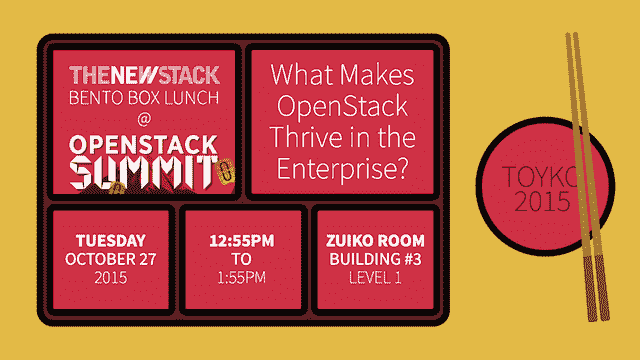

# TNS 制造商:Kelsey Hightower 谈 OpenStack 的发展和英特尔的透明容器

> 原文：<https://thenewstack.io/tns-makers-kelsey-hightower-on-openstacks-evolution-and-intels-clear-containers-and/>

理想情况下，云是面向所有人的——提供一组 API 来完成您想要的底层计算，无论您是云提供商还是运行自己的数据中心。这是 OpenStack 的使命所暗示的世界，对于核心 [Kubernetes 贡献者](https://github.com/kelseyhightower)凯尔西·海托华来说，这是一个他认为越来越近的世界，这要归功于英特尔最近推出的 Clear Containers 计划。

在本期 New Stack Makers 播客中，Hightower 与 TNS 主编 Alex Williams 讨论了他对 OpenStack 和容器的最新观点。他们还深入研究了透明容器的前景。

威廉姆斯正在东京参加 OpenStack 峰会，他将在周二的便当午餐会议上与英特尔进行交流。他们将讨论 OpenStack、开源和其他因素，这些因素使得云构建环境对于创建连接到一组 API 的底层计算的公司越来越可行。所有 OpenStack 与会者均可免费享用午餐。

[凯尔西·海托华，谷歌:OpenStack 和 Clear Containers](https://thenewstack.simplecast.com/episodes/kelsey-hightower-google-openstack-and-clear-containers)

这个播客也可以在 YouTube 上找到。

Hightower 说:“当 OpenStack 开始时，它的目标是为任何地方的任何人提供一个类似 EC2 的环境。“这个世界已经发生了变化。甚至亚马逊现在也有了自己的容器服务——ECS 和容器注册。OpenStack 也需要继续发展。随着时间的推移，整个 AWS 平台有了显著的发展。我认为可以肯定地说，OpenStack 没有跟上这一趋势。

“AWS 对云的未来有自己的愿景——结合 IaaS 和围绕它的一系列 SaaS 产品。英特尔拥有足够的规模和社区来提供我们开始看到的基础设施趋势的新进展，即容器和集群管理工具，如 Mesos 和 Kubernetes。他们将做大量工作来帮助教育人们，并在必要的地方贡献代码，以确保每个想要运行类似云的环境的人都有能力这样做。

“Clear Containers 是英特尔的一个非常聪明的举措。你会看到很多使用容器的需求；就在我们看到峰值时，这种使用方式想要取代虚拟机。在某些情况下可以，但有一个症结，这是围绕多租户。如果你运行你自己的服务器，你就不那么担心其他人并行运行应用程序可能会做一些恶意的事情。你还是要小心你运行的软件。说到真正的多租户，这意味着您必须能够支持来自外部的任意工作负载。在这种情况下，安全性需要达到我们对虚拟机的要求。尽管这不是百分之百的安全，但正如大多数云提供商所证明的那样，围绕这一点有一个相当可靠的故事。”

根据 Hightower 的说法，英特尔的开发使得轻松启动一个可以在容器中运行 Docker 映像的专用 Linux 发行版成为可能，从而创造了“一个容器在专用虚拟机中运行的世界，并立即利用我们拥有的虚拟机的所有进步。”

那么，透明容器有助于解决容器管理中的单主机问题吗？海托华给出了有条件的肯定回答。

是的，“…如果你有一个围绕 KVM 的好的虚拟机管理平台，这是 Clear Containers 的主要实现；如果您继续使用您的跨主机网络解决方案—您的商店解决方案；以及允许码头集装箱与世界接轨。但我认为这是一个临时的解决方案。

“我们如何将新世界与旧世界整合起来，让人们继续做他们正在做的事情，特别是人们今天包装容器的方式，在许多情况下，你会在这些容器中看到几乎整个操作系统？想象它们像虚拟机一样工作是有意义的。但我认为那是暂时的。”

## 芯片上的容器？

虚拟化技术的主要交叉是当它出现在芯片上的时候。容器过程中会有类似的发展吗？

“我认为这是游戏规则真正发生变化的地方。从性能的角度来看，我认为容器已经给了我们这种提升，主要是因为我们不需要通过这个虚拟化层。你可以直接访问底层设备、文件系统、CPU 和内存，”Hightower 说。

“容器与这些集群管理器携手并进，真正利用了人们想要部署容器的方式。您希望将节点视为一组抽象的资源，并在其上放置一些东西。我们放在上面的东西需要系统有更多的可见性。我认为英特尔将在这方面提供很大帮助，能够公开大量遥测数据，然后提供一些我们可能无法在操作系统级别实现的安全边界。

“当你看 OpenStack 平台时，有许多围绕网络的工具，这是两个世界都需要的东西，无论是虚拟机还是容器。还有围绕存储的工具—同样，这是您在选择划分基础架构的这两种方式之间共享的东西。OpenStack 本身有很多两个世界都需要的原语，但是没有什么可以阻止 OpenStack 从 Amazon EC2 发展——甚至分化——使其更可行。

“OpenStack 可以发展成为一个世界，在这个世界中，您可以将这个 OpenStack 控制器指向您的数据中心，并最终获得一组用于部署应用程序的 API。这就是人们想要的，”高塔说。

“如果您是一家云提供商，您可能希望 OpenStack 成为您的 EC2 克隆—您拥有策略和控制面板，您分发虚拟机，并且您有一种向人们收费的方式。

“我看到了 OpenStack 的潜力，它可以确保他们与行业和社区想要做的事情保持一致，即在一套硬件上运行应用程序，并确保他们利用那些与这一使命相吻合的开源项目。

“OpenStack 增加了很多价值，例如让机器到达它们需要的地方，让网络达到它需要的形状，然后在上面提供价值，例如 GUI、仪表盘、策略和其他可以很好地补充 Kubernetes 等系统的东西。

“老实说，我认为 OpenStack 目前面临的最大问题是它没有自己的身份。这可能是有意为之，但如果你以克隆其他东西的方式开始你的生活，这是失败之一——很难全面理解为什么 AWS 会以这种方式工作。它甚至可以归结到只是人。你没有只需要支持一个平台的标准化，这个平台就是亚马逊云环境。现在你必须努力取悦任何数量的组织；他们想以某种方式做事；你有投票权，董事会，基金会。有很多事情会阻碍将软件运送到目标市场。

“对于 OpenStack 来说，挑战将是:OpenStack 能否变得足够方便，足以使用并实现最初的承诺，比它变得更快，只需通过其他人的基础设施(也称为云)就行了？”

Docker 和英特尔是新堆栈的赞助商。

专题图片:爱德华·霍普 1939 年创作的布面油画《地面隆起》(T0)，由美国国家美术馆 [NGA 影像开放中心](https://images.nga.gov/en/page/openaccess.html)。

<svg xmlns:xlink="http://www.w3.org/1999/xlink" viewBox="0 0 68 31" version="1.1"><title>Group</title> <desc>Created with Sketch.</desc></svg>