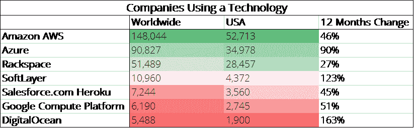

# TNS Research:我们对云市场份额的了解

> 原文：<https://thenewstack.io/tns-research-cloud-market-share/>

每到财报季，我们都会意识到人们对大型云供应商的竞争地位知之甚少。供应商本身以及各种第三方提供了大量的统计数据和数据点，但是有多少是真正可信的呢？

人们普遍认为亚马逊网络服务(AWS)是领导者，但领先多少呢？根据我们的研究，微软和 Rackspace 在付费用户方面分别排名第二和第三。其他人都远远落在后面。

微软没有在 Azure 和 [Office 365](https://www.microsoftstore.com/store/msusa/en_US/cat/Office-365/categoryID.68021500) 之间划分其云收入，Alphabet(谷歌的母公司)也没有区分谷歌云平台和其他云应用(现在统称为 [G Suite](https://gsuite.google.com) )。在这种情况发生之前，大多数关于云市场份额的新闻都是猜测或云清洗。

我们经常依靠调查来确定竞争定位，但在考察云提供商时，这些调查通常是有缺陷的，因为 1)样本有偏差，2)云类型(基础架构即服务、软件即服务、平台即服务)的定义很少清晰和/或明确，以及 3)关于使用广度和深度的细节有限。在过去的几周里，我们采访了敏锐的市场预测者，比如 Gartner 的 [Ed Anderson](https://www.linkedin.com/in/ed-anderson-a645581) 和 451 Research 的 [Greg Zwakman](https://www.linkedin.com/in/greg-zwakman-7a446) 。他们正在创造更可靠的自下而上的模型，但这项研究是与愿意为此付出高昂代价的投资者私下分享的。

因此，公开报道、调查和市场预测都有它们的问题。另一种方法是使用[机器学习](/category/machine-learning/)和网页抓取技术。例如， [HG Data](https://www.hgdata.com) 已经积累了关于世界各地公司已安装技术的庞大数据集。它从在线来源收集信息，如案例研究、博客帖子和新闻稿，但 HG Data 的独特之处在于，它还梳理了离线文件，如合同、大额采购保险和其他交易，这些通常发生在企业进行大额采购时。接下来，使用机器学习技术来管理非结构化数据。最后，这些信息是由真实的、活生生的人编辑的。我们使用 HG Data 的免费 [Discovery](https://discovery.hgdata.com/) 工具来确定有多少公司正在使用领先的 IaaS 云提供商。由于数据的性质，许多技术没有被编入索引。也就是说，我们确定了七种领先的云产品。

和所有数据研究一样，有很多理由持怀疑态度。读者应该记住，该方法并不关注企业的云支出程度，它是向后看的，而不是向前看的。此外，尽管我们使用术语“云”，但我们指的是基础设施服务提供商。此外，控制数据收集和处理的算法仍在不断成熟，并不是为这种特殊情况而创建的。

AWS 的客户最多。微软的 Azure 和 Rackspace 显示出惊人的实力。资料来源:汞数据。

虽然 AWS 以 148，044 名客户领先，但微软的 Azure 以 90，827 家公司的使用量位居第二。这与摩根士丹利首席信息官调查的结果相吻合，因为他们都在关注云使用的广度，而不是深度。换句话说，HG Data 和摩根士丹利不区分每月 10 美元的虚拟主机交易和数百万美元的合同。

乍一看，使用 Rackspace 的 51，489 家公司令人印象深刻。有趣的是，我们最近看到的许多调查研究都认为 Rackspace 做得更差，可能是因为它的托管服务并不总是被认为是“云”这一点，加上它有助于管理其他公司的云产品，使 Rackspace 独一无二。回顾今年夏天私募股权公司[将 Rackspace 私有化的交易](https://techcrunch.com/2016/08/26/rackspace-to-go-private-after-4-3b-acquisition-by-private-equity-firm-apollo/)，也许金融家们认为客户数量是被低估的资产。或者，Rackspace 可能只是在挤它之前的位置。由于数据是回顾性的，因此报告的大部分机架空间使用情况可能与旧的和/或即将到期的合同有关。

根据数据，IBM SoftLayer 正在迅速发展，有近 11000 家公司在使用它。几年前，该公司被 IBM 收购，但它正逐渐被[整合到公司的整体云产品组合中。由于 IBM 有其他几种云产品，通常很难确定它们有多少用于云。](http://blog.softlayer.com/2016/softlayer-ibm-bluemix-integration)

Salesforce.com 的 Heroku、谷歌云平台和 DigitalOcean 也榜上有名。就像 Rackspace 的地位一样，Heroku 的突出地位很有可能是基于几年前它拥有大量市场份额的事实。使用 DigitalOcean 的公司增长了 163 %,这要归功于它在开发者中的受欢迎程度。谷歌云平台在开发者中也很受欢迎，但传统观点认为谷歌受制于不成熟的企业销售业务。对于这些公司来说，开发人员发起的小型用例可能没有被捕获，但是对于 AWS 来说，同样的动态也是存在的。

## **方法论观点**

*   这些数据不应用于对市场规模做出假设。
*   HG Data 挖掘的文档都是向后看的。他们讲述了一个发生在过去的故事。此外，许多小额采购可能会被遗漏，无法被跟踪。这可能导致严重的测量误差。例如，数据显示几乎有十万家公司仍在使用 Windows XP，尽管该产品在几年前就已经终止了。
*   HG Data 并不是唯一一家使用人工智能来创建数据驱动的市场图景的公司。今年春天， [Aman Naimat](https://www.linkedin.com/in/amannaimat) 用类似的方法写了 *[大数据市场](http://www.oreilly.com/data/free/the-big-data-market.csp?intcmp=il-data-free-lp-lgen_20160708_new_site_big_data_market_report_excerpt_top_note_report_link)* 。收购他的初创公司 [Demandbase](https://www.demandbase.com) 的公司与 HG Data 相似，都认为他们的数据对采用基于账户营销的公司很有价值。
*   传统上，IaaS 包括计算、存储和网络服务。近年来，大多数分析师都将 SaaS 排除在云市场报告之外。虽然 PaaS 和基础设施软件即服务是重要的类别，但它们也不在此分析范围内。
*   值得注意的是，OpenStack 提供商 VMware 和 Oracle 被排除在此分析之外。写完这篇文章后，我们仔细检查了一下，发现有 3，624 家公司使用了 VMware 云计算。[甲骨文云](https://thenewstack.io/where-containers-fit-into-the-oracle-cloud/)甚至不在 HG Data 的数据库中。
*   展望未来，许多观察家认为云服务是市场的发展方向，但那是另一天的话题…

DigitalOcean 和 IBM 是新堆栈的赞助商。

通过 Pixabay 的特征图像。

<svg xmlns:xlink="http://www.w3.org/1999/xlink" viewBox="0 0 68 31" version="1.1"><title>Group</title> <desc>Created with Sketch.</desc></svg>