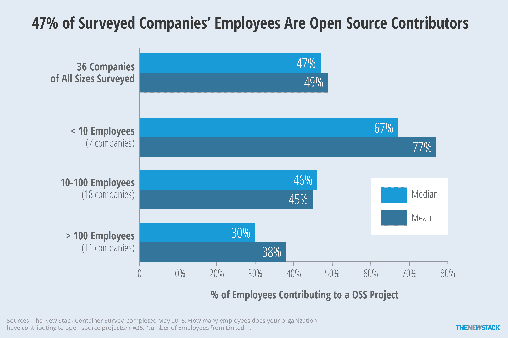
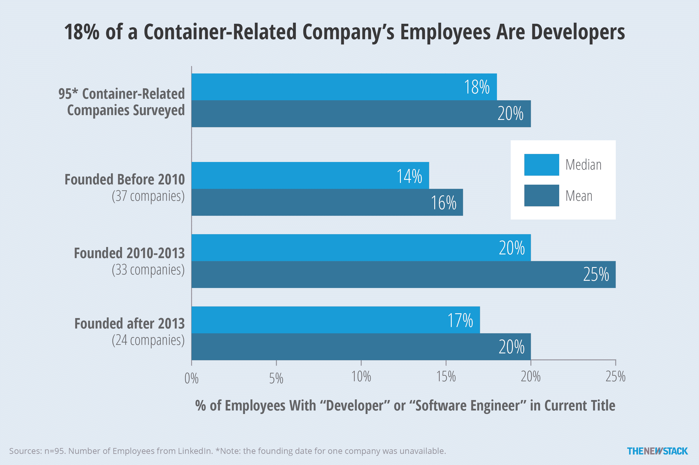

# TNS Research:有多少公司开发人员应该从事开源工作？

> 原文：<https://thenewstack.io/tns-research-dedicating-human-resources-open-source/>

您的组织中有多少员工参与开源项目？今年早些时候，新堆栈向容器生态系统中的公司提出了这个问题。

在我们收到的 36 份回复中，中位数是 10 名员工，这是一个很大的数字，但如果我们看看所涉及公司的规模，这一数字就更大了。考虑到这一点，我们发现中间公司实际上说他们 47%的员工在为开源项目做贡献。

我们发现公司越大，参与开源软件(OSS)的员工越少。此外，我们确定了一个公司的成熟度和它雇佣的开发人员数量之间的关系。总的来说，这项研究证实，集装箱公司确实是开发商和 OSS-为中心。

几乎一半的员工为开源做出了贡献，这是一个令人震惊的数字，所以我们决定进一步调查。我们发现公司规模和调查的语义会影响结果。

较小的公司倾向于让更大比例的员工为开源项目做贡献。这具有直观的意义，因为这些公司的许多创始员工都为他们的产品所基于的开源项目做出了贡献。

在我们调查的员工少于 10 人的公司中，平均有 67%的员工参与开源项目。较大的公司(超过 100 名员工)，其中许多拥有广泛的非软件产品，平均有 30%的员工为开源项目做出贡献。需要注意的是，我们并没有根据公司的员工人数来计算百分比。如果我们这样做，最大的公司的数千名员工将会使整个样本数据偏向 7%的员工。

调查数据与 LinkedIn 统计数据相结合，以了解有多少员工为开源项目做出了贡献。

对于成为开源项目的贡献者意味着什么，有不同的观点。甚至 GitHub 对贡献者的定义也因您使用的仪表板而异。在他们最狭隘的定义中，贡献者是对项目做出承诺的人。从个人反应来看，我们认为并不是每个人都使用了这个定义。事实上，我们发现两位中型企业的高管给出的回答与他们整个公司的规模完全一致。相反，这些高管可能认为既然他们的核心产品是基于开源的，那么为他们工作的每个人都支持开源。

新的 Stack 评估了这些公司的许多开源项目的贡献者的完整列表，并可以证明在开源项目中的非常高的参与水平。因此，尽管我们怀疑每个回答的准确性，但我们相信调查准确地描述了 OSS 对这些公司的重要性。

如果你的公司说它致力于开源，有多少员工应该为开源项目做贡献？那些项目应该和你的商业活动直接相关吗？你如何回答这些问题可能会影响你的公司对“开源”的友好程度。

## **关注开发者，而不仅仅是 OSS 开发者**

这类问题让我们思考公司应该如何分配他们的开发人员“人力资源”所以，我们调查了不同公司雇佣的开发人员和软件工程师的数量。利用这些数据，我们希望帮助公司确定有多少员工应该是开发人员，并告知他们应该将多少时间用于开源项目。

我们关注了关于 [Docker 和集装箱生态系统](https://thenewstack.io/ebookseries/)的系列电子书的第一本中涉及的 95 家与集装箱相关的公司。关于员工数量的数据是使用 LinkedIn 收集的，方法是通过复选框选择“当前公司”，然后根据员工当前的雇主搜索员工。标题字段中的特定搜索标准是“‘软件工程师’或开发人员。”首先计算每个公司的中间值和平均值。被调查公司的完整名单，以及与调查无关的数据，可以在[这里](https://docs.google.com/spreadsheets/d/1jGPNhcNKnO45UdUDCe9u6VrV1G58lgBCln2qdEIWU9I/edit?usp=sharing)找到。

由 95 家公司组成的更广泛的群体往往比那些完成调查的公司规模更大，平均有 41 名员工。然而，即使雇佣的开发人员数量发生了变化，开发人员的比例仍然相对稳定。

因此，我们深入研究了这些公司，通过观察公司成熟度发现了更多趋势。发现越年轻的公司员工越少并不奇怪。重要的是要认识到，在许多初创公司中，首席执行官或创始人也是开发人员，但不会在 LinkedIn 上表明自己是开发人员。如果我们将他们视为开发人员，许多公司可能会有一半的员工参与编码。

在 2010 年至 2013 年间成立的中年公司中，拥有“软件工程师”或“开发人员”头衔的员工比例最高。这些公司中的许多都专注于发展他们的开发团队，寻找员工中 30%以上是开发人员的公司。这一组中有新的堆栈赞助商 Codenvy 和 SignalFx。老公司的开发人员总体较少，但这部分是由于 IBM(418，168 人中的 8%)和 HPE(219，111 人中的 5%)降低了数字。

尽管员工和开发人员的数量都随着时间的推移而增加，但百分比却保持稳定。

使用 LinkedIn 来确定开发人员的数量可能会有问题，因为它首先依赖于用户自认为是公司的实际员工，然后是头衔中带有“开发人员”的人。话虽如此，但随着公司的成长，它们自然会增加员工数量。

在经历了几年的发展后，我们所考察的许多公司都处于成长阶段，这意味着他们正专注于雇佣开发者，或许还在风险投资的资助下建立自己的知识产权。我们考察的老公司本质上并不仅仅专注于容器，但它们仍然是拥有大量资源致力于软件开发的科技公司。

Codenvy、HPE、IBM、SignalFx 都是这个新堆栈的赞助商。

专题图片:IBM 的前身制表机公司 1917 年组织结构图，via [Flickr](https://www.flickr.com) 。

<svg xmlns:xlink="http://www.w3.org/1999/xlink" viewBox="0 0 68 31" version="1.1"><title>Group</title> <desc>Created with Sketch.</desc></svg>