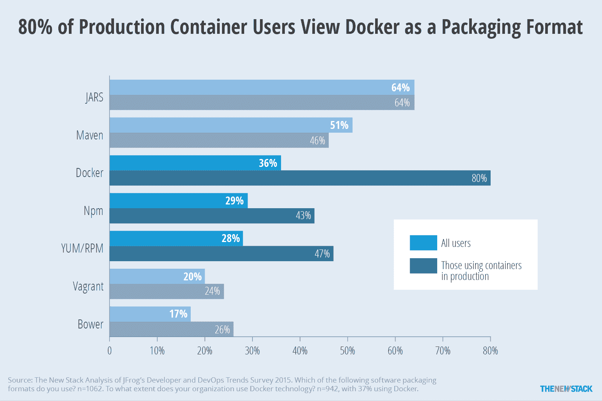

# TNS 研究:定义集装箱注册

> 原文：<https://thenewstack.io/tns-research-defining-container-registries/>

新的堆栈已经写了关于容器注册的文章，并将再次这样做。当供应商向我们推销他们的故事时，我们一直在问自己，这是一个独特的类别，还是只是更大产品中的一个功能？

在回顾 [Codenvy 的](https://codenvy.com/)更新的[集装箱生态系统图](https://thenewstack.io/codenvys-devops-container-ecosystem-market-map-refined/)时，这个问题成为焦点，其中包括一个叫做“工件和图像注册”的部分这可能是一个非常大的空间，取决于它是如何定义的。例如，Codenvy 在这个类别中包括 Twistlock，尽管它的主要功能是扫描图像注册表而不是存储它。此外，虽然库管理器 Artifactory 包含在 Codenvy 的类别中，但 [Sonatype](http://www.sonatype.com/) 却没有，尽管它也可以集成到连续交付管道中。

狭义地说，Docker [说](https://docs.docker.com/v1.7/registry/introduction/)它的 Registry 2.0“是一个存储和内容交付系统，拥有命名的 Docker 图像，有不同的标记版本。”稍微分析一下这个定义，图像注册中心既是容器图像的主机又是服务器。虽然并不完美，但让我们将它作为容器注册中心的工作定义。

映像可以由云提供商托管，也可以位于私有数据中心内。无论哪种方式，存储图像的成本都可能很高。 [Docker 的可信注册中心](https://docs.docker.com/docker-trusted-registry/overview/)可以在两种环境下使用，而 [CoreOS](https://coreos.com/) 的 Quay.io 是云托管版本，其[企业注册中心](https://coreos.com/blog/standalone-enterprise-registry/)可以用于基础设施。下表提供了其他几个例子。

image registry 的核心组件是实际的注册服务器。在选择要使用的映像注册表时，维护注册表服务器的相关成本是另一个需要考虑的因素。虽然开源 Docker Registry 在技术上是免费的，但它通常与其他服务捆绑在一起(例如 Docker 发行版)或得到增强(例如 VMware 的 [Harbor](https://github.com/vmware/harbor) 和 SUSE 的 [Portus](http://port.us.org/) )。术语“容器注册中心”的一个问题是，将它包含到处理更大范围服务的产品中相对容易。例如，虽然 [GitLab](https://thenewstack.io/container-registry-comes-online-gitlab/) 现在在其产品中包括 Docker Registry，但我们不会将其包括在这一类别中，而是将其归类为源代码管理器，就像其同行 GitHub 和 Atlassian 的 BitBucket 一样。类似地，容器即服务(CaaS)提供商 [Alauda](http://www.alauda.io/) 将图像服务与客户的持续部署管道相集成。AWS 和谷歌都将品牌注册捆绑到他们的 CaaS 产品中。

安全的托管环境可防止第三方威胁图像完整性。和安全的某些方面。控制哪些类型的人和服务可以访问图像是安全图像注册的另一个方面。访问控制将 Docker Hub 这样的公共注册中心与 FlawCheck 提供的私有注册中心区分开来。许多私人登记处的另一个特点是他们扫描图像并验证其完整性。FlawCheck 和许多其他服务都是这样做的。

尽管本文认为漏洞扫描是一项独立的服务，但我们不能忽略以下内容:图像注册。难道不应该从 CoreOS 的 [BanyanOps](http://banyanops.com) 、 [Docker 安全扫描](https://thenewstack.io/docker-launches-vulnerability-scanner-containers/)、 [Clair](https://thenewstack.io/coreos-adds-remediation-hooks-clair-container-security-scanner/) 、Bluemix 上的 [IBM](https://www.ibm.com/cloud) 的容器内的漏洞顾问能力、 [Twistlock Trust](https://www.twistlock.com/trust/) 以及 Aqua Security 的 [Peekr](https://www.aquasec.com/products/aqua-peekr/) 。

如前所述，容器注册中心正被打包成更大的部署管道的一部分。在这些情况下，它们被定位为仅仅是另一个工件存储库。因此，Artifactory 被包含在[中间层](https://d2iq.com/)的速度中，而 [Nexus](http://www.sonatype.org/nexus/2016/03/28/jenkins-and-nexus-for-micro-service-deployments/) 被推为 Docker Hub 的替代方案。从下面的图表中可以看出，80%的 Docker 用户认为这是一种打包格式。如果是这种情况，也许图像注册表只是另一种类型的包管理器。参见这篇 CloudMunch [文章](http://www.cloudmunch.com/devops-debates-image-driven-or-build-driven-delivery/)，了解更多关于 DevOps 是否应该将其过程视为映像驱动或构建驱动的讨论。

Docker 用户在回答 Artifactory 调查时，压倒性地认为这是一种包装形式。

尽管容器注册中心本身并不是容器的存储或安全性，但是期待在我们的电子书系列[的第四部分](https://thenewstack.io/ebookseries/)中读到它们如何融入更大的画面。

[Codenvy](https://codenvy.com/) 、 [CoreOS](https://coreos.com/) 、 [Docker](https://www.mirantis.com/software/docker/kubernetes/) 、 [IBM](https://www.ibm.com/cloud) 和 [Mesosphere](https://d2iq.com/) 是新堆栈的赞助商。

专题图片:[福里斯特县合作社](http://nos.twnsnd.co/post/146112300977/wiggins-branch-of-forrest-county-cooperative)威金斯分社，通过新老股票。

<svg xmlns:xlink="http://www.w3.org/1999/xlink" viewBox="0 0 68 31" version="1.1"><title>Group</title> <desc>Created with Sketch.</desc></svg>