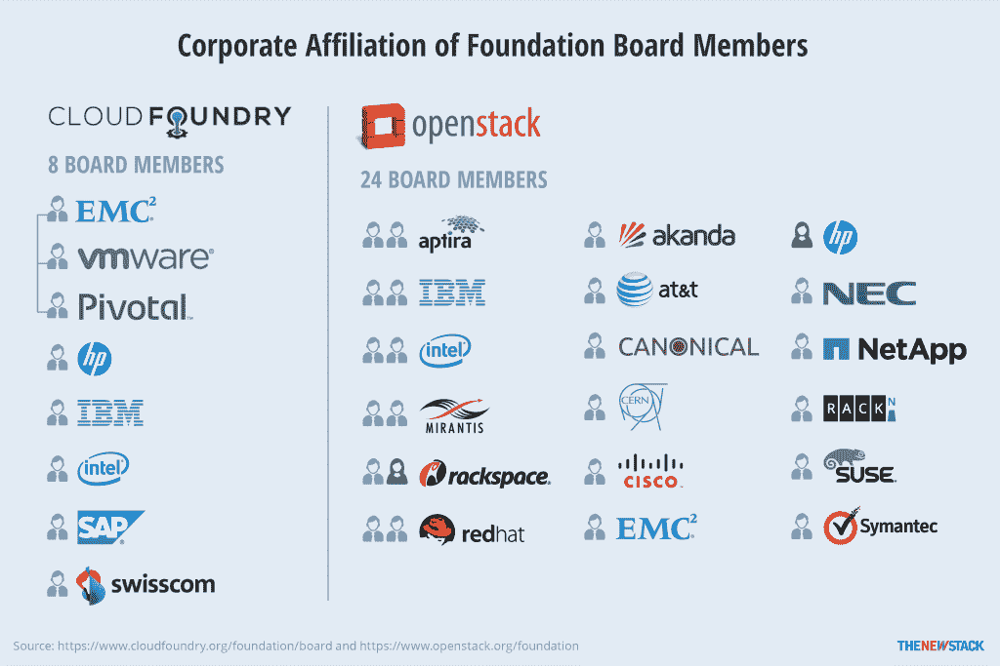

# TNS 研究:开发分析开源社区的方法

> 原文：<https://thenewstack.io/tns-research-developing-methodology-analyzing-open-source-communities/>

新的 Stack 正在开发一种分析开源社区的方法。为了开始这项工作，我们决定看看几个开源项目的组成。在最初的分析中，我们了解了一些参与 OpenStack、Docker、Kubernetes 和其他新堆栈技术开发的公司和人员。一些最初的研究可以在我们最近关于容器生态系统的电子书中找到[，在我们编目的 71 个开源项目中，有 50 个有可识别的企业赞助商。](https://thenewstack.io/ebookseries/)

当我们观察这些项目的贡献者时，我们发现在许多情况下，开发是由一个团队领导的。下表显示，许多与容器相关的更受欢迎的项目都由少数几家公司主导。

## 员工贡献的百分比:选择容器生态系统中的项目

Cloud Foundry 的数字需要更多的解释。尽管我们的初步分析发现 Pivotal 贡献了 58%的 Cloud Foundry 代码，但我们还发现另外 10%来自 VMware，它与 Pivotal 共享同一母公司 EMC。另外 10%的贡献来自“机器人”，即自动提交代码的持续集成软件管道，这些代码可能来自 Pivotal 或第三方，如 IBM。因此，Pivotal/VMware 可能贡献了多达 77%的云计算代码。

值得注意的是，并非所有项目都由一家公司主导。与上面列出的项目相比，Linux 和 OpenStack 是更加异构的社区:

## 来自员工的贡献百分比:具有更多样化贡献者基础的项目

以更直观的方式比较 OpenStack 和 Cloud Foundry 的贡献，结果如下:

【T2

如果不说别的，上面的数字表明开源软件开发，至少对企业来说，可能不总是一个社区驱动的过程。这并不是什么新鲜事:开源长期以来一直得到企业的大力支持。我们计划在后续文章中调查这对我们的读者和他们使用的技术是好是坏。我们希望听到您的反馈。

## 方法学

为了创建上面的第一个表，使用名为 [Blockspring](https://www.blockspring.com/) 的工具收集关于贡献者的数据，该工具访问 [GitHub API](https://developer.github.com/v3/) 将关于贡献者的信息提取到特定的存储库中。尽管每个项目都有多个存储库，TNS 选择关注每个项目的主存储库。

由于 GitHub 不会指明投稿人的雇主，我们将此信息标识如下:TNS 使用了电子邮件或网站字段中的公司域名。然而，由于大多数投稿人提供了 Gmail 地址或根本没有电子邮件地址，我们使用了其他方法来识别他们雇主的姓名。例如，Blockspring 有一种算法，可以跨几个社交网络和数据库交叉检查一个人的电子邮件地址和用户名。 [Clearbit](https://clearbit.com/) 和[full contact](https://www.fullcontact.com/)API 也被用来收集信息。

虽然这些方法没有一个是完美的，但它们在大多数时候是准确的。对于那些仍然没有公司信息的人，每个提供的个人网站都会被检查。此外，如果提供了真实的用户名，将在 LinkedIn 上搜索该人，然后验证他们的照片和其他信息与 GitHub 个人资料中的内容相似。

请注意，由于我们是如何计算来自合并库和由机器人处理的贡献的，所以审阅的贡献数量与 GitHub 自己的仪表板上看到的不同。

第二个表是 Linux 和 OpenStack，分别包含来自 Linux 基金会和 OpenStack 基金会这两个组织自己发布的报告的数据。在这两种情况下，他们从 GitHub 和其他版本控制系统中挖掘概要文件，以及关于问题解决方案的提交和沟通的文本。

Docker、惠普企业、IBM、英特尔、Pivotal、Red Hat 和 VMware 是新堆栈的赞助商。
特征图像格劳乔·马克斯[通过](https://pixabay.com/en/groucho-marx-vaudeville-comedian-401923/) Pixabay。图表图标[通过](https://www.freepik.com/) Freepik。

<svg xmlns:xlink="http://www.w3.org/1999/xlink" viewBox="0 0 68 31" version="1.1"><title>Group</title> <desc>Created with Sketch.</desc></svg>