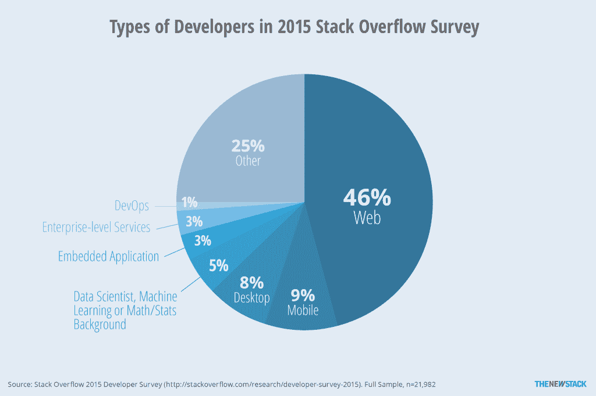
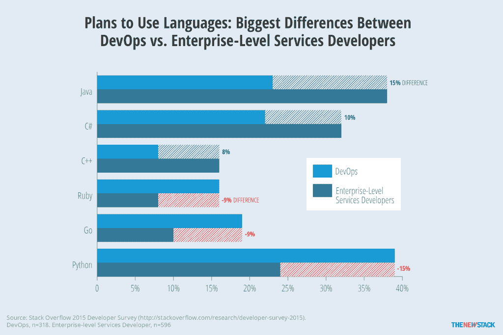
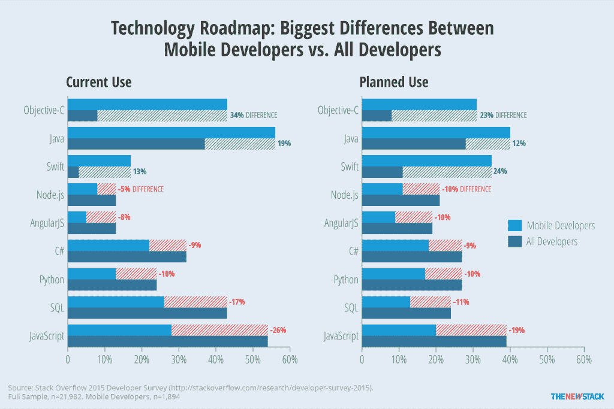
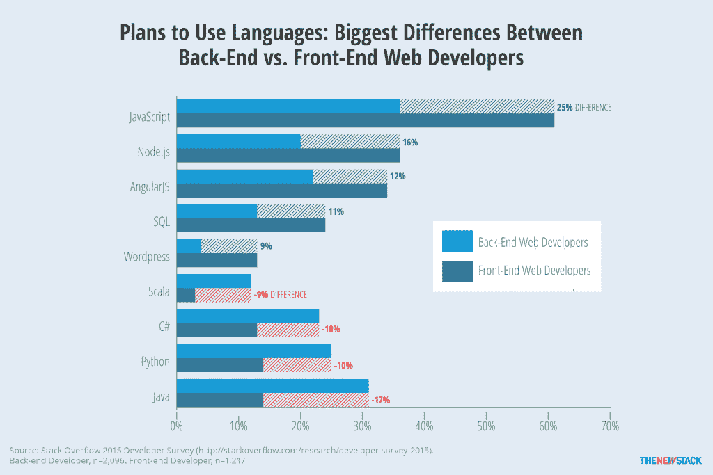
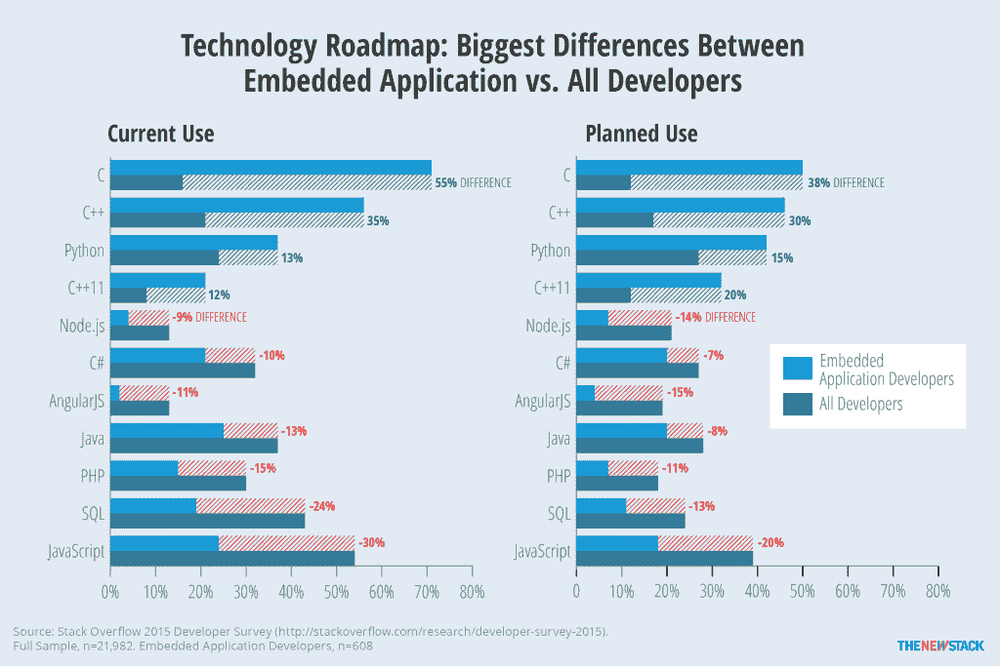

# TNS 研究:DevOps 和软件开发世界中的其他派别

> 原文：<https://thenewstack.io/tns-research-devops-factions-software-development-world/>

DevOps 现在也是人了。

长期以来，我们认为术语“DevOps”主要是关于一个过程，特别是开发人员(“dev”)和管理员(operations 或 Ops)之间工作流的融合。然而，我们发现至少有数百名 Stack Overflow 的读者在职业上自称为“DevOps”

大多数 Stack Overflow 用户是为 web 开发的，但是新的 Stack 更侧重于 DevOps 和企业级应用程序开发。

更重要的是，这些自我识别的开发人员的工具选择与企业开发人员明显不同。裂口沿着可识别的线对齐。

这不是我们在检查软件开发领域的数据时观察到的唯一奇怪的裂缝。虽然局外人可能会认为计算机编程是一个单一的工作描述，但该领域正与双重性结合在一起:移动与企业，前端与后端，嵌入式与其他所有人。每个人都有自己喜欢的工具集。

例如，与偏爱 C#、Java 和 C++的企业开发人员相比，看看他们计划在不久的将来使用的编程语言，DevOps 人员更有可能期望使用 Python、Go 和 Ruby。

DevOps 用 Python“走”，而企业级 app 还是用 Java 写的。

Python、Go 和 Ruby 是 DevOps 工具带中不足为奇的发现。Python 之所以方便，是因为 DevOps 更专注于协调多个不同应用程序的使用，而这正是 Python 所擅长的。Go 的突出来自于管理微服务的 it 实用程序。

由于构建企业级服务的开发人员更有可能专注于遗留应用程序，因此更高比例的开发人员继续使用 Java 和 C#也就不足为奇了。

## 移动设备来自金星，开发设备来自火星

专业化显然将你的注意力集中在某些技术上，而排除了其他技术。在很大程度上，所有类型的开发人员都对最热门的技术感兴趣。然而，随着它们开始被更广泛地采用，开发人员更有可能继续学习和使用符合他们专业目标的语言。

上面的数字来自于 [Stack Overflow 的 2015 年开发者调查](http://stackoverflow.com/research/developer-survey-2015)，该调查收集了超过 26000 份回复。在这里，人们可以看到不同类型的开发者在技术路线图上的巨大差异。例如，78%的网络开发者使用 JavaScript，相比之下，只有 28%的移动开发者使用 JavaScript。

事实上，对于所有关于苹果进入企业的炒作，看到移动开发者与其他开发者之间的差距有多大是令人清醒的。Java 以及苹果的 Swift 和 Objective-C 更有可能被移动开发者使用，Swift 用户的比例预计今年将增加两倍。然而，应用开发者对苹果的关注只是故事的一部分。堆栈溢出调查的受访者总体上更倾向于关注 JavaScript 和 C#。

移动开发者专注于 Swift 和 Objective-C，但对 JavaScript 不太感兴趣。

技能和计划有如此巨大的差异，难怪大多数开发人员不热衷于了解移动应用程序开发趋势。这件事的影响可能比你想象的更广泛。有了这样的利益分歧，苹果在试图获得开发者的使用时将继续面临障碍。更重要的是，如此多的创新发生在他们的生态系统之外，移动开发者有落后的风险。此外，随着开发者继续为 Android 和 iOS 编程，他们是否会开始使用更常见的语言还有待观察。如果没有，那么我们很可能会看到更多的 SDK 和方法来集成应用程序。

## 后端和前端永远不会相遇

其他的分歧可以在开发者社区中找到。例如，前端和后端开发人员之间的差异非常明显。前端开发人员专注于 JavaScript，超过三分之一的人希望在未来使用 Node.js 和 AngularJS。由于用 Scala 编写的程序可以在与 Java 相同的虚拟机上运行，所以后端开发人员规划 its 的比例增加到 12%就不足为奇了，相比之下，所有调查受访者中只有 3%。尽管全栈 Web 开发人员的数量超过了前端和后端的总和，但值得注意的是，他们的技术概况与前者更相似。

使用 Node.js 和 AngularJS 的计划将前端和后端开发者区分开来。

## 嵌入式系统开发商与世界

此外，以嵌入式系统开发人员为例，如果你想成为一名符合流行术语的“物联网”开发人员。正如 JavaScript 与 Web 开发相关联一样，C 与开发嵌入式应用程序相关联。尽管目前只有 16%的调查对象使用 C，但多达 71%的嵌入式应用程序开发人员使用 C。在其他语言提高了对硬件的强大控制能力之前，不要指望这个会有太大的改变。请注意，Arduino 没有包括在下面的图表中，因为与其他类型的开发人员相比，它的使用计划相对相似。很可能有 12%计划使用 Arduino 的开发人员希望将此作为业余爱好者，而不是他们工作的一部分。

嵌入式应用程序继续用 c 编写。

通过 Pixabay 的特征图像[。](https://pixabay.com/en/meadow-hill-channel-division-260966/)

<svg xmlns:xlink="http://www.w3.org/1999/xlink" viewBox="0 0 68 31" version="1.1"><title>Group</title> <desc>Created with Sketch.</desc></svg>