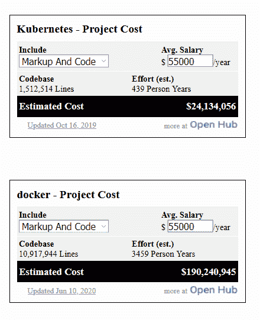
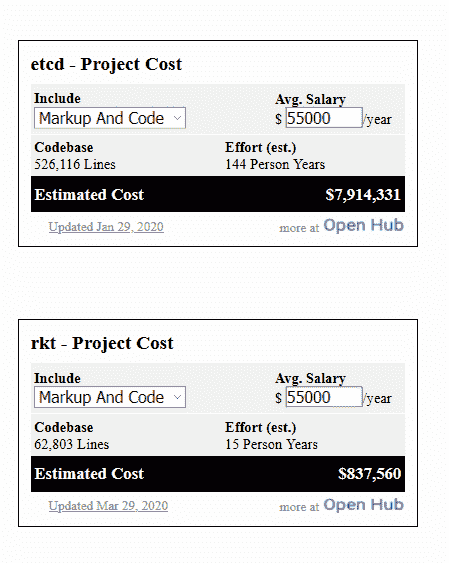

# TNS Research:建立 Kubernetes 生态系统花了多少钱？

> 原文：<https://thenewstack.io/tns-research-k8s-ecosystem-cost/>

编者按:原始文章已经更新，将 rkt 包括在计算中。此外，在 2020 年 6 月 30 日，用于计算的交互式小部件被屏幕截图取代。

库伯内特生态系统的代价是什么？几周前，CoreOS 首席执行官 T2 提出了这个问题。在[黑鸭 Open Hub](https://t.co/WFLxqV4vER) 开源目录的帮助下，我们很快就能得到一个大概的答案。

根据每个项目中的代码行，我们估计 Kubernetes 1.4 的成本约为 1.2 亿美元。虽然这只是一个粗略的猜测，但总比什么都没有好，而且这是一个可以让您将其与其他闭源开发项目进行比较的指标。

我们是怎么得到这个数字的？我们做了很多假设。首先，生态系统只由 Kubernetes、Docker、etcd 和 rkt 项目组成。第二，与项目相关的唯一成本是开发人员的工资。然后，Black Duck 的计算器使用了 [COCOMO](https://en.wikipedia.org/wiki/COCOMO) 软件成本模型，该模型依赖于两个基本输入:1)代码行和 2)开发人员工资。据 Black Duck 称，“COCOMO 是为大型机构项目建模而创建的，这些项目通常无法与分布式开源项目相提并论。除了开发时间之外，COCOMO 还意味着包括设计、规范起草、评审和生产高质量软件的管理开销。”

根据 Open Hub 上的统计，这些项目中有 2，609，454 行代码。以平均年薪 55，000 美元计算，总计超过 4，000 万美元。我们知道许多 Docker 贡献者在他们的空闲时间这样做，但是有多少很难确定。也就是说，我们也知道谷歌员工的平均收入要高得多，所以我们研究了如果普通开发人员的年薪分别为 165，000 美元和 330，000 美元，那么总开发成本会是多少。中间的猜测是每个开发人员每小时 89 美元。

所有这些数字看起来仍然非常低，对于熟悉企业 IT 世界的人来说几乎是小钱。不要被骗了。这些数字并没有考虑到所有的营销、管理、风险、利润率等等，这些都包含在项目的最终价格中。这还没有考虑到安装、定制和操作每个部署需要多少人力。这是真正的钱，如果不是利润。

CoreOS 和 Docker 是新堆栈的赞助商。

通过 Pixabay 的特征图像。

<svg xmlns:xlink="http://www.w3.org/1999/xlink" viewBox="0 0 68 31" version="1.1"><title>Group</title> <desc>Created with Sketch.</desc></svg>