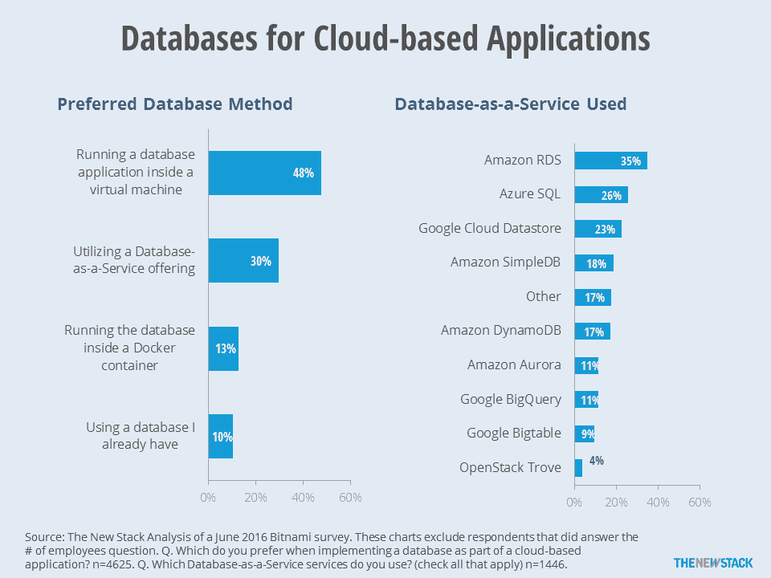
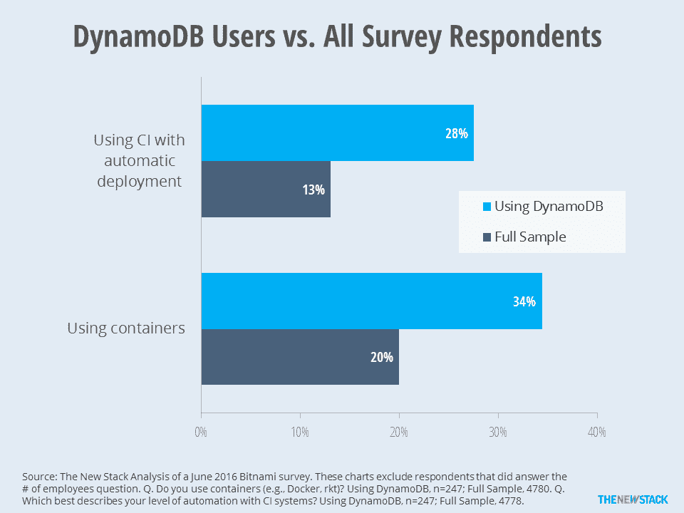
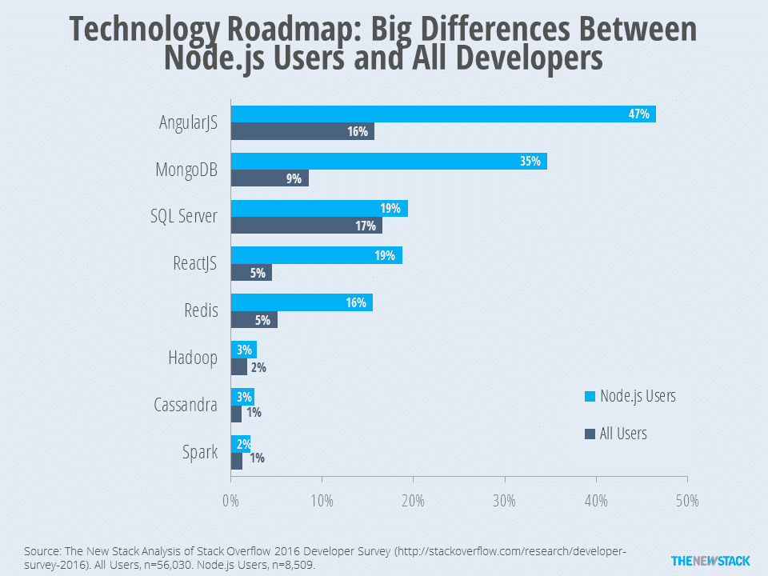
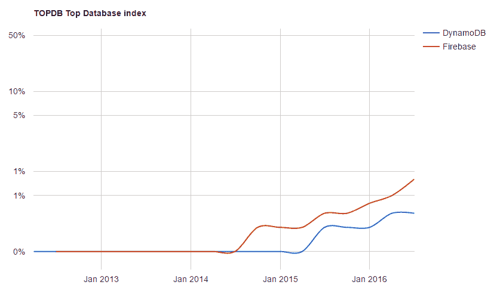
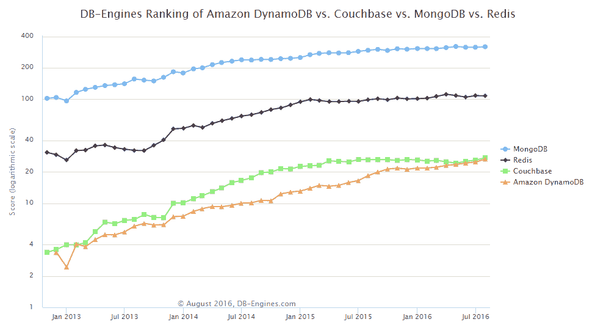

# TNS 研究:无服务器和分布式数据库服务现在是最好的

> 原文：<https://thenewstack.io/tns-research-linking-serverless-distributed-database-trends/>

当前向“[无服务器](/category/serverless/)技术的发展将推动分布式数据库的发展。特别是，像[亚马逊 DynamoDB](https://aws.amazon.com/dynamodb/) 这样的数据库即服务正被[微服务](/category/microservices/)的开发者所利用。此外， [MongoDB](https://www.mongodb.com/) 产品也将从中受益，因为 [Node.js](/tag/node.js/) 得到了许多无服务器提供商的支持。

对于业内人士来说，无服务器是后端即服务(BaaS)和功能即服务(FaaS)的结合。尽管 AWS Lambda 走得更远，但它的许多竞争对手正在提升他们的 FaaS 能力。在生产中使用 FaaS 的例子很多，但大多数无服务器活动仍处于构思和测试阶段。BaaS 市场更为古老，在发展过程中也遇到了一些困难。这并不意味着无服务器趋势是假的。相反，无服务器是几个相关趋势的顶点。

> 新的堆栈正在审查跟踪实际采用数字的最佳方式。请[发邮件给我们](mailto:research@thenewstack.io)提出建议。

正如[数据](https://thenewstack.io/beyond-greenfield-rearchitecting-containers)和[分析](/tag/ebook2-applications-and-microservices/)、 [DevOps](/category/devops/) 工具和容器基础设施几乎是大规模部署微服务的先决条件。正如 [Ben Keh](https://twitter.com/ben11kehoe) [oe](https://twitter.com/ben11kehoe) 最近[写的](https://serverless.zone/a-wishlist-for-serverless-deployment-tooling-b4581395bf7e#.g0xho0258)，“几乎根据定义，无服务器架构就是微服务架构。”

另外两个趋势也是相关的。在一篇关于无服务器 API 前景的深度评论中，TNS 的定期撰稿人 Mark Boyd 写道 API 工具(用于网关和生成)如何将 FaaS 能力与 BaaS 提供商联系起来。提供的后端服务类型包括识别/认证和数据流，两者都连接到数据库，而数据库现在通常作为服务提供。

Bitnami 的调查提供了对数据库即服务需求的一些见解。虽然近一半的受访者仍然喜欢在虚拟机中运行数据库，但 30%的受访者表示他们更愿意利用 DBaaS 产品。根据 Tesora 发起的一项调查，47%的受访者选择 DBaaS 的最重要标准是与现有生产应用程序集成的能力。

因此，最终用户最有可能使用主要云提供商的传统数据库“即服务”也就不足为奇了。亚马逊 DynamoDB 的使用率为 17 %,比其他“更专业”的数据库更常用，但谷歌的 [BigQuery](https://cloud.google.com/bigquery/) 经常被引用。该调查没有询问其他几个相关的数据库产品，但如果有，我们相信 MongoDB 和 Redis 的版本会做得很好。

三大云提供商的基本 DBaaS 产品显示在顶部。

DynamoDB 用户展示了显著的微服务成熟度。他们使用持续集成和部署的可能性是以前的两倍多。此外，34%的 DynamoDB 用户正在使用容器，相比之下，整个 Bitnami 调查中只有 20%的用户在使用容器。结合 AWS Lambda 的重要开端，DynamoDB 在讨论无服务器架构时获得如此多的关注就不足为奇了。

Dynamo DB 用户在部署微服务基础方面走得更远。

Node.js 是 FaaS 提供者支持的框架。因此，有理由相信 Node.js 社区最常用的数据库也更有可能用于无服务器部署。我们用的是 [Stackoverflow 的 2016 年开发者调查](http://stackoverflow.com/research/developer-survey-2016)；我们发现 Node.js 用户使用 MongoDB 的可能性几乎是普通开发人员的四倍。再次按照这个逻辑，我们假设使用 Node.js 部署无服务器应用程序的人很可能使用 MongoDB 作为他们的后端。

由于处于中等水平，Node.js 用户更有可能使用 MongoDB 也就不足为奇了。

## **用于无服务器普及的数据库**

最新的 [TOPDB](https://pypl.github.io/DB.html) 排名显示，Firebase 和亚马逊的 DynamoDB 是受欢迎程度增长最快的数据库。我们认为这是因为它们通常用作无服务器部署的 BaaS(后端即服务)。

被 Google 收购的 [Firebase](https://thenewstack.io/google-firebase-trims-middle-tier-faster-app-dev/) 是一个移动开发平台，但是它的数据库功能是很多人所知道的。值得注意的是，与 Oracle、MySQL 和 SQL Server 相比，基于谷歌搜索趋势的“受欢迎程度”仍然微不足道。也就是说，实际使用水平在某些最终用户中变得更加明显。虽然 [DB-Engines](http://db-engines.com/en/ranking_trend/system/Amazon+DynamoDB%3BCouchbase%3BMongoDB%3BRedis) 没有跟踪 Firebase，但我们发现，Redis、MongoDB 和 Couchbase 等分布式数据库并没有出现如此快速的流行。

自从被加入 TOPBD 指数以来，Firebase 和 DynamoDB 的受欢迎程度相对提高了很多。

亚马逊 DynamoDB 的排名仍然低于 MongoDB 和 Redis，但在 DB-Engines 的受欢迎程度得分上已经超过了 Couchbase。

通过 Pixabay 的特征图像。

<svg xmlns:xlink="http://www.w3.org/1999/xlink" viewBox="0 0 68 31" version="1.1"><title>Group</title> <desc>Created with Sketch.</desc></svg>