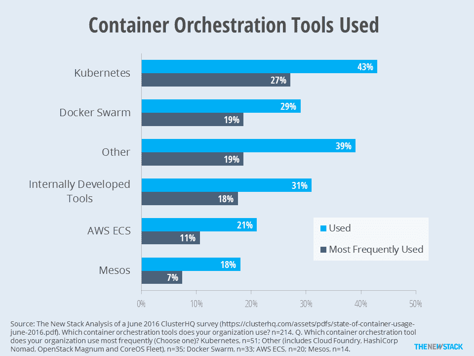
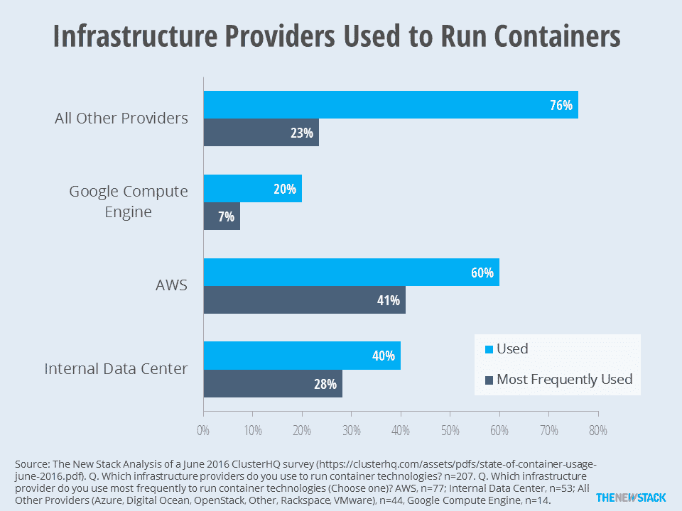
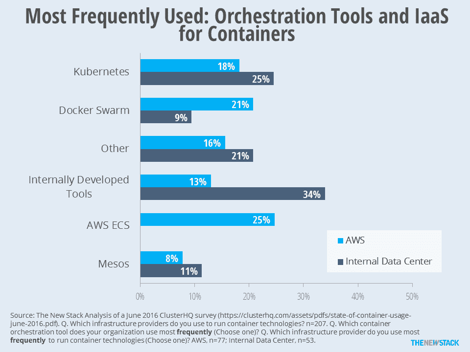

# TNS Research:多个指挥者，多个云，真是一团糟

> 原文：<https://thenewstack.io/tns-research-multiple-clouds-multiple-orchestrators-what-a-mess-part-2/>

大多数容器用户的堆栈中都有 Docker 引擎，即使它只是开源引擎。既然 Docker Engine 1.12 [自带了内置的编排功能](https://thenewstack.io/docker-engine-1-12-will-come-built-orchestration-capabilities/)，我们预计未来的调查将会发现使用这些功能的人会大幅增加。

虽然这在许多方面给了[码头工人](https://www.mirantis.com/software/docker/kubernetes/)一个优势，但不要误解这些“预期”的发现意味着该公司突然垄断了“编排市场”正如在一些调查中看到的，包括我们的[自己的](https://thenewstack.io/tns-research-present-state-container-orchestration/)，多种编排工具正在同时使用，许多人计划继续这种做法。在这种环境下，通过评估哪些提供商最受欢迎，以及谁最受欢迎，可以获得洞察力。

> Kubernetes 是使用最多的编排工具，拥有 43%的容器用户。27%的容器用户表示 Kubernetes 是他们最常使用的容器编制器。

2016 年 6 月发布的 [ClusterHQ 调查](https://clusterhq.com/assets/pdfs/state-of-container-usage-june-2016.pdf)巧妙地向容器用户询问了他们的工具和基础设施，然后他们问什么是最常用的。与许多调查中的“检查所有适用的”问题相比，这些问题显示出实质性的差异。

关于容器编排器，Kubernetes 仍然是最常用的。Docker Swarm 排名第二，但三分之二的用户表示它是使用最频繁的 orchestrator，比 Kubernetes 略胜一筹。AWS ECS 表现不佳，52%的受访者称他们最常使用它。很可能任何使用 AWS ECS 的人都知道它具有编排功能，但当情况危急时，他们并不倾向于使用这种功能。

似乎 Mesos 属于这一类，因为只有 39%的使用 Mesos 的人说这是他们的主要编排工具。“其他”类别中的许多产品都不是正在使用的主要工具。

三分之二的 Swarm 用户表示，这是使用最频繁的 orchestrator。只有 39%的 Mesos 用户说同样的话。

虽然上面的图表很吸引人，但现在挑选一个赢家是一件徒劳的事情。这是一个开放的问题，如果两年后，甚至会有一个容器编排市场。编排功能可以分解成不同的部分(例如，集群管理、调度、服务发现)，但是随着容器进入生产环境，许多用户更喜欢捆绑解决方案。

将一些功能捆绑到容器本身是一种方法。然而，编排也可能被归入 PaaS 产品或作为云提供商提供的功能包含在内。Wikibon 的[Brian gracey](https://twitter.com/bgracely)在最近的[文章](http://wikibon.com/architectural-considerations-for-open-source-paas-and-container-platforms/)中将这个选项描述为*容器管理平台*。这个术语很有用，因为它涵盖了作为一个堆栈一起部署的更广泛的服务堆栈。除了工作负载和公司规模，容器管理平台的选择也仍然受到部署到的云的影响。

无论它们被称为容器管理平台、orchestrators 还是 thingamajigs，都有许多可用的选项。Cloud Foundry、OpenStack、Kubernetes 和 Docker 都提供了管理容器的技术。AWS ECS、微软 Azure、谷歌云计算、IBM Bluemix、Joyent Triton 和 Mesosphere 的 DC/OS 只是可以使用的一些公共云产品。

随着许多这些云技术被同时使用，我们想知道容器在多大程度上被这些解决方案使用和管理？如果大多数企业拥有多个云(参见 [2016 年云状况调查](http://www.rightscale.com/blog/cloud-industry-insights/cloud-computing-trends-2016-state-cloud-survey))，我们会使用第三方云协调/代理工具，还是依赖我们首选的云提供商的管理工具？

将应用程序从一个云迁移到另一个云的能力正在成为一种需求。展望未来，基于性价比的考虑，越来越多的应用将被分解为分布在不同云上的微服务。据 Accel Partners 的 Adrian Coyler 称，大多数公司的目标是能够部署在 AWS(另一种公共 IaaS)及其私有数据中心上的部署。因此，供应商正在开发能够与多种云互操作的编排工具。

当然，多个云正在使用并不意味着一个云不占优势。下图显示，虽然四分之三的受访者表示他们在 AWS、谷歌或内部数据中心之外的其他设备上运行容器。然而，到了紧要关头，AWS 和内部数据中心是部署容器最频繁的地方。

尽管 20%的调查受访者在谷歌计算引擎上运行容器，但只有 7%的人说它比不同的云使用得更频繁。

每个说 Kubernetes 是他们使用最多的工具的人也说 Google Compute Engine 是他们使用最多的基础设施。AWS 在其 ECS 产品中也有自己的管理平台，但其客户并没有采用它。在最频繁地将容器部署到 AWS 的公司中，25%的公司表示他们使用公司的 CaaS 作为主要的编排工具。

Docker Swarm 在 AWS 用户中表现特别好，可能是由于部署的规模。随着越来越多的 AWS 容器部署不再基于虚拟机，我们预计会看到 ECS 的持续增长，甚至可能损害 Kubernetes 和 Docker。放眼公共云之外，内部开发的工具击败了 Kubernetes，成为首选的容器管理工具。虽然 Kubernetes 希望在这一领域占据主导地位，但调查问卷中没有包括的 Docker Datacenter 只是众多将参与竞争的本地产品之一。

内部开发的工具比 Kubernetes 更有可能在内部数据中心使用。

使用多个云时，大多数容器工作负载将在哪里运行？哪些提供商将主要用于云爆发或与另一个 IaaS 的协商？新的堆栈将让其他人来确定跨多个云分发容器化应用程序的性能指标和基准。虽然 [Cloud Foundry 调查](https://www.cloudfoundry.org/learn/2016-container-report/)发现了对来自云和/或云提供商的捆绑容器解决方案的偏好，但我们想知道这种偏好有多强烈。未来，我们计划研究定价和许可如何影响部署到特定云或使用特定流程编排工具的决策。

[Cloud Foundry](https://www.cloudfoundry.org/) 、 [Docker](https://www.mirantis.com/software/docker/kubernetes/) 、 [Joyent](https://www.joyent.com/) 和 [Mesosphere](https://d2iq.com/) 是新栈的赞助商。

通过 Pixabay 的特征图像。

<svg xmlns:xlink="http://www.w3.org/1999/xlink" viewBox="0 0 68 31" version="1.1"><title>Group</title> <desc>Created with Sketch.</desc></svg>