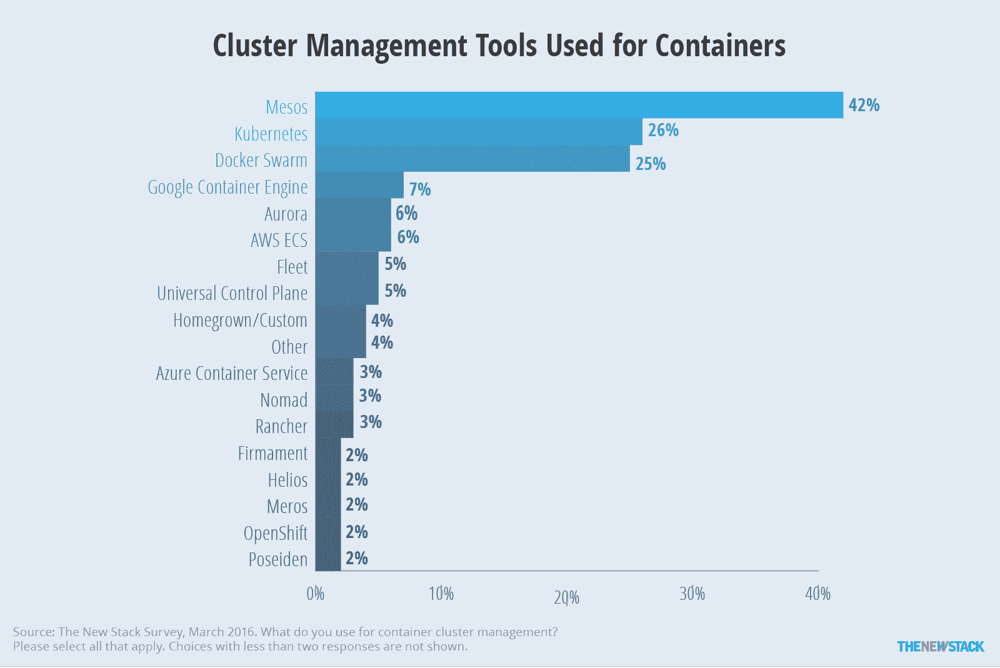

# TNS 研究:容器编排的现状

> 原文：<https://thenewstack.io/tns-research-present-state-container-orchestration/>

在观看了一年的会议演示之后，人们很容易对围绕编排容器的产品的大肆宣传习以为常。然而，在更广泛的技术社区中，对于编排容器涉及哪些功能仍然存在困惑。New Stack 进行了一项针对容器管理技术用户的调查，70%的受访者在某种程度上使用容器。我们发现，对于管理和编排容器意味着什么，确实存在不确定性。还有一个正在形成的共识，即调度、集群管理和服务发现对于协调容器在生产中的使用是必要的。

超过 40%使用或试用容器的受访者表示，编排平台是他们组织中管理容器的主要方式。然而，正在使用或计划使用的实际产品受到受访者容器采用阶段的强烈影响。在非生产环境中使用容器的人更有可能引用 Ansible 和 Chef 这样的配置管理工具作为编排方法。在评估容器的路线图中，平台即服务(PaaS)解决方案，如 Red Hat [OpenShift](https://www.openshift.com/) 和 Hashicorp 产品被更多地引用。

在用户的计划中有各种各样的公司和服务。什么工具会胜出还有待观察。目前看来，许多特定于容器编排的工具，如[、Kubernetes](/category/kubernetes/) 、Mesos 和 Docker Swarm，以及容器即服务产品，正在确保它们在捆绑产品中提供广泛的开源工具。供应商应该认识到，大多数用户并不寻求一个解决方案来解决他们的所有需求——只有 29%的人认为容器编排工具能够处理非容器化的遗留应用程序是很重要的。相反，他们最关心的是为开发人员和 it 运营(ops)集成工具。

## 样本和方法

### 数据是如何收集的

该调查于 2016 年 2 月 21 日至 3 月 14 日通过网络进行。与所有基于网络的匿名调查一样，结果可能会受到自我选择偏差的影响。所有的回答都经过了完整性的人工审查，有几个被丢弃了。本章中的数据基于 309 名受访者，其中 75%完成了整个调查。

[cyclone slider id = " ebook-3-赞助商"]

新书库的读者被要求参与调查。这项研究还通过社交媒体进行了推广。此外，我们收到了 54 份因在 [DevOps Weekly](http://www.devopsweekly.com/) 上发布而得到的回复，以及另外 42 份因 Mesosphere 营销部门的一名高管发送的电子邮件而得到的回复。在相关的情况下，分析会指出这会如何影响调查结果。

### 研究参与者简介

61%的受访者是最终用户，其余为与容器、PaaS、基础设施即服务(IaaS)或软件管理相关的供应商和服务提供商工作。关于正在使用或考虑的工具或产品的问题只问最终用户，以防止供应商为他们的产品投票。此外，这些问题仅向使用和/或至少试用或评估容器的 164 名最终用户提出。

图 1:71%的被调查终端用户在某种程度上使用容器。

与[更广阔的市场](https://thenewstack.io/parity-check-no-one-really-grasped-uses-docker-containers/)相比，该调查更可能与早期采用者交谈，因为 59%的人说他们在生产中使用容器，另外 11%的人以更有限的方式使用容器，例如在开发生命周期的测试部分。有点令人惊讶的是，只有 64%的供应商说他们在生产中使用容器。

几乎一半的最终用户将自己描述为 DevOps，经过调查，我们发现这并不是因为 DevOps 周刊订阅者的回复。虽然 DevOps 的增长是真实的，但该角色很可能在本研究中得到充分体现，因为容器编排是一个需要应用程序开发和 IT 运营之间协调的领域。

图 2: DevOps 专业人员得到了很好的代表。

## 定义容器编排功能

当我们开始写关于容器自动化和编排的[电子书](https://thenewstack.io/ebookseries/)时，关于容器编排的确切定义还没有达成一致。因此，我们没有试图创建一个自上而下的市场定义，而是决定询问社区的意见。

人们一致认为调度、集群管理和服务发现是核心要素。五分之四的人表示，调度和集群管理是与容器编排相关的产品或服务所期望的。紧随其后的是 76%的人将服务发现与容器编排相关联。监控，尤其是配置管理，是最不可能与容器编排相关联的功能。自动扩展、负载平衡和联网都是由多人在“其他”框中提供的定义。

图 3:只有 45%的受访者认为配置管理是容器编排产品的一部分。

几个变量影响了认知，工作角色对人们如何定义容器编排有着重要的影响。特别是，自我认定的应用程序开发人员不太可能将其与调度(59%)联系起来，而更可能将其与监控(64%)和配置管理(64%)联系起来。他们缺乏对监控和配置管理的参与，这可能是他们更经常提到该功能的原因。除了工作角色，我们还发现具有中间层视角的人——那些由于公司员工的促销邮件而参与调查的人——更有可能回答调度(93%)和监控(74%)。在那些以中间层为中心的回答者中，72%的人说他们使用阿帕奇马拉松来安排时间。

图 4:当应用程序开发人员考虑容器编排时，调度并不是首要考虑的因素。

## 将容器定义为服务功能

就像之前的 PaaS 一样，对于容器即服务(CaaS)的含义也存在相当大的分歧。值得注意的是，新的堆栈询问了市场上可以找到的 CaaS 功能的一些类型，但不是所有类型。我们发现容器编排是与容器即服务联系最紧密的功能。然而，由于调查的主题是容器编排，因此回答很可能偏向于容器编排。注册表是访问容器化内容的地方，也与 CaaS 密切相关。构建映像和运行时最不可能与 CaaS 相关联，但仍有超过 50%的人表示他们期望这些功能会出现在产品中。换句话说，CaaS 被大多数人视为端到端的产品。

图 5:容器编排和注册与 CaaS 联系最紧密。

工作角色也影响对 CaaS 的理解。与 DevOps 相比，负责 IT 运营的人不太可能说注册管理机构(61%对 81%)是 CaaS 包的一部分，运行时和容器编排也是如此。负责 IT 运营的人不太可能使用容器，所以他们可能不太了解为什么注册中心是容器服务的重要组成部分。可能是因为他们与容器生态系统的联系不紧密，从 DevOps 每周时事通讯中征集的参与者不太可能说容器编排和运行时是 CaaS 的一部分。

图 6: IT 运营团队对 CaaS 的看法不同于开发运维团队。

## 在供应商领域之外，混乱比比皆是

当被要求定义与容器编排或 CaaS 相关的功能时，与容器生态系统相关的公司的员工不太可能选择大多数选项。特别是，更少的供应商认为集群管理等同于容器编排，而注册、部署和云编排是 CaaS 的组成部分。

[cyclone slider id = " ebook-3-赞助商"]

与容器有关的供应商的雇员在他们的定义中更有鉴别力的一个原因是，他们可能花了更多的时间参加活动和阅读有关主题的文章。另一个原因可能是，更广泛的市场定义不适合他们如何营销自己的产品。不管为什么会出现分歧，它们都指出了一个事实，即除了业内人士之外，仍有必要定义市场。

图 7:供应商在定义容器编排和 CaaS 时非常吝啬。

## 用于管理和编排容器的产品/服务

图 8:对于 45%正在使用或试用容器的终端用户来说，专注于编排的平台是管理容器的主要方法。

正如我们在以前的几篇文章中提到的，无论你如何划分，容器的使用都在增加，随之而来的是在生产中协调它们的部署的需要。由于对容器编排的含义仍有困惑，我们确保广泛询问用于管理或编排容器的内容。调查问卷首先询问了编排或管理的主要方法，然后询问了下一年要使用的前三种产品或服务。这种方法迫使受访者在多种方法之间进行优先排序，并提供一些关于其未来路线图的细节。

这种方法的一个结果是，只有 16%的受访者主要使用 shell 脚本或定制来管理容器，这大大低于受访者能够提供多种选择的其他研究。虽然定制可以将多种工具结合在一起，但它们本身通常不是管理某些东西的主要方式。

[cyclone slider id = " ebook-3-赞助商"]

容器采用的状态也与编排容器的主要方式相关。已经开始使用容器但尚未投入生产的受访者更有可能使用配置管理工具(21%)和 shell 脚本(21%)。然而，随着用户继续他们的“容器之旅”，这两个数字分别下降到 16%和 10%，这可能是因为随着生产使用的增加，对更一致、可扩展的解决方案的需求变得明显。请注意，DevOps Weekly 的订阅者更有可能使用配置管理工具(29%)，考虑到其出版商的日常工作是与 [Puppet Labs](https://puppet.com/) 合作，这并不奇怪。

看看 PaaS 和 CaaS，PaaS 似乎更有可能(13 %)成为进行评估的人的首选。生产用户更可能说 CaaS 是他们的主要管理方法。当然，正如我们之前所讨论的，容器即服务的定义仍然存在争议。有些人可能认为它是容器服务或容器托管的提供，而其他人如 Docker 有一个不同的定义，更侧重于技术无关的可移植性。

图 9:随着企业进入生产使用，管理容器的配置管理工具的使用减少了。

除了所有这些管理容器的方法，目前的首选是编排平台，如 Swarm、Kubernetes 和 Mesos，45%的受访者将其作为管理容器的主要方法。也称为框架，编排平台为用户提供了执行几种类型的编排功能(即集群管理、调度)的能力。至少目前看来，专门构建的平台似乎是编排方法的首选，但这可能是因为该领域的新颖性，而不是因为对这种或那种工具的偏好。

IT 运营是一个似乎不太倾向于使用流程编排平台的工作角色——与其他所有人相比，只有不到一半的人提到它们。相反，35%的 IT 运营人员主要使用配置管理工具，相比之下，其他人只有 9%。此外，IT 运营部门很可能会将 CaaS 视为流程编排平台。与关注运营的受访者相比，应用程序开发角色的受访者更有可能(27%)使用 shell 脚本，这并不奇怪，因为他们可能非常乐意一起开发定制解决方案。

图 10: CaaS 和编排平台(如 Swarm、Kubernetes 和 Mesos)竞相从其配置管理工具中赢得 IT 运营。

通过询问用户近期计划中的前三个产品以及目前正在使用的产品，可以发现图表中报告的类别背后的名称。前五名分别是 Kubernetes、Ansible、Mesos 或 Mesosphere DCOS、亚马逊弹性集装箱服务(ECS)和 Docker Swarm。Kubernetes 名列榜首，39%的受访者计划使用它。但是，由于它不是可购买的产品，所以很难将结果与图 10 中的其他条目进行比较。阅读图表的另一种方式是找出与 Kubernetes 密切相关的产品，如 Google Container Engine (GCE)和 CoreOS architectural。因为 Amazon ECS 的许多用户也使用 Kubernetes，所以很难确定 25%引用 Amazon Web Services (AWS)的用户中有多少人计划使用它作为他们的主要编排方法。同样的问题也出现在中间层 DCOS 上，它可以在 Amazon EC2 上运行。

图 11: Kubernetes、Ansible、Mesos/Mesosphere、Amazon ECS 和 Docker Swarm 顶级用户的容器编排计划。

三分之一的受访者希望使用阿帕奇 Mesos 或 DCOS 中间层。虽然这两者是不同的，但它们被结合起来考虑那些认为它们是同义词的回答者。该样本很可能过度代表了使用 Mesos 的计划，因为几乎 50%引用 Mesos 或 Mesosphere DCOS 的受访者是被 Mesosphere 邀请参与的。然而，即使这些受访者被排除在外，Mesos/Mesosphere 仍然以 23%的比例并列第四。

如果你只看 Swarm 的 23%的数字，那么 Docker 在编排方面的使用是被低估了。如前所述，Swarm 的生产就绪版本是在调查进行时宣布的，但名为 Docker Datacenter 的新产品也是如此。此外，Tutum 在生产版本上线后被重命名为 Docker Cloud。引用 Docker Datacenter 和 Docker Cloud 的人之间没有重叠，但这 15 名受访者中有 7 人引用 Swarm 作为他们的另一个选择。因此，更广泛地看 Docker，31%的人计划使用该公司的产品来管理容器。

Ansible 是 36%的受访者的选择，这令人惊讶地将它放在用户路线图的第二位。在可回答的回答者中，只有 10%的人选择配置管理作为编排容器的主要方法。Ansible 似乎将与其他几个工具结合使用。由于 Puppet Labs 和 Chef 也是配置管理供应商，所以看到这三家公司更有可能出现在使用容器但不用于生产的受访者的路线图中就不足为奇了。然而，由于 Ansible 仍然是在生产中使用容器的第三名，我们相信 Ansible 做得这么好还有其他原因。其中最主要的是它最近被红帽公司收购。许多红帽客户可能会选择 Ansible 而不是它的配置管理竞争对手，作为与其他红帽产品集成的一种方式。这种基本原理可能是引用 Red Hat 的 [OpenShift](https://www.openshift.com/) 的 12 个受访者中有 7 个也计划使用 Ansible 的原因。

在第二层选择中，进行试验项目或评估的人更有可能选择红帽的 [OpenShift](https://www.openshift.com/) 和哈希公司的产品。这可能是因为许多最终用户已经熟悉或使用这些公司的产品。例如，如果只看使用 Hashicorp 的 Consul 进行服务发现的人，计划使用 Hashicorp 产品的比例从 13%上升到 21%。由于哈希公司的 [Nomad](https://thenewstack.io/tns-analysts-show-62-at-hashiconf-2015/) 是为大型部署设计的，随着当前容器使用规模的增加，它的使用可能会增加。

图 12: Hashicorp 和 OpenShift 更经常被认为是进行试验项目或评估的公司。

## 用于执行特定功能的工具

**警告:** *以下图表和分析不得用于分析市场份额。取而代之的是，将它们视为用户感知的标准。向调查参与者提供了一长串可能与集装箱管理功能相关的工具。虽然他们也能提供其他开放式的回答，但这种方法可能影响了结果。此外，没有提供什么服务发现、调度或集群管理的定义。*

### 服务发现

Hashicorp 的 Consul、Apache ZooKeeper 和 etcd 是最常被引用的服务发现。由于 Mesos 使用 ZooKeeper 来确保高可用性，因此毫不奇怪，通过调查的 Mesosphere 推广，73%的参与者使用 ZooKeeper 进行服务发现。那些在 DevOps Weekly 上听说调查的人更有可能使用 Consul 或 etcd，也许是因为他们被开源解决方案所吸引。

图 13: Consul、ZooKeeper 和 etcd 比其他服务发现工具使用得更频繁。

### 行程安排

Kubernetes、Marathon 和 Docker Swarm 是最常被引用的集装箱调度工具。在中间层征集的受访者中，72%的人使用马拉松进行日程安排，33%的人使用 Chronos，而只有 6%的人使用 Kubernetes。如果排除这些回答，Marathon 将与 Swarm 交换位置，从第二位跌至第三位。

有趣的是，这个群体只是稍微更倾向于使用中间层 DCOS 进行调度，也许是因为他们对 DCOS 最近推向市场的企业级服务不感兴趣。另一方面，43%的 DevOps 每周订阅用户使用 DCOS 进行日程安排。值得注意的是，AWS ECS、Rancher 和“自产”都获得了至少四张非推荐票。

图 14:开源的 Kubernetes、Marathon 和 Swarm 常用于调度容器。

### 集群管理

Mesos、Kubernetes 和 Docker Swarm 是集群管理中最常使用的工具。每个来自中间层的参与者都说他们使用中间层。然而，即使我们排除这些答案，Mesos 仍然会以剩余样本的 22%与其他两个竞争。DevOps Weekly 订阅者更有可能使用 Kubernetes(50%)和 Docker Swarm(43%)，这可能是这些工具在早期采用者社区之外曝光的一个指标。自从 Swarm 在 2015 年 11 月开始全面上市以来，一半的 Swarm 受访者在生产中不使用容器就不足为奇了。Docker 的通用控制平面(UCP)也被百分之五的受访者使用，其中除了一人外，所有人都使用它与 Swarm 一起管理集装箱集群。

图 15:考虑到调查对中间层生态系统的倾斜，集群管理是 Kubernetes、Swarm 和 Mesos 之间的三方竞赛。

## 评定标准

在这个仍处于萌芽阶段的领域，决定使用什么产品或服务并不像只看成本、性能测试和品牌声誉那么简单。为了找出容器编排决策是如何制定的，我们询问了用户对需求和能力的评估标准。

我们很欣赏 Docker 在最近的用户调查中提出的许多问题，所以我们为自己的调查修改了一个问题。就像 Docker 的[结果](https://blog.docker.com/2016/03/swarmweek-docker-swarm-exceeds-kubernetes-scale/)一样，新的堆栈发现集成工具(针对开发人员和 IT 运营)和解决整个应用程序生命周期是最有可能被认为重要的标准。与 Docker 调查一致，我们发现支持多种操作系统是最不重要的。然而，仔细观察图 16，很明显，满足特定工作角色的需求是必不可少的。58%的人认为应用开发和 IT 运营的集成工具极其重要，比其他任何标准高出 12 个百分点。

图 16:开发人员和 IT 运营人员都可以使用的工具是最重要的标准。

随着技术的成熟，在许多不同环境中的可用性是可以改进的。解决处理特定用例的能力更加困难。图 17 显示了支持长时间运行的应用程序的重要性，86%的人认为至少非常重要。相比之下，只有 43%的人对批量申请持相同看法。超过四分之三的参与者认为负载平衡也很重要。持久存储是一个经常被引用的痛点，至少对 70%的人来说非常重要。然而，与领先标准相比，人们不太可能说它极其重要。排在最后的是能够支持非容器化的工作负载，这表明人们希望将遗留应用程序与运行在容器上的应用程序分开处理。

## 外卖食品

**容器编排的定义**

*   调度、集群管理和服务发现被广泛认为是容器编排的一部分。然而，超过一半的受访者认为资源调配和监控也是流程编排的一部分。
*   在许多计划使用 Docker 云和 Docker 数据中心的公司中，Docker 的 Swarm 被认为是底层技术。
*   虽然仍有工作要做，但许多 Mesos 和 Kubernetes 的用户了解哪些产品使用了底层技术。
*   容器编排平台仍然是管理容器最常用的方法。然而，当查看具体的产品时，用户最有可能说他们使用 Kubernetes，它本身并不是一个产品。

**容器即服务和平台即服务**

*   人们一致认为 CaaS 封装了软件开发生命周期的几个部分。容器编排和注册是与这个术语联系最紧密的功能。
*   AWS 弹性集装箱服务占 25 %,是下一年管理集装箱的第四大选择。谷歌容器引擎和 Docker 的云和数据中心产品也经常被引用。
*   仍然没有足够的数据来确定用户在他们的编排工具中需要多少捆绑。

**工作角色**

*   开发人员和 IT 管理之间的交集仍然是容器的最佳点。考虑到 49%的受访者将他们的工作角色描述为 DevOps，58%的人认为开发人员和 it 运营的集成工具极其重要就不足为奇了。
*   应用程序开发人员更有可能使用定制脚本来管理容器。也许因为他们不经常使用它们，这个群体更可能认为监控和配置管理是容器编排工具的一部分。
*   IT 运营更有可能使用配置管理工具来处理非生产容器实现。有迹象表明，他们比其他团队更有可能将 CaaS 用于生产，而不是更通用的“流程编排平台”产品。

**配置管理**

*   配置管理是最不可能与容器编排相关联的功能，尽管大的配置管理供应商仍然经常在用户的计划中被提及。
*   配置管理供应商并没有将它作为编排的主要方法，而是希望与其他工具结合使用。因此，Ansible、Puppet Labs、Chef 和 SaltStack 都被许多用户列为第二或第三选择。
*   Ansible 与 Kubernetes 在用户计划中的引用数量上不相上下。红帽对 Ansible 的收购可能提升了它的地位，因为许多人在他们的计划中都提到了 OpenShift 和 Ansible。

<svg xmlns:xlink="http://www.w3.org/1999/xlink" viewBox="0 0 68 31" version="1.1"><title>Group</title> <desc>Created with Sketch.</desc></svg>