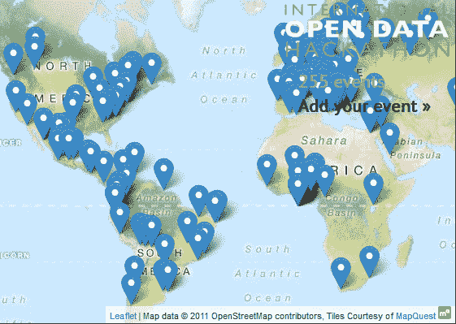

# 今天是国际开放数据日:去黑一些政府数据

> 原文：<https://thenewstack.io/today-open-data-day-go-hack-government-data/>

周六，数百场不同的数据黑客活动在全球各地举行，庆祝国际开放数据日。这是一年一度的活动的第五部分，旨在通过一系列松散加入的黑客马拉松来促进政府数据共享，每一次都以一个演示或头脑风暴提案告终，可以与其他参与者分享。致力于通过软件促进政府开放的非营利组织 [Code for America](http://www.codeforamerica.org/) 也参与其中，举办自己的“CodeAcross”黑客马拉松，让自己的社区参与到这项国际活动中来。

“我迫不及待地想看到来自世界各地的所有东西，”前谷歌高管、后成为美国政府首席技术官的[梅根·史密斯](https://twitter.com/smithmegan)在活动官方网页上的视频中说道。

在视频中，史密斯提醒游客，自 2009 年以来，近 20 万个联邦数据集已经向公众开放，全部托管在 Data.gov，同时各州和地方领导人也在提供更多的数据。

[https://www.youtube.com/embed/MH4MtB83NZc?feature=oembed](https://www.youtube.com/embed/MH4MtB83NZc?feature=oembed)

视频

“正如美国首席数据科学家 DJ Patil 所说，数据科学是一项团队运动。所以，团结起来，让我们把这件事做好！”

这些活动对所有人开放，他们的网站鼓励开发者、设计师、统计学家和图书管理员参与，当然还有公民。“我们最需要你。如果不是你，这一切都不会发生。我们需要想法、啦啦队员和朋友来传播信息。”

Code For America 网站提供了一个明确的使命声明:“支持并鼓励世界各地的地方、地区和国家政府采用开放数据政策。”它的方法看起来非常简单，即“聚集世界各地城市的公民编写应用程序，解放数据，创建可视化并使用开放的公共数据发布分析。”

截至周四晚上，超过 250 个活动被列在了活动的官方电子表格上，该表格由 Google Docs 托管，开放给所有人编辑。每个条目都包括经度和纬度，因此它们都可以用虚拟图钉显示在交互式世界地图上。

本着这一活动的真正精神，他们正在生成自己的数据集。即使你按洲来划分，参与国家的名单也令人印象深刻。

*   北美——加拿大、墨西哥和美国(在佐治亚州、南卡罗来纳州、肯塔基州、加利福尼亚州、德克萨斯州等地安排了许多不同的活动)。
*   南美–哥斯达黎加、萨尔瓦多、哥伦比亚、阿根廷、秘鲁、玻利维亚、智利、厄瓜多尔、巴西。
*   欧洲–意大利、法国、西班牙、葡萄牙、希腊、匈牙利、德国、丹麦、芬兰、荷兰、瑞士、英国、北爱尔兰、俄罗斯。
*   亚洲–日本、中国、台湾、土耳其、印度、尼泊尔、泰国、孟加拉国、越南、柬埔寨、韩国、印度尼西亚、马来西亚。
*   非洲–埃塞俄比亚、埃及、加纳、肯尼亚、摩洛哥、尼日利亚、南非、塞拉利昂、乌干达、喀麦隆、卡塔尔、沙特阿拉伯。
*   澳大利亚–澳大利亚、新西兰。

“让我们不要试图煮沸海洋，”该活动的网站解释说。“让我们举办一系列活动，让人们用心组织这些活动，并尝试用一个简单的简短连接/演示将它们联系在一起。

“最重要的是，让我们提高一些意识，创造一些东西，享受一些乐趣。”

* * *

## WebReduce

<svg xmlns:xlink="http://www.w3.org/1999/xlink" viewBox="0 0 68 31" version="1.1"><title>Group</title> <desc>Created with Sketch.</desc></svg>