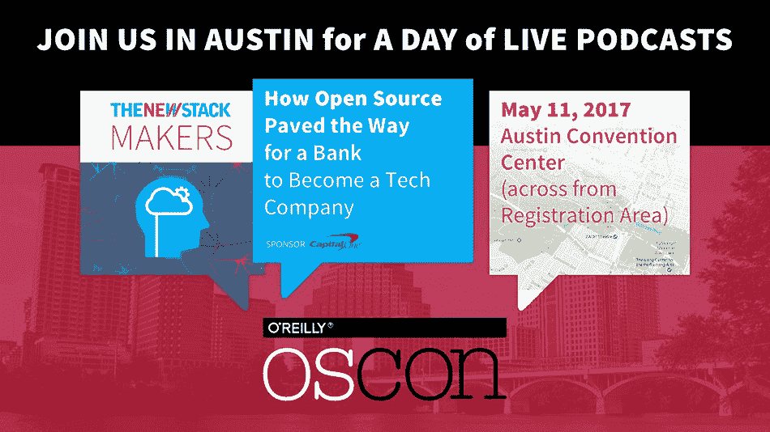

# Kinetica 为数据库系统带来了 GPU 并行处理的强大功能

> 原文：<https://thenewstack.io/todays-open-source-db-stack-fails-high-scale-says-gpu-database-maker-kinetica/>

十几年前，大学教授是第一批将 GPU 的并行处理能力用于日常应用的人。实现这一点的诀窍是——当 2005 年[他们第一次与我谈论它的时候，他们称之为“诀窍”——以这样一种方式占据图形处理器，使它“认为”它在 3d 虚拟世界中遮蔽炮火和僵尸，而实际上它在做其他事情。](http://www.tomshardware.com/news/graphics-processors-supercharge-everyday-apps,1135.html)

今天的 GPU 如此频繁地用于日常数学，以至于“G”不再真正代表“图形”。本周由英伟达赞助的 [GPU 技术大会](http://www.gputechconf.com/)将在圣何塞举行，主题包括机器人技术、气候建模、天体物理学和数据库动力学。正是在后一个类别中，与会者将期望找到 [Kinetica](https://www.kinetica.com/) ，一家围绕一个开发团队组建的公司，该团队[为美国陆军](http://www.datacenterknowledge.com/archives/2016/11/17/gpu-acceleration-makes-kineticas-brute-force-database-brute/)设计了一个远远超出任何人预期的数据库解决方案。

Kinetica 首席执行官 [Amit Vij](https://twitter.com/amit_vij1) (他也是地理空间工程咨询公司 GIS Federal 的首席执行官)在谈到新的堆栈时说道:“我们签订了一份合同，要全面评估同类最佳的技术。“我们正从基于文档的搜索转向基于实体的搜索。传统上，我们基于文档的搜索使用的是关系数据库。但是我们的项目获得了 200 多种不同的数据，包括无人机跟踪的在国外移动的每一项资产，移动设备的元数据，社交媒体…并对其进行异常检测。我们评估了世界上的每一项技术，我们的项目基本上没有预算限制。”

## 陷落

当你的客户是军队和国家安全局的时候，这是一个梦想的情况。在那里，Vij 和他的同事 Nima Negahban 开始围绕 SAP、Oracle 和 IBM Netezza 数据库仓库构建临时解决方案。他们的客户需要的是一个能够实时评估数据并在后台执行查询的系统，分析查询的标准也能实时到达系统。这些商业产品显然不太适合这个概念。

开源也没有提供答案。“如果你看看开源社区——Hadoop，以及所有这些不同风格的 NoSQL，”Vij 解释道，“它们都是面向批处理的。它更多的是营销，而不是真正拥有一个有效的产品。”

Vij 向我们讲述了他的开发团队如何为他们的军事客户(此时，美国邮政服务公司也加入了进来)制作了一个完整的、有效的、大数据风格的开源数据库堆栈的故事。但是，无论他们如何扩展他们的应用程序，这些物流密集型机构永远无法实现实时、确定性的性能。换句话说，想象一下看一部电影，它的帧被成功地同步了，除了其中的几帧被打乱了顺序。当然，这些帧会在时间*出现，但是对于确定性应用来说，那些丢失的帧是无法填补的空白。*

[领先的 GPU 加速库 CUDA](https://developer.nvidia.com/cuda-math-library) ，以及使用该库生成目标代码的编译器基础设施如今都是开源项目。也就是说，Nvidia 已经将他们专有开发的技术发布到开源社区，而像 [IBM 这样的公司也已经将他们围绕这些资产开发的专有技术](https://developer.nvidia.com/ibm-spectrum-mpi)发布到开源社区。这与 Linux 基金会项目的情况完全不同，例如，来自多家公司的开发人员共同构建一个概念，从他们各自的雇主付费开始，这个概念就是免费和开放的。

## 分崩离析

Vij 告诉我们，让 NoSQL 和卡珊德拉栈满足 NSA 和 USPS 的需求，“就像用胶带封住五、十个不同的项目，这些项目松散耦合，处于不同的发布周期，并不真正意味着以协同的方式相互合作。这些技术如何实时处理数据？我们采取了完全不同的方法。我们从零开始创建了一个数据库，考虑到了多核设备，我们将数据与成千上万个 GPU 核心对齐。”

2013 年，AMD 作为 CPU 领域真正挑战者的地位正在减弱，IBM 意识到它无法独自与英特尔竞争。它建立了一个战略联盟，现在被称为 [OpenPower Foundation](https://openpowerfoundation.org/) ，其成员共同为最初属于 IBM 的系统架构做出贡献——其最初的意图是扩大到大型机，而[缩小到索尼的 PlayStation 3](http://www.tomshardware.com/news/ibm-lead-architect-cell-cpu-ps3-gaming,1336.html)——作为一个集体项目。

通过 OpenPower，IBM 和 Nvidia 都支持通过设计促进 GPU 加速的硬件架构。这项技术迫使英特尔，凭借其古老的 x86 架构仍然保持强劲，回应了软件本身无法提供的更快加速的要求——例如，[在 2015 年 6 月以超过 160 亿美元的价格收购了 FPGA 加速器制造商 Altera](http://www.datacenterknowledge.com/archives/2015/06/01/intel-bets-on-server-fpgas-with-16-7b-altera-acquisition/) 。

OpenPower 的努力也帮助实现了一个由 IBM 管理的开放标准，叫做[一致加速器处理器接口](http://www.datacenterknowledge.com/archives/2016/11/11/ieee-blesses-opencapi-consortiums-effort-supersede-pci/)。这是一种比当今许多 GPU 所依赖的 PCI-Express 更快的扩展总线，它可能适用于包括 OpenPower 和 x86 在内的硬件架构。

## 闹翻

所有这些对可扩展软件领域的小老人们来说都很重要的原因是:更宽的扩展总线将为一类 GPU 铺平一条新的多车道高速公路，这些 GPU 已经等待了一段时间，等待着交通瓶颈的打破。这种新型加速器将使一种完全不同的——尽管不是正式的新——数据库系统架构出现，这种架构利用更广泛的内存路径，比 Hadoop 或 Spark 单独在 CPU 上运行的并行操作快几个数量级，最重要的是，*不需要连续索引*。

啊，问题就在这里。Kinetica 认为，是索引使今天的数据库如此缓慢，这些数据库需要所有这些索引的原因是因为它们被绑定到存储卷。HDFS 让这些卷变得更加庞大，从而为大数据打开了世界，但那里正在进行的工作是惊人的。如果这些卷不存在，传统数据库今天执行的大量繁忙工作将会消失。

“这些 NoSQL 数据库迫使组织重新设计他们的数据模型，”Kinetica 的 Vij 认为。“几十年来，组织一直依赖关系数据库作为原语和表。将它们转移到关键/价值商店需要数月或数年的时间。NoSQL 数据库目前…无法提供实时分析，因为它们非常依赖索引和增量索引。”

NoSQL 数据库工程师建议的典型解决方案包括对他们倾向于运行的查询进行优化。但这只有在你知道查询会是什么的情况下才有效——不像 NSA 的情况，NSA 在找到之前根本不知道它在找什么。

“我们使组织能够在运行时和查询时进行关联，”首席执行官继续说道，“并进行子查询，并将它们链接在一起。而对于传统数据库和 NoSQL 数据库，他们正在设计他们的数据模式和模型，他们知道这些查询是什么，并为此进行优化。如果你不知道你要查询什么，那对军方来说是不可能的。

Amit Vij 的建议是，Kinetica 以及类似的 GPU 加速或 FPGA 加速平台开始支持[容器化应用](http://www.nvidia.com/object/docker-container.html)来解决十年前的大数据问题和今天的实时数据库问题，这种方式在当时构思当前开源数据库堆栈时是不可能的。

在周一的 GPU 技术大会上，随着分析产品制造商 Fuzzy Logix 启动与 Kinetica 的合作，我们可能会看到这一说法的更多新例子。这种伙伴关系应该导致实时金融预测和风险分析应用程序的开发，其范围仅在几年前还只属于超级计算领域。

“数据库和分析引擎需要开始利用今天的硬件，”Kinetica 的 Vij 说。"图形处理器遵循摩尔定律，而软件则不然."

<svg xmlns:xlink="http://www.w3.org/1999/xlink" viewBox="0 0 68 31" version="1.1"><title>Group</title> <desc>Created with Sketch.</desc></svg>