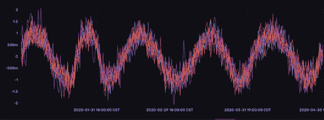

# 使用 InfluxDB 解决时序数据科学问题的工具

> 原文：<https://thenewstack.io/tools-for-time-series-data-science-problems-with-influxdb/>

[](https://www.linkedin.com/in/anais-dotis-029623113/)

[Anais dot is-乔治乌](https://www.linkedin.com/in/anais-dotis-029623113/)

 [Anais 是 InfluxData 的开发者倡导者，热衷于使用数据分析、人工智能和机器学习来美化数据。她收集数据，进行综合研究、探索和工程设计，将数据转化为功能、价值和美感。当她不在屏幕后面时，你可以发现她在外面画画、伸展身体、登船或追逐足球。](https://www.linkedin.com/in/anais-dotis-029623113/) [](https://www.linkedin.com/in/anais-dotis-029623113/)

如果您正在处理时间序列数据，您可能需要执行异常检测或预测。处理时间序列[的第一步是找到正确的数据存储。为了有效地检测或](https://www.influxdata.com/what-is-time-series-data/?utm_source=vendor&utm_medium=referral&utm_campaign=2022-08_spnsr-ctn_tools-for-time-series-data-science-problem_tns)[预测您的数据](https://www.influxdata.com/time-series-forecasting-methods/?utm_source=vendor&utm_medium=referral&utm_campaign=2022-08_spnsr-ctn_tools-for-time-series-data-science-problem_tns)，您将需要一个能够以高接收速率处理大量数据的数据存储。因此，您可能希望考虑使用专门构建的时间序列数据库。时间序列数据库不同于更常见的关系数据库，因为它们不是使用行和列来快速查找数据点之间的关系，而是被设计来处理时间序列数据的独特工作负载。

对于本文，我们将使用时序数据库 [InfluxDB](https://www.influxdata.com/products/?utm_source=vendor&utm_medium=referral&utm_campaign=2022-08_spnsr-ctn_tools-for-time-series-data-science-problem_tns) 并讨论一些可以用来执行预测和异常检测的工具。我们还将讨论 InfluxDB v2 Python 客户端库的一些增强功能，这些功能使得从 InfluxDB 查询数据以及将数据科学工具应用于时间序列数据变得更加容易。

## 时间序列数据科学问题的工具

虽然您可以使用 InfluxDB 解决一些时间序列数据科学问题，但您可以用它解决的问题范围有些有限。对于大多数用例，使用 InfluxDB 来存储所有原始时间序列数据，然后使用 Flux(influx db 的本地查询和脚本语言)来准备数据。

接下来，使用[客户端库](https://docs.influxdata.com/influxdb/cloud/api-guide/client-libraries/?utm_source=vendor&utm_medium=referral&utm_campaign=2022-08_spnsr-ctn_tools-for-time-series-data-science-problem_tns)将数据提取到另一个环境中。如果你正在处理一个时间序列数据科学问题，考虑使用 [Python](https://www.influxdata.com/blog/getting-started-with-python-and-influxdb-v2-0/?utm_source=vendor&utm_medium=referral&utm_campaign=2022-08_spnsr-ctn_tools-for-time-series-data-science-problem_tns) 。我看到用 Python 开发的时间序列工具和包比任何其他语言都多。让我们来看看一些最流行的用于时间序列的 Python 工具。

[Pandas](https://pandas.pydata.org/) 是一个用于数据操作的开源 Python 库。如果您打算使用下面提到的许多库，您将不得不使用 Pandas 将数据放入 Pandas DataFrame，因为这是预期的数据格式。Pandas 数据帧是一个二维的、大小可变的数据结构。熊猫在数据科学界广受欢迎有两个原因。首先，它很直观，有很好的用户体验。用熊猫转换和重塑数据很有趣。其次，一些数据科学图书馆要求输入是熊猫数据框架。

[TensorFlow](https://www.tensorflow.org/) 是一个开源的机器学习和人工智能平台。数据科学家使用 TensorFlow 使用 Python 或 JavaScript 构建和训练模型。TensorFlow 主要用于深度学习应用。深度学习是一种使用神经网络的机器学习。神经网络由控制数据流动和操作的计算或逻辑门组成。它们控制数据流的方式从人类大脑的学习方式中获得灵感，这也是神经网络得名的原因。

TensorFlow 面向初学者和专家。神经网络是具有多种特征的数据的伟大预测者。要素是有助于您进行预测的所有相关属性，在下一个工具描述中将详细介绍。还可以使用 TensorFlow 来执行异常检测。

Keras 是 TensorFlow 的开源包装器。虽然 TensorFlow 也面向初学者，但对于那些刚接触深度学习的人来说，它仍然是势不可挡的。Keras 旨在通过为 TensorFlow 提供接口来简化学习 tensor flow 的过程。我推荐去看看[这本 Keras 关于天气数据时间序列预测的教程](https://keras.io/examples/timeseries/timeseries_weather_forecasting/)。在该课程中，您将学习如何使用包括压力、湿度、温度、风和速度在内的 14 种输入特征来预测温度。它还演示了如何通过生成相关图来执行一些基本的特征选择。

特征选择是移除多余或不相关的特征的过程，以便它们不会对模型产生不良影响。相关图或相关图有助于我们形象化不同变量之间的相关性。彼此高度相关的特征被认为是冗余的。与任何特征都不相关的特征被认为是不相关的。例如，湿度和相对湿度可能会被认为是温度预报的冗余特征。您还可以使用 Keras 来执行异常检测。

[Prophet](https://facebook.github.io/prophet/docs/quick_start.html) 是一个用于预测的 Python 库。它将预测问题作为曲线拟合练习或创建数学模型来提供“最佳拟合”线。Prophet 类似于 Holt-Winters 或三重指数平滑，这是一种众所周知的统计预测方法。它的创建是为了让各种背景的用户都能做出预测。Prophet 不需要关于时间序列数据的专业知识来进行预测，时间序列数据有几个独特的统计属性。相反，它允许用户通过指定独特的假期、时间表和饱和点(或承载能力)来轻松地将领域专业知识纳入他们的模型。此外，与其他流行的统计预测方法不同，Prophet 可以很好地处理特殊特征和不规则的时间序列数据，而无需进行数据准备工作。这是因为 Prophet 执行插值并自动移除异常值。

[NeuralProphet](https://neuralprophet.com/html/index.html) 是另一个用于预测的 Python 库。它是先知的继承者。它旨在成为先知和深度学习之间的混合方法。NeuralProphet 的目标是使近期的预测比 Prophet 的预测更准确。换句话说，NeuralProphet 可以用稀疏或更少的数据做出更准确的预测。NueralProphet 通过使用深度学习来识别时间序列中的局部上下文并对其敏感，从而实现了更高的准确性。局部环境是指时间序列数据中季节性或特定形状的一部分。识别局部环境可以提高预测的准确性，特别是当这些形状具有周期性时。然而，值得注意的是，如果你有足够的可靠和干净的历史数据，那么[先知可以以微弱的优势胜过 NeuralProphet](https://towardsdatascience.com/prophet-vs-neuralprophet-fc717ab7a9d8) 。

[ADTK](https://adtk.readthedocs.io/en/stable/) (异常检测工具包)是一个开源的 Python 包，用于时序数据中基于规则的异常检测。ADTK 面向工业物联网用例。在大多数工业物联网案例中，运营商拥有关于其系统应该如何正常运行以及常见异常或故障场景可能是什么样子的领域专业知识。

ADTK 允许用户通过组合不同的模块来构建异常检测模型。一种类型的模块是[探测器](https://arundo-adtk.readthedocs-hosted.com/en/stable/notebooks/demo.html)。探测器发现异常点。它们包括关注分位数、阈值、水平变化、季节性等的方法。ADTK 允许用户将这些功能链接在一起，以建立一个模型，例如，评估数据是否超过该阈值，同时表现出一定幅度的电平移动，并违反季节模式。如果数据满足所有这些基于规则的标准，那么就存在异常。

还有许多其他用于异常检测的开源包，但 ADTK 令人耳目一新，因为它相对简单。该软件包非常适合识别遵循某些明确定义的统计属性的异常，或者反过来发现物联网数据中表现出非常可预测或可控行为的异常。

[Telegraf](https://www.influxdata.com/time-series-platform/telegraf/?utm_source=vendor&utm_medium=referral&utm_campaign=2022-08_spnsr-ctn_tools-for-time-series-data-science-problem_tns) 是一个用于度量和事件的开源收集代理。它与数据库无关，但属于 InfluxDB 堆栈的一部分，因此您可以轻松地收集时序数据并将其写入 InfluxDB。然而，它不仅仅是一个收款代理。您也可以使用 Telegraf 处理数据。 [Telegraf Execd 处理器插件](https://github.com/influxdata/telegraf/blob/master/plugins/processors/execd/README.md)使得 Telegraf 可以在任何语言中扩展。这包括使用统计预测算法对小批量数据进行连续预测。这篇[报道](https://github.com/InfluxCommunity/tg-brew-anomaly)包含了一个使用 Telegraf 对啤酒温度进行连续预测的例子，以更好地调节发酵过程。

[亚马逊预测](https://aws.amazon.com/forecast/)是一项时间序列预测服务，允许用户轻松进行预测，而不需要他们在模型选择、培训或部署方面接受过专门培训。亚马逊预测提供了几种流行的预测算法和神经网络，包括 ARIMA、CNN-QR、DeepAR+、ets(指数趋势平滑)、NPTS(非参数时间序列)和 Prophet。Amazon Forecast 允许用户同时训练所有这些预测算法，从而使模型选择更加容易。亚马逊预测还将在使用多个预测器评估预测准确性后选择获胜的算法，这些预测器包括均方根误差(RMSE)、加权分位数损失(wQL)、平均绝对百分比误差(MAPE)、平均绝对比例误差(MASE)和加权绝对百分比误差(WAPE)指标。Amazon Forecast 也知道如何解释那些准确度预测器的结果，并返回获胜的算法，所以你不必学习如何(统计很难！).最后，用户可以使用经过训练的模型进行预测。亚马逊预测还为用户提供了一种便捷的方式，在训练之前将不同的标准功能集(如假期)纳入他们的数据中，以提高准确性。

## 对 InfluxDB v2 Python 客户端库的增强

虽然您可以使用 [Flux](https://docs.influxdata.com/influxdb/cloud/query-data/get-started/?utm_source=vendor&utm_medium=referral&utm_campaign=2022-08_spnsr-ctn_tools-for-time-series-data-science-problem_tns) 执行一些预测和异常检测，但您可能希望利用您已经熟悉的语言和工具。一些最流行的解决时序数据科学问题的工具是 Python 库。为了同时利用这些流行的 Python 包和 InfluxDB，您需要使用 [InfluxDB v2 Python 客户端库](https://github.com/influxdata/influxdb-client-python)。

在之前的帖子中，我们了解了如何[从 OpenWeatherMap API 获取天气数据](https://thenewstack.io/obtaining-and-storing-time-series-data-with-python/)，并使用 InfluxDB v2 Python 客户端库将其存储在 InfluxDB 中。但是，还有一些额外的客户端库功能可以改善使用体验。InfluxDB v2 Python 客户端库支持[熊猫](https://www.influxdata.com/blog/getting-started-with-influxdb-and-pandas/?utm_source=vendor&utm_medium=referral&utm_campaign=2022-08_spnsr-ctn_tools-for-time-series-data-science-problem_tns)。您可以编写 Pandas 数据帧，并将查询结果作为 Pandas 数据帧返回。

第一个改进是你的熊猫数据框的形状可以比以前更灵活。以前，将数据帧写入 InfluxDB 的一个要求是，必须将时间戳列转换为数据帧索引。现在，您可以简单地指定哪一列是您的时间戳列。

此外，还可以接受更多的时间戳格式。最后，您还可以将时间戳列的时区指定为 write 方法的一部分，这样就不必事先进行转换。

最终，所有这些变化意味着使用 Pandas 将数据写入 InfluxDB 变得更加容易，因为用户不必花费更多的代码来转换他们的数据帧以满足旧的需求。事实上，您可以使用:
直接从 CSV 读取数据并将其写入 InfluxDB

```
import pandas as pd

from influxdb_client import InfluxDBClient
from influxdb_client.client.write_api import SYNCHRONOUS

url  =  "http://localhost:8086"  
// or the URL of your Cloud instance e.g. https://us-west-2-1.aws.cloud2.influxdata.com/
token  =  "my-token"
org  =  "my-org"

with InfluxDBClient(url=url,  token=token,  org=org)  as client:

    df  =  pd.read_csv("path/to/CSV.csv")
    client  \
        .write_api(write_options=SYNCHRONOUS)  \
        .write(bucket="my-bucket",
 record=df,
 data_frame_timestamp_column="Date",
 data_frame_timestamp_timezone="EST")

```

## InfluxDB 在时序数据科学问题中的局限性和优势

InfluxDB 在处理时序数据科学问题时有以下限制:

*   在使用 InfluxDB 处理时序数据科学问题时，没有太多的原生工具。虽然您可以使用 InfluxDB 进行一些基本的预测或异常检测，但您可能希望使用客户端库来查询您的数据，并使用其他专门构建的工具来解决您的数据科学问题。

在解决时序数据科学问题时，InfluxDB 具有以下优势:

*   InfluxDB 可以处理许多时序问题所需的摄取量。
*   您可以使用 InfluxDB 对数据进行预处理，为任何其他数据科学工作做准备。
*   您可以使用 InfluxDB 执行一些基本的预测和异常检测，这可能就足够了。

使用 Flux(influx db 的查询和数据脚本语言)的优势在于，它包含许多用于处理和操作时序数据的功能和特性，包括但不限于:

*   统计时序分析的转换函数
    *   相关、协变、标准差、分位数、分布等函数。
*   动态统计和基本时间序列分析的变换函数
    *   导数、移动平均、时间加权平均等函数。
*   金融分析的技术动量指标
    *   钱德动量振荡器、考夫曼移动平均线等。
*   数学应用的数学软件包
*   地理时态数据的地理包

Flux 的缺点是，虽然它有一个 map()函数，可以让您迭代查询结果中的行，但它不支持循环。这使得编写复杂的预测或异常检测算法变得不可能。然而，Flux 已经被用来编写一些基本的异常检测算法，包括中值绝对偏差和朴素贝叶斯。[中值绝对偏差](https://www.influxdata.com/blog/anomaly-detection-with-median-absolute-deviation/?utm_source=vendor&utm_medium=referral&utm_campaign=2022-08_spnsr-ctn_tools-for-time-series-data-science-problem_tns)算法用于查找偏离一组相似时间序列的时间序列。[朴素贝叶斯](https://www.influxdata.com/blog/deep-dive-into-machine-learning-in-flux-naive-bayes-classification/?utm_source=vendor&utm_medium=referral&utm_campaign=2022-08_spnsr-ctn_tools-for-time-series-data-science-problem_tns)是一个概率分类器，用于确定一个输入是否属于某个类别。



类似时间序列的一个例子，它与 Linux 内核上的磁盘 IO 有相似之处。中位数绝对偏差用于确定哪个系列偏离了包装。

Flux 还包含 [holtWinters()](https://docs.influxdata.com/flux/v0.x/stdlib/universe/holtwinters/?utm_source=vendor&utm_medium=referral&utm_campaign=2022-08_spnsr-ctn_tools-for-time-series-data-science-problem_tns) 函数，该函数对时间序列数据应用双重或三重指数平滑。双重和三重指数平滑是一种统计时间序列预测，它使用指数加权平均值中的数据、趋势和季节性来进行预测。

## 结论

我希望这篇博文能启发你利用上述任何工具来解决时序数据科学问题。我鼓励你看一看 repo 之后的[，其中包括如何使用许多 Python 库和 InfluxDB 进行预测和执行异常检测的示例。](https://github.com/InfluxCommunity/Notebooks)

<svg xmlns:xlink="http://www.w3.org/1999/xlink" viewBox="0 0 68 31" version="1.1"><title>Group</title> <desc>Created with Sketch.</desc></svg>