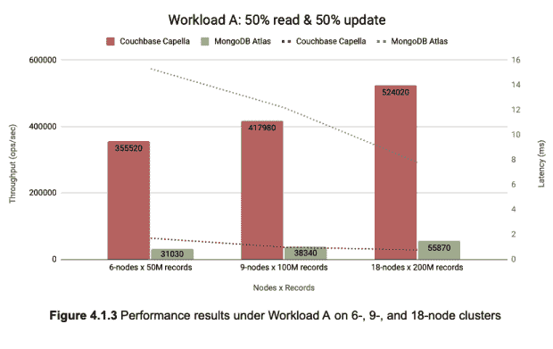

# 2023 年降低总拥有成本的三大方法

> 原文：<https://thenewstack.io/top-3-ways-to-lower-tco-in-2023/>

对于现代企业来说，做生意的成本从来没有这么高过。虽然没有一家公司可以完全避免支付这些成本，但首席信息官和首席技术官在降低技术的总拥有成本(TCO)方面发挥着至关重要的作用。这篇博客文章概述了 IT 领导者在 2023 年降低组织总拥有成本的三种方法。企业可以通过自动化流程、提高效率和寻找经济高效的云解决方案来节省技术成本。

## **什么是 TCO？**

TCO 是物理和云资源的服务和产品以及日常运营的成本。TCO 用于通过分析项目和公司计划的成本回报比来辅助决策。例如，许多组织都被授权将其大部分工作负载迁移到云中。因此，一般来说，他们需要计算迁移和运营成本，以确定迁移的可行性。

降低经营成本对于任何致力于提高盈利能力的组织都至关重要，对于以技术为基础的企业尤其重要。首席信息官/首席技术官的任务是定义降低总拥有成本并最终节省资金的流程。以下是他们在 2023 年降低总拥有成本的三种方式。

## **自动化**

自动化重复的任务是一种行之有效的省钱方法。现代企业正变得越来越由数据和应用驱动。任务关键型应用程序的中断会带来灾难性的后果。自动化有助于降低此类停机的风险，降低成本，还可以释放资源，让开发人员和 IT 团队能够从事更多创收任务。

自动化还加快了应用程序的开发和部署。例如，自动化数据管道极大地提高了效率，这也是一个成本驱动因素。因此，许多组织都显著增强了他们的开发运维能力，并受益于由此带来的总拥有成本的降低。

## **提高流程效率**

通过提高流程效率，TCO 可以大大降低。这可以通过多种方法来实现，例如减少流程中的步骤数量、自动化任务以及改善部门之间的沟通。通过鼓励跨部门协作，IT 领导可以帮助他们的组织实现降低成本的目标，同时保持高质量标准。

组织正在通过检查现有流程、减少重复和采用更有效的现代替代方案来提高效率，如下面讨论的[云迁移](https://thenewstack.io/top-4-misconceptions-about-cloud-migration/)。通过明确确定增值任务和瓶颈，采用基于证据的决策也有助于提高效率。采取这些分析步骤有助于公司创建更优化但成本更低的流程，并减少浪费。一旦确定了更好的实践，与利益相关者沟通并采用良好的[变更管理](https://thenewstack.io/the-chickens-have-flown-the-coop-change-management-is-back/)授权实施。

## **云迁移**

通过将工作负载从内部转移到云中，企业将一些最耗时的 IT 管理和维护活动外包出去。这使得 IT 团队可以专注于创收活动，如开发功能、修复和新的创新，以增强客户体验并获得超越竞争对手的优势。迁移到云提高了敏捷性，降低了总拥有成本，并使用云原生开发和自动化技术加速了创新。

例如，当决定迁移到云上的数据库平台时，应该重点考虑性能、灵活性和效率等因素。许多组织选择从传统的 RDBMS(关系数据库管理系统)迁移到 [NoSQL 平台](https://thenewstack.io/why-choose-a-nosql-database-there-are-many-great-reasons/)，以获得更好的数据灵活性、随着需求变化快速更新应用程序的能力，当然还有更好的可伸缩性。

## **结论**

随着越来越多的企业寻求削减成本和简化技术堆栈，他们应该考虑 Couchbase 的 NoSQL 数据库，该数据库提供以下优势:

*   独立的[基准测试](https://www.altoros.com/research-papers/performance-evaluation-couchbase-capella-vs-mongodb-atlas-2022/)展示了行业领先的性能，这些基准测试比较了各种工作负载的数据库吞吐量和延迟。

资料来源:Altoros

*   使用分析、事件、移动应用服务和 FTS(全文搜索)等服务进行多模式数据访问
*   多维扩展(MDS ),使架构与工作负载相匹配

## **接下来的步骤**

了解更多关于五车二 Couchbase 的信息:

如果您有任何问题或意见，请在 [Couchbase 论坛](https://forums.couchbase.com/)与我们联系。

<svg xmlns:xlink="http://www.w3.org/1999/xlink" viewBox="0 0 68 31" version="1.1"><title>Group</title> <desc>Created with Sketch.</desc></svg>