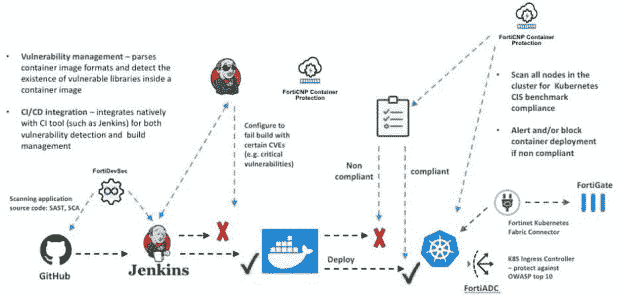

# 提高 CI/CD 渠道安全性的五大考虑因素

> 原文：<https://thenewstack.io/top-5-considerations-for-better-security-in-your-ci-cd-pipeline/>

越来越多的应用程序团队正在采用持续集成/持续交付(CI/CD)工作流来促进应用程序开发，这意味着他们的组织需要部署自动化和集成的安全性来保护这些工作流。

试图加速云应用和服务创新的组织将 CI/CD 管道置于日常运营的核心。如果配置正确，它们可以提供软件开发过程的可见性，并自动执行手动操作，以保证交付过程的一致性。网络基础设施可以通过这些管道访问各种资源，如分析密钥和代码签名证书。

DevOps 团队已经使用像 Kubernetes 这样的容器和容器编排平台来构建和部署他们的应用程序，因为大多数当代应用程序都是使用微服务架构构建的。因此，任何旨在保护 CI/CD 工作流的解决方案都必须将容器安全性作为一个关键组件。下面列出的五个因素可以帮助 DevOps 团队确保他们的容器策略不会危及安全性。

1.  ## **自动扫描源代码**

要获得对应用程序漏洞的精确评估，请进行全面深入的扫描。将持续的应用安全测试嵌入到在主要 DevOps CI/CD 环境中创建和交付应用的过程中，将有助于您评估和识别安全缺陷，您可以在软件开发生命周期(SDLC)中修补或消除这些缺陷。

2.  ## **设置连续运行时安全**

保护运行中的微服务对于有效的 CI/CD 安全解决方案来说至关重要，这与通过将安全转移到管道的早期阶段来防止应用违规同样重要。传统的下一代防火墙(NGFW)没有提供理解 Kubernetes 结构(如名称空间、pod 和标签)所需的上下文。一旦边界被破坏，隐性信任的风险和阻止外部攻击的扁平网络给攻击者提供了很大的空间。因此，重要的是利用一个支持持续安全性和集中式策略以及可见性的平台来实现高效和有效的持续运行时安全性。

3.  ## **将安全性无缝地插入 CI/CD 工作流**

大多数应用程序团队使用像 Jenkins 这样的构建工具来自动化他们的构建过程。安全解决方案必须包含在流行的构建框架中，以便为构建管道带来安全性。这种集成使团队能够快速获得新技能，并根据他们组织的需求通过或失败构建。例如，如果企业的安全需求禁止部署具有关键漏洞的应用程序，那么当在映像中发现关键漏洞时，需要设置一个策略来使构建失败。

4.  ## **构建考虑安全性的映像**

图像中经常使用第三方库和源代码。在创建映像以生成所有漏洞(CVE)和发现漏洞的库/包的完整报告之前，解析库和包是非常重要的。如果特定的库可能会产生安全风险，也应该排除它们。漏洞报告还可能揭示图像是否包含凭据或其他敏感信息。

5.  ## **使用 CIS 基准运行合规性检查**

随着 Kubernetes 之类的容器编排平台的应用越来越广泛，运行静态测试来发现这些平台中的潜在漏洞是必不可少的。遵循互联网安全中心(CIS)提出的 Kubernetes 最佳安全实践建议是一个好主意。这为设置 Kubernetes 以保持健壮的安全姿态提供了建议，比如阻止匿名 API 服务器查询，只允许非根用户运行容器。

更好、更有效的开发工具

跨主要云平台本机集成的广泛、全面的云安全解决方案，以及安全结构方法，是确保团队应用程序之旅数字化加速的关键。像 [Fortinet 云安全产品组合](https://www.fortinet.com/solutions/enterprise-midsize-business/cloud-security.html?utm_source=pr&utm_medium=pr&utm_campaign=cloud-security)(如上例所示)这样的解决方案，通过跨所有混合和多云平台的一致策略、集中化管理、跨应用和工作负载的深入可见性，使组织能够降低运营复杂性、提高可见性和增强安全有效性。

<svg xmlns:xlink="http://www.w3.org/1999/xlink" viewBox="0 0 68 31" version="1.1"><title>Group</title> <desc>Created with Sketch.</desc></svg>