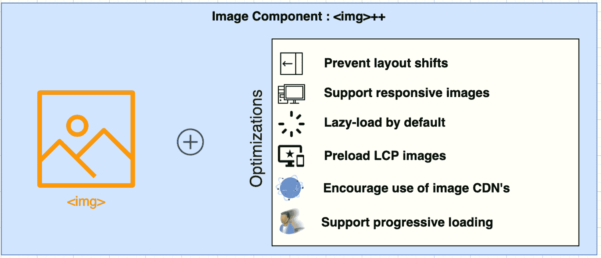

# 2021 年五大互联网技术

> 原文：<https://thenewstack.io/top-5-internet-technologies-of-2021/>

 [理查德·麦克马努斯

理查德是 New Stack 的高级编辑，每周撰写一篇关于网络和应用程序发展趋势的专栏文章。此前，他在 2003 年创立了读写网，并将其打造为全球最具影响力的科技新闻和分析网站之一。在 Twitter @ricmac 上关注他。](https://twitter.com/ricmac) 

对于互联网技术来说，这是极端的一年。一方面，你有几乎未经证实的“网络 3”和脸书转向元宇宙的宣传。但另一方面，互联网平台取得了坚实的进步，有时甚至是惊人的进步。这个帖子是要颂扬后者的；推动互联网向前发展的实际可行的非软件技术。五分之四的情况下，这些技术将 web 开发带回了前台——值得注意的是，因为不久前移动应用程序开发还占主导地位。我的清单还包括一项元宇宙技术，尽管(抱歉，扎克)它不是 Meta 的。

当然，年终“最佳”榜单总是主观的。但是我已经利用了我今年写的所有专栏，也回顾了我 2021 年在 Twitter 上跟踪的内容，得出了以下五种技术。我还和多个软件专家讨论了我的列表，他们的反馈和见解非常有帮助。

所以，让我们开始吧。名单没有特定的顺序，但我会从你们大多数人都会同意的今年最突出的互联网技术开始…

## 1.web 程序集

WebAssembly (WASM)是一个 web 标准，允许开发人员用非 web 语言创建 web 应用程序，如 C、C++和 Rust。它的主要目标是在网页上启用高性能应用程序，但使用开发人员已经熟悉或精通的编程语言。不用再和 JavaScript 框架争论了(或者至少，它给了你一个选择)。

WASM 是 2021 年 SIGPLAN 编程语言软件奖的得主，该奖项由计算机械协会(ACM)主办。ACM 更出名的是它的图灵奖，但是 SIGPLAN 奖几乎同样享有盛名。在它的引文中，委员会指出“WebAssembly 是自 JavaScript 以来第一个在网络浏览器中被广泛采用的新语言。”

云原生 WebAssembly 应用[于 2021 年](https://thenewstack.io/cloud-native-webassembly-applications-are-already-here/)开始起飞，因此在 WASM 已经有了很大的势头。但是最有趣的是 WASM 开启的未来可能性——一些人认为它可能[消除文件系统](https://thenewstack.io/webassembly-aims-to-eliminate-the-file-system/)，甚至可能是操作系统。

如果你热衷于在 2022 年投入 WebAssembly，我推荐[这篇解释性文章](https://thenewstack.io/what-is-webassembly/)7 月发表的新堆栈。

## 2.菲格玛

Figma 是一个协作界面设计工具，它展示了现代网络浏览器能够运行极其丰富的交互式内容。这种交互性过去只能通过 Flash 这样的插件工具来实现。但是 Figma 是使用 web 标准构建的，特别是使用 Web GL(Web Graphics Library)来处理渲染。

该公司还在新产品上进行创新。今年四月，它推出了 FigJam，这是一个“在线白板”,允许团队在网页上一起头脑风暴。Figma 的这些产品有点让人想起 Web 2.0 的早期，大约在 2004-2005 年，当时 Writely 和 JotSpot 等初创公司推出了创新的“web office”产品(这两家公司在 2006 年很快被谷歌抢购)。当时，Ajax 是推动网络办公创新的关键网络技术。当然，现在浏览器的功能要优越得多；Figma 是一家充分利用这一优势的创业公司。

FigJam，2021 年推出

我也喜欢 Figma 不只是试图取代当前的工具；它试图发明新的工作方式。正如 Figma 首席执行官迪伦·菲尔德(Dylan Field)在 10 月份发布 FigJam 插件和插件时所说:

最后，值得注意的是，Figma 有一些强大的新朋友。就在这个月，亚马逊网络服务[宣布](https://aws.amazon.com/blogs/mobile/aws-amplify-studio-figma-to-fullstack-react-app-with-minimal-programming/)其新的 AWS Amplify Studio，一种低代码可视化开发环境，“自动将 Figma 中的设计翻译成人类可读的 React UI 组件代码。”

## 3.Next.js 12

说到 React，2021 并没有看到流行的脸书衍生的 JavaScript 库的减少。尽管基于 React 的框架比比皆是，但今年有一个特别突出:Next.js，由 Vercel 管理的开源框架。

10 月底，Vercel 宣布了 Next.js 的[版本 12，其中包括 ES 模块和 URL 导入、即时热模块替换(HMR)，以及一种叫做“中间件”的东西，它使你能够“在请求完成之前运行代码”](https://thenewstack.io/vercel-delivers-next-js-12-the-sdk-for-the-web/)

Next.js 图像组件；来源:谷歌的 web.dev

Next.js 是过去几年 SSG(静态站点生成器)崛起的标志，Gatsby 和 Hugo 是其他例子。虽然，已经有了明显的远离纯静态生成的趋势——next . js 现在将自己描述为“混合静态[和]服务器渲染”框架。

Next.js 开发人员喜欢它的易用性和所有花哨的功能(如“edge functions”)，但并不是每个人都迷恋 Next.js 制作的应用程序的输出。这可能更像是对 React 本身的控诉，而不是对 Next.js 的控诉。但值得注意的是，由于 React 框架倾向于使用大量的 JavaScript，因此在 web 上对 React 框架的抵制越来越多。

不过总的来说，正如我在[我写的 Next.js 12](https://thenewstack.io/how-next-js-12-connects-to-low-code-and-visual-design-tools/) 中提到的，Next.js 现在能为开发者做的事情有很多细微差别。我们只是碰巧生活在一个被复杂性统治的 web 开发世界中，而 Next.js 是将复杂性抽象化的最佳框架之一。

## 4.Lit Web 组件

另一端是 web 组件的趋势，这是 HTML 原生组件，避免了 JavaScript 技巧。

一个名为 [Lit](https://lit.dev/) 的项目处于 web 组件开发创新的前沿。它建立在 [web 组件标准](https://developer.mozilla.org/en-US/docs/Web/Web_Components)之上，事实上你可以把 Lit 看作是 React 的 Web 标准等价物——它们都是帮助开发人员为网站和 Web 应用程序构建和部署组件的库。关键区别:React 组件[依赖于 JavaScript](https://reactjs.org/docs/components-and-props.html) ，而每个 Lit 组件[都是标准的 web 组件](https://lit.dev/docs/)。

当我在三月初最后一次写这篇文章的时候，这个项目还不叫 Lit。相反，有两个独立的项目——LitElement 和 lit-html——它们以某种方式与聚合物项目(Polymer Project)相关联，聚合物项目是谷歌在 2015 年推出的开源 JavaScript 库。但是[4 月](https://lit.dev/blog/2021-04-21-lit-2.0-meet-lit-all-over-again/)，两个项目合并成一个，更容易理解，brand: Lit。

web 组件仍然处于早期阶段，它很难被采用——例如， [Shopify 的新 React 框架](https://thenewstack.io/dynamic-by-default-shopifys-hydrogen-a-new-take-on-react/) Hydrogen 选择使用 React 组件而不是 web 组件。但是 web 组件的愿景是最终结束当前对组件模型的单一框架把关的依赖。 [GitHub 和 Salesforce](https://thenewstack.io/how-web-components-are-used-at-github-and-salesforce/) 是*已经*采用 web 组件的两家大公司，所以希望 2022 年继续这一趋势。

## 5.Nvidia Omniverse

最后但同样重要的是，一个工作中的元宇宙——算是吧。早在 8 月，在 10 月下旬脸书转向 Meta 之前，[我写了关于 Nvidia 的 Omniverse](https://thenewstack.io/omniverse-kit-nvidia-metaverse-sdk/) 。它自 2019 年以来一直在运行，因此无论元宇宙平台 Meta 开发什么，它都有一个重要的开端。

虽然 Omniverse 本质上不是一个互联网平台，但它有所有的工具可以整合成一个平台(稍后会详细介绍)。它的开发者工具包——omni verse Kit——是开发者如何为该平台创建应用程序的工具。包括 Kit 在内的所有 Omniverse 都是基于皮克斯的开源通用场景描述(USD)构建的。USD，Nvidia 将其描述为“3D 世界的 HTML”，既是一种文件格式，也是“一种具有 API 的强大场景表示”

3D 元宇宙平台的关键部分之一是它的“物理”，这意味着它模拟物理世界的方式。Nvidia 有几个仿真 SDK，其中一个是物理 SDK PhysX。

Omniverse 中的扩展创建

但是如前所述，还不完全清楚 Omniverse 将在消费者互联网上扮演什么角色(如果有的话)。到目前为止，它是一个针对设计和制造公司的模拟和协作平台。然而，在 10 月下旬发布 Meta 后大约一周，Nvidia [宣布了扩展的功能](https://blogs.nvidia.com/blog/2021/11/09/expanded-omniverse-ecosystem/)——如 AR、VR 和多 GPU 渲染——这表明 Omniverse 将在即将到来的消费者元宇宙中发挥作用。根据这份声明，Omniverse 正在“加速互联网从普通的 2D 向令人眼花缭乱的 3D 世界的演进。”

不管它最终如何被使用，Nvidia 的 Omniverse 是我们在线未来的一个指针，值得承认已经有一个工作的 3D 平台。在等待 Meta 的新平台时，这是有抱负的[元宇宙开发者](https://thenewstack.io/metaverse-developers/)现在可以玩的东西。

## 你的建议？

有一堆互联网技术没有完全进入这个列表，包括[渐进式网络应用](https://thenewstack.io/growth-of-progressive-web-apps/)(PWAs)[分散标识符](https://thenewstack.io/did-you-hear-decentralized-identifiers-are-coming/) (DIDs)，Basecamp 的[“HTML-over-the-wire”框架](https://thenewstack.io/ruby-on-rails-creator-takes-on-javascript-frameworks-with-hotwire/)叫做 Hotwire， [CSS 容器查询](https://css-tricks.com/say-hello-to-css-container-queries/)， [VS 浏览器中的代码](https://code.visualstudio.com/blogs/2021/10/20/vscode-dev)，等等。

如果你有其他建议，我很想听听— [在 Twitter 上给我加标签](https://twitter.com/ricmac)开始讨论。

<svg xmlns:xlink="http://www.w3.org/1999/xlink" viewBox="0 0 68 31" version="1.1"><title>Group</title> <desc>Created with Sketch.</desc></svg>