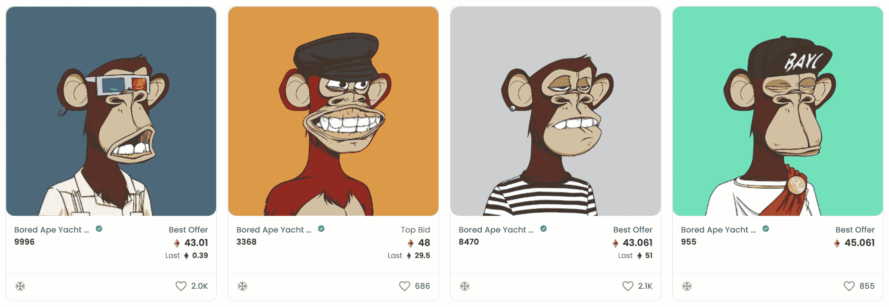
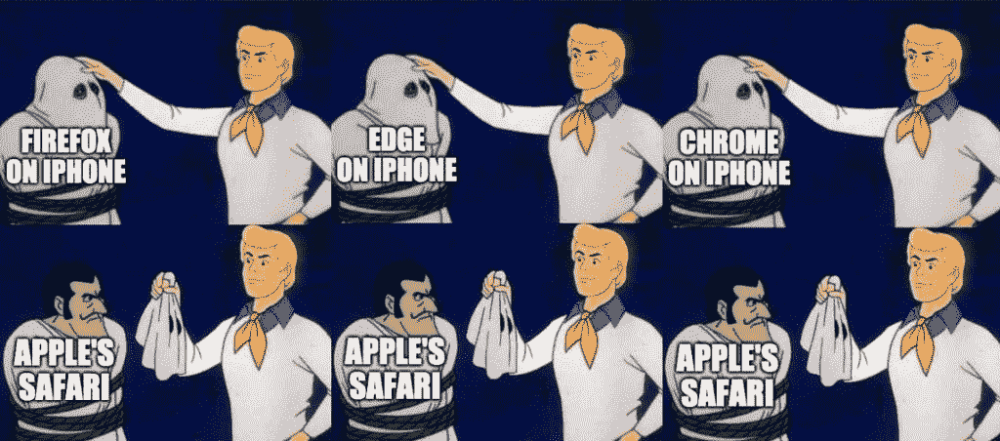

# 2021 年 5 大互联网技术故事

> 原文：<https://thenewstack.io/top-5-internet-technology-stories-of-2021/>

 [理查德·麦克马努斯

理查德是 New Stack 的高级编辑，每周撰写一篇关于网络和应用程序发展趋势的专栏文章。此前，他在 2003 年创立了读写网，并将其发展成为世界上最有影响力的博客之一。在 Twitter @ricmac 上关注他。](https://twitter.com/ricmac) 

上周，我展示了我的年度最佳互联网技术。本周，我将回顾今年的十大新闻。信不信由你，没有太多的重叠。科技行业有新闻价值的故事往往不是关于最好的技术。有时是炒作，有时是争议，有时是一个比小说还离奇的故事。

以下五个 2021 年引人注目的科技故事中，有四个属于上述类别。另一个，谢天谢地，是一个新闻项目，实际上是庆祝一项了不起的技术成就。

让我们从今年最大的新闻开始，当然是在噪音方面…

## 1.Web3 和 NFTs

“Web3”不是一个单一的新闻故事，而是一个滚动的炒作球，在 2021 年积聚了动力。加密货币爱好者和投资者成功地使 Web3 成为今年硅谷的新流行语，以至于它现在主导了科技 Twitter 上的话语。你要么是 Web3 的爱好者，要么是憎恨者；信徒还是怀疑论者。没有中间环节。

NFT 平台“开放海”上的无聊猿游艇俱乐部

在我今年早些时候对 Web3 的[技术架构的分析中，我得出的结论是架构太复杂，存在明显的技术限制，像以太坊这样的平台又慢又贵(更不用说对环境的影响了)，而且还没有证据表明主流用户甚至想要区块链应用。](https://thenewstack.io/web3-architecture-and-how-it-compares-to-traditional-web-apps/)

但是这些对 Web3 的信徒来说似乎都无关紧要——事实上对大多数科技新闻记者来说也是如此，他们在报道加密时通常会掩盖技术细节。从新闻的角度来看，Web3 是一个由炒作定义的故事[。](https://thenewstack.io/its-a-web3-world-now-how-the-hype-compares-to-web-2-0/)

除了加密货币投机，NFTs(不可替代的代币)是 Web3 最吸引公众注意力的方面。我最喜欢的 2021 年 NFT 故事对我来说也是一个极具讽刺意味的故事，因为我对故事中心人物怀有崇敬之情。

今年 6 月，万维网的发明者蒂姆·伯纳斯·李爵士在苏富比拍卖了一幅 NFT 的网络代码。NFT 还包括蒂姆爵士的一封信和一个动画视频，但源代码是主要的吸引力。它最终在 6 月底以 540 万美元的价格卖出了 T1。尽管伯纳斯·李将 NFT 比作签名海报[并表示收益将用于他和他的妻子支持的项目，但这次出售还是引起了争议。](https://www.theguardian.com/technology/2021/jun/23/tim-berners-lee-defends-auction-nft-web-source-code)

如果连网络的发明者都卖了一个 NFT，那么也许我们都应该闭嘴，接受我们的网络 3 未来。

## 2.元

今年的第二大新闻是[脸书转向元宇宙](https://thenewstack.io/meta-metaverse-developers/)，这是一个互联网的 3D 愿景，将包括虚拟现实(VR)、增强现实(ar)，以及可能介于两者之间的一切。该公司甚至更名为 Meta，以更好地反映其新战略(也可能是为了在一年的负面媒体报道和多个爆料故事后获得一个全新的品牌开始)。

马克·扎克伯格在元宇宙

在宣布转向时，首席执行官马克·扎克伯格将元宇宙称为“移动互联网的继承者”尽管移动互联网是双头垄断(苹果和谷歌)，他接着谈到互操作性将如何成为元宇宙的一个关键部分。这意味着用户将能够使用相同的技术(虚拟现实耳机、增强现实标准等)轻松地从一个元宇宙平台转移到另一个平台。

像 Web3 一样，Meta 关于元宇宙的概念在这一点上很大程度上是未经证实的。除了 Oculus Quest 的最新版本和 Horizon Workrooms(其 VR 工作场所)等新产品，该公司还没有一个工作的元宇宙平台。还不清楚它将如何实现与其他元宇宙平台的互操作性，如 Nvidia 的 Omniverse。

与 Web3 一样，我们必须拭目以待，看看扎克伯格和他的公司是否真的能提供产品来支持元宇宙的宣传。

## 3.网络上的 Photoshop

现在谈谈今年的一个头条新闻，它是基于实际的、经过验证的互联网技术创新。十月底，谷歌和 Adobe 宣布在网上公开测试 Photoshop 的版本。

网络上的 Photoshop 通过网络开发

将 Photoshop 带到 web 上，尽管没有它的全部桌面功能，但不可否认是 web 开发的一个里程碑事件。鉴于其复杂性，人们一直认为 Photoshop 不可能成为一个网络应用程序。在[一条祝贺的推特](https://twitter.com/bengoodger/status/1453036957521510403)中，谷歌的 [Ben Goodger](https://www.linkedin.com/in/bengoodger/) ，一位资深的浏览器开发者，现在是 Chrome 团队的产品总监，称其为“一个巨大的飞跃——也是一个奇妙的例子，说明为什么让网络变得更强大是如此重要！”

附带条件是 Photoshop 的网页版[目前只能在谷歌的 Chrome 浏览器](https://thenewstack.io/chrome-dev-summit-2021-its-a-web-evolution-not-revolution/)上运行。即便如此，这个项目显示了浏览器功能已经走了多远。

有趣的是，WebAssembly 是我认为的 2021 年五大互联网技术之一，它使 Adobe 能够将其 Photoshop 代码库的大部分带到网络上。

## 4.苹果浏览器引擎禁令

另一个贯穿全年的故事是苹果有争议的立场，即不允许在其 iOS 平台上竞争浏览器引擎。如果你是从 App Store 下载 Chrome 的 iPhone 用户，你可能会惊讶地发现这是一个中性版本的 Chrome。它没有使用谷歌的 Blink web 引擎，来自开源 Chromium 项目，而是建立在苹果的 WebKit 引擎上。

通过迫使谷歌、微软和 Mozilla 等浏览器厂商使用 WebKit，苹果正在有意限制 iOS 上网络应用的功能。这就是为什么渐进式网络应用程序的许多功能在 iPhone 或 iPad 上无法运行。

到年底，苹果在移动浏览器方面的压力增加了。6 月，英国竞争和市场管理局(CMA)开始了一项针对移动生态系统的市场研究，重点是苹果和谷歌，并于本月发布了中期报告。关于浏览器禁令，CMA 指出，“由于 WebKit 限制，iOS 上的浏览器引擎没有竞争，苹果实际上规定了 iOS 上的浏览器可以提供的功能。”

这是否会改变苹果 2022 年的移动浏览器战略，甚至会导致地缘政治干预，还有待观察。

## 5.世界硬币和球体

最后，这是我对今年最古怪的互联网技术故事的投票。当然，它来自于密码世界。10 月份，crypto 新闻博客 [CoinDesk 在一篇新闻报道中写了](https://www.coindesk.com/business/2021/10/21/worldcoin-now-valued-at-1b-has-grand-plans-to-get-you-to-gaze-into-the-orb/)下面的笑话:“你会让一个排球大小的铬合金球体扫描你的视网膜来换取 crypto 吗？”

事实证明这不是一个笑话，而是一家名为 Worldcoin 的公司推出的实际产品——“球体”实际上扫描你的视网膜，并向你支付加密货币作为回报。它已经从包括安德森霍洛维茨基金(Andreessen Horowitz)和比特币基地风险投资公司在内的投资者那里筹集了 2500 万美元。

我认为，即使是创造了“元宇宙”这个词的科幻作家尼尔·斯蒂芬森(Neal Stephenson)也无法超越这一反乌托邦寓言。查看 CoinDesk 对“Orb 操作符”的描述，Orb 操作符是优步驱动程序的加密等价物:

“Orb 由独立企业家处理，Worldcoin 称之为“Orb Operators ”,他们将设备带到世界各地——偏远的村庄、地铁站和大学校园——并说服人们通过眼部扫描注册免费的 worldcoin，Orb 用它来创建一个名为 IrisHash 的唯一标识符，以确保这个人是以前没有收集过 worldcoin 的人。”

OpenAI 的联合创始人[萨姆·奥特曼](https://twitter.com/sama)，open ai 的首席执行官，Y Combinator 的前总裁，自 Worldcoin 推出以来，明显没有提到过它。“我绝对低估了使用生物识别技术进行身份验证的本能反应，”他在 10 月份关于该计划的最新推文中写道。

所以，明年在你的邻居中寻找漫游 Orb 操作员！或者你可能会在元宇宙看到他们，也在兜售非功能性食物。

<svg xmlns:xlink="http://www.w3.org/1999/xlink" viewBox="0 0 68 31" version="1.1"><title>Group</title> <desc>Created with Sketch.</desc></svg>