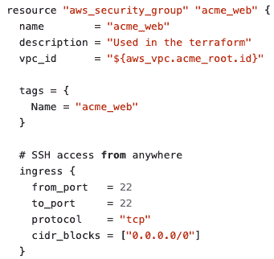
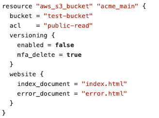
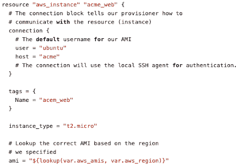
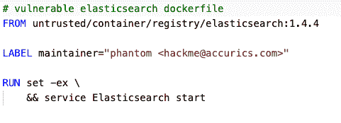
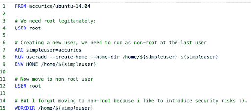

# 基础设施即代码的五大安全风险

> 原文：<https://thenewstack.io/top-5-security-risks-for-infrastructure-as-code/>

Accurics 赞助了这篇文章。

 [皮尤什·沙尔马

皮尤什是 Accurics 的联合创始人兼首席技术官。他是一名技术专家、企业家和工程领导者，在构建大规模 IaaS、端点和数据中心安全产品方面拥有近 20 年的经验。在他的职业生涯中，他一直是一名企业家，并联合创办了多家科技初创公司。](https://www.linkedin.com/in/piyushsharrma/) 

组织越来越多地采用基础设施即代码(IaC)技术来提供快速供应和部署云环境的能力。IaC 技术的例子包括 Terraform、AWS 云形成模板、Azure 资源管理器模板、Chef、Puppet、Red Hat Ansible、Helm Charts、Kubernetes YML 文件和 OpenFaaS YML。

随着 IaC 的强大，管理安全风险的责任也随之而来，如果没有遵循最佳实践，可能会引入这种责任。不安全的 IAC 导致不安全的云环境，最终可能导致云中的合规违规和数据泄露。根据最新的[威瑞森数据泄露调查报告](https://enterprise.verizon.com/resources/reports/2019-data-breach-investigations-report.pdf)，云错误配置是事件和泄露的主要原因之一。

那么，由于 IaC 的不安全使用而带来的最大安全风险是什么呢？在本帖中，我们将看看前五名，并在后续文章中跟进其余的。

## 1.网络暴露

不安全的 IaC 配置会扩大攻击面，从而实现侦察、枚举，有时甚至会向云环境实施网络攻击。配置开放安全组、可公开访问的云存储服务、公共 ssh 访问和可从互联网访问的数据库是常见的 IaC 错误配置的示例，这些配置会增加云中的攻击面。下面是一个示例 IaC 片段，突出显示了存在这些问题的代码。

**提示:**执行 IaC 的静态安全分析，在云部署生命周期的早期消除风险。尽早发现并解决这些问题是非常经济有效的，并且可以降低您的剩余风险。

## 2.脆弱点

如今，IaC 模板通过包含存储在可信注册表中的基本映像，用于调配计算和容器化实例。这为及早检测和解决此类基础映像中的任何已知漏洞并大幅降低补救成本提供了机会。以下示例说明了易受攻击的 AMI 和 Docker 映像的使用。

**提示:**对 IaC 文件中引用的图像执行漏洞评估，并在开发生命周期的早期检测漏洞。

## 3.未经授权的权限提升

如今，IaC 用于提供全栈云环境，其中可能包括 Kubernetes、容器和微服务。开发人员通常使用特权帐户来调配云应用和其他层，这带来了特权升级的风险。如果这种风险与硬编码的秘密和网络暴露结合在一起，攻击者就会面临严重的破坏。

**提示:**确保在 IaC 中执行最小特权原则，并检测 IaC 中的特权蔓延。

## 4.配置漂移

虽然开发人员可能会遵循 IaC 最佳实践，但紧急情况可能会迫使操作团队直接在生产环境中进行配置更改。这种行为打破了云基础设施的不变性，云基础设施的不变性是基于基础设施在部署后不会被修改的前提。如果需要以任何方式更新、修复或修改某些东西，必须通过代码提供新的基础设施。更重要的是，配置更改可能会带来风险，导致云的状态偏离基础架构调配前通过 IaC 定义的安全状态。

**提示:**通过监控调配的云基础架构和 IaC 之间的状态漂移，维护基础架构的不变性，并减少引入风险的变更。

## 5.幽灵资源

标记云资产是确保合规性和治理的关键要求。使用 IaC 构建的未标记资源会导致 ghost 资源，这可能会给在实际云环境中检测、可视化和获得可观察性带来挑战。其结果是云状态漂移可能长时间未被发现，以及补救风险方面的挑战。除了安全后果之外，未标记的资源还使得检测对运营的影响(如成本、维护和可靠性)变得极其困难。

***阅读下一篇:[基础设施再添 5 大安全隐患](https://thenewstack.io/5-more-security-risks-for-infrastructure-as-code/)***

专题图片[由 PHOTOCREO Michal Bednarek](https://www.shutterstock.com/image-illustration/man-walking-balancing-on-rope-over-248863420) 通过 Shutterstock 拍摄。

<svg xmlns:xlink="http://www.w3.org/1999/xlink" viewBox="0 0 68 31" version="1.1"><title>Group</title> <desc>Created with Sketch.</desc></svg>