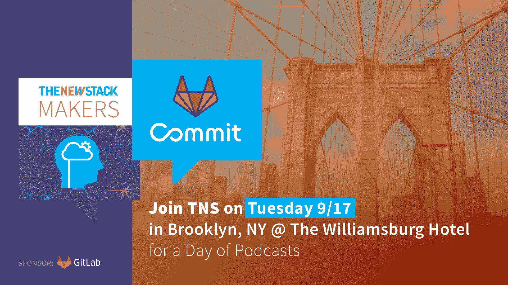

# 我迫不及待想在布鲁克林 GitLab Commit 上看到的前 5 名演讲者

> 原文：<https://thenewstack.io/top-5-speakers-i-cant-wait-to-see-at-gitlab-commit-brooklyn/>

[GitLab](https://about.gitlab.com/) 赞助本帖。

 [普里扬卡·夏尔马

Priyanka 是 GitLab 的技术传道部主任，也是云计算原生计算基金会(CNCF)的董事会成员。她在 DevOps 和可观察性方面有很深的专业知识。Priyanka 是一名前企业家，热衷于通过开源社区开发开发人员产品，她在 HeavyBit industries(开发人员产品加速器)为初创公司提供咨询。她拥有斯坦福大学的政治学学士学位，业余时间喜欢阅读和与她的狗奥利玩耍。](https://twitter.com/pritianka) 

每个成功的开源技术最终都会到达一个临界质量的社区，当人们想要面对面地见面，这样他们就可以面对面地交流思想和互相学习。Kubernetes 与 KubeCon 和 Linux 与 LinuxFest 都有这样的时刻——这样的例子不胜枚举。对于 GitLab 来说，现在有超过 100，000 家公司和数百万开发人员使用并与我们共同创造这个项目，这一时刻已经到来。为此，我很高兴地宣布，我们将于今年在纽约和伦敦举办首届用户大会 [GitLab Commit](https://about.gitlab.com/events/commit/) 。

我已经深入 DevSecOps 开源社区好几年了，对我们的计划是如何形成的感到非常兴奋。我是 GitLab 的技术传道部主任，也是[云计算原生计算基金会](https://www.cncf.io/)的董事会成员。在我的各种角色中，我在无数的会议委员会中服务过，做过许多演讲(特别是关于可观察性的)，并为许多项目做出过贡献。这种协作精神恰好铭刻在 GitLab 的使命“每个人都可以做出贡献”中，这也是我们试图带给 GitLab Commit 的精神。

对于纽约，GitLab 社区将于 9 月 17 日接管布鲁克林的威廉斯堡社区，参加一个充满行动的日子，利用云原生和 DevOps 技术进行联系、学习和解决问题。当然，随后在布鲁克林保龄球馆[举行的派对应该也同样具有传奇色彩。](https://www.brooklynbowl.com/)

与许多其他会议不同，GitLab Commit Brooklyn 更注重行动，而不是空谈。我们经常看到 DevOps 会议关注最时髦的新技术，这些新技术是 DevSecOps 生命周期的利基组件，但并不反映企业现实。相比之下，Commit 的演讲者阵容以大多数最终用户为特色，包括许多女性工程领导者作为演讲者和小组成员。我们为最终用户量身定制了 GitLab Commit Brooklyn。在这个会议上，人们将相互分享 DevOps 转型如何在企业组织层面上实际发生的本质，而不是仅仅提供 DevOps 的全景视图，或者深入到特定的云原生主题，以至于忘记了组织变革是如何进行的细节。

在布鲁克林 GitLab Commit 上，有太多令人兴奋的演讲者、小组和活动，但我已经将它缩小到我最期待聆听和学习的五个杰出人物。

### Delta 如何成为真正的云原生:避免供应商锁定

我第一次见到 Jasmine James 时，她同意成为我在 2018 年 KubeCon 西雅图会议上的小组成员，讨论企业中的工具链危机。从我遇见她的那天起，她就给我留下了深刻的印象，她是一位能带领达美航空走得更远的领导者。在过去的六个月里，我了解了更多关于 Delta 公司向云原生技术迈进的工程技术，以及 Jasmine 公司如何通过工具战略使其与云供应商无关而取得成功。Delta 将重点放在工具和工作流程上，首先使用裸机上的 Kubernetes 来加速代码交付。在本专题讲座中，您将深入了解 Jasmine 如何引领达美航空在不依赖单一供应商的情况下实现向云原生平台的战略迁移，以及该公司目前从多云关系中获得的优势。

### 小组讨论:从开发运维到数据运维—数据工程最佳实践

随着 Kubernetes 的出现和微服务的并行趋势，组织经常需要管理的数据出现了爆炸式增长。在本专题小组中，我们将讨论如何转变数据工程，从开发运维转向数据运维，以及版本控制和 GitOps 对于数据工程的重要性。专题小组成员包括:GitLab 的数据工程师[艾米莉·夏里奥](https://about.gitlab.com/company/team/#emilieschario)和梅尔塔诺的[丹妮尔·莫里尔](https://www.linkedin.com/in/daniellemorrill)。我们还将邀请来自 [Fishtown Analytics](https://www.fishtownanalytics.com/) 的数据构建工具(dbt)社区经理 [Claire Carroll](https://www.linkedin.com/in/clrcrl/) 和 DataKitchen 的高级数据操作实施工程师 Priyanjna Sharma[参加对话。哦，顺便说一下，小组成员和主持人都是女性。](https://www.linkedin.com/in/priyanjnasharma/)

### 在 NASA 实施开源文化

作为一个太空迷，我不得不包括这一个:尽管有无数的障碍，随着工程团队领导着向开源和统一工具链的文化转变，NASA 已经进入了 DevOps 的现代时代。在这个主题演讲中， [MRI Technologies](https://www.mricompany.com/) 的 [Marshall Cottrell](https://www.linkedin.com/in/marshall-cottrell-27b385181/) 解释了他的团队如何着手从零开始构建一个云原生 PaaS，专门针对 NASA 复杂的运营和监管要求进行了调整。“我们不会停止，直到我们把这种文化带回美国国家航空航天局…并把库伯内特星团带到月球上！”科特雷尔说。发射！

### 永远不要让管家去做机器人的工作 Infor 访谈

亚马逊网络服务(AWS)业务每天都激励着我。该公司将云计算带到了世界上，并在将计算交给开发人员后开创了 DevOps。GitLab 通过让开发人员可以访问 CI/CD 来做同样的事情。这个演讲贴近我的心，因为它结合了 AWS 和 GitLab 的魔力，让所有人都可以看到。

### 实时编码会话

没有现场编码的开发者大会算什么？来参加闪电演讲和现场编码会议，体验激动人心的舞台表演。我们将会看到:

*   来自 MayaData 的人们将混沌工程付诸实践。
*   T-mobile 工程师使用 GitOps 的权限。
*   使用 arm 集群和 GitLab 构建一个小云！

这将是一系列嚼爆米花、咬指甲的会议——准备好吧！！

如果你不知道，我对 GitLab Commit 感到非常兴奋。这将是生活、学习、欢笑的美好一天。让我们聚一聚，在威廉斯堡玩得开心。我们在那里见！

通过 Pixabay 的特征图像。

<svg xmlns:xlink="http://www.w3.org/1999/xlink" viewBox="0 0 68 31" version="1.1"><title>Group</title> <desc>Created with Sketch.</desc></svg>