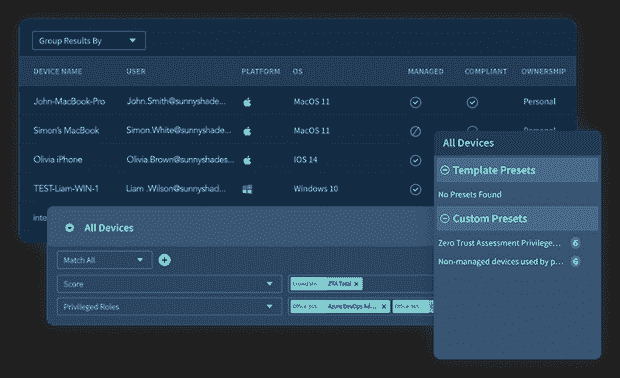

# 2023 年 SaaS 六大安全威胁

> 原文：<https://thenewstack.io/top-6-saas-security-threats-for-2023/>

随着新年的到来和员工假期的结束，是时候让安全团队为 2023 年的安全挑战做准备了。随着 SaaS 的不断扩张和变得越来越复杂，组织可以从其软件即服务环境中的六个方面加强和保护。

## 错误的配置比比皆是

企业可以在其员工的 SaaS 应用中拥有数千个安全控件。安全团队面临的最大挑战之一是[保护这些设置](https://thenewstack.io/armo-misconfiguration-is-number-1-kubernetes-security-risk/)、用户角色和权限，以确保它们符合行业和公司政策。

除了与安全策略不一致的明显风险之外，配置可能会随着每次更新而改变，并且许多合规性行业标准增加了它们的复杂性。除此之外， [SaaS 应用](https://thenewstack.io/the-growing-security-risk-of-shadow-saas-integrations/)的所有者往往坐在业务部门，没有接受过培训，也不关注应用的安全性。

安全团队应采用 SaaS 安全态势管理(SSPM)解决方案，该解决方案可对 SaaS 堆栈中的大量应用提供深入的可见性和控制。该解决方案必须确定每个应用程序中的全局应用程序设置和特定于平台的配置。

SSPMs 应该为安全团队提供安全警报的上下文，并帮助回答以下问题:哪些用户会受到某种错误配置的影响？他们是管理员吗？他们是否启用了多因素身份认证(MFA )?有了这些答案，安全团队可以强制执行公司和行业策略，并补救任何错误配置带来的潜在风险。

## SaaS 至 SaaS 的通道

SaaS 到 SaaS 的应用程序集成旨在实现简单的自助安装，提高效率和功能。然而，这些特性带来了安全噩梦。挑战集中在连接到该公司 SaaS 环境的应用数量不断增加。

平均而言，数以千计的应用程序在未经安全团队批准或安全团队不知情的情况下被连接。员工连接这些应用程序，通常是为了提高工作效率，实现远程工作，以及更好地构建和扩展公司的工作流程。

但是，当将应用程序连接到他们的工作区时，会提示员工授予应用程序访问权限。这些权限包括读取、创建、更新和删除公司或个人数据的能力，更不用说应用程序本身可能是恶意的。

通过单击“接受”，他们授予的权限可以使威胁参与者获得对重要公司数据的访问权限。用户通常不知道他们授予这些第三方应用程序的权限的重要性。

在影子 IT 领域，安全团队必须能够[发现第三方应用](https://thenewstack.io/docontrol-automating-saas-data-security-policy-enforcement/)并识别哪些会带来风险。从这些应用程序请求的访问范围，到授权用户和交叉引用，安全人员应该能够衡量跨组织堆栈的敏感数据的访问级别。像 Adaptive Shield 这样的 SSPM 解决方案除了提供高级报告功能以进行有效和准确的风险评估来推动可行的措施之外，还可以用这种类型的发现和控制来武装安全团队。

[获得 SSPM 解决方案如何帮助减少第三方应用访问的演示。](https://www.adaptive-shield.com/lp/request-a-demo?utm_source=TheNewStack&utm_medium=sponsored_content&utm_campaign=tns_topsaassecuritythreats2023.2)

## 设备到 SaaS 的用户风险

安全团队必须应对来自用户的威胁，这些用户从不同的、被入侵的设备访问他们的 SaaS 应用程序。通过不受管理的设备访问 SaaS 应用程序会给组织带来很高的风险，尤其是当设备所有者是高特权用户时。个人设备易受数据失窃的影响，可能会无意中将恶意软件传播到组织的环境中。丢失或被盗的设备也可能成为犯罪分子访问网络的入口。

组织需要一种解决方案来管理来自受损设备的 SaaS 风险。SSPM 解决方案可以识别管理员和高管等特权用户，计算用户风险级别，并识别哪些终端设备需要更加安全。

图一。Adaptive Shield 设备清单

## 身份和访问治理

每个 SaaS 应用程序用户都是潜在威胁者的门户，正如最近的[优步 MFA 疲劳](https://thenewstack.io/uber-hack-its-the-simple-things-that-kill-your-security/)攻击所见。除了验证基于角色的访问管理(相对于基于个人的访问)和建立对访问治理的理解之外，确保正确的用户访问控制和身份验证设置的流程也是必不可少的。身份和访问治理有助于确保安全团队全面了解和控制所有域中发生的情况。

安全团队需要监控所有身份，以确保用户活动符合其组织的安全准则。IAM 治理通过持续监控公司的 SaaS 安全状况及其访问控制的实施，使安全团队能够对出现的问题采取行动。

## 数据泄露

数据泄露是 SaaS 越来越担心的问题。正如我们在最近的[日产](https://www.adaptive-shield.com/blog/breach-debrief-series-nissan-north-america)和 [Slack](https://www.adaptive-shield.com/blog/slack-github-breach-how-it-happened-and-how-you-can-protect-your-repository) 违规事件中看到的那样，与任何有链接的人共享的文件或其他资源，或者共享的文件或资源没有到期日，都有落入未经授权的人手中的风险。

安全团队需要引入数据泄漏保护解决方案，这通常包含在 SSPM 平台中。这包括检查每个文件权限的安全检查，以及显示 SaaS 堆栈中公开或公开共享文件的资产清单。

## 身份威胁检测和响应

威胁参与者越来越多地通过用户来攻击 SaaS 应用程序。随着越来越多的数据转移到云中，它们是一个有吸引力的目标，只要有正确的登录凭证，任何计算机都可以访问它们。

为防止此类攻击，组织需要部署 SaaS 身份威胁检测和响应(ITDR)机制。这套新工具能够识别异常或可疑的用户行为，或者安装了恶意应用程序，并向安全团队发出警报。

## 最后的想法

Gartner 将 SaaS 安全态势管理公司(SSPM)纳入其 2021 年报告“ [4 项必备技术，使 Gartner 的云安全宣传周期](https://www.gartner.com/smarterwithgartner/4-must-have-technologies-that-made-the-gartner-hype-cycle-for-cloud-security-2021)”借助像 Adaptive Shield 这样的 [SSPM 平台](https://www.adaptive-shield.com/adaptive-shield-platform?utm_source=TheNewStack&utm_medium=sponsored_content&utm_campaign=tns_topsaassecuritythreats2023.3)，组织可以防范风险、检测和应对威胁，并强化其 SaaS 安全生态系统。

了解如何通过自动化[保护您的整个 SaaS 堆栈](https://www.adaptive-shield.com?utm_source=TheNewStack&utm_medium=sponsored_content&utm_campaign=tns_topsaassecuritythreats2023.1)。

<svg xmlns:xlink="http://www.w3.org/1999/xlink" viewBox="0 0 68 31" version="1.1"><title>Group</title> <desc>Created with Sketch.</desc></svg>