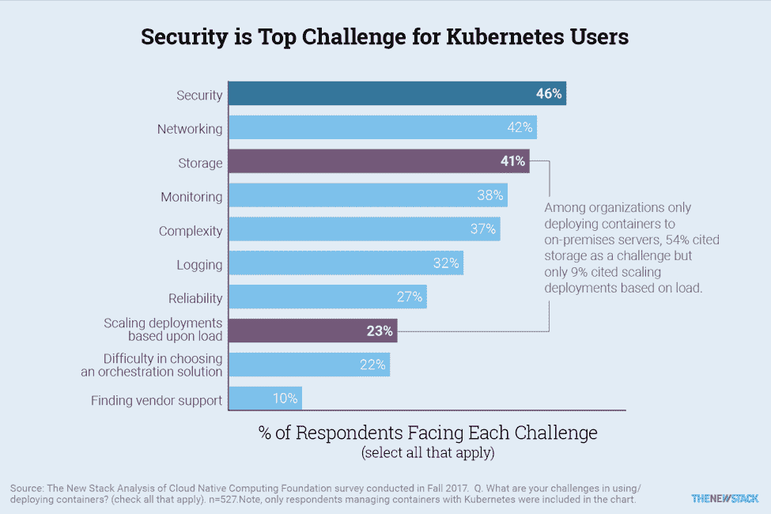

# Kubernetes 用户在部署方面面临的最大挑战

> 原文：<https://thenewstack.io/top-challenges-kubernetes-users-face-deployment/>

人们在使用或部署 Kubernetes 时会面临各种各样的问题。虽然有些挑战是 Kubernetes 独有的，但许多其他挑战是采用许多技术后出现的典型成长烦恼。

"[Kubernetes 生态系统的状态](https://thenewstack.io/ebooks/kubernetes/state-of-kubernetes-ecosystem/)"报告了选择容器编排解决方案时不同标准的重要性，以及抑制采用 Kubernetes 的主要因素。与安全性或资源优化等标准相比，伸缩性更可能是编排解决方案的基本要求。提到的最大挑战之一是，使用 Kubernetes 经常需要改变 IT 组织中几个部分的角色或职责。

最近的[云本地计算基金会](https://www.cncf.io/) (CNCF)调查询问了人们在使用或部署容器时面临的挑战。在我们自己对数据的独立分析中，发表在“ [Kubernetes 部署&安全模式](https://thenewstack.io/ebooks/kubernetes/kubernetes-deployment-and-security-patterns/)”中，我们得到了这些答案，并将关注点缩小到使用 Kubernetes 管理容器的组织。这提供了一种方式来说明 Kubernetes 用户面临的问题。

## 安全性、存储、网络是最大的挑战

结果显示，复杂性——对 Kubernetes 的普遍批评——只是第五大挑战。首当其冲的是与基础设施相关的挑战。46%的 Kubernetes 用户提到了安全性，网络和存储位居第二和第三。

[cyclone slider id = " kubernetes-series-book-2-赞助商"]

23%的受访者表示基于负载扩展部署是一项挑战。这可能意味着许多需求已经得到满足，Kubernetes 实际上帮助了扩展，正如它应该做的那样。在列表的底部，10%的人提到了获得供应商支持的问题。很少有人抱怨供应商对 Kubernetes 的支持，原因之一是许多部署不依赖于供应商的发行版。展望未来，由于 CNCF 最近推出了 Kubernetes 认证服务提供商计划，以保证服务提供商达到一定的能力水平，因此很有可能提供高质量的服务。

超过 40%的受访者表示，安全性、联网和存储是与集装箱相关的挑战。

## 较大的组织面临更多挑战

与其他研究一样，我们发现大型组织更有可能将许多问题作为他们关心的挑战。例如，拥有 1，000 名或更多员工的组织中有 55%认为安全性是一个挑战，而员工少于 100 名的组织中只有 39%持相同观点。在这种情况下，以及在可靠性等其他类别中，大企业的需求很可能不同于较小组织的需求。在其他领域，如网络，it 基础设施的规模和广度(带宽和站点数量)可能会给 Kubernetes 带来更多独特的挑战，而不仅仅是所使用的容器数量。事实上，在拥有六个或更多集群的组织中，将网络视为挑战的百分比从 42%跃升至 53%。

一些挑战不符合上述模式。对于存储，一种解释可能是技术“问题”不基于可扩展性。在监控方面，中型公司更有可能面临挑战。正如我们之前在文章[反思集装箱操作的监控](https://thenewstack.io/monitoring-reset-containers/)中所描述的，较小的组织通常不太需要创建正式的监控流程，而较大的组织有资源创建更强大的定制监控系统。夹在中间的是那些拥有 100 到 999 名员工的组织。

在拥有 1，000 名或更多员工的组织中，安全性和网络更有可能被视为与容器相关的挑战。

## 内部部署与云决定挑战

影响组织的容器相关挑战的另一个因素是他们是否专门将容器部署到公共云或本地服务器。在那些只使用本地服务器的企业中，存储是最常见的挑战。这可能是因为这些组织管理自己的存储基础架构，甚至可能由单独的 IT 团队来处理。

54%的纯本地容器用户面临存储挑战，相比之下，只有 34%的纯公共云组织面临存储挑战。

对于仅在公共云上使用容器的组织来说，监控和日志记录更经常被认为是一项挑战。虽然云提供商应该能够实现可扩展性，但只使用本地服务器的组织不太可能说扩展部署是一个挑战。

CNCF 的调查还询问了几种类型的云原生基础设施和工具，其中一些在市场上被特别宣传为与 Kubernetes 配合良好。本系列的下一篇文章将讨论 Kubernetes 用户用来解决他们所面临的挑战的最常见的工具。

<svg xmlns:xlink="http://www.w3.org/1999/xlink" viewBox="0 0 68 31" version="1.1"><title>Group</title> <desc>Created with Sketch.</desc></svg>