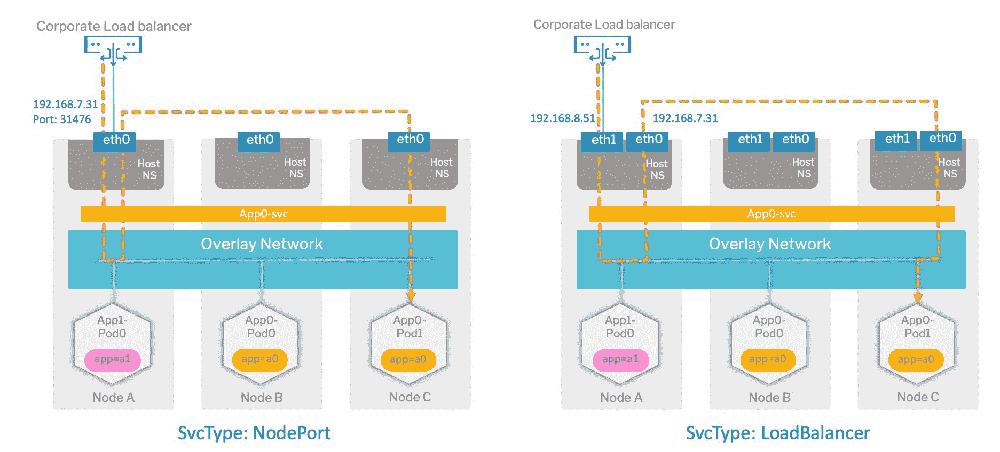

# 为 Kubernetes 选择 CNI 插件时的首要考虑事项

> 原文：<https://thenewstack.io/top-considerations-when-selecting-cni-plugins-for-kubernetes/>

[Diamanti](https://diamanti.com/) 赞助本帖。

 [阿尔温德·古普塔

Arvind 是云原生专家、问题解决者和传播者，拥有从高级应用程序堆栈到低级硬件的广泛经验。Arvind 拥有普渡大学的硕士学位。](https://www.linkedin.com/in/guptaarvindk/) 

云原生应用的时代带来了思考网络架构的新方式。Kubernetes 网络被设计成一个干净的、向后兼容的模型，消除了将容器端口映射到主机端口的需要。为了支持这一点，Kubernetes 引入了许多围绕网络的基本结构，如 pod 网络、服务、集群 IP、容器端口、主机端口和节点端口，它们将用户从底层基础架构中抽象出来。

尽管 Kubernetes 中有许多构建网络基础的构造，但 Kubernetes 留下了许多[有意留下的空白](https://thenewstack.io/why-those-gaps-in-kubernetes-are-really-a-good-thing/)，使其与基础设施无关。网络中的这些空白大多由网络插件填补，这些插件通过容器网络接口(CNI)与 Kubernetes 交互。

## CNI 插件的常见限制

Kubernetes 使用插件模型进行联网，使用 CNI 来管理集群上的网络资源。大多数常见的 [CNI 插件](https://kubernetes.io/docs/concepts/cluster-administration/networking/)利用覆盖网络，这在现有的第 2 层(L2)网络之上创建了集群内部的私有第 3 层(L3)网络。使用这些 CNI 插件，专用网络只能由集群中的 pod 访问。在节点之间甚至在集群外部移动数据包的过程严重依赖 iptable 规则以及私有和公共 IP 地址的网络地址转换(NAT)。这些 CNI 插件的一些例子是开放的 vSwitch (OVS)，印花布，法兰绒，运河，编织。

适用于 Kubernetes 的每个网络 CNI 插件都有其优缺点。让我们探讨一下 CNI 插件的一些常见限制:

### **依赖软件定义的网络**

SDN 网络功能以软件设备的形式交付，增加了各种复杂性，包括额外的 iptables 和 NATing。SDN 软件消耗 15%到 20%的可用主机资源(CPU 和内存)，降低了效率并增加了运行实际应用所需的资源数量。

### **在集群外公开应用**

由于大多数网络解决方案使用 L3 网络，pod IP 存在于集群本身中。将这些豆荚暴露在外界仍然是一个挑战。Kubernetes 利用服务类型“节点端口”和“负载平衡器”来公开应用程序。

*ServiceType "NodePort"* 通过随机唯一端口上的主机网络接口路由节点上运行的所有应用程序。

在公共云中，云负载平衡器的可用性使生活变得更加轻松，因为它会自动为 Kubernetes *ServiceType“负载平衡器”*分配一个公共 IP。然而，这种功能对于本地云来说并不容易实现。像 MetalLB 这样的解决方案可以用来解决这个问题，但是它们有自己的局限性和挑战。

### **通过主机网络路由所有流量**

当使用 ServiceType“节点端口”或“负载平衡器”时，Kubernetes 利用主机网络接口来路由所有流量。由于安全性和性能方面的问题，这在企业环境中并不是一个理想的场景。

节点端口和负载平衡器服务的数据包流

### **交通隔离**

大多数 Kubernetes 网络解决方案对所有类型的流量使用相同的物理网络(主机网络)接口。这意味着控制、pod 和存储流量共享同一个网络平面/接口。这可能是一个安全风险，也会影响 Kubernetes 控制平面的性能，因为 pod 和存储流量很容易消耗可用带宽(反之亦然)。

### **负载不平衡**

大多数网络解决方案依赖于外部负载平衡器，当 pod 分布在集群中的多个节点上时，这不是问题。但是同一个后端服务的多个 pod 也可以在同一个节点上运行。这可能会导致负载不平衡问题，因为外部负载平衡器只能在节点之间实现负载平衡，而不能在单元之间实现负载平衡。

### **额外跳数**

在 L3 网络中，外部访问总是通过暴露节点本身的接口或端口来完成。在这种情况下，如果请求通过错误的节点，pod 外部通信可能会有额外的跳数，从而影响性能和延迟。

### **多宿主网络**

在许多情况下，应用程序可能需要 pod 网络的多个接口，以便它可以连接到不同的隔离网络/子网。大多数 CNI 插件目前缺乏对多界面的支持。

### **静态端点供应**

Kubernetes 中的 Pod IP 是动态的，每当 Pod 重新启动时都会发生变化。大多数 CNI 插件不支持为 pod 分配静态端点或 IP。这意味着 pod 只能通过服务公开，这对于某些类型的部署可能并不理想。

### **噪音邻居和性能 SLA**

对于在同一节点上运行多个应用程序的虚拟环境，来自每个应用程序的流量都流经同一网络管道。如果一个应用程序行为不当，它会影响其他应用程序的性能。大多数 CNI 插件不支持在应用程序级别提供网络性能保证。

### **多区域支持**

高可用性对任何组织来说都是至关重要的，并且正在成为生产 Kubernetes 部署中的一项要求。为多区域集群提供网络支持非常重要，多区域集群将环境分布在不同的容错域中。

### **存储流量没有分离**

大多数 CNI 插件无法区分存储流量和常规流量。它们使用相同的共享平面/接口进行均匀的存储数据移动，这导致网络和存储流量(在某些情况下甚至控制流量)相互竞争。这会影响性能和安全性。

## 一种不同的网络方式

Diamanti 以其独特的网络架构解决了常见 CNI 插件的大部分缺点。Diamanti 针对 Kubernetes 的数据平面解决方案内置了对 L2 网络的支持，硬件卸载了智能网卡。这允许真实的 L2 MAC 地址被分配给外部可路由网络上的每个 pod，使得联网更加容易。它还支持使用 OVS 的 L3 覆盖网络、流量隔离、VLAN/VXLAN 分段、多宿主网络、静态端点配置、网络感知调度、有保证的 SLA 以及许多其他独特功能。你可以在[迪亚曼蒂网站](https://diamanti.com/)上看到更多关于迪亚曼蒂网络架构的细节。

Kubernetes 中的网络堆栈是企业生产部署中最重要的架构决策之一。当你为你的基础设施选择一个 CNI 插件时，你需要小心它的局限性，并决定什么最适合你。

通过 Pixabay 的特征图像。

*目前，新堆栈不允许在该网站上直接发表评论。我们邀请所有希望讨论某个故事的读者通过 [Twitter](https://twitter.com/thenewstack) 或[脸书](https://www.facebook.com/thenewstack/)访问我们。我们也欢迎您通过电子邮件发送新闻提示和反馈: [feedback@thenewstack.io](mailto:feedback@thenewstack.io) 。*

<svg xmlns:xlink="http://www.w3.org/1999/xlink" viewBox="0 0 68 31" version="1.1"><title>Group</title> <desc>Created with Sketch.</desc></svg>